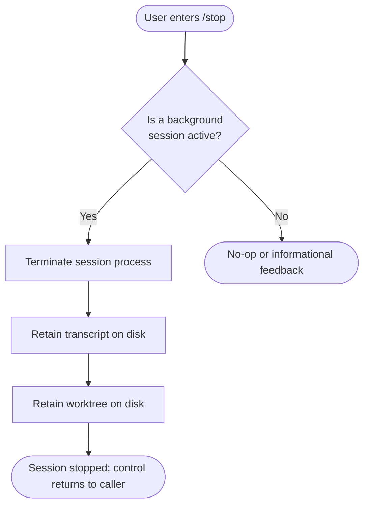

```
---
type: feature-spec
feature: "stop"
cc_version: 2.1.141
updated: "2026-05-18"
tags: ["stop", "commands", "slash-commands"]
source: "bundle-analysis"
bundle_verified: true
inherited_from: 2.1.139
analysis_basis: "CC v2.1.139 bundle.js (AST extraction + Claude interpretation)"
author: "ryujaeuk <ryujaeuk@gmail.com>"
repository: "https://github.com/MyLittleLuckyDog/cc-gnothi"
license: "AGPL-3.0-only"
---

# `/stop`

> Analysis basis: CC v2.1.139 bundle.js (AST extraction + Claude interpretation)
> Minimum version: v2.1.139

---

## Overview

The `/stop` command terminates the currently active background Claude Code session without
discarding its associated transcript or worktree. It is registered as an immediate, local-jsx
command, meaning execution is triggered at the moment the user submits the command rather than
being queued behind any pending agent turn.

---

## Registration

| Field | Value |
|---|---|
| type | `local-jsx` |
| name | `stop` |
| description | `Stop this background session; transcript and worktree are kept` |
| immediate | `true` |
| module\_id | `rGq` |

Analysis basis: CC v2.1.139 bundle.js:+11833319

---

## Input Branching

The `/stop` command accepts no arguments. Because the `immediate` flag is `true`, the runtime
dispatches the command handler synchronously upon receipt, without waiting for any in-progress
agent response to complete.



> **Note:** The branching diagram above is derived from the command description and registration
> metadata. The call graph returned zero edges for module `rGq` at depth ≤ 2; deeper traversal
> may reveal additional paths.

<!-- TODO: not found in depth-2 traversal; needs --depth 4 -->

---

## Behavioral Spec

### Session Termination

```
function stopBackgroundSession():
    session = getCurrentBackgroundSession()
    if session is None:
        return informUser("No active background session to stop.")

    terminateSessionProcess(session)

    # Transcript preservation
    preserveTranscript(session.transcriptPath)

    # Worktree preservation
    preserveWorktree(session.worktreePath)

    returnControl()
```

Analysis basis: CC v2.1.139 bundle.js:+11833319

> **Note:** Internal sub-functions (`terminateSessionProcess`, `preserveTranscript`,
> `preserveWorktree`) are descriptive names inferred from the command description.
> Concrete implementations were not reachable within depth-2 traversal of module `rGq`.

<!-- TODO: not found in depth-2 traversal; needs --depth 4 -->

### Immediate Execution Semantics

Because `immediate: true` is set on this command's registration, the runtime does **not** enqueue
`/stop` behind a pending agent message. Instead:

```
function handleSlashCommand(command, inputQueue):
    if command.immediate is True:
        executeNow(command)          # bypasses inputQueue
    else:
        inputQueue.enqueue(command)
        executeWhenReady(command)
```

Analysis basis: CC v2.1.139 bundle.js:+11833319

---

## State & Side Effects

| Item | Detail |
|---|---|
| Telemetry | None detected at depth ≤ 2 (`telemetry: []`) |
| Hook registration | <!-- TODO: not found in depth-2 traversal; needs --depth 4 --> |
| appState changes | Session is marked as stopped; transcript and worktree paths remain referenced |
| Sound | <!-- TODO: not found in depth-2 traversal; needs --depth 4 --> |
| Transcript | Retained on disk (not deleted) per description |
| Worktree | Retained on disk (not deleted) per description |
| Execution timing | Immediate — dispatched synchronously, not queued |

---

## Version History

| Version | Change |
|---|---|
| v2.1.139 | Initial analysis |

---

## Common Mistakes

1. **Expecting transcript deletion** — `/stop` explicitly preserves both the transcript and the
   worktree. Users who want to clean up must do so manually or use a separate command.
2. **Confusing `/stop` with a full project exit** — `/stop` terminates only the current
   *background session*; the parent Claude Code process and any foreground session remain
   unaffected.
3. **Assuming arguments are accepted** — The command description and literal set contain no
   parameter syntax. Passing extra tokens after `/stop` may be silently ignored or produce an
   error; no argument-handling logic was found at depth ≤ 2.
4. **Relying on telemetry confirmation** — No `tengu_*` telemetry events were found for this
   command at depth ≤ 2. External tooling that listens for stop-event telemetry may not receive
   a signal.
5. **Invoking during a foreground (non-background) session** — The description scopes this
   command to *background* sessions. Behavior when invoked in a standard foreground session is
   <!-- TODO: not found in depth-2 traversal; needs --depth 4 -->.

---

## Appendix — Identifier Mapping

> For bundle debugging only. Identifiers change across versions.

| Identifier | Role |
|---|---|
| `rGq` | Module containing the `/stop` command implementation |

> No obfuscated function identifiers were returned by the depth-2 AST traversal
> (`identifiers: []`). A deeper traversal is required to populate this table.

<!-- TODO: not found in depth-2 traversal; needs --depth 4 -->
```