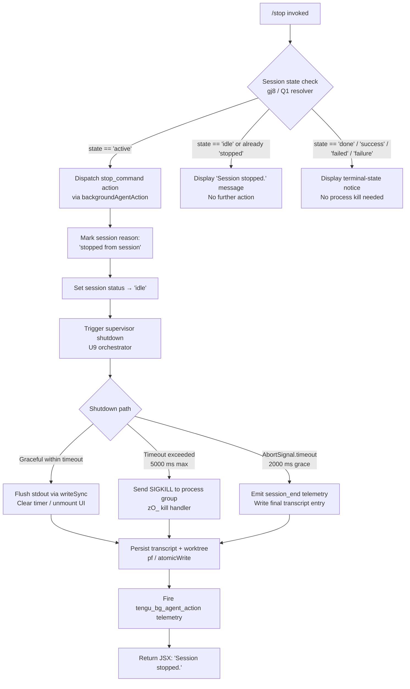

# `/stop`

> Analysis basis: CC v2.1.139 bundle.js (AST extraction + Claude interpretation)
> Minimum version: v2.1.139

---

## Overview

The `/stop` command terminates the currently running background session controlled by Claude Code. Rather than destroying session state, it transitions the session to an idle/stopped status while preserving both the conversation transcript and the associated worktree. The command fires a `stop_command` action through the background-agent action dispatcher, then performs an orderly shutdown of the supervisor and process tree.

---

## Registration

| Field | Value |
|---|---|
| type | `local-jsx` |
| name | `stop` |
| description | `Stop this background session; transcript and worktree are kept` |
| immediate | `true` |
| module_id | `rGq` |
| load_inline | `true` |
| loc_byte | `11833319` |
| loc_byte_end | `11833521` |
| loc_line | `7896` |
| arbor_handler.name | `GN7` |
| arbor_handler.fqn | `claude-2.1.139::GN7` |
| arbor_handler.kind | `AsyncFunction` |
| arbor_handler.resolution_path | `module_id` |
| arbor_handler.n_hits | `0` |

Analysis basis: CC v2.1.139 bundle.js:+11833319

---

## Input Branching

The command exhibits three distinct execution paths depending on session state at invocation time: the session may be actively running, already stopped/idle, or in a terminal state (done/failed/stopped). A Mermaid flowchart is used to capture these branches.



---

## Behavioral Spec

### 1. Handler Entry — `stopCommandHandler` (GN7)

The handler is an `AsyncFunction` resolved via `module_id` → `rGq`. It is the sole top-level entry point for `/stop`.

```
async function stopCommandHandler(context):
    // Step 1: dispatch the stop action
    randomDelay = computeRandomDelay()           // H + Math.random (bundle.js:+12439009)
    schedule(randomDelay, setTimeout)            // bundle.js:+12439046

    // Step 2: run the background-agent stop pipeline
    result = await backgroundAgentStopPipeline(context)   // gj8, bundle.js:+11833048

    return result
```

Analysis basis: CC v2.1.139 bundle.js:+11833038, +11833048

---

### 2. Background-Agent Stop Pipeline — `backgroundAgentStopPipeline` (gj8)

This is the primary orchestrating function. It coordinates state resolution, transcript persistence, and UI feedback.

```
async function backgroundAgentStopPipeline(context):
    // 1. Resolve current session state
    sessionState = resolveSessionState(context)   // Q, bundle.js:+11832455
    mode = detectMode(context)                    // V6, bundle.js:+11832518

    // 2. Emit telemetry for background-agent action
    emitTelemetry("tengu_bg_agent_action", {      // bundle.js:+11832457
        action: "stop",                           // literal "stop" bundle.js:+11832489
        mode: mode
    })

    // 3. Check session mode: "bg", "daemon", "daemon-worker"
    //    (literals bundle.js:+2148195, +2148205, +2148219)
    if sessionMode not in ["bg", "daemon", "daemon-worker"]:
        return earlyExit()

    // 4. Load ordered session state
    orderedState = loadSessionStateOrder(context)   // Q1, bundle.js:+11832588
    //   - reads "order" / "stateOrder" keys (bundle.js:+3923017, +3923038)
    //   - uses utf-8 encoding (bundle.js:+3923488)
    //   - handles ENOENT gracefully (bundle.js:+168330)

    // 5. Determine current status
    activeStatus = resolveActiveStatus(orderedState)   // Vw / KE, bundle.js:+11832601
    //   Recognized terminal statuses: "done","success","failed","failure","stopped"
    //   (literals bundle.js:+3929294, +3929307, +3929324, +3929339, +3929356)
    //   Active status token: "active" (bundle.js:+3929475)

    // 6. Write stop reason into session record
    writeStopReason(context, "stopped from session")   // literal bundle.js:+11832647
    setSessionStatus("idle")                           // literal bundle.js:+11832676

    // 7. Persist transcript atomically
    atomicWriteTranscript(context)   // pf / RD, bundle.js:+11832613
    //   - generates 4-byte hex token via _n8.randomBytes (bundle.js:+2179239, +2179251)
    //   - writes utf8 content (bundle.js:+2179297)
    //   - uses writeFile → rename pattern for atomicity

    // 8. Notify display layer
    displayMessage = "Session stopped."    // literal bundle.js:+11832820
    notifyUI(displayMessage)              // OHH, bundle.js:+11832816

    // 9. Emit feature-usage telemetry
    emitFeatureOk("job_stop_self")        // kH → tengu_feature_ok, literal bundle.js:+11832851

    // 10. Run supervisor shutdown
    await supervisorShutdown(context)     // U9, bundle.js:+11832868

    // 11. Emit prompt-input-exit signal
    signalPromptInputExit("prompt_input_exit")   // literal bundle.js:+11832873

    return renderJSX(displayMessage)
```

Analysis basis: CC v2.1.139 bundle.js:+11832455, +11832588, +11832613, +11832647, +11832820, +11832851

---

### 3. Session State Loader — `sessionStateOrderReader` (Q1)

Reads the persisted state file for the session, resolving ordering metadata.

```
async function sessionStateOrderReader(sessionPath):
    fullPath = path.join(sessionPath, ...)          // KX.join, bundle.js:+3922990
    stats = await Promise.all([fs.stat(fullPath)])  // qX.stat, bundle.js:+3923088

    if stat fails with ENOENT:                      // bundle.js:+168330
        return defaultState(order=0)                // literal 0, bundle.js:+3923155

    // Check in-memory cache (aMH map)
    cached = stateCache.get(key)                    // aMH.get, bundle.js:+3923395
    if cached and not stale:
        return cached

    rawContent = await fs.readFile(fullPath, "utf-8")   // bundle.js:+3923488
    parsed = safeJSONParse(rawContent)                  // U6 / JSON.parse, bundle.js:+3923579

    // Validate numeric fields
    orderValue = Number(parsed.order)               // bundle.js:+3923795
    if not Number.isFinite(orderValue):             // bundle.js:+3923852
        log("warn", ...)                            // literal "warn", bundle.js:+3923354

    stateCache.set(key, parsed)                     // aMH.set, bundle.js:+3923740
    return parsed
```

Analysis basis: CC v2.1.139 bundle.js:+3922990, +3923088, +3923395, +3923488, +3923795

---

### 4. Atomic Transcript Writer — `atomicTranscriptWriter` (pf / RD)

Ensures transcript is durably written without corruption risk.

```
async function atomicTranscriptWriter(session):
    targetPath = path.join(session.dir, ...)          // KX.join, bundle.js:+3922760

    // Generate collision-resistant temp filename
    token = crypto.randomBytes(4).toString("hex")     // bundle.js:+2179239, +2179251
    tempPath = targetPath + "." + token

    content = serializeTranscript(session)            // yH / JSON.stringify, bundle.js:+3922775

    await fs.writeFile(tempPath, content, "utf8")     // Io.writeFile, bundle.js:+2179270
    await fs.rename(tempPath, targetPath)             // Io.rename, bundle.js:+2179323

    // Handle copy-on-write filesystems
    if filesystem.requiresCopy(targetPath):           // qaA.has, bundle.js:+2179374
        await fs.copyFile(...)                        // Io.copyFile, bundle.js:+2179396
        await fs.unlink(tempPath)                     // Io.unlink, bundle.js:+2179450

    invalidateCache(session.key)                      // j2 / aMH.delete, bundle.js:+3922949
```

Analysis basis: CC v2.1.139 bundle.js:+2179223, +2179270, +2179323, +2179374

---

### 5. Supervisor Shutdown Orchestrator — `supervisorShutdown` (U9)

The most complex sub-system. Manages process lifecycle, timeout enforcement, and final telemetry flush.

```
async function supervisorShutdown(context):
    // 1. Attempt graceful stop of all active sessions
    await Promise.all(
        activeSessions.map(s => gracefulStop(s))    // jyH / Promise.all, bundle.js:+5111521
    )

    // 2. Compute shutdown timeout window
    //    Max wait: Math.max(5000, 3500) = 5000 ms  (bundle.js:+5111054, +5111061)
    timeoutMs = Math.max(SHUTDOWN_TIMEOUT, DRAIN_TIMEOUT)

    // 3. Race: normal exit vs AbortSignal timeout (2000 ms) vs forced kill
    result = await Promise.race([
        normalExitPath(context),         // D, bundle.js:+5111228
        AbortSignal.timeout(2000),       // bundle.js:+5111316 (2000 ms)
        forcedKillPath(context)          // zO_, bundle.js:+5111037
    ])

    // 4. Flush startup-profiling / scroll summary telemetry
    flushStartupPerf()       // eeH → tengu_startup_perf, bundle.js:+5111352
    flushScrollSummary()     // y68 → tengu_scroll_summary, bundle.js:+5111365

    // 5. Emit session_end event
    emitTelemetry("session_end", ...)    // literal bundle.js:+5111425

    // 6. Emit cache-eviction hint
    emitTelemetry("tengu_cache_eviction_hint", ...)   // bundle.js:+5111390

    // 7. Final write to stdout (500 ms unref timer)
    flushFinalOutput(500)    // l$H.writeSync + setTimeout 500, bundle.js:+5111668, +5111705
```

Analysis basis: CC v2.1.139 bundle.js:+5111054, +5111061, +5111174, +5111316, +5111425

---

### 6. Forced-Kill Handler — `forcedKillHandler` (zO_)

Invoked when graceful shutdown times out.

```
function forcedKillHandler(processRef):
    clearTimeout(pendingTimer)               // bundle.js:+5109733
    target = processRegistry.get(processRef) // Q4.get, bundle.js:+5109766

    if target.canExit:
        process.exit(target.code)            // bundle.js:+5109814
    else:
        process.kill(target.pid, "SIGKILL")  // bundle.js:+5109839, literal bundle.js:+5109864

    // Should never reach here
    throw new Error("unreachable")           // literal bundle.js:+5109887
```

Analysis basis: CC v2.1.139 bundle.js:+5109733, +5109814, +5109839, +5109864

---

### 7. Terminal UI Cleanup — `uiCleanupHandler` (GTH)

Runs just before process exit to restore terminal state.

```
function uiCleanupHandler():
    // Write any buffered output
    stdoutSync.writeSync(...)           // l$H.writeSync, bundle.js:+5109137

    // Retrieve mounted Ink component
    inkInstance = inkRegistry.get(...)  // Q4.get, bundle.js:+5109163
    if inkInstance:
        inkInstance.unmount()           // H.unmount, bundle.js:+5109214

    // Emit final render notification
    notifyRender()                      // Ny, bundle.js:+5109248

    // Restore terminal cursor position
    restoreTerminalPosition()           // Lr6: write ESC-7 / ESC-8 sequences
    //   Uses ANSI save-cursor (\x1b7) and restore-cursor (\x1b8)
    //   (literals bundle.js:+3567867, +3567878)

    // Normalize string output
    normalizeOutput()                   // SH / String(), bundle.js:+5109303
```

Analysis basis: CC v2.1.139 bundle.js:+5109137, +5109214, +5109248, +3567867

---

### 8. Fullscreen / Display-Mode Selection — `displayModeSelector` (FA)

Determines rendering mode during shutdown UI teardown.

```
function displayModeSelector(config):
    agentType = "local-agent"    // literal bundle.js:+3232244

    // Detect hostile terminal environments
    if isTmuxCCMode():
        warn("fullscreen disabled: tmux -CC (iTerm2 integration mode) detected ...")
        // literal bundle.js:+3232399
        return "default"

    if isWindowsOverSSH():
        warn("fullscreen disabled: Windows over SSH (ConPTY re-rendering) detected ...")
        // literal bundle.js:+3232585
        return "default"

    // Emit display-mode telemetry
    emitTelemetry("tengu_pewter_brook", {mode: "fullscreen"})  // bundle.js:+3232880

    return config.displayMode ?? "default"   // literals bundle.js:+3232789, +3232815
```

Analysis basis: CC v2.1.139 bundle.js:+3232244, +3232399, +3232585, +3232789

---

## State & Side Effects

| Item | Detail |
|---|---|
| Telemetry: `tengu_bg_agent_action` | Fired at entry of background-agent stop pipeline; records `action:"stop"` (bundle.js:+11832457) |
| Telemetry: `tengu_feature_ok` | Fired after session state set to idle; feature tag `"job_stop_self"` (bundle.js:+943635, literal +11832851) |
| Telemetry: `tengu_daemon_config_reload` | Fired during supervisor normal-exit path (bundle.js:+14324140) |
| Telemetry: `tengu_startup_perf` | Flushed during supervisor shutdown; includes performance mark data (bundle.js:+206895) |
| Telemetry: `tengu_scroll_summary` | Flushed during supervisor shutdown (bundle.js:+5110602) |
| Telemetry: `tengu_pewter_brook` | Fired during display-mode selection (bundle.js:+3232880) |
| Telemetry: `tengu_cache_eviction_hint` | Emitted at end of supervisor shutdown (bundle.js:+5111390) |
| Telemetry: `session_end` | Emitted at supervisor shutdown completion (literal bundle.js:+5111425) |
| `prompt_input_exit` signal | Raised after session stops to unblock any waiting prompt loop (literal bundle.js:+11832873) |
| Session status mutation | Transitions to `"idle"` (literal bundle.js:+11832676) |
| Stop reason field | Written as `"stopped from session"` into session record (literal bundle.js:+11832647) |
| Transcript persistence | Atomic write via temp-file + rename pattern; worktree left intact (bundle.js:+2179270–+2179323) |
| In-memory state cache | `aMH` map: entry deleted then re-set; cleared on error (bundle.js:+3923370, +3923957) |
| Process termination | SIGKILL sent to process if graceful shutdown exceeds timeout (bundle.js:+5109839) |
| Terminal state | ANSI save/restore cursor sequences emitted (`\x1b7`, `\x1b8`) (bundle.js:+3567867, +3567878) |
| Ink UI component | Unmounted on exit (bundle.js:+5109214) |
| Shutdown timeouts | Graceful window: 5000 ms; drain window: 3500 ms; AbortSignal grace: 2000 ms; final flush delay: 500 ms (bundle.js:+5111054, +5111061, +5111316, +5111668) |
| Heartbeat | Supervisor heartbeat stopped during normal-exit path (literal `"heartbeat"`, bundle.js:+14322569) |
| Sound | <!-- TODO: not found in depth-2 traversal; needs --depth 4 --> |

---

## Version History

| Version | Change |
|---|---|
| v2.1.139 | Initial analysis |

---

## Common Mistakes

1. **Expecting immediate process exit**: `/stop` does not kill the process instantly. It runs a multi-stage shutdown that can take up to 5000 ms before SIGKILL is escalated. Do not assume the session process is gone as soon as the command returns.

2. **Assuming transcript is deleted**: The command description explicitly states that transcript and worktree are *kept*. Users who want to clean up storage must use a separate deletion command or manual filesystem operation.

3. **Invoking `/stop` in a non-background session**: The pipeline checks the session mode against `"bg"`, `"daemon"`, and `"daemon-worker"` (bundle.js:+2148195, +2148205, +2148219). In a foreground interactive session this command has no defined action pathway at depth-2 traversal.

4. **Treating the `immediate: true` flag as synchronous**: `immediate` controls whether the command skips the confirmation step in the UI, not whether the underlying async shutdown is blocking. The `AsyncFunction` nature of `GN7` (arbor_handler.kind) means callers must still await full resolution.

5. **Misreading session state after `/stop`**: The session status is set to `"idle"`, not `"stopped"`. The string `"stopped"` is only one of the recognized *terminal* state tokens from an external state machine; internally the field value written is `"idle"` (bundle.js:+11832676).

---

## Appendix — Identifier Mapping

> For bundle debugging only. Identifiers change across versions.

| Identifier | Role |
|---|---|
| `GN7` | Main `/stop` command handler (`AsyncFunction`; arbor handler resolved via `module_id`) |
| `H` | Random-delay utility (uses `Math.random` + `setTimeout`) |
| `gj8` | Background-agent stop pipeline orchestrator |
| `Q` | Session-state resolver / feature-ok emitter |
| `V6` | Session mode detector |
| `WN7` | Secondary pipeline helper (invoked from `gj8`) |
| `Z1` | Mode classification helper (calls `Zo`) |
| `Zo` | Inner mode classification implementation |
| `Q1` | Session state order file reader (reads `"order"` / `"stateOrder"`) |
| `D8` | Error-code checker (handles `"ENOENT"`, `"code"` field) |
| `w8` | Low-level file-error handler |
| `N` | Debug-log / transcript serialization helper |
| `y9K` | Log-level router (calls `SZ`, `k9K`, `Xo_`) |
| `yH` | JSON serializer wrapper (`JSON.stringify`) |
| `_` | String utility (`.toUpperCase`, `.trim` consumer) |
| `LM` | Path/string redaction helper (produces `"[REDACTED]"` tokens) |
| `QyH` | Metadata string builder (calls `ms_`) |
| `R9K` | Transcript chunk writer (buffer-length aware, 1000/100 byte limits) |
| `U6` | Safe JSON parse wrapper (`JSON.parse`) |
| `Vw` | Session status resolver (delegates to `KE`) |
| `KE` | Status normalizer (calls `npH`) |
| `npH` | Inner status normalization implementation |
| `pf` | Atomic transcript write coordinator |
| `RD` | Atomic file-write implementation (randomBytes + writeFile + rename) |
| `j2` | Cache-invalidation helper (calls `aMH.delete`) |
| `NU6` | UI notification dispatcher |
| `OHH` | "Session stopped." message renderer |
| `kH` | Feature-ok telemetry emitter (`tengu_feature_ok`) |
| `U9` | Supervisor shutdown orchestrator |
| `K` | Active-session map iterator (`.map` + `padEnd`) |
| `L` | Individual session lifecycle manager (queue add/delete/finally) |
| `f` | Session stream object (`.close`, `.finally`) |
| `GTH` | Terminal UI cleanup handler (unmount + cursor restore) |
| `Ny` | Post-render notification callback |
| `Lr6` | ANSI cursor save/restore writer (`\x1b7` / `\x1b8`) |
| `SH` | String coercion normalizer |
| `OO_` | Output formatter / path escaper (handles `\\` and `\"`) |
| `IZ` | Output stream accessor |
| `kS` | Stream-state checker |
| `q$6` | Worktree path resolver (`statSync` check) |
| `Q$` | Path validator (calls `V6`, `uL`) |
| `lH1` | Line-output helper |
| `zO_` | Forced-kill handler (`process.exit` / `process.kill("SIGKILL")`) |
| `jyH` | Parallel session stopper (`Promise.all` + `Array.from`) |
| `D` | Normal-exit path supervisor (heartbeat, config reload, transcript flush) |
| `fwH` | Session-read pump (`rq_.read` based) |
| `q` | Socket/stream object with `.write`, `.close` |
| `rWq` | Session metrics aggregator (`Object.keys` + `Math.max`) |
| `T` | Remote-control stop handler (`remoteControlAtStartup`) |
| `V` | Supervisor control interface (`.stop`, `.updateConfig`, `.start`) |
| `haq` | Heartbeat stop coordinator (calls `Ja`) |
| `Z` | Secondary supervisor handle (`.start`) |
| `eeH` | Telemetry flush coordinator (`tengu_startup_perf` + `tengu_cache_eviction_hint`) |
| `sV8` | Startup-performance metric recorder (`Math.round`, `Math.max`, 1 MiB limit) |
| `Wt_` | Startup profiling report emitter (`"Startup profiling report:"`) |
| `y68` | Scroll-summary flusher (`tengu_scroll_summary`) |
| `cH1` | Scroll-summary helper |
| `dH1` | Session duration calculator (`Date.now`, `Math.round`) |
| `FA` | Display-mode selector (fullscreen / default; `tengu_pewter_brook`) |
| `vtH` | Pre-exit cleanup hook |
| `$` | Background-session finalizer (calls `NXq`) |
| `NXq` | Session record writer (`Date.now` + atomic write + `yH`) |
| `O` | Background-session type annotator (`"background session"`) |
| `x8` | Session-type resolver |
| `o8` | Abort-signal helper (timeout + `clearTimeout` + `L.unref`) |

---

Note: index built via Arbor fallback; some signals (telemetry, literals) may be missing — see arbor-fallback.js.