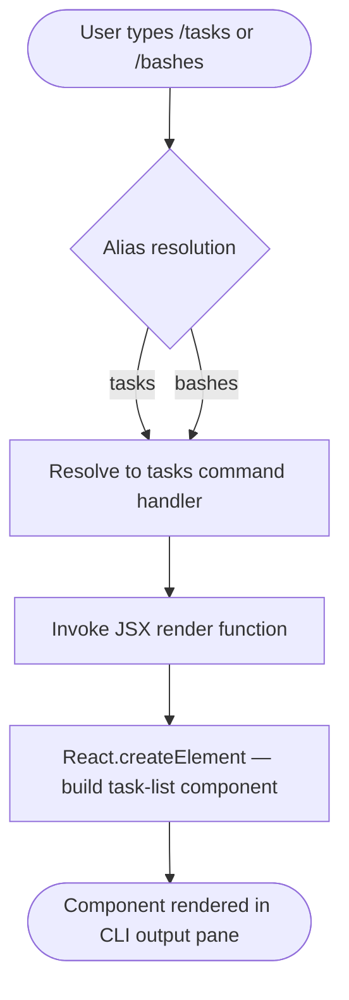

# `/tasks`

> Analysis basis: CC v2.1.133 bundle.js (AST extraction + Claude interpretation)
> Minimum version: v2.1.133

---

## Overview

The `/tasks` command (also accessible as `/bashes`) lists and manages background tasks running within the current Claude Code session. It is implemented as a local JSX command, meaning its output is rendered as a React component rather than plain text. The command provides a unified interface for inspecting the lifecycle state of any long-running or asynchronous operations that Claude Code has dispatched to the background.

---

## Registration

| Field | Value |
|---|---|
| type | `local-jsx` |
| name | `tasks` |
| description | `List and manage background tasks` |
| aliases | `bashes` |
| module\_id | `e7q` |

Analysis basis: CC v2.1.133 bundle.js:+11050580

---

## Input Branching

The depth-2 call-graph traversal surfaced a single call edge: the command's render function invokes `wSA.createElement` (i.e., `React.createElement`) to produce its JSX output. No conditional branch literals or sub-command routing strings were found at this traversal depth.



<!-- TODO: internal branch logic within the task-list component (e.g., empty-state vs populated-state, individual task controls) not found in depth-2 traversal; needs --depth 4 -->

---

## Behavioral Spec

### Command Dispatch and Alias Resolution

```
function resolveTasksCommand(rawInput):
    normalizedName = rawInput.trim().toLowerCase()
    if normalizedName is "tasks" or normalizedName is "bashes":
        return taskCommandHandler
    else:
        return NO_MATCH
```

When the user enters `/tasks` or `/bashes`, the CLI's command router normalizes the input and matches it against the registered name and alias list. Both forms are treated as fully equivalent; no behavior differs based on which alias was used.

Analysis basis: CC v2.1.133 bundle.js:+11050580

### JSX Component Rendering

```
function renderTasksView(sessionContext):
    taskList = sessionContext.getBackgroundTasks()
    element = createElement(TaskListComponent, { tasks: taskList })
    return element
```

The command handler calls into React's element factory (`wSA.createElement`) to construct a component tree representing the current background-task state. The resulting element is handed back to Claude Code's rendering pipeline for display in the terminal UI.

Analysis basis: CC v2.1.133 bundle.js:+11050453

<!-- TODO: TaskListComponent internal props schema and individual task action handlers (e.g., cancel, inspect) not found in depth-2 traversal; needs --depth 4 -->

---

## State & Side Effects

| Item | Detail |
|---|---|
| Telemetry | None detected at depth-2 traversal (`telemetry: []`) |
| Hook registration | None detected at depth-2 traversal |
| appState changes | <!-- TODO: not found in depth-2 traversal; needs --depth 4 --> |
| Sound | <!-- TODO: not found in depth-2 traversal; needs --depth 4 --> |

> **Note on telemetry absence:** No `tengu_*` event strings were found in the depth-2 traversal of this command. It is possible that telemetry is emitted by a child component or a shared task-management utility reachable only at greater traversal depth.

---

## Version History

| Version | Change |
|---|---|
| v2.1.133 | Initial analysis; command registered as `local-jsx`, alias `bashes` confirmed |

---

## Common Mistakes

1. **Using `/bashes` and expecting different behavior from `/tasks`** — The two names are registered aliases of the same command. They produce identical output and have no behavioral distinction.
2. **Assuming `/tasks` manages shell processes exclusively** — The description says "background tasks," which may include non-shell async operations internal to Claude Code. The exact scope of what constitutes a "task" is <!-- TODO: not found in depth-2 traversal; needs --depth 4 -->.
3. **Treating the output as plain text** — Because the command type is `local-jsx`, its output is a React component. Tooling or test harnesses that scrape raw stdout may not capture the rendered view correctly.
4. **Expecting interactive task controls to always be present** — If no background tasks are active, the component likely renders an empty or informational state rather than a list of controls. The exact empty-state behavior is <!-- TODO: not found in depth-2 traversal; needs --depth 4 -->.

---

## Appendix — Identifier Mapping

> For bundle debugging only. Identifiers change across versions.

| Identifier | Role |
|---|---|
| `zO7` | Tasks command render function — the top-level JSX handler registered for the `/tasks` command |