# `/team-onboarding`

> Analysis basis: CC v2.1.141 bundle.js (AST extraction + Claude interpretation)
> Minimum version: v2.1.141

---

## Overview

`/team-onboarding` is a `prompt`-type slash command that scans the invoking user's local Claude Code session transcripts and co-authors a Markdown onboarding guide (`ONBOARDING.md`) tailored for teammates who are new to Claude Code. The command collects usage data (up to the configured `WINDOW_DAYS` look-back, bounded at 365 days), classifies past work into task-type buckets, discovers MCP server configurations from `.mcp.json`, and drives a two-turn collaborative review loop before writing the final file.

---

## Registration

| Field | Value |
|---|---|
| type | `prompt` |
| name | `team-onboarding` |
| description | `Help teammates ramp on Claude Code with a guide from your usage` |
| isHidden | `false` |
| handler_method | `getPromptForCommand` |
| handler_method_start (byte) | `11831952` |
| handler_method_end (byte) | `11832608` |
| loc_byte | `11831614` |
| loc_byte_end | `11832609` |
| loc_line | `7868` |
| prompt_body.length | `4539` characters |
| prompt_body.trace | `identifier→$ (local→1 ext vars)` |
| arbor_handler.name | `getPromptForCommand` |
| arbor_handler.fqn | `claude-2.1.141::getPromptForCommand` |
| arbor_handler.kind | `Method` |
| arbor_handler.resolution_path | `direct` |
| arbor_handler.n_hits | `2` |
| `handler_method_start` | `11831952` |
| `handler_method_end` | `11832608` |

Analysis basis: CC v2.1.141 bundle.js:+11831614

---

## Input Branching

The handler performs multiple distinct branches: look-back window clamping, transcript scan success/empty/error, MCP config presence, git identity resolution, and guide-generation with/without a `generatedBy` name. This qualifies for a Mermaid flowchart.

```mermaid
flowchart TD
    A(["/team-onboarding invoked"]) --> B[Emit tengu_team_onboarding_invoked]
    B --> C[Clamp look-back window\nMath.min / Math.max / Math.floor\nbounded 0–365 days]
    C --> D[Scan local transcript directory\nfor .jsonl files via sVq]
    D --> E{Files found?}
    E -- "~0 sessions" --> F[Set USAGE_DATA = empty\nLeave work-type breakdown as TODO]
    E -- "sessions present" --> G[Parse sessionDescriptors\nextract title, prNumbers, first message]
    G --> H[Classify each session into\nbuild_feature / debug_fix /\nimprove_quality / analyze_data /\nplan_design / prototype / write_docs]
    H --> I[Pick top 3–5 categories\nwith rough percentages]
    F --> J
    I --> J[Resolve currentRepo\ncheck sibling workspace dirs via rE9]
    J --> K[Read .mcp.json via cR7\nparse mcpServers entries]
    K --> L{.mcp.json found?}
    L -- "yes" --> M[Infer server purpose\nfrom name + urlOrigin]
    L -- "no / ENOENT" --> N[Skip MCP section]
    M --> O
    N --> O[Resolve git user.name\nvia M_ → git config user.name]
    O --> P{generatedBy available?}
    P -- "yes" --> Q[Include author name in guide header]
    P -- "no / missing" --> R[Omit name from guide header]
    Q --> S[Substitute WINDOW_DAYS\nUSAGE_DATA GUIDE_TEMPLATE\ninto prompt body via replaceAll]
    R --> S
    S --> T[Build ASCII bar charts\n█ filled ░ empty 20 chars wide]
    T --> U[Write draft to ONBOARDING.md\nRender guide in code block]
    U --> V[Emit tengu_team_onboarding_generated]
    V --> W[Output acknowledgment line\nthen Review section with 3 questions]
    W --> X{User replies?}
    X -- "provides team name / tips / starter task" --> Y[Update ONBOARDING.md\nwith answers]
    Y --> Z[Output: Saved to ONBOARDING.md…]
    X -- "further edits" --> Y
    Z --> AA([End])
```



Analysis basis: CC v2.1.141 bundle.js:+11831952 (handler entry), +11832155 (Math clamping), +11832201 (365-day bound), +11832336 (lR7 transcript scan call), +11832345 (replaceAll substitution), +11832454 (t$8 guide template render)

---

## Behavioral Spec

### 1. Handler Entry and Telemetry Emission

```
function getPromptForCommand(context):
    emitTelemetry("tengu_flint_harbor_prompt")          // loc +11831989
    emitTelemetry("tengu_team_onboarding_invoked")      // loc +11832212

    rawDays = context.windowDaysParam ?? DEFAULT_DAYS
    windowDays = Math.floor(
        Math.max(0,
            Math.min(rawDays, 365)                       // max 365 days
        )
    )
    // loc +11832155–11832173
```

The 365-day ceiling is a hard constant in the bundle.
Analysis basis: CC v2.1.141 bundle.js:+11832201

---

### 2. Transcript Scanning (usageDataCollector)

```
async function collectUsageData(windowDays):
    cutoffMs = Date.now() - windowDays * 24 * 60 * 1000
    // constants: 24, 60, 1000 — loc +11820455–11820464

    entries = await fs.readdir(transcriptDir)           // loc +11820483
    jsonlFiles = entries.filter(e => extname(e) == ".jsonl")  // loc +11820553, ".jsonl" +11820570

    results = await Promise.all(
        jsonlFiles.map(async file =>
            stat = await fs.stat(join(transcriptDir, file))
            if not stat.isFile(): return null
            raw = await fs.readFile(file, "utf-8")      // loc +11820826
            lines = raw.split("\n")                     // loc +11820940

            // Extract sessionDescriptors:
            // scan for "\"name\":\"mcp__" pattern      // loc +11821149
            // scan for "\"content\":[" pattern         // loc +11821499
            // apply regex BR7, FR7, gR7               // loc +11821290–11821521

            // Cap session count at 10                  // loc +11820966
            return parsedSession
        )
    )
    return results.filter(Boolean)
```

If zero sessions are found, the work-type breakdown section is emitted as a TODO placeholder rather than empty data.
Analysis basis: CC v2.1.141 bundle.js:+11820442, +11820483, +11820570, +11820966

---

### 3. MCP Configuration Reader (mcpConfigReader)

```
async function readMcpConfig(workspaceRoot):
    configPath = join(workspaceRoot, ".mcp.json")       // loc +11822681
    try:
        raw = await fs.readFile(configPath, "utf8")     // loc +11822694
        parsed = JSON.parse(raw)
        servers = parsed["mcpServers"] ?? {}            // loc +11822737
        return servers
    catch err:
        if err.code == "ENOENT": return {}
        throw err
```

Each server entry's `name` and (when present) `urlOrigin` are used by the prompt to infer the server's purpose and access instructions for the guide's MCP section.
Analysis basis: CC v2.1.141 bundle.js:+11822657, +11822670, +11822681, +11822737

---

### 4. Git Identity Resolution (gitIdentityResolver)

```
async function resolveGitIdentity(cwd):
    // Step 1: get user display name
    nameResult = await runGit(["config", "user.name"], cwd)
    // literals: "git" +11823304, "config" +11823311, "user.name" +11823320

    // Step 2: get remote origin URL (for repo identification)
    remoteResult = await runGit(["remote", "get-url", "origin"], cwd)
    // literals: "remote" +11823376, "get-url" +11823385, "origin" +11823395

    return {
        generatedBy: nameResult.stdout.trim() || null,
        remoteUrl: remoteResult.stdout.trim() || null
    }
```

If `generatedBy` is null or missing, the guide header omits the author name entirely.
Analysis basis: CC v2.1.141 bundle.js:+11823301, +11823304, +11823376

---

### 5. Prompt Template Substitution

```
function buildPromptBody(windowDays, usageData, guideTemplate):
    base = PROMPT_TEMPLATE_STRING                       // length 4539, loc +11831614

    // Three placeholder replacements via replaceAll:   // loc +11832345
    result = base
        .replaceAll("{{WINDOW_DAYS}}", String(windowDays))   // loc +11832358, +11832376
        .replaceAll("{{GUIDE_TEMPLATE}}", guideTemplate)     // loc +11832398
        .replaceAll("{{USAGE_DATA}}", JSON.stringify(usageData, null, 2))  // loc +11832433

    return result
```

The prompt instructs the agent to emit an acknowledgment line as its **first visible output** before any classification or tool use — this is an explicit ordering constraint built into the prompt body.
Analysis basis: CC v2.1.141 bundle.js:+11832345, +11832358, +11832398, +11832433

---

### 6. Session Classification (performed by the agent, specified in the prompt)

The prompt body instructs the agent to classify each `sessionDescriptor` entry into one of seven canonical task types:

| Canonical Key | Display Form | Description |
|---|---|---|
| `build_feature` | Build Feature | New functionality, scripts, tools, config/CI/env setup |
| `debug_fix` | Debug Fix | Investigating and fixing bugs |
| `improve_quality` | Improve Quality | Refactoring, tests, cleanup, code review |
| `analyze_data` | Analyze Data | Queries, metrics, number crunching |
| `plan_design` | Plan Design | Architecture, approach, strategy, design review |
| `prototype` | Prototype | Spikes, POCs, throwaway exploration |
| `write_docs` | Write Docs | PRDs, RFCs, READMEs, design docs, copy/doc review |

Rules enforced by the prompt:
- Display names use title case with spaces (e.g. "Build Feature", not "build_feature").
- The top 3–5 categories are selected with rough percentage estimates.
- New categories are only invented when no existing category fits the task type.
- Code review → `improve_quality`; doc review → `write_docs`; design review → `plan_design`.
- If first messages are uninformative, tool and MCP call counts serve as a weak fallback signal.

Analysis basis: CC v2.1.141 bundle.js:+11831614 (prompt body), +11831952 (handler method)

---

### 7. Guide Rendering and Two-Turn Review Loop

```
function agentGuideTurn1(promptResult):
    // FIRST OUTPUT: acknowledgment line (no thinking, no tool calls before this)
    print("> Looking at how you've used Claude over the last {WINDOW_DAYS} days...")

    // Generate draft ONBOARDING.md:
    //   - ASCII bar charts: █ (filled), ░ (empty), 20 chars wide
    //   - Fill real numbers from usage data (no placeholder strings)
    //   - Include generatedBy name if present, otherwise omit
    //   - Keep HTML comment instruction at bottom of template verbatim

    writeToDisk("ONBOARDING.md", draftContent)
    renderInCodeBlock(draftContent)

    print("---")
    print("**Review**")
    print("1. Team name confirmation or request")
    print("2. Starter task question (ticket or doc link, optional)")
    print("3. Team tips question (anything not in CLAUDE.md)")

function agentGuideTurn2(userAnswers):
    updateFile("ONBOARDING.md", {
        teamName: userAnswers.teamName,
        tips: userAnswers.tips,
        starterTask: userAnswers.starterTask
    })
    print("Saved to `ONBOARDING.md`. Drop it in your team docs...")
    // Apply further edits on subsequent turns if requested
```

Analysis basis: CC v2.1.141 bundle.js:+11832454 (t$8 render call), +11832477 (tengu_team_onboarding_generated)

---

### 8. Guide Share / Flint Harbor Integration

```
function shareGuide(context):
    // Reached via t$8 → xA → j6
    // loc +11832454, +11832574
    emitTelemetry("tengu_flint_harbor_share")           // loc +8981611
```

The call graph shows `t$8` invokes both the Flint Harbor prompt pipeline (`Vq → cMA → RH`) and a share path (`xA`), suggesting the rendered guide may be eligible for sharing through an internal distribution mechanism.
Analysis basis: CC v2.1.141 bundle.js:+8981556, +8981574, +8981608, +8981611

---

## State & Side Effects

| Item | Detail |
|---|---|
| **Telemetry — invocation** | `tengu_team_onboarding_invoked` (loc +11832212) — fired on every invocation after window clamping |
| **Telemetry — generation** | `tengu_team_onboarding_generated` (loc +11832477) — fired after the prompt body is fully assembled |
| **Telemetry — harbor prompt** | `tengu_flint_harbor_prompt` (loc +11831989) — fired at handler entry via `j6` |
| **Telemetry — harbor share** | `tengu_flint_harbor_share` (loc +8981611) — fired through `t$8 → xA` path |
| **Telemetry — feature flags** | `tengu_feature_ok` (loc +945566), `tengu_feature_bad` (loc +945624) — feature-gate checks in the call chain |
| **Telemetry — config error** | `tengu_config_parse_error` (loc +3143249) — if config read fails during context assembly |
| **Telemetry — background** | `tengu_bg_dispatch_sigkill_escalate`, `tengu_bg_dispatch_low_mem`, `tengu_bg_spare_enable`, `tengu_bg_spare_claim`, `tengu_bg_spare_claim_fail`, `tengu_bg_spare_spawn`, `tengu_bg_low_mem_mb`, `tengu_daemon_control` — daemon/background session management events in shared call paths |
| **File written** | `ONBOARDING.md` in the current working directory — created/overwritten during Turn 1, updated after Turn 2 review answers |
| **File read** | `.mcp.json` in workspace root (UTF-8, loc +11822681); local transcript `.jsonl` files (loc +11820826) |
| **Git commands run** | `git config user.name` and `git remote get-url origin` — executed at invocation time to resolve identity and repo |
| **appState changes** | Session deduplication sets (`pA_.add`, `R76.add`) updated through `vi6`; Growthbook experiment events emitted via `mA_` (loc +3114109, +3114536) |
| **Sound** | None identified in depth-2 traversal |
| **Hook registration** | File-watch hooks registered/deregistered through `EhL → mi6.watchFile / mi6.unwatchFile` in the configuration load path |
| **Random bytes** | Used for session ID generation in `hu → oE9.randomBytes` (32 bytes, hex-encoded, loc +3146156–3146169) |

---

## Version History

| Version | Change |
|---|---|
| v2.1.141 | Initial analysis — command registered at bundle.js:+11831614; prompt body length 4539 chars; seven task-type classification categories; 365-day look-back ceiling; two-turn review loop producing ONBOARDING.md |

---

## Common Mistakes

1. **Expecting instant output before the acknowledgment line.** The prompt explicitly requires the acknowledgment line (`"> Looking at how you've used Claude over the last N days…"`) to be the very first visible output. Any tool calls or classification thinking emitted before it violates the prompt contract.

2. **Assuming the window is unlimited.** The look-back period is hard-clamped to a maximum of 365 days (`Math.min(rawDays, 365)`, bundle.js:+11832201). Values larger than 365 are silently truncated.

3. **Using snake_case task-type keys in the rendered guide.** The prompt explicitly requires title-case display names with spaces (e.g. "Build Feature", not "build_feature"). Using the internal key names in the guide output is incorrect.

4. **Skipping the two-turn review loop.** The command is designed for a two-turn interaction: Turn 1 generates and renders the draft, Turn 2 incorporates the user's answers. Closing after Turn 1 without the Review section leaves the team name, tips, and starter task as unfilled TODOs.

5. **Quoting placeholder strings in the final guide.** The rendered ONBOARDING.md must contain real numbers from usage data, not placeholder strings like `{{WINDOW_DAYS}}` or `{{USAGE_DATA}}`. These are substituted during prompt assembly (bundle.js:+11832345), not by the agent.

6. **Inventing many new task categories.** The classification scheme has seven canonical types. New categories should only be added when a session describes a genuinely different *type* of task — not a different project or domain within an existing type.

7. **Omitting the closing line verbatim.** After updating `ONBOARDING.md` in Turn 2, the agent must output the exact phrase beginning `"Saved to \`ONBOARDING.md\`. Drop it in your team docs and channels…"` — paraphrasing breaks the designed UX flow.

---

## Appendix — Identifier Mapping

> For bundle debugging only. Identifiers change across versions.

| Identifier | Role |
|---|---|
| `__handler_team-onboarding` | Synthetic BFS entry point for the command handler (not a real bundle symbol; prefer `getPromptForCommand` per Arbor) |
| `j6` | Flint Harbor prompt dispatcher — routes prompt-type commands into the agent pipeline |
| `b76` | Prompt pipeline sub-step A (called from `j6`) |
| `x76` | Prompt pipeline sub-step B (called from `j6`) |
| `Js` | Prompt context assembler |
| `RH` | String normalisation utility |
| `ws` | Workspace/config reader |
| `Su` | Config access guard (raises "Config accessed before allowed" if called too early) |
| `vi6` | Session deduplication and dispatch gate |
| `mA_` | Background session creator / Growthbook experiment event emitter |
| `W0H` | Session record writer |
| `hu` | Session ID generator (uses `oE9.randomBytes`, 32 bytes hex) |
| `SH` | JSON serialiser wrapper (`JSON.stringify`) |
| `ayL` | Post-creation callback/hook for new sessions |
| `cA_` | API endpoint resolver (checks `api.anthropic.com`) |
| `sY9` | First-party origin checker |
| `p_` | Execution context resolver |
| `xE9` | Network config helper |
| `FRH` | Feature-flag gate (`fIK.has`) |
| `h6` | Config loader / file-watch coordinator |
| `x6` | Config path resolver |
| `_9_` | Config schema validator |
| `cMH` | Configuration read-and-parse implementation (reads UTF-8, handles ENOENT/EEXIST, creates backups) |
| `q` | Filesystem module reference (sync I/O: `readFileSync`, `statSync`, `mkdirSync`, `readdirStringSync`, `copyFileSync`) |
| `b6` | JSON.parse wrapper |
| `DR` | Path prefix stripper (uses `startsWith`/`slice`) |
| `M8` | Async error handler / error classifier |
| `rE9` | Sibling repository directory scanner (uses `readdirStringSync`, `statSync`, `basename`, `dirname`) |
| `v` | Log/debug formatter (handles `debug` level, `toUpperCase`, trim) |
| `kH` | Transcript file reader with error logging (`Oc.logError`, `aRH.push`) |
| `Q` | Shared async queue / promise coordinator |
| `$9_` | Backup directory path builder (joins `backups` subdirectory) |
| `w` | Daemon background-session lifecycle manager (spawns, monitors memory, retires, kills via SIGKILL) |
| `EhL` | File-watch registration/teardown coordinator (`mi6.watchFile` / `mi6.unwatchFile`) |
| `Jl` | Watch-event debounce handler |
| `b9` | AppState update applier (`Object.assign`, `jI8.add`/`jI8.delete`) |
| `lR7` | Usage-data collection orchestrator — calls `sVq`, `cR7`, `dR7`, `M_`, `GXH` |
| `e8` | Transcript directory path resolver |
| `BG` | Projects directory path builder |
| `XV` | Project subdirectory path builder |
| `tO` | Path sanitiser / anonymiser |
| `H` | Miscellaneous utility (random, setTimeout, string ops) |
| `HNK` | Numeric hash helper (`Math.abs`) |
| `sVq` | Transcript scanner — reads `.jsonl` files, applies regex, extracts `sessionDescriptors` |
| `x9` | Error-code classifier |
| `K` | Async iterator / map utility |
| `L` | Task queue entry wrapper |
| `f` | Stream/reader abstraction |
| `O` | File stat result wrapper |
| `b8` | File metadata helper |
| `$` | Line-splitting and session-parse coordinator |
| `XTq` | Session descriptor builder (uses `Date.now`, `SH`) |
| `z` | Background-session manager (stop/status checks, `hH`/`xH`) |
| `hH` | Daemon stop handler |
| `xH` | Daemon status checker |
| `oR` | Message-flow recorder (`MF.push`, `W0H`) |
| `Kx` | Background session race/all coordinator (`Promise.race`, `Promise.all`, `process.exit`) |
| `D` | Background subprocess dispatch and memory monitor |
| `YG6` | Platform detector (`macos` branch) |
| `_o_` | Daemon spare-session spawner (uses `Bun.spawn`, random bytes, SIGTERM) |
| `cR7` | `.mcp.json` config reader (`eVq.readFile`, `eP8.join`, parses `mcpServers`) |
| `$8` | Async error wrapper (calls `M8`) |
| `dR7` | Additional usage-data transformer / post-processor |
| `M_` | Git command runner (invokes `git config user.name` and `git remote get-url origin`) |
| `jXH` | Child-process executor (full featured: timeout, kill, stdio pipe, `Promise.race`) |
| `eOA` | Process argument builder |
| `sx8` | Process stdout decoder |
| `tx8` | Process stderr decoder |
| `Hu8` | Process exit-code handler |
| `MOA` | Numeric argument validator (`Number.isFinite`) |
| `CA6` | Process execution orchestrator (handles `[object Error]`, `bufferedData`) |
| `ax8` | Reflect-based method proxy (`Reflect.apply`, `Reflect.defineProperty`) |
| `pOA` | Process exit event listener (`H.on("exit", ...)`) |
| `fOA` | Execution timeout wrapper (`setTimeout`, `clearTimeout`, `Promise.race`) |
| `$OA` | Forced process kill (`H.kill`, `Dc`) |
| `KOA` | stdout data collector (`MkK`) |
| `LOA` | Kill-on-timeout handler |
| `uOA` | Parallel output consumer (`Promise.all`, `ox8`, `rx8`) |
| `mA6` | Output finaliser (`Sx8`) |
| `bOA` | Stream pipe connector (`A.pipe`, `eS6`) |
| `xOA` | Stream output accumulator (`SOA.default`, `A.add`) |
| `DOA` | stdout/stderr stream binder (`Fx8.bind`) |
| `lkK` | String-based argument formatter |
| `GXH` | Git remote URL parser (trim, match, `git/` prefix check) |
| `XyK` | URL hostname extractor |
| `B1` | String index/slice utility |
| `t$8` | Guide template renderer and Flint Harbor share dispatcher |
| `Vq` | Flint Harbor prompt channel selector (`cMA`) |
| `cMA` | Harbor channel normaliser (`RH`) |

---

*Note: index built via Arbor fallback; some signals (telemetry, literals) may be missing — see arbor-fallback.js.*