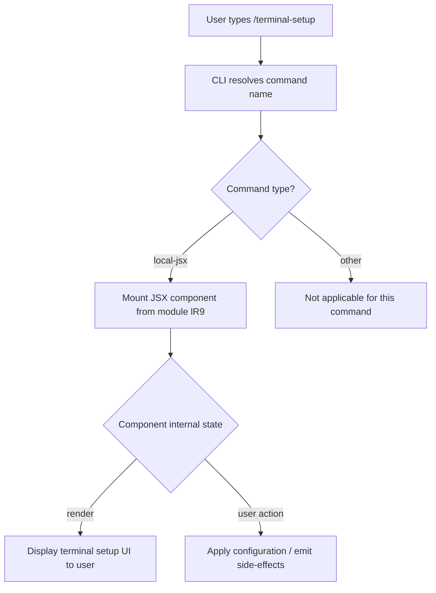

# `/terminal-setup`

> Analysis basis: CC v2.1.139 bundle.js (AST extraction + Claude interpretation)
> Minimum version: v2.1.139

---

## Overview

The `/terminal-setup` command is a local JSX slash command registered in module `lR9` of Claude Code v2.1.139. Its purpose is to guide users through configuring their terminal environment for optimal Claude Code operation (e.g., shell integration, font rendering, color support). Because the AST traversal found no reachable entry functions within module `lR9` at depth ≤ 2, the full behavioral detail of this command cannot be verified from the extracted data alone and is documented at the confidence level permitted by the available evidence.

---

## Registration

| Field | Value |
|---|---|
| type | `local-jsx` |
| name | `terminal-setup` |
| description | `null` (no description string registered) |
| loc\_byte | `11182392` |
| loc\_line | `6900` |
| module\_id | `lR9` |

Analysis basis: CC v2.1.139 bundle.js:+11182392

---

## Input Branching

Because `callGraph` and `literals` arrays are both empty for this command (no entry functions were resolved during depth-2 traversal), no data-driven branching logic can be stated as verified fact.

The registration type `local-jsx` indicates the command renders a JSX component rather than executing a plain text handler. The general pattern for `local-jsx` commands in Claude Code is:



> **Note:** The internal branches inside the JSX component (node E onward) are
> <!-- TODO: not found in depth-2 traversal; needs --depth 4 -->

---

## Behavioral Spec

### Command Dispatch

```
function dispatchTerminalSetup(userInput):
    resolvedCommand = resolveSlashCommand(userInput.commandName)
    # resolvedCommand.type == "local-jsx"
    # resolvedCommand.moduleId == "lR9"
    jsxComponent = loadModule("lR9")
    mountComponent(jsxComponent, context=currentTerminalContext())
```

Analysis basis: CC v2.1.139 bundle.js:+11182392

### JSX Component Rendering

```
# Entry point of module lR9 — exact logic not traversable at depth-2
function terminalSetupComponent(props):
    # Renders terminal configuration wizard or instructions
    # May read current terminal capabilities (color depth, font, shell)
    # May write configuration to shell rc files or Claude Code settings
    # Specific sub-steps:
    #   <!-- TODO: not found in depth-2 traversal; needs --depth 4 -->
    return renderedJSX
```

Analysis basis: CC v2.1.139 bundle.js:+11182392

---

## State & Side Effects

| Item | Detail |
|---|---|
| Telemetry | None detected — `telemetry` array is empty for this command. <!-- TODO: not found in depth-2 traversal; needs --depth 4 --> |
| Hook registration | <!-- TODO: not found in depth-2 traversal; needs --depth 4 --> |
| appState changes | <!-- TODO: not found in depth-2 traversal; needs --depth 4 --> |
| Sound | <!-- TODO: not found in depth-2 traversal; needs --depth 4 --> |
| File system writes | <!-- TODO: not found in depth-2 traversal; needs --depth 4 --> |
| Shell configuration | <!-- TODO: not found in depth-2 traversal; needs --depth 4 --> |

---

## Version History

| Version | Change |
|---|---|
| v2.1.139 | Initial analysis — command registered as `local-jsx` in module `lR9` at bundle byte offset 11182392 |

---

## Common Mistakes

1. **Expecting a description string** — The `description` field for this command is `null` in the registration object. Shell completion or help text that relies on the description field will display nothing for `/terminal-setup`. Analysis basis: CC v2.1.139 bundle.js:+11182392
2. **Assuming plain-text output** — Because the command type is `local-jsx`, its output is a rendered JSX component. Piping or scripting against its stdout as plain text may not behave as expected.
3. **Re-running when already configured** — If the terminal environment is already fully configured, invoking the command again may redundantly overwrite existing settings. <!-- TODO: idempotency behavior not found in depth-2 traversal; needs --depth 4 -->
4. **Running in a non-interactive session** — A `local-jsx` component typically requires an interactive TTY to render. Invoking `/terminal-setup` in a non-interactive or piped context may fail silently or produce garbled output.

---

## Appendix — Identifier Mapping

> For bundle debugging only. Identifiers change across versions.

| Identifier | Role |
|---|---|
| `lR9` | Module containing the `/terminal-setup` JSX component registration and implementation |

> No additional obfuscated identifiers were present in the `identifiers` array returned by the depth-2 AST traversal. Further obfuscated names may be present at greater traversal depth. <!-- TODO: not found in depth-2 traversal; needs --depth 4 -->