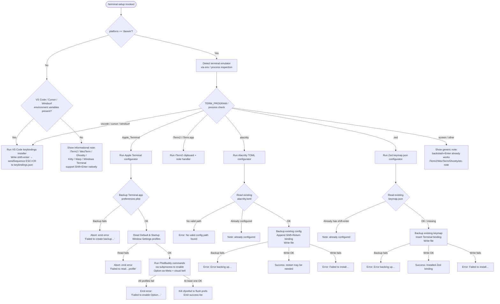

# `/terminal-setup`

> Analysis basis: CC v2.1.141 bundle.js (AST extraction + Claude interpretation)
> Minimum version: v2.1.141

---

## Overview

`/terminal-setup` installs a Shift+Enter key binding that sends a newline sequence to the terminal without submitting the current input line, enabling multi-line input in Claude Code. It detects the active terminal emulator and platform, then writes the appropriate configuration file or system preference for each supported terminal (Apple Terminal, VS Code family, Alacritty, Zed, iTerm2). The command is macOS-centric for most paths but also handles VS Code on Linux and Windows.

---

## Registration

| Field | Value |
|---|---|
| type | `local-jsx` |
| name | `terminal-setup` |
| description | Install Shift+Enter key binding for newlines |
| loc_byte | `11241249` |
| loc_byte_end | `11241881` |
| loc_line | `6942` |
| module_id | `$u9` |
| load_inline | `true` |
| arbor_handler.name | `EcL` |
| arbor_handler.fqn | `claude-2.1.141::EcL` |
| arbor_handler.kind | `AsyncFunction` |
| arbor_handler.resolution_path | `module_id` |
| arbor_handler.n_hits | `1` |

Analysis basis: CC v2.1.141 bundle.js:+11241249

---

## Input Branching

The command detects 7+ distinct terminal contexts and dispatches to separate configuration sub-routines; a Mermaid flowchart is required.



Analysis basis: CC v2.1.141 bundle.js:+3811368 (platform check), +3809448 (darwin literal), +3809472–3809605 (terminal name literals), +3815979 (shift+enter keybinding), +3819328 (alacritty.toml), +3820843 (keymap.json)

---

## Behavioral Spec

### 1. Top-level Handler (`EcL`)

```
async function terminalSetupHandler(context):
    currentPlatform = getPlatform()          // qt.platform

    // Step 1: Handle iTerm2 clipboard setup (macOS only)
    if currentPlatform == "darwin":
        iTerm2ClipboardSetup(context)        // Mu9

    // Step 2: Identify active terminal name
    terminalName = detectTerminalName(context)   // ca6 + H

    // Step 3: If on macOS, also check for screen multiplexer hint
    // and emit "iTerm2/WezTerm … support Shift+Enter natively" note
    // when running inside screen or unrecognized terminal

    // Step 4: Run per-terminal configuration
    perTerminalConfig(terminalName, context)     // na6

    // Step 5: Display dim status note about what was configured
    displayStatusNote(context)
```

Analysis basis: CC v2.1.141 bundle.js:+3811368

---

### 2. iTerm2 Clipboard Enabler (`Mu9`)

Executed on macOS before the main key-binding installation. Reads the `com.googlecode.iterm2` domain key `AllowClipboardAccess` via the macOS `defaults` subsystem.

```
async function iTerm2ClipboardSetup(context):
    currentValue = readDefaultsKey("com.googlecode.iterm2", "AllowClipboardAccess")
    if currentValue.trim() indicates already enabled:
        emit dim note "iTerm2 clipboard access already enabled"
        return

    result = runCommand(["defaults", "write",
                         "com.googlecode.iterm2", "AllowClipboardAccess",
                         "-bool", "true"])
    if result indicates failure:
        emit warning "Couldn't update iTerm2 clipboard setting."
    else:
        emit success "Enabled \"Applications in terminal may access clipboard\" in iTerm2"
        emit note "Restart iTerm2 for this to take effect. Undo: defaults write …"
```

Analysis basis: CC v2.1.141 bundle.js:+3810403, +3810425, +3810449, +3810524, +3810612

---

### 3. Per-Terminal Dispatcher (`na6`)

Routes execution to one of five terminal-specific configuration functions, plus two VS Code variant handlers, after a common platform detection step.

```
async function perTerminalConfig(terminalIdent, context):
    platform = getPlatform()

    // Sub-handlers (all called as needed):
    appleTerminalHandler(context)     // VcL  — Apple_Terminal
    vscodeHandler(context)            // Y4_  — vscode / Code
    cursorHandler(context)            // z4_  — cursor / Cursor
    alacrittyHandler(context)         // IcL  — alacritty
    zedHandler(context)               // vcL  — zed

    // Render output lines
    renderOutput(context)             // e6, HBH
```

Analysis basis: CC v2.1.141 bundle.js:+3809691

---

### 4. Apple Terminal Configurator (`VcL`)

The most complex sub-handler. Modifies Apple Terminal's binary plist to add Shift+Enter and Option-as-Meta support.

```
async function appleTerminalConfigurator(context):
    prefsPath = path.join(homedir(), "Library", "Preferences",
                          "com.apple.Terminal.plist")

    // 1. Create backup via subprocess
    backupOk = createBackup(prefsPath)   // O8
    if not backupOk:
        throw Error("Failed to create backup of Terminal.app preferences, bailing out")
        // literal at +3817639

    // 2. Read Default Window Settings profile name
    defaultProfile = runSubprocess(["defaults", "export",
                                    "com.apple.Terminal", ...])
    defaultProfile = defaultProfile.trim()
    if not defaultProfile:
        throw Error("Failed to read default Terminal.app profile")
        // literal at +3817837

    // 3. Read Startup Window Settings profile name
    startupProfile = readStartupProfile()
    startupProfile = startupProfile.trim()
    if not startupProfile:
        throw Error("Failed to read startup Terminal.app profile")
        // literal at +3818014

    // 4. Apply PlistBuddy commands to each profile via qu9/Ku9
    successCount = 0
    for profile in [defaultProfile, startupProfile]:
        ok = applyPlistBuddyCommands(profile, prefsPath)  // qu9 / Ku9 / v
        if ok: successCount++

    if successCount == 0:
        throw Error("Failed to enable Option as Meta key or disable audio bell …")
        // literal at +3818224

    // 5. Flush macOS preference daemon
    runCommand(["killall", "cfprefsd"])
    // literals at +3818323, +3818334

    // 6. Build and emit success message lines
    successLines = []
    successLines.push("- Enabled \"Use Option as Meta key\"")      // +3818443
    successLines.push("- Switched to visual bell")                  // +3818505
    successLines.push(dim("Shift+Return will now enter a newline."))// +3818550
    successLines.push("Option+Enter will now enter a newline.")     // +3818599
    successLines.push(dim("You must restart Terminal.app …"))       // +3818684
    emit "success", "Configured Terminal.app settings:"             // +3818376
    emit lines joined                                               // D.join +3818650
```

Analysis basis: CC v2.1.141 bundle.js:+3817593, +3817621, +3817734, +3817816, +3817954, +3818094, +3818109, +3818323, +3818347, +3818360

---

### 5. Subprocess Executor (`O8` / command runner)

Thin wrapper over a queued subprocess system used to run `defaults`, `PlistBuddy`, and `killall`.

```
function runCommand(argv):
    // uses internal queue (kH / GvK) with shift/push semantics
    // logs errors via Oc.logError
    // returns stdout string or null on error
```

Analysis basis: CC v2.1.141 bundle.js:+3806054, +3806095, +1025913, +950995

---

### 6. plist/defaults Reader for Apple Terminal (`ex9`)

```
async function readAppleTerminalDefaults():
    prefsPath = buildPrefsPath()   // ABH: homedir + "Library/Preferences/com.apple.Terminal.plist"
    stat(prefsPath)                // f4_.stat to check existence
    result = runSubprocess(["defaults", "export", "com.apple.Terminal", ...])   // O8
    writeConfigWithBackup(result)  // XcL
    return result
```

Literal constants: `"Library"` (+3805975), `"Preferences"` (+3805985), `"com.apple.Terminal.plist"` (+3805999), `"defaults"` (+3806098), `"export"` (+3806110), `"com.apple.Terminal"` (+3806119).

Analysis basis: CC v2.1.141 bundle.js:+3806054, +3806175, +3806267, +3806292

---

### 7. PlistBuddy Invoker (`qu9` / `Ku9`)

Sends PlistBuddy `-c` commands to modify individual profile keys inside the Terminal plist.

```
async function applyPlistBuddyToProfile(profile, prefsPath):
    buddyPath = "/usr/libexec/PlistBuddy"        // literal +3816866
    flag = "-c"                                   // literal +3816893
    commands = buildPlistBuddyCommandList(profile)
    results = []
    for cmd in commands:
        out = runSubprocess([buddyPath, flag, cmd, prefsPath])   // O8
        results.push(out)
    return formatResults(results)   // v, ABH
```

Analysis basis: CC v2.1.141 bundle.js:+3816863, +3816959, +3817110, +3817250, +3817333

---

### 8. VS Code / Cursor / Windsurf Keybindings Installer (`Y4_` / `z4_`)

Writes or merges a `keybindings.json` entry that maps Shift+Enter to `workbench.action.terminal.sendSequence` with the escape sequence `ESC CR` (`\x1b\r`).

```
async function vscodeKeybindingsInstaller(variant):
    // variant is "vscode", "cursor", or "windsurf"
    configDir = resolveVSCodeConfigDir(variant)    // W4_
    keybindingsPath = path.join(configDir, "keybindings.json")  // +3815530

    existing = readFile(keybindingsPath, "utf-8") ?? "[]"       // +3815593, +3815644
    parsed = parseJSON(existing)                                 // ER6

    // Check if binding already present (D4_ searches for shift+enter)
    alreadyPresent = parsed.find(entry =>
        entry.key == "shift+enter" and                          // +3815979
        entry.command == "workbench.action.terminal.sendSequence")

    if alreadyPresent:
        emit note "Already configured"
        return

    // Backup existing file
    backup = createBackup(keybindingsPath)
    if backupFails: bail out

    // Build new binding object
    newBinding = {
        key: "shift+enter",                                     // +3815979
        command: "workbench.action.terminal.sendSequence",      // +3816001
        args: { text: "\x1b\r" },                              // +3816053
        when: "terminalFocus"                                   // +3816068
    }

    // Insert / merge
    updatedBindings = mergeOrInsert(parsed, newBinding)         // BzA / UzA
    writeFile(keybindingsPath, JSON.stringify(updatedBindings, null, 2))

    emit success "Installed …Shift+Enter key binding"
```

Config directory resolution (`W4_`) branches by platform and variant:
- `win32`: `%APPDATA%\Code\User` / `%APPDATA%\Cursor\User` etc. (literal `"AppData"` +3813483, `"Roaming"` +3813493)
- `darwin`: `~/Library/Application Support/Code/User` (literal `"Application Support"` +3813556)
- Linux: `~/.config/Code/User` (literal `".config"` +3813596)

Analysis basis: CC v2.1.141 bundle.js:+3814859, +3815511, +3815530, +3815560, +3815620, +3815661, +3815685, +3815774, +3815912, +3816087

---

### 9. Alacritty Configurator (`IcL`)

```
async function alacrittyConfigurator():
    candidatePaths = buildAlacrittyConfigPaths()  // A.push, Yh.join, qt.homedir
    // Checks platform-standard locations for alacritty.toml

    configPath = candidatePaths.find(p => fileExists(p))
    if not configPath:
        throw Error("No valid config path found for Alacritty")   // +3819689

    content = readFile(configPath)

    // Check if already configured
    if content.includes("mods = \"Shift\"") and                   // +3819757
       content.includes("key = \"Return\""):                       // +3819787
        emit note "Alacritty Shift+Enter key binding already configured"  // +3819830
        return

    // Backup
    backup = createBackup(configPath)
    if backupFails:
        throw Error("Error backing up existing Alacritty config. Bailing out.")  // +3820040

    // Append TOML key binding block
    updatedContent = content + buildAlacrittyTomlBlock()
    mkdir(dirname(configPath))
    if content.endsWith("\n"):
        writeFile(configPath, updatedContent)
    else:
        writeFile(configPath, "\n" + updatedContent)

    emit success "Installed Alacritty Shift+Enter key binding"    // +3820414
    emit note "You may need to restart Alacritty…"               // +3820484
```

Analysis basis: CC v2.1.141 bundle.js:+3819299, +3819367, +3819424, +3819576, +3819638, +3819683, +3819746, +3819814, +3819929, +3819992, +3820188, +3820358

---

### 10. Zed Configurator (`vcL`)

```
async function zedConfigurator():
    keymapPath = path.join(homedir(), ".config", "zed", "keymap.json")  // +3820843

    mkdir(dirname(keymapPath))
    existing = readFile(keymapPath) ?? "[]"

    parsed = JSON.parse(existing)                                  // b6
    if not Array.isArray(parsed): parsed = []

    // Check already configured
    alreadyPresent = parsed.some(entry =>
        entry includes "shift-enter" binding)                      // +3821009
    if alreadyPresent:
        emit note "Zed Shift+Enter key binding already configured" // +3821049
        return

    // Backup
    backup = createBackup(keymapPath)
    if backupFails:
        throw Error("Error backing up existing Zed keymap. Bailing out.")  // +3821253

    // Build and insert Zed binding
    newEntry = {
        context: "Terminal",                                       // +3821462
        bindings: { "shift-enter": "terminal::SendText" }         // +3821498
    }
    parsed.push(newEntry)                                          // L.push

    writeFile(keymapPath, JSON.stringify(parsed, null, 2))        // SH +3821553
    emit success "Installed Zed Shift+Enter key binding"          // +3821609
```

Analysis basis: CC v2.1.141 bundle.js:+3820793, +3820801, +3820868, +3820923, +3820975, +3820998, +3821033, +3821120, +3821142, +3821205, +3821538, +3821609

---

### 11. Backup Helper (`da6`)

Shared across Apple Terminal, Alacritty, and Zed handlers. Backs up a config file before any mutation, using a random suffix to avoid collision.

```
async function createBackup(sourcePath):
    backupDir = determineBackupDir(sourcePath)    // WcL -> h6
    if backupDir == "no_backup":                  // literal +3806382
        return true   // skip backup

    randomSuffix = randomBytes(...)
    stat(sourcePath)                              // f4_.stat
    copy = await copyFile(sourcePath, backupPath) // O8
    if fails:
        emit failed state
        return false
    return true
```

Analysis basis: CC v2.1.141 bundle.js:+3806356, +3806408, +3806445, +3806519, +3806591, +3806668, +3806696

---

### 12. Informational Note for Unsupported Terminals

When the active terminal is `screen`, unrecognized, or the command is run inside a remote/server environment (`.vscode-server`, `.cursor-server`, `.windsurf-server` paths detected — literals +3809020, +3809050, +3809080), the handler emits two advisory notes instead of making changes:

- `"Note: You can already use backslash (\\) + return to add newlines."` (literal +3812361)
- `"Note: iTerm2, WezTerm, Ghostty, Kitty, Warp, and Windows Terminal support Shift+Enter natively."` (literal +3812696)

Analysis basis: CC v2.1.141 bundle.js:+3811518, +3812361, +3812696

---

## State & Side Effects

| Item | Detail |
|---|---|
| Telemetry | `tengu_config_auth_loss_prevented` (+3138005); `tengu_bg_spare_enable` (+14464520); `tengu_bg_low_mem_mb` (+11848152); `tengu_bg_spare_spawn` (+14464880); `tengu_config_lock_contention` (+3140668); `tengu_config_stale_write` (+3140804); `tengu_config_parse_error` (+3143249); `tengu_feature_ok` (+945566) |
| File mutations | Writes / patches: `~/Library/Preferences/com.apple.Terminal.plist` (Apple Terminal); `keybindings.json` in VS Code / Cursor / Windsurf user config dirs; `~/.config/alacritty/alacritty.toml` or platform equivalent; `~/.config/zed/keymap.json` |
| Backup files | Before any write, copies original to a backup path with random suffix; backup dir determined by `WcL`/`h6`; skipped when marker is `"no_backup"` |
| Subprocess invocations | `defaults export/read/write`, `/usr/libexec/PlistBuddy -c`, `killall cfprefsd` (macOS only) |
| iTerm2 side effect | Sets `com.googlecode.iterm2 AllowClipboardAccess YES` via `defaults write` (macOS only) |
| cfprefsd flush | Sends `killall cfprefsd` after Apple Terminal plist changes to force preference reload |
| appState changes | Reads/writes global config via `M9_`/`cMH` (config-lock path); `tengu_config_stale_write` / `tengu_config_auth_loss_prevented` guard auth fields |
| Sound | None detected |
| Hook registration | None detected |

---

## Version History

| Version | Change |
|---|---|
| v2.1.141 | Initial analysis |

---

## Common Mistakes

1. **Running on a non-macOS system expecting Apple Terminal support** — the Apple Terminal, iTerm2, and `cfprefsd` paths are guarded by a `platform == "darwin"` check; on Linux/Windows only VS Code-family editors are patched automatically.
2. **Forgetting to restart the terminal** — all terminal-level changes (Apple Terminal, Alacritty) require a full application restart; the command emits reminder text but cannot enforce it.
3. **Running inside a remote server environment** (e.g., VS Code SSH remote) — the handler detects `.vscode-server` / `.cursor-server` / `.windsurf-server` home-directory markers and falls back to an informational note rather than patching config files.
4. **Expecting idempotency without a check** — VS Code, Alacritty, and Zed handlers each check for an existing binding before writing; Apple Terminal does not perform a full idempotency check and will re-apply PlistBuddy commands each invocation.
5. **Backup failures blocking the install** — if the backup subprocess fails (e.g., permissions), the command aborts with an error rather than writing the config; ensure `~/.config` and `~/Library/Preferences` are writable.
6. **Multiple Claude instances running simultaneously** — config writes use a lock; contention is reported via `tengu_config_lock_contention` and the warning `"Lock acquisition took longer than expected…"` (+3140579).

---

## Appendix — Identifier Mapping

> For bundle debugging only. Identifiers change across versions.

| Identifier | Role |
|---|---|
| `EcL` | Top-level `terminal-setup` async handler (Arbor-resolved) |
| `IGH` | Platform detection helper (reads `qt.platform`) |
| `na6` | Per-terminal dispatcher / router |
| `VcL` | Apple Terminal configurator |
| `ex9` | Apple Terminal `defaults export` reader |
| `ABH` | Apple Terminal prefs path builder (`homedir + Library/Preferences/com.apple.Terminal.plist`) |
| `O8` | Subprocess executor (queued command runner) |
| `M_` | Low-level subprocess queue manager |
| `N6` | Subprocess output parser |
| `XcL` | Config write-with-backup helper (post-defaults-export) |
| `e6` | Global config save utility |
| `kH` | Subprocess queue worker / dispatcher |
| `k_` | Error construction helper |
| `RH` | String coercion helper |
| `Vq` | Network traffic classifier |
| `GvK` | Queue shift/push manager |
| `qu9` | PlistBuddy invoker for Default Window Settings profile |
| `Ku9` | PlistBuddy invoker for Startup Window Settings profile |
| `v` | Config write orchestrator (used across all sub-handlers) |
| `J7K` | Config serializer |
| `SH` | JSON.stringify wrapper |
| `t7` | Path/string formatting utility |
| `MSH` | Metadata/schema helper |
| `X7K` | File write utility with retry/buffer logic |
| `_BH` | Config write delegate |
| `YA` | ANSI color/format renderer |
| `_3H` | Chalk/ANSI color mapping dispatcher |
| `PF` | Fallback color renderer |
| `D` | Background-process / daemon manager |
| `j6` | Telemetry event emitter |
| `vi6` | Telemetry deduplication guard |
| `h6` | Telemetry event builder |
| `XTq` | Telemetry payload serializer |
| `YG6` | Low-memory telemetry reporter |
| `_o_` | Background spare-process spawner |
| `F1` | Spare-process initializer |
| `H4q` | Spare socket path builder |
| `_4q` | Spare lock path builder |
| `nQ` | Spare directory path builder |
| `G15` | Spare-process wait helper |
| `j15` | Spare-process env builder |
| `hk` | Spare-process IPC reader |
| `Q` | Config accessor |
| `da6` | Backup file creator (shared across terminal handlers) |
| `WcL` | Backup directory resolver |
| `Y4_` | VS Code keybindings installer |
| `D4_` | Remote-server environment detector (checks `.vscode-server` etc.) |
| `W4_` | VS Code config directory resolver (platform-aware) |
| `ER6` | JSON config parser with validation |
| `DR` | JSON string prefix stripper |
| `x9` | Error-code classifier |
| `M8` | Error message formatter |
| `KC` | `pathToFileURL` wrapper |
| `B2` | URL / hyperlink builder |
| `LV` | Hyperlink escape builder |
| `BzA` | VS Code keybinding JSON patch builder (Default Window Settings variant) |
| `pu8` | JSON AST insertion helper |
| `SzA` | JSON AST splice utility |
| `Uu8` | JSON AST removal/merge utility |
| `GR6` | JSON substring extractor |
| `z4_` | Cursor / Windsurf keybindings installer |
| `UzA` | Cursor/Windsurf keybinding JSON patch builder |
| `IcL` | Alacritty TOML configurator |
| `vcL` | Zed keymap.json configurator |
| `b6` | JSON.parse wrapper |
| `HBH` | Output renderer / result builder |
| `G3` | JSX/text line renderer |
| `rx9` | CLAUDE.md workspace hint renderer |
| `L4_` | Workspace context builder |
| `nS6` | Workspace path helper |
| `B$` | Project config writer |
| `M9_` | Global config writer with lock |
| `XeA` | Config object merger |
| `cMH` | Config file reader with lock |
| `F76` | Auth field guard |
| `$9_` | Config backup path builder |
| `$CH` | Atomic file writer (rename-based) |
| `XpH` | Config cache invalidator |
| `WpH` | Config lock timestamp recorder |
| `f9_` | Config file write helper |
| `hH` | Feature flag reader |
| `X4_` | iTerm2-specific keybindings reader |
| `ZcL` | iTerm2 config path resolver |
| `P4_` | Output line push helper |
| `J4_` | JSX heading renderer |
| `j4_` | JSX body renderer |
| `Mu9` | iTerm2 clipboard enabler |
| `ca6` | Terminal emulator name detector |
| `w4_` | <!-- TODO: not found in depth-2 traversal; needs --depth 4 --> |