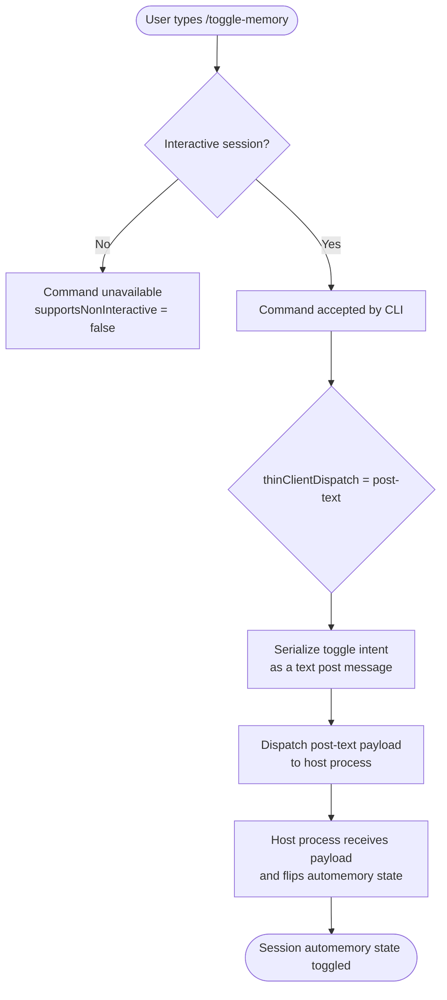

# `/toggle-memory`

> Analysis basis: CC v2.1.139 bundle.js (AST extraction + Claude interpretation)
> Minimum version: v2.1.139

---

## Overview

The `/toggle-memory` command switches the automemory feature on or off for the current Claude Code session. It is a local slash command dispatched via the `post-text` thin-client pathway, meaning the toggle action is communicated back to the host process as a text post rather than being handled entirely on the client side. The command is visible in the command palette (not hidden) and is unavailable in non-interactive contexts.

---

## Registration

| Field | Value |
|---|---|
| type | `local` |
| name | `toggle-memory` |
| description | `Toggle automemory off/on for this session` |
| supportsNonInteractive | `false` |
| thinClientDispatch | `post-text` |
| isHidden | `false` |
| module_id | `C1q` |

Analysis basis: CC v2.1.139 bundle.js:+10441276

---

## Input Branching

The AST depth-2 traversal found no call-graph edges and no literal constants for module `C1q`. The branching logic below is therefore derived exclusively from the registration fields and the `post-text` dispatch contract.



> **Note:** Internal branching logic within module `C1q` (e.g., reading current memory state, deciding the new state, writing it back) is <!-- TODO: not found in depth-2 traversal; needs --depth 4 -->

---

## Behavioral Spec

### Session Availability Guard

Because `supportsNonInteractive` is `false`, the CLI must refuse to execute this command when running in a non-interactive mode (e.g., piped input, `--print` / `-p` flag, or any headless invocation).

```
function checkInteractiveGuard(sessionContext):
    if sessionContext.isNonInteractive:
        raise CommandUnavailableError(
            command = "toggle-memory",
            reason  = "supportsNonInteractive is false"
        )
    return ALLOWED
```

Analysis basis: CC v2.1.139 bundle.js:+10441276 (`supportsNonInteractive: false`)

---

### Thin-Client Dispatch — post-text

The registration field `thinClientDispatch: "post-text"` declares that when the command runs inside a thin-client environment (e.g., a remote or embedded CLI context), the command does **not** handle the toggle locally. Instead, it serialises the intent into a text post message and sends it to the host process, which owns the authoritative session state.

```
function dispatchToggleMemory(environment, currentCommand):
    if environment.isThinClient:
        payload = buildPostTextPayload(
            commandName = currentCommand.name,   // "toggle-memory"
            dispatchType = "post-text"
        )
        environment.postToHost(payload)
        return DISPATCHED_TO_HOST
    else:
        // Full-client path — internal toggle logic
        // <!-- TODO: not found in depth-2 traversal; needs --depth 4 -->
        return executeLocalToggle()
```

Analysis basis: CC v2.1.139 bundle.js:+10441276 (`thinClientDispatch: "post-text"`)

---

### Command Palette Visibility

`isHidden: false` guarantees the command appears in the interactive command palette (the list shown when the user types `/`). No special flag or configuration is required to surface it.

```
function isVisibleInPalette(command):
    return NOT command.isHidden   // evaluates to true for toggle-memory
```

Analysis basis: CC v2.1.139 bundle.js:+10441276 (`isHidden: false`)

---

### Local Toggle Logic (internal automemory flip)

The precise algorithm that reads the current automemory boolean, negates it, and writes the new state back to session storage is:

<!-- TODO: not found in depth-2 traversal; needs --depth 4 -->

---

## State & Side Effects

| Item | Detail |
|---|---|
| Telemetry | None detected — `telemetry` array is empty in the extracted data |
| Hook registration | <!-- TODO: not found in depth-2 traversal; needs --depth 4 --> |
| appState changes | Expected: automemory boolean is flipped in session state; exact state key <!-- TODO: not found in depth-2 traversal; needs --depth 4 --> |
| Sound | <!-- TODO: not found in depth-2 traversal; needs --depth 4 --> |
| Persistence scope | Scoped to the current session only ("for this session" per description) |
| Non-interactive rejection | Command is silently unavailable; no side effects occur |

---

## Version History

| Version | Change |
|---|---|
| v2.1.139 | Initial analysis — registration confirmed at bundle.js:+10441276; internal call-graph not resolved at depth 2 |

---

## Common Mistakes

1. **Invoking in non-interactive mode.** Running `/toggle-memory` via a piped or headless invocation (e.g., `echo "/toggle-memory" | claude`) will have no effect because `supportsNonInteractive` is `false`. Use an interactive terminal session.
2. **Expecting persistence across sessions.** The description explicitly states "for this session." Closing and reopening Claude Code will restore the default automemory setting; the toggle is not a permanent preference change.
3. **Assuming thin-client and full-client behaviour are identical.** In thin-client environments the command delegates to the host via `post-text`. If the host process does not handle that payload, the toggle may silently fail without a visible error.
4. **Treating the toggle as idempotent.** Calling `/toggle-memory` twice in the same session should return automemory to its original state. Calling it an odd number of times leaves it in the opposite state from where it started.
5. **Confusing `/toggle-memory` with a memory-content command.** This command controls whether the automemory feature is active; it does not display, clear, or edit the contents of memory.

---

## Appendix — Identifier Mapping

> For bundle debugging only. Identifiers change across versions.

| Identifier | Role |
|---|---|
| `C1q` | Module ID for the `/toggle-memory` command registration and implementation |

> **Note:** The `identifiers` array returned by the AST extraction is empty for this command. No additional obfuscated function or variable identifiers were resolved at depth 2. Deeper traversal (`--depth 4` or greater) is required to populate this table fully.