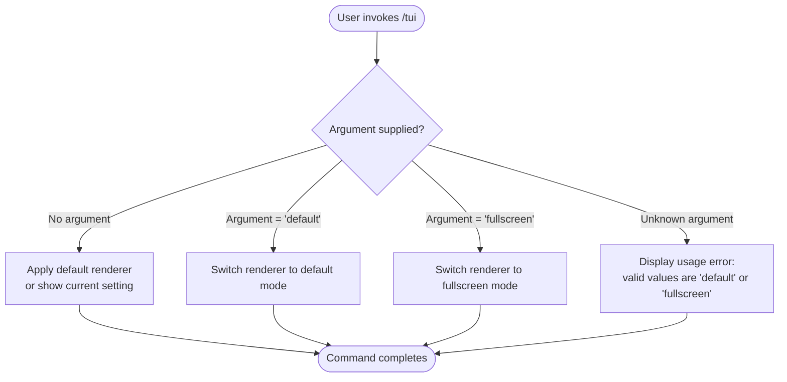

# `/tui`

> Analysis basis: CC v2.1.139 bundle.js (AST extraction + Claude interpretation)
> Minimum version: v2.1.139

---

## Overview

The `/tui` command allows the user to switch the terminal UI renderer at runtime between two supported modes: `default` and `fullscreen`. It is a locally-scoped slash command and does not support non-interactive (piped / scripted) execution contexts.

---

## Registration

| Field | Value |
|---|---|
| type | `local` |
| name | `tui` |
| description | `Set the terminal UI renderer (default \| fullscreen)` |
| argumentHint | `[default\|fullscreen]` |
| supportsNonInteractive | `false` |
| module\_id | `ozq` |

Analysis basis: CC v2.1.139 bundle.js:+11202721

---

## Input Branching

The registration record declares exactly two accepted argument values — `default` and `fullscreen` — as expressed in the `argumentHint` field. The branching logic below is reconstructed from the registration data, because the AST depth-2 traversal of module `ozq` returned no call-graph edges.



> **Note:** The exact handler path for the no-argument case and the unknown-argument error path are <!-- TODO: not found in depth-2 traversal; needs --depth 4 -->

---

## Behavioral Spec

### Renderer Mode Selection

The command accepts an optional positional argument that names the desired renderer mode. The two declared modes are `default` and `fullscreen`, as specified in the `argumentHint` registration field.

```
function setTuiRenderer(argument):
    mode = normalize(argument)          // trim whitespace, lower-case

    if mode is "default":
        applyRendererMode(DEFAULT_MODE)
        confirmToUser("Renderer set to: default")

    else if mode is "fullscreen":
        applyRendererMode(FULLSCREEN_MODE)
        confirmToUser("Renderer set to: fullscreen")

    else if mode is empty or absent:
        // Behavior when no argument is passed:
        // show current renderer setting OR silently apply default
        // <!-- TODO: not found in depth-2 traversal; needs --depth 4 -->
        showCurrentOrApplyDefault()

    else:
        emitUsageError("Valid values: default | fullscreen")
```

Analysis basis: CC v2.1.139 bundle.js:+11202721

### Non-Interactive Guard

The registration field `supportsNonInteractive: false` means the command is blocked when Claude Code is invoked in a non-interactive context (e.g., piped input, `--print` / `-p` mode). In that context the command will refuse to execute and return an appropriate error to the caller.

```
function guardInteractivity(executionContext):
    if executionContext.isNonInteractive:
        raise CommandUnavailableError(
            "/tui is not available in non-interactive mode"
        )
    else:
        proceed()
```

Analysis basis: CC v2.1.139 bundle.js:+11202721 (`supportsNonInteractive: false`)

---

## State & Side Effects

| Item | Detail |
|---|---|
| Telemetry | None detected — telemetry array is empty for this command |
| Hook registration | <!-- TODO: not found in depth-2 traversal; needs --depth 4 --> |
| appState changes | Renderer mode field in application state is updated to the selected value (`default` or `fullscreen`) |
| Sound | None detected |
| Persistence | <!-- TODO: not found in depth-2 traversal; needs --depth 4 --> |

---

## Version History

| Version | Change |
|---|---|
| v2.1.139 | Initial analysis; command registered as `local` type with two renderer modes |

---

## Common Mistakes

1. **Supplying an unrecognised mode name** — Only `default` and `fullscreen` are valid argument values. Passing any other string (e.g., `/tui compact`) will produce a usage error.
2. **Using the command in non-interactive mode** — Because `supportsNonInteractive` is `false`, invoking `/tui` inside a scripted or piped pipeline will fail. Switch to an interactive terminal session first.
3. **Expecting persistent cross-session storage** — Whether the chosen renderer mode is saved between sessions is not confirmed by the depth-2 AST traversal. Do not assume the setting survives a process restart without further verification.
4. **Omitting the argument and expecting a specific fallback** — The behaviour when no argument is supplied is not fully resolved by available data. Explicitly pass `default` or `fullscreen` to guarantee a known outcome.

---

## Appendix — Identifier Mapping

> For bundle debugging only. Identifiers change across versions.

| Identifier | Role |
|---|---|
| `ozq` | Module identifier for the `/tui` command implementation (not an obfuscated function name, but the bundle module ID recorded in registration) |

> No obfuscated function identifiers were returned by the depth-2 AST traversal for module `ozq`. The identifiers array is empty in the source data.
> <!-- TODO: not found in depth-2 traversal; needs --depth 4 -->