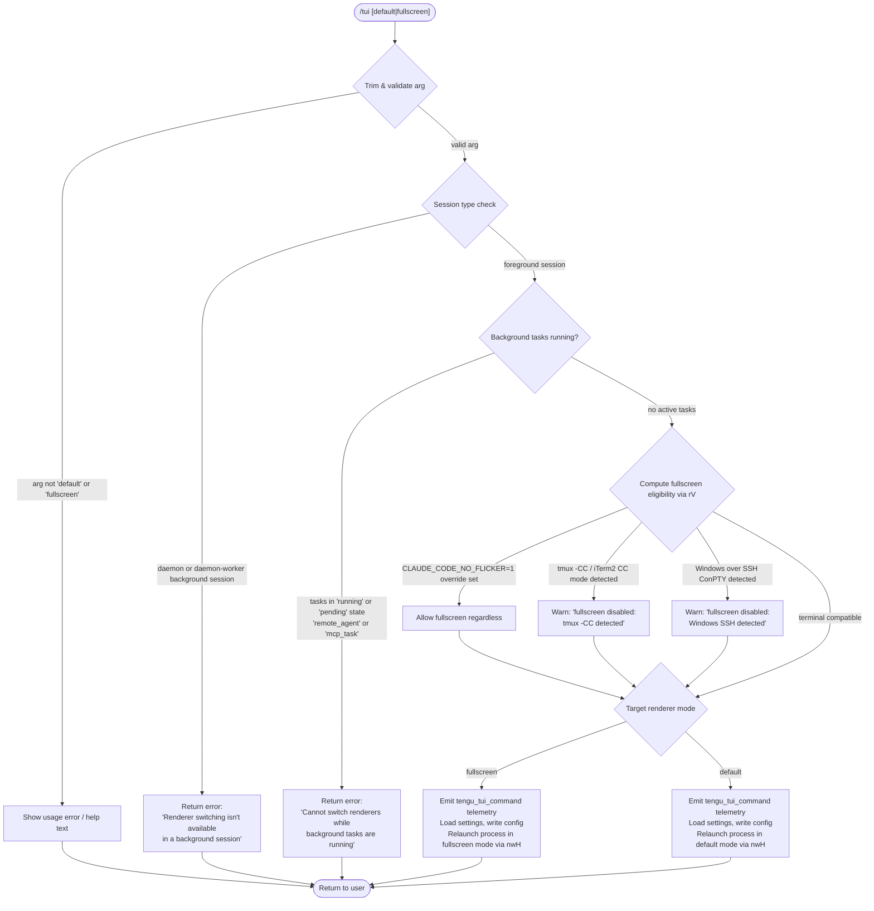

# `/tui`

> Analysis basis: CC v2.1.141 bundle.js (AST extraction + Claude interpretation)
> Minimum version: v2.1.141

---

## Overview

The `/tui` command allows the user to switch the terminal UI renderer at runtime between `default` and `fullscreen` modes. It validates preconditions (session type, active background tasks, environment overrides, terminal compatibility) before executing a live renderer switch that relaunches the Claude Code process under the chosen rendering mode.

---

## Registration

| Field | Value |
|---|---|
| type | `local` |
| name | `tui` |
| description | `Set the terminal UI renderer (default \| fullscreen)` |
| argumentHint | `[default\|fullscreen]` |
| supportsNonInteractive | `false` |
| module_id | `mjq` |
| load_inline | `true` |
| loc_byte | `11262816` |
| loc_byte_end | `11263020` |
| loc_line | `6945` |
| arbor_handler.name | `NZ7` |
| arbor_handler.fqn | `claude-2.1.141::NZ7` |
| arbor_handler.kind | `AsyncFunction` |
| arbor_handler.resolution_path | `module_id` |
| arbor_handler.n_hits | `0` |

Analysis basis: CC v2.1.141 bundle.js:+11262816

---

## Input Branching

The command has 5+ distinct execution branches depending on session type, background task state, and terminal environment. A Mermaid flowchart is used.



---

## Behavioral Spec

### 1. Argument Parsing and Validation

The handler `NZ7` trims the raw argument string and checks membership in the set `["default", "fullscreen"]`.

```
async function tuiCommandHandler(rawArg):
    arg = rawArg.trim()                          // bundle.js:+11261094
    validModes = loadValidModes()                // ["default", "fullscreen"] from literals
    if arg not in validModes:
        displayUsageHelp()
        return
```

Analysis basis: CC v2.1.141 bundle.js:+11261094

### 2. Settings Load

After argument validation, the handler calls `p_` (settings loader), which internally delegates to `ex` → `Fm8`. The settings load lifecycle emits internal markers `loadSettingsFromDisk_start` and `loadSettingsFromDisk_end` and logs `settings_load_started` / `settings_load_completed`.

```
function loadSettings():
    mark("loadSettingsFromDisk_start")           // bundle.js:+1190133
    logInfo("settings_load_started")             // bundle.js:+1186988
    mergeSettingsSources([
        "flagSettings",                          // bundle.js:+1073695
        "policySettings",                        // bundle.js:+1073717
        "userSettings",                          // bundle.js:+1182640
        "projectSettings",                       // bundle.js:+1182687
        "localSettings",                         // bundle.js:+1182709
        "SDK inline settings",                   // bundle.js:+1181763
    ])
    logInfo("settings_load_completed")           // bundle.js:+1187662
    mark("loadSettingsFromDisk_end")             // bundle.js:+1190187
    return mergedSettings
```

Analysis basis: CC v2.1.141 bundle.js:+11261119

### 3. Session Type Guard

The handler calls `lA` to determine session mode. If the mode resolves to `"daemon"` or `"daemon-worker"`, the command exits early with a human-readable refusal message.

```
function checkSessionType():
    mode = getSessionMode()                      // via lA → N1 → pc
    if mode == "daemon" or mode == "daemon-worker":  // bundle.js:+2154325, +2154339
        return Error(
            "Renderer switching isn't available in a background session" +
            " — press ← to detach and run /tui from a foreground session."
        )                                        // bundle.js:+11261397
    return OK
```

Analysis basis: CC v2.1.141 bundle.js:+11261130

### 4. Background Task Guard

The handler calls `N1` → `pc` to enumerate active background tasks. If any task is in state `"running"` or `"pending"` and of type `"remote_agent"` or `"mcp_task"`, the command is blocked and emits the `tengu_tui_refused` telemetry event.

```
function checkBackgroundTasks():
    tasks = Object.values(getTaskRegistry())     // bundle.js:+11261690
    blockedStates = ["running", "pending"]       // bundle.js:+11261729, +11261751
    blockedTypes  = ["remote_agent", "mcp_task"] // bundle.js:+11261772, +11261797
    for task in tasks:
        if task.state in blockedStates and task.type in blockedTypes:
            emit("tengu_tui_refused")            // bundle.js:+11261818
            return Error(
                "Cannot switch renderers while background tasks are running" +
                " — wait for them to finish (or stop them via /tasks), then run /tui again."
            )                                    // bundle.js:+11261876
    return OK
```

Analysis basis: CC v2.1.141 bundle.js:+11261367

### 5. Fullscreen Eligibility Check (`rV`)

`rV` (terminal capability resolver) determines whether `fullscreen` mode is supportable in the current environment. It checks multiple environmental signals and produces a mode status string that the handler uses to either allow, warn, or auto-downgrade the target mode.

```
function resolveFullscreenEligibility(targetMode):
    // Check environment override
    if env("CLAUDE_CODE_NO_FLICKER") is set:    // bundle.js:+11262601
        return { eligible: true, reason: "env_on" }   // bundle.js:+3241135

    // Check tmux control-client mode (iTerm2 integration)
    if terminalStartsWith("iTerm.app"):          // bundle.js:+3239338
        if session in ["screen", "tmux"]:        // bundle.js:+3239406, +3239431
            result = spawnSync("tmux", ["display-message", "-p",
                               "#{client_control_mode}"],
                               { encoding: "utf8", timeout: 2000 })  // bundle.js:+3239639, +3239690
            if controlModeActive:
                return {
                    eligible: false,
                    reason: "tmux_cc_auto_off",  // bundle.js:+3241159
                    message: "fullscreen disabled: tmux -CC (iTerm2 integration mode) detected · set CLAUDE_CODE_NO_FLICKER=1 to override"
                }                                // bundle.js:+3240306

    // Check Windows SSH / ConPTY
    if platform == "win32":                      // bundle.js:+3239900
        return {
            eligible: false,
            reason: "win_ssh_auto_off",          // bundle.js:+3241193
            message: "fullscreen disabled: Windows over SSH (ConPTY re-rendering) detected · set CLAUDE_CODE_NO_FLICKER=1 to override"
        }                                        // bundle.js:+3240492

    // Check IDE terminals (Cursor, VSCode, JetBrains)
    if terminalIsCursor or terminalIsVSCode or isJetBrainsIde:
                                                 // bundle.js:+3311398, +3311447, +3310729
        // Downsell / forced-on logic applies
        return evaluateIdeModeEligibility()

    // Check CLAUDE_CODE_DISABLE_ALTERNATE_SCREEN
    if env("CLAUDE_CODE_DISABLE_ALTERNATE_SCREEN") is set:  // bundle.js:+11262626
        return { eligible: false }

    return { eligible: true }
```

Analysis basis: CC v2.1.141 bundle.js:+11262142

### 6. TUI Mode Resolution and Config Write (`aMH`)

`aMH` (mode resolution + persistence) resolves the effective fullscreen state from the eligibility result, environment variables, and user settings, then persists the decision.

The fullscreen-state reasons tracked are:

| Reason token | Meaning |
|---|---|
| `env_off` | `CLAUDE_CODE_DISABLE_ALTERNATE_SCREEN` set |
| `env_on` | `CLAUDE_CODE_NO_FLICKER` set |
| `tmux_cc_auto_off` | tmux control-client auto-disabled |
| `win_ssh_auto_off` | Windows SSH auto-disabled |
| `bg_forced_on` | background session forces fullscreen |
| `settings_on` | user settings enable fullscreen |
| `settings_off` | user settings disable fullscreen |
| `downsell_on` | IDE terminal upsell path |
| `gb_on` | gradual-rollout flag on |
| `gb_off` | gradual-rollout flag off |

Analysis basis: CC v2.1.141 bundle.js:+11262023 (aMH), literals at +3241077–+3241500

### 7. Process Relaunch (`nwH`)

Once mode is validated and written, `nwH` orchestrates the full relaunch sequence:

```
async function relaunchWithNewRenderer(targetMode):
    // 1. Snapshot current working directory
    savedCwd = process.cwd()                     // bundle.js:+11258901

    // 2. Flush pending I/O, unmount current Ink renderer
    await flushAndUnmount()                      // via mEH → bundle.js:+11259848

    // 3. Await cleanup with dual timeouts
    await Promise.race([
        waitForCleanup(),
        timeout(30000, "flush timeout (relaunch)")  // bundle.js:+11259887, +11259893
    ])
    await Promise.all([cleanupHandlers()])

    // 4. Remove existing signal listeners, add exit handlers
    process.removeAllListeners()                 // bundle.js:+11260278
    process.on("SIGINT", ...)                    // bundle.js:+11260308
    process.on("SIGHUP", ...)

    // 5. Load native FFI for execve (macOS / Linux)
    //    macOS: /usr/lib/libSystem.B.dylib      // bundle.js:+11258990
    //    Linux: libc.so.6                       // bundle.js:+11259019
    //    via Sjq using bun:ffi                  // bundle.js:+11258946

    // 6. Build argv with --resume flag           // bundle.js:+11259825
    //    spawnSync as fallback                   // bundle.js:+11260335
    //    inherit stdio                           // bundle.js:+11260370

    // 7. execve / spawnSync into new process
    //    On failure: write error, exit(128)     // bundle.js:+11260697

    emit("tengu_tui_command", {                  // bundle.js:+11262152
        mode: targetMode,
        uptime: Math.round(process.uptime()),    // bundle.js:+11262224
        ...terminalDetails
    })
```

Analysis basis: CC v2.1.141 bundle.js:+11262526

### 8. Scroll-Summary Flush (`w_8`)

Before the full relaunch, `w_8` is called to flush any pending scroll-summary state. This emits `tengu_scroll_summary` and performs a final render pass.

Analysis basis: CC v2.1.141 bundle.js:+11259854

---

## State & Side Effects

| Item | Detail |
|---|---|
| Telemetry: `tengu_tui_refused` | Fired when background tasks block the switch (bundle.js:+11261818) |
| Telemetry: `tengu_tui_command` | Fired on successful renderer switch attempt; includes uptime and terminal info (bundle.js:+11262152) |
| Telemetry: `tengu_amber_creek` | Fired inside fullscreen-mode resolution path (bundle.js:+3240879) |
| Telemetry: `tengu_pewter_brook` | Fired inside fullscreen-mode resolution path (bundle.js:+3240787) |
| Telemetry: `tengu_scroll_summary` | Fired during scroll-state flush before relaunch (bundle.js:+5133417) |
| Telemetry: `tengu_bg_dispatch_sigkill_escalate` | Fired if background task cleanup requires SIGKILL escalation (bundle.js:+14465103) |
| Telemetry: `tengu_feature_bad` / `tengu_feature_ok` | Feature flag probe results (bundle.js:+945624, +945566) |
| Telemetry: `tengu_bg_low_mem_mb` | Memory pressure event during relaunch (bundle.js:+11848152) |
| Telemetry: `tengu_bg_dispatch_low_mem` | Low-memory dispatch event (bundle.js:+14465682) |
| Telemetry: `tengu_bg_spare_enable` / `tengu_bg_spare_claim` / `tengu_bg_spare_spawn` / `tengu_bg_spare_claim_fail` | Background spare-session lifecycle events (bundle.js:+14466297, +14466418, +14464880, +14466681) |
| Telemetry: `tengu_bg_sendclaim_failed` | Background session claim failure (bundle.js:+14447085) |
| Telemetry: `tengu_daemon_control` | Daemon stop/control events during relaunch (bundle.js:+14499703) |
| Environment read | `CLAUDE_CODE_NO_FLICKER` (bundle.js:+11262601) |
| Environment read | `CLAUDE_CODE_DISABLE_ALTERNATE_SCREEN` (bundle.js:+11262626) |
| Environment read | `CLAUDE_CODE_FORCE_FULLSCREEN_UPSELL` (bundle.js:+11262665) |
| Settings write | Effective fullscreen mode persisted to user settings via `aMH` (bundle.js:+11262023) |
| Process relaunch | Full `execve` into new renderer process with `--resume` flag (bundle.js:+11259825) |
| Renderer unmount | Current Ink UI is unmounted before relaunch (bundle.js:+11259848) |
| Cache clear | Two caches cleared via `ZY` (kV6, XZ8) during settings reload (bundle.js:+24901, +24913) |
| appState changes | Session mode and renderer-mode fields updated before relaunch |
| Sound | None detected |

---

## Version History

| Version | Change |
|---|---|
| v2.1.141 | Initial analysis |

---

## Common Mistakes

1. **Running `/tui` in a background/daemon session** — the command immediately returns an error. Detach first using `←` then run `/tui` in a foreground session.
2. **Running `/tui` while background tasks are active** — tasks in `running` or `pending` state of type `remote_agent` or `mcp_task` block the switch. Use `/tasks` to check/stop them first.
3. **Expecting `/tui fullscreen` to work in tmux -CC (iTerm2 integration) mode** — the command auto-detects this and refuses fullscreen. Set `CLAUDE_CODE_NO_FLICKER=1` to override.
4. **Expecting `/tui fullscreen` to work over Windows SSH** — ConPTY re-rendering is auto-detected and fullscreen is disabled. Use `CLAUDE_CODE_NO_FLICKER=1` to override if acceptable.
5. **Omitting the argument** — `/tui` without `default` or `fullscreen` is not a valid invocation; the argumentHint `[default|fullscreen]` is required.

---

## Appendix — Identifier Mapping

> For bundle debugging only. Identifiers change across versions.

| Identifier | Role |
|---|---|
| `NZ7` | Main async handler for `/tui` command (arbor_handler) |
| `p_` | Settings loader (loads merged settings from all sources) |
| `ex` | Settings load coordinator (start/end markers) |
| `rS` | Settings read helper |
| `T1` | Performance measurement / memory usage probe |
| `bx` | `perf_hooks` require wrapper |
| `Fm8` | Settings merge and telemetry emitter |
| `T8` | File-append log writer |
| `hV6` | Settings flag helper |
| `WE` | Flag/policy settings merger |
| `xDA` | Settings key enumerator |
| `L` | Async task set / log file handle (context-dependent) |
| `K` | Column formatter / task list (context-dependent) |
| `Jf` | Settings file path resolver |
| `f` | Async operation tracker / file handle (context-dependent) |
| `G5H` | User settings loader |
| `MC6` | SDK inline settings loader |
| `yV6` | Post-load settings validator |
| `lA` | Session mode / context detector |
| `FRH` | Feature flag check helper |
| `Y1_` | String converter (arg normalization) |
| `mq` | String coercer |
| `RH` | String coercer (alternate) |
| `El` | Terminal environment probe |
| `mRL` | Terminal type resolver |
| `uRL` | Terminal prefix checker (startsWith) |
| `v` | Settings writer / config persister |
| `J7K` | Config file writer |
| `Qt_` | Config key encoder |
| `SH` | JSON serializer |
| `t7` | Path truncator / log path formatter |
| `T6A` | Path map builder |
| `MSH` | Terminal write helper |
| `M6A` | Raw terminal writer |
| `X7K` | Atomic file write coordinator |
| `bhH` | Debounced write scheduler |
| `A_H` | File write executor |
| `Cv8` | Directory existence check |
| `y6A` | Config path builder |
| `k6A` | Atomic rename helper |
| `P7K` | Append-file writer |
| `b9` | State object mutator |
| `H56` | Boolean environment flag reader |
| `pRL` | Fullscreen state resolver |
| `j6` | Renderer mode dispatcher |
| `b76` | Renderer mode constant A |
| `x76` | Renderer mode constant B |
| `Js` | Mode string normalizer |
| `vi6` | Mode transition tracker |
| `h6` | Mode-change event emitter |
| `N1` | Background task registry accessor |
| `pc` | Task list provider |
| `Q` | State machine query helper |
| `aMH` | Full-screen mode resolution + persistence |
| `m_` | Relaunch coordinator (pre-execve) |
| `Bm8` | Settings snapshot helper for relaunch |
| `hD` | File reader (CLAUDE_HISTORY / context files) |
| `MB` | File content reader with encoding detection |
| `OM` | File stat / symlink resolver |
| `zx8` | File descriptor helper |
| `Yx8` | File encoding detector |
| `$8` | File system error wrapper |
| `M8` | ENOENT / EISDIR error classifier |
| `Fu8` | Telemetry timestamp recorder |
| `Xc` | Path resolver for settings files |
| `e8` | Error normalizer |
| `Oo` | Settings merge finalizer |
| `$CH` | Atomic safe-write helper |
| `O` | Process/file state enum helper |
| `b8` | Stopped-state constant |
| `ZY` | Cache-clear helper (kV6, XZ8) |
| `jR6` | Git-ignore-aware settings file writer |
| `N6` | AsyncLocalStorage context accessor |
| `bS6` | Store getter |
| `vu8` | VL version accessor |
| `hu8` | Git check-ignore runner |
| `M_` | Git subprocess runner |
| `WyK` | Home-directory path builder |
| `ky` | `.claude/settings.json` path builder |
| `kH` | Telemetry/error logger |
| `k_` | Error string coercer |
| `Vq` | Log queue flusher |
| `cMA` | Log entry formatter |
| `GvK` | Log ring-buffer manager |
| `rV` | Terminal fullscreen eligibility resolver |
| `W56` | Terminal info getter |
| `LV` | Terminal version parser |
| `_q_` | Alternate-screen eligibility sub-checker |
| `RuL` | Xterm.js version range checker |
| `K3H` | Terminal version comparator |
| `CuL` | Column-width / terminal-size resolver |
| `Aq_` | Terminal columns reader |
| `nwH` | Process relaunch orchestrator (execve wrapper) |
| `em` | Claude binary path resolver |
| `E58` | Version directory scanner |
| `W3` | Array normalization helper |
| `qYH` | Versioned binary path builder |
| `_HH` | Default binary path builder |
| `U48` | Home directory resolver |
| `vp` | Current process argv builder |
| `V6` | Path existence checker |
| `NO6` | Interval clearer |
| `yY_` | clearInterval wrapper |
| `mEH` | Ink renderer unmounter |
| `Ah` | Post-unmount cleanup hook |
| `Qo6` | Alternate-screen exit writer |
| `i0H` | Terminal escape sequence builder |
| `c0H` | Cursor restore helper |
| `J0` | Escape sequence formatter |
| `w_8` | Scroll-summary flush + tengu_scroll_summary emitter |
| `KV` | Scroll state accessor |
| `CA1` | Scroll summary builder |
| `RA1` | Frame timing calculator |
| `hA1` | Frame stats accumulator |
| `Uf` | Promise timeout racer |
| `xZ` | Cleanup promise chain |
| `cL` | Cleanup state tracker |
| `xhH` | Parallel cleanup runner |
| `pp_` | Post-relaunch path restorer |
| `QK` | Working directory restorer |
| `Sjq` | Native execve / spawnSync dispatcher |
| `$` | Active process map |
| `XTq` | Process entry tracker |
| `w` | Background session / worker manager |
| `S` | Worker health monitor |
| `xH` | Feature-ok telemetry emitter |
| `hH` | Feature-bad telemetry emitter |
| `YG6` | Low-memory background dispatcher |
| `u` | Pending write tracker |
| `Ao_` | IPC socket connector |
| `Mo_` | Worker lifecycle manager |
| `D` | Spare-session spawner |
| `p` | Process disposer |
| `M` | MCP client manager |
| `SvH` | MCP server connector |
| `Eeq` | MCP update applier |
| `XA5` | MCP client set reconciler |
| `z` | Daemon stop coordinator |
| `oR` | WebSocket connection manager |
| `Kx` | Shutdown promise racer |
| `TH` | String coercer (generic) |
| `AX` | Relaunch error file writer |

---

Note: index built via Arbor fallback; some signals (telemetry, literals) may be missing — see arbor-fallback.js.