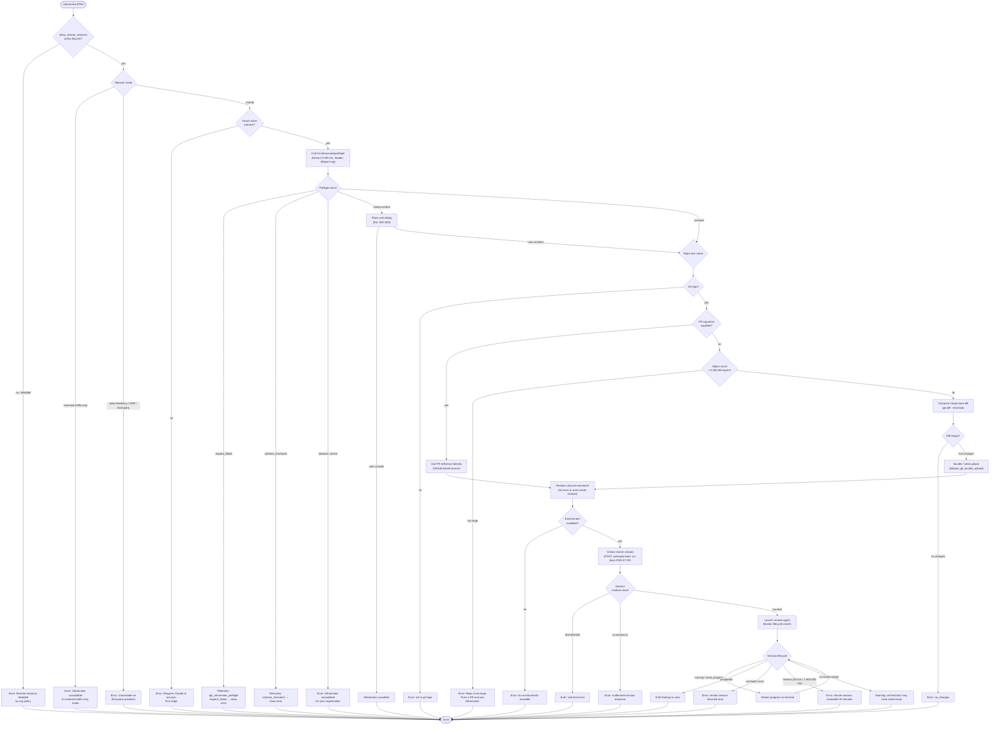

# `/ultrareview`

> Analysis basis: CC v2.1.141 bundle.js (AST extraction + Claude interpretation)
> Minimum version: v2.1.141

---

## Overview

`/ultrareview` is a remote code-review command that runs a bug-finding agent on Claude Code's web infrastructure. Given a local branch (or an explicit GitHub PR number), it bundles or references the repository, uploads it to a remote cloud environment, executes a thorough review session lasting roughly 10–20 minutes, and streams the findings back to the local terminal. The command enforces a multi-stage preflight that checks organisation policy, authentication, network mode, and repository size before launching.

---

## Registration

| Field | Value |
|---|---|
| type | `local-jsx` |
| name | `ultrareview` |
| description | ` ... · Est. cost ... USD · Finds and verifies bugs in your branch. Runs in Claude Code on the web. See ...` |
| loc_byte | `11139446` |
| loc_byte_end | `11139705` |
| loc_line | `6750` |
| module_id | `Nwq` |
| load_inline | `true` |
| arbor_handler.name | `KE7` |
| arbor_handler.fqn | `claude-2.1.141::KE7` |
| arbor_handler.kind | `AsyncFunction` |
| arbor_handler.resolution_path | `module_id` |
| arbor_handler.n_hits | `1` |

Analysis basis: CC v2.1.141 bundle.js:+11139446

---

## Input Branching

The command has well over three distinct decision paths (policy block, essential-traffic mode, data-residency/third-party, authentication, preflight API call, repo-size check, PR-vs-local-branch, remote session lifecycle). A Mermaid flowchart is used.



---

## Behavioral Spec

### 1. Handler Entry Point — `ultrareviewHandler` (`KE7`)

The async top-level handler is resolved via `module_id → Nwq` (Arbor `resolution_path: module_id`).

```
async function ultrareviewHandler(context, args):
    // 1. Policy check
    if not featureAllowed("allow_remote_sessions"):
        emit randomDelay()          // H: Math.random + setTimeout
        displayError("Remote sessions are disabled by your " +
                     "organization's policy. Contact your organization " +
                     "admin to enable them.")
        return

    // 2. Run precondition chain (tm_)
    preconditionResult = await checkRemotePreconditions(context)
    if preconditionResult.failed:
        telemetry("tengu_review_remote_precondition_failed")
        return

    // 3. Preflight API call (em_)
    preflightResult = await runPreflight(context)
    if preflightResult.status != "proceed":
        handlePreflightBlock(preflightResult)
        return

    // 4. Build remote session parameters (qE7 → Hp_)
    sessionParams = await buildRemoteSessionParams(context, args)

    // 5. Launch and monitor (Hp_ → HKH → LnH → Gh1)
    await launchAndMonitorRemoteSession(sessionParams)

    // 6. Teardown / cancellation (sm_)
    finalizeUltrareview()
```

Analysis basis: CC v2.1.141 bundle.js:+11137233, +11137268, +11137417, +11137497, +11138089, +11138153

---

### 2. Policy and Network Mode Check (`pq`)

Called immediately from `ultrareviewHandler`. Checks three orthogonal gate conditions.

```
function checkRemoteSessionsPolicy(context):
    // Gate 1: org policy flag
    if context.settings.has("allow_product_feedback"):
        // fall through (this signals policy fetch occurred)

    bp_result = evaluateFeatureFlag("allow_remote_sessions")
    // bp calls: WA (flag lookup), UM (plan check), j$ (org tier),
    //           xA (auth), j6 (settings store)

    // Gate 2: network-traffic mode
    if networkMode == "essential-traffic-only":
        return { failed: true, reason: "essential_traffic" }

    // Gate 3: telemetry
    emit("tengu_slate_kestrel")   // loc_byte 9900038

    return { failed: false }
```

Analysis basis: CC v2.1.141 bundle.js:+9903353, +9899831, +9899864, +9899893, +9899963, +9900035, +9900038

Relevant literals:
- `"firstParty"` — plan tier check (bundle.js:+9899838)
- `"enterprise"` — org tier check (bundle.js:+9900124)
- `"team"` — org tier check (bundle.js:+9900159)

---

### 3. Precondition Chain (`tm_`)

Runs before the preflight API call. Verifies git context, remote URL, default branch, current branch, and diff size.

```
async function checkRemotePreconditions(context):

    // 3a. Verify git repository (g98)
    isRepo = await execGit(["rev-parse", "--is-inside-work-tree"])
    if not isRepo:
        return { failed: true, reason: "not_in_git_repo" }

    // 3b. Resolve remote URL (Zy)
    remoteUrl = getCachedRemoteUrl()          // XCH.get / XCH.set
    if not remoteUrl:
        raw = await execGit(["config", "--get", "remote.origin.url"])
        if not raw:
            return { failed: true, reason: "No git remote URL found" }
        remoteUrl = sanitizeUrl(raw)          // WCH: strips ://***@ credentials

    // 3c. Parse remote URL (v, XXH)
    parsedUrl = parseGitUrl(remoteUrl)        // handles https / http / ssh
    if not parsedUrl.owner or not parsedUrl.repo:
        return { failed: true, reason: "no_git_remote" }

    // 3d. Resolve default branch (GV)
    defaultBranch = getCached("defaultBranch")
    if not defaultBranch:
        ref = await execGit(["symbolic-ref", "--short",
                              "refs/remotes/origin/HEAD"])
        if not ref: try "main" then "master" via show-ref
        cache("defaultBranch", ref)

    // 3e. Resolve current branch (SJ)
    currentBranch = await execGit(["branch", "--abbrev-ref", "HEAD"])

    // 3f. Compute merge-base and diff (K, L.trim, $.trim)
    mergeBase = await execGit(["merge-base", defaultBranch, currentBranch])
    diffStat  = await execGit(["diff", "--shortstat", mergeBase])

    // 3g. Detect github.com specifically
    if remoteHost != "github.com":
        // allow; github-specific checks happen later

    // 3h. Repo object-count guard (jh1 → Jh1)
    objectCount = await execGit(["count-objects", "-v"])
    sizeKb = parseObjectCount(objectCount)   // in KB, multiply by 1024
    if sizeKb * 1024 > 5_000_000:
        displayError("Repo is too large to bundle. Push a PR and " +
                     "use `/ultrareview <PR#>` instead.")
        return { failed: true }

    // 3i. Stash / branch-presence verify (O8, u_)
    await execGit(["rev-parse", "--verify", "--quiet", currentBranch])

    return { failed: false,
             remoteUrl, defaultBranch, currentBranch, diffStat }
```

Analysis basis: CC v2.1.141 bundle.js:+11099243, +11099408, +11099513, +11099554, +11100289, +11100472, +11100565, +11100839, +11100860, +11100894, +11101032, +11101409, +11101416, +6535753, +6535765, +1038554, +1047207, +1047035, +7912880

---

### 4. Preflight API Call (`em_` → `Awq`)

Contacts the remote Ultrareview service to check account eligibility and cost.

```
async function runPreflight(context):
    response = await httpGet("/v1/ultrareview/preflight",
                             headers: { "teleport-org": orgId },
                             timeout: 5_000)

    if response.failed:
        telemetry("api_ultrareview_preflight", { reason: "request_failed" })
        return { status: "request_failed" }

    status = response.body.status

    switch status:
        case "blocked":
            return { status: "blocked" }

        case "essential-traffic-only":
            displayError("Ultrareview runs in Claude Code on the web " +
                         "and is unavailable when essential-traffic-only " +
                         "mode is active.")
            return { status: "blocked" }

        case "zdr" / "data-residency" / "data_residency":
            displayError("Ultrareview runs in Claude Code on the web " +
                         "and is unavailable on third-party providers.")
            return { status: "blocked" }

        case "no-auth" / "no_oauth_token":
            displayError("Ultrareview requires a Claude.ai account. " +
                         "Run /login to authenticate.")
            return { status: "blocked" }

        case "schema_mismatch":
            return { status: "schema_mismatch" }

        case "server":
            displayError("Ultrareview is unavailable for your organization.")
            return { status: "server" }

        case "needs-confirm":
            // Show cost confirmation dialog (~$10–$20, ~10–20 min)
            confirmed = await showCostConfirmDialog()
            if not confirmed:
                return { status: "cancelled" }
            return { status: "proceed" }

        case "proceed":
            return { status: "proceed" }
```

Analysis basis: CC v2.1.141 bundle.js:+11097737, +11097771, +11097794, +11097831, +11097867, +11097975, +11097986, +11098014, +11098104, +11098126, +11098160, +11098222, +11098294, +11098415, +11098418, +11098446, +11098618, +11101825, +11102006, +11102043, +11102138, +11102205, +11097201, +11097293

---

### 5. Session Parameter Construction (`qE7` → `Hp_` → `HKH`)

Builds the remote session payload, choosing between a GitHub-PR-based source and a git-bundle upload.

```
async function buildRemoteSessionParams(context, args):

    // 5a. Resolve environments list (ln / VdH → teleport_environments_list)
    environments = await listTeleportEnvironments()

    if environments.empty:
        // Attempt to auto-create default cloud env (VdH)
        env = await createDefaultCloudEnv()
        if not env:
            displayWarning("Could not create a cloud environment. " +
                           "Set one up at https://claude.ai/code/onboarding?magic=env-setup")
            return null

    // 5b. Determine source code strategy (iB4)
    if args.prNumber provided:
        sourceMode = "explicit_source_url"     // GitHub PR reference
    elif noGitAtAll:
        sourceMode = "no_git_at_all"           // empty sandbox
    else:
        sourceMode = decideBundleMode()        // "bundle" | "git_repository" | "explicit_env_bundle"

    telemetry("tengu_teleport_source_decision")   // loc_byte 7936401
    telemetry("tengu_teleport_bundle_mode")        // loc_byte 7931402

    // 5c. GitHub App installation check (OZH → checkGithubAppInstalled)
    githubOk = await checkGithubAppInstalled(context)
    if not githubOk:
        // Record: "github_preflight_failed" / "github_app_not_installed"

    // 5d. Upload git bundle if required (IT_ → teleport_git_bundle_upload)
    if sourceMode in ("bundle", "git_repository"):
        await uploadGitBundle(context)   // stash → bundle → POST upload

    // 5e. Construct session request
    sessionRequest = {
        environment: selectedEnv,
        source: sourceMode,
        taskPath: "claude/task",
        permissionMode: "set",
        headers: {
            "anthropic-beta": "ccr-byoc-2025-07-29",
            "x-organization-uuid": orgUUID
        }
    }

    // 5f. Overage guard (Sf8 → CMH)
    if userIsOverLimit:
        telemetry("tengu_review_overage_blocked")
        showOverageDialog()              // links to /admin-settings/
        telemetry("tengu_review_overage_dialog_shown")

    return sessionRequest
```

Analysis basis: CC v2.1.141 bundle.js:+11103897, +11102383, +7930180, +7930319, +7930330, +7930490, +7930496, +7930641, +7930975, +7931147, +7931261, +7931400, +7931624, +7931764, +7931499, +7931551, +7932227, +7932779, +7932844, +7932879, +7933015, +7934624, +7934786, +7934911, +7935016, +7935038, +7935076, +7935106, +7935134, +11137657, +11137678, +11137686

---

### 6. Git Bundle Upload (`IT_` → `teleport_git_bundle_upload`)

```
async function uploadGitBundle(context):
    // Verify repo has commits
    commitCount = await execGit(["for-each-ref", "--count=1", "refs/"])
    if commitCount == 0:
        displayError("Repository has no commits — run " +
                     "`git add . && git commit -m \"initial\"` then retry")
        return { status: "empty_repo" }

    // Create seed stash ref
    stashHash = await execGit(["stash", "create"])
    if stashHash:
        await execGit(["update-ref", "refs/seed/stash", stashHash])

    // Build bundle
    bundlePath = writeTempFile("ccr-seed.bundle")
    await execGit(["bundle", "create", bundlePath, "--all"])

    // Upload
    response = await httpPost(uploadUrl, bundlePath)
    // Status codes: 200 → success, others → upload_failed

    if upload succeeded:
        telemetry("tengu_ccr_bundle_upload")   // loc_byte 7916172
        return { status: "success", bundleRef: "head" | "squashed" | "fallback_head" | "fallback_squashed" }
    else:
        return { status: "upload_failed" }

    // Clean up seed refs
    await execGit(["update-ref", "-d", "refs/seed/stash"])
    await execGit(["update-ref", "-d", "refs/seed/root"])
```

Analysis basis: CC v2.1.141 bundle.js:+7915850, +7915857, +7915876, +7916022, +7916082, +7916097, +7916109, +7916172, +7916364, +7916372, +7916661, +7917018, +7917029, +7917321, +7917423, +7917466, +7917615, +7917679, +7917718, +7917753, +7917796

Bundle size hard limit: 5,000,000 bytes (bundle.js:+7913321). Object-count check limit: 1,024 KB units (bundle.js:+7913095).

---

### 7. Remote Session Launch and Lifecycle (`LnH` → `Gh1`)

```
async function launchAndMonitorRemoteSession(sessionParams):
    // Generate session token (ch: pNq.randomBytes, 8 bytes)
    token = generateRandomToken(8)

    // Open remote session (Q58 → vr.open)
    sessionId  = await openRemoteSession(sessionParams, token)
    startTime  = Date.now()

    // Poll / stream session events (Gh1)
    timeout = 1_800_000   // 30 minutes in ms

    loop:
        event = await nextSessionEvent(sessionId)
        elapsed = Date.now() - startTime

        if elapsed > timeout:
            displayError("remote session exceeded 30 minutes")
            break

        switch event.type:
            case "starting":
                showStatus("starting")
            case "running" / "hook_progress":
                streamProgressToTerminal(event.data)
            case "hook_response":
                forwardHookResponse(event)
            case "idle" / "hook_started":
                updateStatusIndicator(event)
            case "SessionStart":
                telemetry("tengu_ccr_session_link")   // loc_byte 7925806
            case "result":
                displayFindings(event.data)
            case "completed":
                break loop
            case "archived" / "error":
                displayError("remote session returned an error")
                break loop

    if no review output received:
        displayWarning("no review output — orchestrator may have exited early")

    telemetry("tengu_review_remote_launched")   // loc_byte 11105174
```

Analysis basis: CC v2.1.141 bundle.js:+7944178, +7944197, +7944214, +7944418, +7944478, +7944657, +7945776, +7946047, +7946220, +7946295, +7946315, +7946330, +7946384, +7946390, +7946410, +7946454, +7946702, +7946727, +7946910, +7946939, +7947346, +7947430, +7947520, +7947747, +7948298, +7948339, +7948376, +7948437, +7948555, +7948602, +7948908, +11105174

---

### 8. Background Eligibility Pre-check (`Mz1` → `UVH`)

Runs as a background check to populate eligibility cache before the user invokes the command.

```
async function backgroundRemoteEligibilityCheck():
    telemetry("bg_remote_eligibility_check")

    isRepo  = await checkIsGitRepo()
    allowed = await checkPolicyFlag("allow_remote_sessions")

    if not allowed:
        cache({ reason: "policy_blocked" })
        return

    loggedIn = await checkLoginStatus()
    if not loggedIn:
        cache({ reason: "not_logged_in" })
        return

    if usingBYOC:
        cache({ reason: "byoc" })
        return

    if not isRepo:
        cache({ reason: "not_in_git_repo" })
        return

    remoteUrl = await resolveRemoteUrl()
    if not remoteUrl:
        cache({ reason: "no_git_remote" })
        return

    githubOk = await checkGithubAppInstalled()
    if not githubOk:
        cache({ reason: "github_app_not_installed" })
        return

    cache({ reason: "ok" })
```

Analysis basis: CC v2.1.141 bundle.js:+7940476, +6537923, +6537958, +6537990, +6538058, +6538071, +6538077, +6538110, +6538145, +6538194, +6538253, +6538296, +6538310, +6538385, +6538432, +6538452, +6538477, +6538495, +6538545, +6538608, +6538641, +6538686

---

### 9. Postscript Prompt Suppression (`qE7` → `AE7`)

After the remote session completes, the assistant model receives a system-injected instruction (represented by literal at bundle.js:+11136896) that instructs it to briefly acknowledge the output without repeating the target URL, repository name, or billing note — findings arrive asynchronously via task notification.

Analysis basis: CC v2.1.141 bundle.js:+11136839, +11136841, +11136896

---

### 10. Cancellation / Teardown (`sm_`)

```
function finalizeUltrareview(cancelled):
    if cancelled:
        displayMessage("Ultrareview cancelled.")   // loc_byte 11138175
    cleanupSessionResources()
```

Analysis basis: CC v2.1.141 bundle.js:+11138153, +11138175

---

## State & Side Effects

| Item | Detail |
|---|---|
| Telemetry: `tengu_slate_kestrel` | Fired on every command invocation after policy check passes (bundle.js:+9900038) |
| Telemetry: `tengu_review_remote_precondition_failed` | Fired when any precondition (git, remote, size) fails (bundle.js:+11099258) |
| Telemetry: `tengu_ccr_bundle_max_bytes` | Fired when the repo object-count check runs (bundle.js:+7912795) |
| Telemetry: `tengu_feature_ok` / `tengu_feature_bad` / `tengu_feature_sad` | General feature flag result telemetry (bundle.js:+945566, +945624, +945699) |
| Telemetry: `tengu_review_bughunter_config` | Emitted when bughunter/preflight config is loaded (bundle.js:+11097084) |
| Telemetry: `tengu_review_overage_blocked` | User is over spending limit (bundle.js:+11137535) |
| Telemetry: `tengu_review_overage_dialog_shown` | Overage confirmation dialog displayed (bundle.js:+11137870) |
| Telemetry: `tengu_ccr_bundle_seed_enabled` | Seed-based bundle strategy chosen (bundle.js:+6538388) |
| Telemetry: `tengu_ccr_bundle_upload` | Git bundle successfully uploaded (bundle.js:+7916172) |
| Telemetry: `tengu_teleport_bundle_mode` | Bundle mode decision recorded (bundle.js:+7931402) |
| Telemetry: `tengu_ccr_session_link` | Session ID established (bundle.js:+7925806) |
| Telemetry: `tengu_teleport_source_decision` | Source strategy decision (bundle.js:+7936401) |
| Telemetry: `tengu_review_remote_teleport_failed` | Teleport launch failed (bundle.js:+11104690) |
| Telemetry: `tengu_review_remote_launched` | Session fully launched (bundle.js:+11105174) |
| Telemetry: `tengu_bg_spare_enable` / `tengu_bg_spare_spawn` | Spare background process management (bundle.js:+14464520, +14464880) |
| Telemetry: `tengu_daemon_control` | Daemon stop/start events (bundle.js:+14499703) |
| Telemetry: `tengu_daemon_config_reload` | Daemon configuration reloaded during session (bundle.js:+14478760) |
| Hook registration | Session supervisor hook registered via `remoteControlAtStartup` (bundle.js:+12830472) |
| appState changes | User settings (`userSettings`) read for remote control flags; session state written to `daemon.status.json` (bundle.js:+3229204, +11581186) |
| Credential usage | OAuth token required; API key alone is insufficient (bundle.js:+6533890) |
| Temp files | `ccr-seed.bundle`, `_source_seed.bundle` created and cleaned up (bundle.js:+7917018, +7917321) |
| Git refs | `refs/seed/stash`, `refs/seed/root` created then deleted (bundle.js:+7915980, +7915998) |
| Network headers | `anthropic-beta: ccr-byoc-2025-07-29`, `x-organization-uuid`, `anthropic-version: 2023-06-01`, `anthropic-client-platform` (bundle.js:+7930998, +7931020, +6530266, +6530299) |
| Sound | None detected in depth-2 traversal |

---

## Version History

| Version | Change |
|---|---|
| v2.1.141 | Initial analysis |

---

## Common Mistakes

1. **Using an API key instead of an OAuth (Claude.ai) account.** The command explicitly rejects API-key-only auth and instructs the user to run `/login` (bundle.js:+6533890, +11098222).
2. **Running on a repository without a GitHub remote.** The command requires a `github.com` remote for non-bundle modes; SSH or HTTPS remotes to other hosts are not supported for the PR-based path (bundle.js:+11099971, +7940862).
3. **Invoking on an oversized repository without first pushing a PR.** When the git object store exceeds 5,000,000 bytes, the command aborts and asks the user to push a PR and use `/ultrareview <PR#>` instead (bundle.js:+11100363, +7913321).
4. **Running in essential-traffic-only or ZDR/data-residency mode.** The feature requires full network access to the Anthropic cloud and is completely blocked in those modes (bundle.js:+11097831, +11097867, +11097986, +11098014).
5. **Expecting synchronous results.** The review takes approximately 10–20 minutes and results arrive asynchronously via task notification; the assistant's immediate response will only briefly acknowledge the submission (bundle.js:+11136896, +11097293).
6. **Cancelling mid-flight without understanding cost implications.** Once the session is created the infrastructure cost may already be incurred; the cost confirmation dialog ($10–$20) should be taken seriously (bundle.js:+11097201, +11102138).
7. **Running on a branch with no diff against the default branch.** An empty diff causes a `no_changes` early exit (bundle.js:+7936087).

---

## Appendix — Identifier Mapping

> For bundle debugging only. Identifiers change across versions.

| Identifier | Role |
|---|---|
| `KE7` | Main async handler for `/ultrareview` (Arbor-resolved entry point) |
| `pq` | Remote-sessions policy and plan check |
| `kAq` | Feature-flag evaluation wrapper |
| `ZR_` | Plan/tier resolver |
| `bp` | Feature-flag core evaluation (calls `WA`, `UM`, `j$`, `xA`, `j6`) |
| `vAq` | Remote URL file reader (`readFileSync`, encoding utf-8) |
| `Vq` | Telemetry channel selector |
| `cMA` | Telemetry dispatch |
| `RH` | String error formatter |
| `J0H` | Error message builder |
| `H` | Random-delay utility (`Math.random` + `setTimeout`) |
| `tm_` | Full remote-precondition chain coordinator |
| `g98` | Git repository detection (`rev-parse --is-inside-work-tree`) |
| `N6` | App-config store accessor |
| `bS6` | Context-store getter |
| `e8` | Config value extractor |
| `M_` | Claude subprocess / agent runner |
| `jXH` | Agent session factory |
| `D` | Process/memory monitor (Windows, `freemem`, 2000 ms cycle) |
| `lkK` | String conversion utility |
| `kH` | Error logging and push utility |
| `A` | Output formatter (lowercase) |
| `f` | Session close / stream handler |
| `Q` | General async task scheduler |
| `Zy` | Remote URL cache (`XCH`) and resolver |
| `zB` | Cached URL retrieval |
| `Yu8` | `remoteUrl` cache reader (`C_H.get`) |
| `K` | Branch label formatter (`padEnd`) |
| `L` | Async task set manager (`q.add/delete/finally`) |
| `v` | Git URL parser and normaliser |
| `J7K` | URL scheme handler |
| `SH` | JSON serialiser |
| `t7` | Token/credential redactor (`[REDACTED]`) |
| `MSH` | Message-schema handler |
| `X7K` | Git remote URL processor (path, dirname, byte-length) |
| `WCH` | Credential scrubber from URLs (`://***@`) |
| `XXH` | Git URL scheme classifier (https/http/ssh) |
| `jzA` | SSH URL splitter (includes/split) |
| `B1` | URL component extractor (indexOf/slice) |
| `jh1` | Repo size check coordinator |
| `Jh1` | Object-count parser (1024-byte multiplier) |
| `wh1` | Settings-store reader |
| `j6` | Settings/config key accessor |
| `O8` | Branch verification runner |
| `z` | Daemon stop/start sequencer |
| `hH` | Daemon stop event emitter |
| `xH` | Daemon stop-failed event emitter |
| `oR` | Process event router |
| `ws` | WebSocket/IPC message sender |
| `W0H` | Remote request builder |
| `uA_` | UUID-tagged event emitter |
| `Kx` | Shutdown race (`Promise.race`, `process.exit`) |
| `$F` | Graceful shutdown initiator |
| `JF` | Clear-timeout cleanup |
| `a8` | Abort-signal timeout helper |
| `GV` | Default-branch resolver (`symbolic-ref --short refs/remotes/origin/HEAD`) |
| `Du8` | `defaultBranch` cache reader |
| `SJ` | Current-branch resolver (`branch --abbrev-ref HEAD`) |
| `Ou8` | `branch` cache reader |
| `$` | Session state serialiser (`XTq`) |
| `XTq` | `daemon.status.json` writer |
| `Ia` | File-path builder |
| `p7` | Store context reader |
| `b06` | Status file path joiner |
| `em_` | Preflight orchestrator (calls `Awq`, `UNH`) |
| `Awq` | `/v1/ultrareview/preflight` HTTP caller |
| `b6` | JSON parser |
| `am_` | Preflight response handler |
| `D8` | Async queue dispatcher |
| `UNH` | Confirmation dialog presenter |
| `SaH` | Settings-key reader |
| `Sf8` | Overage/subscription checker |
| `RV` | Subscription plan resolver |
| `CMH` | Subscription type classifier |
| `q5` | Plan-level evaluator |
| `mw` | Auth credential reader (API key, apiKeyHelper) |
| `h6` | Session timestamp / cost tracker |
| `KA` | Max/pro plan checker |
| `RB` | Boolean coercer |
| `Mu` | Role/tier access evaluator (max, pro, admin, billing, owner, primary_owner) |
| `qq` | Subscription type matcher |
| `SdA` | Subscription type constant set A |
| `hdA` | Subscription type constant set B |
| `Dr` | Settings reader (uses `SaH`) |
| `qE7` | Remote session parameter assembly wrapper |
| `Hp_` | Full session creation and monitoring pipeline |
| `UVH` | Background eligibility check trigger |
| `Mz1` | Background eligibility checker (populates cache) |
| `T` | Input event handler (preventDefault) |
| `p2` | User-settings reader |
| `Y` | Supervisor process lifecycle manager |
| `kYH` | Progress display helper |
| `Hwq` | Settings accessor within `Hp_` |
| `HKH` | Session creation and negotiation core |
| `Xf` | Session token helper |
| `ST_` | Session auth token attacher |
| `qN` | HTTP session POST builder |
| `bA` | OAuth endpoint validator (local/staging/prod) |
| `xO` | HTTP request header builder |
| `IT_` | Git bundle upload pipeline (`teleport_git_bundle_upload`) |
| `V6` | Bundle cleanup helper |
| `Ph1` | Permission-mode setter (randomUUID, `set_permission_mode`) |
| `kT_` | `tengu_ccr_session_link` event emitter |
| `ln` | Environment list fetcher (`teleport_environments_list`) |
| `VdH` | Default cloud environment creator (`teleport_default_environment_create`) |
| `TH` | String coercer |
| `iB4` | Task description / source builder (`claude/task`, `{description}`, JSON schema) |
| `aR` | Pending-session coordinator |
| `OZH` | GitHub App installation checker |
| `m1` | Message formatter (Ta, zq, mJ) |
| `k_` | Error string extractor |
| `Ud` | Cancel-check helper |
| `Yy` | URL sanitiser |
| `LnH` | Remote-agent monitor entry point |
| `ch` | Random-bytes token generator |
| `Q58` | Remote session opener (`vr.open`) |
| `t2` | Session open timestamp utility |
| `AF4` | Session task formatter |
| `Gh1` | Session lifecycle event loop (streaming, 1 800 000 ms timeout) |
| `FVH` | Remote-agent state accessor |
| `iY` | Agent queue reader |
| `AE7` | Postscript message mapper |
| `sm_` | Cancellation/teardown handler |