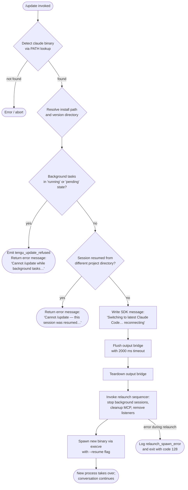

# `/update`

> Analysis basis: CC v2.1.141 bundle.js (AST extraction + Claude interpretation)
> Minimum version: v2.1.141

---

## Overview

The `/update` command performs an in-place hot-swap of the Claude Code CLI binary to the latest available version while keeping the current conversation session alive. It detects and refuses unsafe update conditions (background tasks in flight, cross-directory resume sessions), then orchestrates a graceful teardown of the current process followed by an `execve`-style relaunch of the new binary with a `--resume` flag so the conversation continues seamlessly.

---

## Registration

| Field | Value |
|---|---|
| type | `local` |
| name | `update` |
| description | Switch to the latest version (conversation continues) |
| loc_byte | `11528329` |
| loc_byte_end | `11528531` |
| loc_line | `7193` |
| supportsNonInteractive | `false` |
| isHidden | `true` |
| module_id | `i0q` |
| load_inline | `true` |
| arbor_handler.name | `ZN7` |
| arbor_handler.fqn | `claude-2.1.141::ZN7` |
| arbor_handler.kind | `AsyncFunction` |
| arbor_handler.resolution_path | `module_id` |
| arbor_handler.n_hits | `0` |

Analysis basis: CC v2.1.141 bundle.js:+11528329

---

## Input Branching

The handler follows 5+ distinct paths based on precondition checks and execution stages; a Mermaid flowchart is used.



---

## Behavioral Spec

### 1. Binary Location Resolution

The handler begins by locating the `claude` executable on the system `PATH` using a `Bun.which` call. If the executable cannot be found, the update is aborted.

```
async function resolveClaudeBinary():
    binaryPath = Bun.which("claude")          // bundle.js:+11526132
    if binaryPath is null:
        abort("binary not found")
    return binaryPath
```

Analysis basis: CC v2.1.141 bundle.js:+11526129

### 2. Install-Path and Version-Directory Resolution

Two helpers are called to derive the install base directory and version-specific subdirectory:

- **installPathResolver** (`em`) computes the base install directory by joining the user home directory (via `os.homedir()`) with `.local/share/versions` segments, falling back to a `bin`-relative path. Analysis basis: CC v2.1.141 bundle.js:+11526182
- **versionDirectoryResolver** (`T0`) extracts the basename of the current binary path and computes a numeric offset (constant `8`) into the path string to isolate the version component. Analysis basis: CC v2.1.141 bundle.js:+11526377

```
function resolveInstallPath(binaryPath):
    homeDir = os.homedir()                    // bundle.js:+7497452
    base = path.join(homeDir, ".local", "share", "versions")   // bundle.js:+7497725
    return base

function resolveVersionDirectory(binaryPath):
    name = path.basename(binaryPath)          // bundle.js:+3928226
    offset = 8                                // bundle.js:+3928261
    return deriveVersionComponent(name, offset)
```

### 3. Precondition Guards

Two guards are evaluated before any side effects are applied.

#### 3a. Background Task Guard

The handler inspects the current task registry (via `Object.values`) for entries whose status equals `"running"` or `"pending"`. If any such tasks exist, it emits a `tengu_update_refused` telemetry event and returns a user-visible error.

```
function checkBackgroundTasks(appState):
    tasks = Object.values(appState.taskRegistry)   // bundle.js:+11526452
    blocked = tasks.filter(t => t.status == "running" or t.status == "pending")
    if blocked.length > 0:
        emit("tengu_update_refused")               // bundle.js:+11526229
        return Error("Cannot /update while background tasks are running — wait for them to finish, then try again.")
                                                   // bundle.js:+11526593
    return OK
```

#### 3b. Cross-Directory Resume Guard

The handler checks whether the current session was resumed from a different project directory. If so, it returns a separate blocking error without emitting telemetry.

```
function checkResumeDirectory(appState):
    if sessionResumedFromDifferentDirectory(appState):
        return Error("Cannot /update — this session was resumed from a different project directory. Restart manually with --resume to continue on the latest version.")
                                                   // bundle.js:+11526834
    return OK
```

### 4. Pre-Relaunch Message and Bridge Operations

When all guards pass, the handler writes a user-visible status message through the SDK message writer, then flushes and tears down the output bridge in preparation for process replacement.

```
async function prepareRelaunch(outputBridge):
    outputBridge.writeSdkMessages(
        type: "text",                              // bundle.js:+11526275
        content: "Switching to latest Claude Code… reconnecting"  // bundle.js:+11527327
    )
    await outputBridge.flush(timeout=2000)         // bundle.js:+11527394, +11527407
    // "bridge flush" label used in timeout path   // bundle.js:+11527412
    await outputBridge.teardown()                  // bundle.js:+11527448
```

### 5. Session Teardown Sequencer (`nwH`)

This is the most complex sub-function. It performs a multi-step cleanup before handing control to the new binary.

```
async function sessionTeardownAndRelaunch(binaryPath, resumeArgs):
    // 1. Stat the new binary to confirm it is accessible
    await fs.stat(binaryPath)                      // bundle.js:+11259772

    // 2. Stop spinner / unmount terminal UI
    stopProgressIndicator()                        // bundle.js:+11259842
    unmountTerminalUI()                            // bundle.js:+11259848

    // 3. Remove all process signal listeners, then re-register
    //    minimal handlers for SIGINT and SIGHUP
    process.removeAllListeners()                   // bundle.js:+11260278
    process.on("SIGINT", ...)                      // bundle.js:+11260308
    // Signals handled: "SIGINT" (bundle.js:+11260249), "SIGHUP" (bundle.js:+11260268)

    // 4. Stop background daemon sessions
    await stopBackgroundSessions()                 // bundle.js:+11259356 (z)

    // 5. Apply MCP updates and flush pending MCP state
    await applyPendingMcpUpdates()                 // bundle.js:+11259239 (M)

    // 6. Re-instantiate the new binary module via require/dlopen
    //    Platform-specific library loading:
    //    - macOS: "/usr/lib/libSystem.B.dylib"    // bundle.js:+11258990
    //    - Linux: "libc.so.6"                     // bundle.js:+11259019
    loadNewBinaryModule(platform)                  // bundle.js:+11259101

    // 7. Flush conversation log entry (type "last-prompt")
    appendConversationEntry(type="last-prompt")    // bundle.js:+12002410

    // 8. Change working directory if needed and call execve
    //    to replace this process with the new binary
    if not path.isAbsolute(binaryPath):
        targetPath = path.join(process.cwd(), binaryPath)
    process.chdir(targetDir)                       // bundle.js:+11258915
    M.execve(newBinary, ["--resume", ...resumeArgs], env)  // bundle.js:+11259345

    // On execve failure, write error file and exit
    // label: "relaunch_spawn_error"               // bundle.js:+11260560
    AX.writeFileSync(errorLogPath)                 // bundle.js:+186377
    process.exit(128)                              // bundle.js:+11260697, +11260584

    // Flush timeout (30 000 ms) used as a safety net  // bundle.js:+30000 (+11259887)
    // label: "flush timeout (relaunch)"           // bundle.js:+11259893
    // label: "cleanup timeout"                    // bundle.js:+11259949
```

Analysis basis: CC v2.1.141 bundle.js:+11527637

### 6. UUID Generation for Resumed Session

Before the relaunch arguments are assembled, a fresh random UUID is generated to identify the resumed session.

```
function generateResumeSessionId():
    return crypto.randomUUID()                     // bundle.js:+11525202
```

Analysis basis: CC v2.1.141 bundle.js:+11527323

### 7. App-State Mutation

The handler reads and updates the shared application state at two points:

```
function updateAppState(stateRef):
    current = _.getAppState()                      // bundle.js:+11527081
    // Filters out any message whose role begins with "assistant-"
    // bundle.js:+11527135
    filtered = current.messages.filter(
        m => not m.role.startsWith("assistant-")
    )
    _.setAppState({ ...current, messages: filtered })  // bundle.js:+11527217
```

Analysis basis: CC v2.1.141 bundle.js:+11527081

---

## State & Side Effects

| Item | Detail |
|---|---|
| Telemetry — `tengu_update_refused` | Fired when a background task blocks the update (bundle.js:+11526229) |
| Telemetry — `tengu_scroll_summary` | Fired during terminal-UI teardown (bundle.js:+5133417) |
| Telemetry — `tengu_amber_creek` | Fired in fullscreen/terminal-mode detection path (bundle.js:+3240879) |
| Telemetry — `tengu_pewter_brook` | Fired in fullscreen/terminal-mode detection path (bundle.js:+3240787) |
| Telemetry — `tengu_bg_dispatch_sigkill_escalate` | Fired if a background session requires SIGKILL escalation during stop (bundle.js:+14465103) |
| Telemetry — `tengu_feature_bad` / `tengu_feature_ok` | Fired in feature-flag evaluation during relaunch checks (bundle.js:+945624, +945566) |
| Telemetry — `tengu_bg_low_mem_mb` | Fired when available memory is low during background session management (bundle.js:+11848152) |
| Telemetry — `tengu_bg_dispatch_low_mem` | Fired on low-memory dispatch (bundle.js:+14465682) |
| Telemetry — `tengu_bg_spare_enable` / `tengu_bg_spare_claim` / `tengu_bg_spare_spawn` / `tengu_bg_spare_claim_fail` | Spare-session pool management events (bundle.js:+14466297, +14466418, +14464880, +14466681) |
| Telemetry — `tengu_bg_sendclaim_failed` | Fired when a background session claim fails (bundle.js:+14447085) |
| Telemetry — `tengu_daemon_control` | Fired when daemon stop is attempted during teardown (bundle.js:+14499703) |
| Signal handling | `process.removeAllListeners()` called; then `SIGINT` and `SIGHUP` re-registered with minimal handlers (bundle.js:+11260278, +11260308) |
| Output bridge | `writeSdkMessages` → `flush` (2 000 ms timeout) → `teardown` called in sequence (bundle.js:+11527303, +11527394, +11527448) |
| App state | `_.getAppState()` read; `_.setAppState()` written with assistant-prefixed messages removed (bundle.js:+11527081, +11527217) |
| Conversation log | An entry of type `"last-prompt"` is appended before relaunch (bundle.js:+12002410) |
| Native library loading | `require("bun:ffi")` + platform-specific `dlopen` for macOS (`/usr/lib/libSystem.B.dylib`) or Linux (`libc.so.6`) to support `execve` (bundle.js:+11258946, +11258990, +11259019) |
| Process replacement | `M.execve` replaces the current process image; on failure, writes an error file and calls `process.exit(128)` (bundle.js:+11259345, +11260697) |
| MCP state | Pending MCP updates are applied and MCP connections flushed before relaunch (bundle.js:+11259239) |
| Flush timeout | 30 000 ms hard timeout on teardown flush labeled `"flush timeout (relaunch)"` (bundle.js:+11259887) |

---

## Version History

| Version | Change |
|---|---|
| v2.1.141 | Initial analysis |

---

## Common Mistakes

1. **Running `/update` while background tasks are active** — The command checks for tasks in `"running"` or `"pending"` state and refuses with an explicit error message. Users must wait for all background tasks to complete before invoking `/update`.
2. **Running `/update` after `--resume` across a project-directory change** — If the session was resumed from a different project directory, the command refuses. The user must restart manually with `--resume` from the correct directory after updating.
3. **Expecting interactive prompts** — `supportsNonInteractive: false` means the command will not function in non-interactive (piped / scripted) mode; it is also hidden (`isHidden: true`) and not advertised in command listings.
4. **Assuming the update is instantaneous** — The command performs sequential teardown (flush with 2 000 ms timeout, bridge teardown, background session stops, MCP cleanup, native-library reload) before `execve`. On slow systems or with many background sessions, this can take several seconds.
5. **Manually killing the process during update** — Signal listeners are stripped and re-registered during teardown. Sending signals between `removeAllListeners` and the new listener registration may cause the update to leave stale state.

---

## Appendix — Identifier Mapping

> For bundle debugging only. Identifiers change across versions.

| Identifier | Role |
|---|---|
| `ZN7` | Main async handler for `/update` (arbor_handler; AsyncFunction) |
| `tj8` | Binary path lookup helper (calls `j3` for PATH resolution) |
| `j3` | PATH-search wrapper around `Bun.which` |
| `JzA` | `Bun.which` call site wrapper |
| `em` | Install-path resolver (derives `.local/share/versions` path from home dir) |
| `E58` | Version-directory builder (joins path segments, calls `qYH`) |
| `W3` | `Array.isArray` guard utility |
| `qYH` | Home-directory path helper (calls `U48`, joins with `eD6`) |
| `U48` | `os.homedir()` wrapper |
| `_HH` | Bin-subdirectory path helper |
| `N1` | Process-role classifier (`bg`, `daemon`, `daemon-worker` literals) |
| `pc` | Internal process-role constant store |
| `Q` | General-purpose async utility / promise wrapper |
| `T0` | Version-directory component extractor (uses `path.basename` + offset 8) |
| `V6` | General value / option accessor utility |
| `vp` | App-state accessor |
| `pp_` | Relaunch argument assembler (calls `vp`, `e8`, `path.dirname`, `s3`, `QK`) |
| `e8` | Environment variable reader |
| `QK` | Resume argument builder |
| `U6H` | Session-ID or context helper |
| `Wr` | Background-task status checker (reads `SX8`, checks `vx7` set) |
| `SX8` | Task-registry snapshot getter |
| `rU_` | Conversation-log entry appender (writes `"last-prompt"`, calls `cL`, `_.appendEntry`) |
| `cL` | Conversation-state reader |
| `b9` | State mutation primitive (uses `JKK`, `jI8`, `Object.assign`) |
| `JKK` | Undefined-guard / sentinel helper |
| `kH` | Process-output / logging pipeline (calls `k_`, `RH`, `Vq`, `GvK`) |
| `k_` | Error-to-string converter |
| `RH` | String coercion utility |
| `Vq` | Output formatter (calls `cMA`) |
| `cMA` | Output formatter helper (calls `RH`) |
| `GvK` | Rolling log buffer manager (shift/push on `kS6`) |
| `yZ` | App-state message filter (removes `"assistant-"` prefixed messages) |
| `O` | Output bridge object (`writeSdkMessages`, `flush`, `teardown`) |
| `b8` | Output bridge internal implementation |
| `l0q` | Resume session UUID generator (calls `crypto.randomUUID`) |
| `Uf` | Timed promise wrapper (`setTimeout`, `Promise.race`, `clearTimeout`) |
| `nwH` | Full session teardown and `execve`-relaunch sequencer |
| `NO6` | Progress indicator stopper (calls `yY_`) |
| `yY_` | `clearInterval` wrapper for spinner |
| `mEH` | Terminal UI unmount helper (calls `nOH.writeSync`, `H.unmount`, `Ah`, `Qo6`) |
| `H` | Ink/React renderer handle |
| `Ah` | Post-unmount cleanup helper |
| `Qo6` | Terminal state restore helper (ANSI save/restore cursor escape sequences) |
| `i0H` | Terminal-type detector (checks Ghostty ≥1.2.0, iTerm2 ≥3.6.6) |
| `c0H` | Terminal state writer |
| `J0` | tmux/screen multiplexer escape handler |
| `w_8` | Scroll / fullscreen state manager (calls `KV`, `CA1`, `Q`, `RA1`, `lA`) |
| `KV` | Scroll-state constant or key |
| `CA1` | Scroll-state writer |
| `RA1` | Scroll metrics calculator (`Date.now`, `Math.max`, `Math.round`) |
| `hA1` | Scroll state helper |
| `lA` | Fullscreen / terminal-mode decision engine |
| `FRH` | Feature-flag lookup (`fIK.has`) |
| `Y1_` | Local-agent mode helper |
| `El` | Terminal resize helper |
| `v` | Terminal capability / environment variable reader |
| `H56` | Windows/platform detector |
| `p_` | Fullscreen enable helper |
| `pRL` | Fullscreen alternative path helper |
| `j6` | Render/display dispatch helper |
| `xZ` | Conversation state reader for teardown |
| `xhH` | Subscriber/hook teardown (calls `Promise.all`, `Array.from`) |
| `Sjq` | `execve` wrapper: sets up FFI, changes directory, calls `M.execve` |
| `f` | FFI handle (loaded via `bun:ffi` / `dlopen`) |
| `A` | Process map / active-process registry |
| `q` | Temp-file registry |
| `L` | Resource cleanup / finally-block helper |
| `$` | IPC write channel |
| `XTq` | Telemetry event emitter |
| `w` | Background session dispatcher / worker pool manager |
| `S` | Background session lifecycle manager |
| `xH` | Feature-ok reporter |
| `hH` | Feature-bad reporter |
| `YG6` | Memory-aware session gate |
| `u` | Session connection object |
| `Ao_` | Background session connection initiator |
| `Mo_` | Background session lifecycle handler (done/killed/failed/crashed states) |
| `D` | Spare session pool manager |
| `M8` | Session metadata holder |
| `p` | Disposable resource wrapper |
| `M` | MCP update orchestrator (`execve`, `SvH`, `Eeq`, `XA5`) |
| `SvH` | MCP server connection manager |
| `Eeq` | MCP update applicator (`H.applyMcpUpdate`) |
| `XA5` | MCP client reconciler |
| `z` | Daemon stop coordinator |
| `oR` | Daemon stop request sender |
| `Kx` | Daemon stop with race/timeout logic (`Promise.race`, `process.exit`) |
| `TH` | String-coercion / type-tag utility |
| `AX` | Error-log file writer (`fSH.writeFileSync`) |

---

Note: index built via Arbor fallback; some signals (telemetry, literals) may be missing — see arbor-fallback.js.