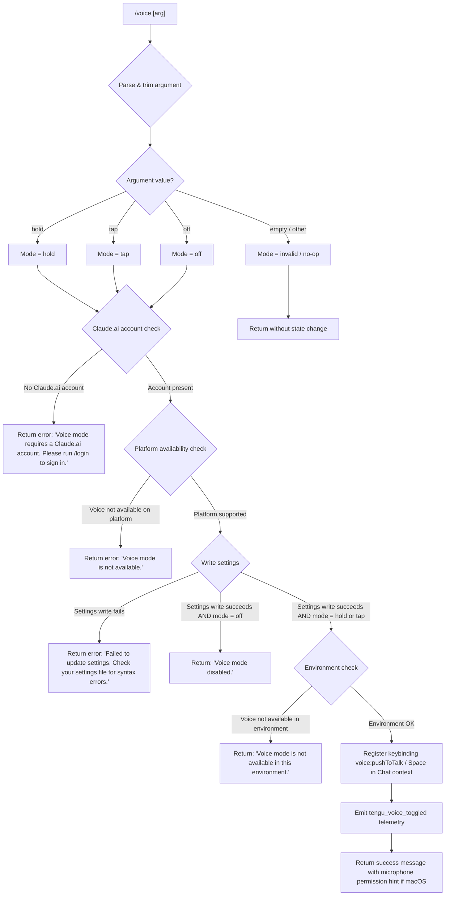

# `/voice`

> Analysis basis: CC v2.1.141 bundle.js (AST extraction + Claude interpretation)
> Minimum version: v2.1.141

---

## Overview

The `/voice` command toggles voice input mode in Claude Code, allowing users to switch between `hold` (push-to-talk), `tap` (toggle-to-talk), and `off` states. It validates platform and account prerequisites before applying the mode change, and persists the setting via the user settings file. The command also registers the `voice:pushToTalk` keybinding action in the `Chat` context with the `Space` key.

---

## Registration

| Field | Value |
|---|---|
| type | `local` |
| name | `voice` |
| description | `Toggle voice mode` |
| argumentHint | `[hold\|tap\|off]` |
| supportsNonInteractive | `false` |
| isHidden | `null` |
| module_id | `kVq` |
| load_inline | `true` |
| loc_byte | `11808737` |
| loc_byte_end | `11808979` |
| loc_line | `7726` |
| arbor_handler.name | `YR7` |
| arbor_handler.fqn | `claude-2.1.141::YR7` |
| arbor_handler.kind | `AsyncFunction` |
| arbor_handler.resolution_path | `module_id` |
| arbor_handler.n_hits | `1` |

Analysis basis: CC v2.1.141 bundle.js:+11808737

---

## Input Branching

The command has 5+ distinct branches based on argument value and platform/account state, so a Mermaid flowchart is used.



Analysis basis: CC v2.1.141 bundle.js:+11806108, +11806120, +11806131, +11806152, +11806202, +11806232, +11806331, +11806650, +11806788, +11807032

---

## Behavioral Spec

### 1. Argument Parsing

```
function parseVoiceArgument(rawArg):
    trimmedArg = rawArg.trim()
    if trimmedArg in ["hold", "tap", "off"]:
        return trimmedArg
    else:
        return "invalid"
```

Valid mode values: `"hold"`, `"tap"`, `"off"` (bundle.js:+11806108, +11806120, +11806131).
Any other input (including empty string) resolves to `"invalid"` (bundle.js:+11806152).

---

### 2. Account Prerequisite Check

```
async function checkAccountPrerequisite(appState):
    authStatus = getAuthenticationStatus(appState)
    if not authStatus.hasClaudeAiAccount:
        return {
            ok: false,
            message: "Voice mode requires a Claude.ai account. Please run /login to sign in."
        }
    return { ok: true }
```

Analysis basis: CC v2.1.141 bundle.js:+11806219, +11806232

The check is performed via `EsH` (accountStatusChecker) → `XF_` (oauthStateReader) before any mode is applied.

---

### 3. Platform Availability Check

```
function checkVoicePlatformAvailability():
    available = queryVoiceCapabilityFlag()   // via XF_ / Boolean coercion
    if not available:
        return {
            ok: false,
            message: "Voice mode is not available."
        }
    return { ok: true }
```

Analysis basis: CC v2.1.141 bundle.js:+11806331, +11796650, +11796662

`XF_` (oauthStateReader) also evaluates a boolean capability flag; `Boolean` coercion is applied at bundle.js:+11796662.

---

### 4. Settings Persistence

```
async function persistVoiceMode(mode):
    result = await writeSettingsKey("voiceMode", mode)
    if result.error:
        return {
            ok: false,
            message: "Failed to update settings. Check your settings file for syntax errors."
        }
    return { ok: true }
```

Analysis basis: CC v2.1.141 bundle.js:+11806552, +11806650

This is handled by `m_` (settingsWriter), which internally calls `jR6` (configFileAppender), `kH` (settingsPersistor), and ultimately performs file I/O including directory creation, atomic write, and cache clearing via `ZY` (cacheInvalidator).

---

### 5. Keybinding Registration

```
function registerVoiceKeybinding():
    action = "voice:pushToTalk"
    context = "Chat"
    key = "Space"
    registerKeybinding(context, key, action)
```

Analysis basis: CC v2.1.141 bundle.js:+11807998, +11808001, +11808020, +11808027

The registration is performed via `rJ` (keybindingRegistrar) → `Da6` (keybindingLoader) → `Kf6` (keybindingParser). The action `"voice:pushToTalk"` is bound to the `"Space"` key within the `"Chat"` context.

---

### 6. Disable Path

```
function handleDisable():
    persistVoiceMode("off")
    return { message: "Voice mode disabled." }
```

Analysis basis: CC v2.1.141 bundle.js:+11806788

When mode is `"off"` and settings write succeeds, a short confirmation message is returned without proceeding to environment checks or keybinding registration.

---

### 7. Environment Availability Check (post-settings)

```
function checkVoiceEnvironment(appState):
    if not isVoiceAvailableInCurrentEnvironment(appState):
        return {
            ok: false,
            message: "Voice mode is not available in this environment."
        }
    return { ok: true }
```

Analysis basis: CC v2.1.141 bundle.js:+11807032

This check runs only when mode is `hold` or `tap` and settings write succeeded. It evaluates whether the runtime environment (e.g., SSH session, headless terminal) supports microphone access.

---

### 8. macOS Microphone Permission Hint

```
function buildSuccessMessage(platform):
    if platform == "macos":
        hint = "System Settings → Privacy & Security → Microphone"
        return formatMessageWithHint(hint)
    else:
        return formatMessageWithoutHint()
```

Analysis basis: CC v2.1.141 bundle.js:+11807519, +11807539

The string `"System Settings → Privacy & Security → Microphone"` is appended to the success message on macOS to guide users to grant microphone permission.

---

### 9. Telemetry Emission

```
function emitVoiceToggled(mode, success):
    emitTelemetry("tengu_voice_toggled", {
        mode: mode,
        success: success
    })
```

Analysis basis: CC v2.1.141 bundle.js:+11806733

The `tengu_voice_toggled` event is emitted via `Q` (telemetryEmitter) at bundle.js:+11806731, triggered regardless of which mode was selected as long as execution reaches the telemetry call site.

---

### 10. MCP State Refresh (side effect)

```
async function refreshMcpState(appState):
    mcpManager = getMcpManager(appState)   // via M (mcpManager)
    await mcpManager.applyUpdate()         // via Eeq / SvH
```

Analysis basis: CC v2.1.141 bundle.js:+11807307, +14200092, +14200380

The handler `YR7` calls `M` (mcpManager) as a side effect, which triggers MCP server state reconciliation. This is consistent with other commands that write settings — MCP servers may be restarted or re-evaluated.

---

## State & Side Effects

| Item | Detail |
|---|---|
| Telemetry | `tengu_voice_toggled` (bundle.js:+11806733) |
| Telemetry (indirect / MCP) | `tengu_mcp_oauth_flow_start`, `tengu_mcp_oauth_flow_success`, `tengu_mcp_oauth_flow_error`, `tengu_mcp_reconnect`, `tengu_mcp_reconnect_not_connected`, `tengu_mcp_reconnect_failed` |
| Telemetry (indirect / daemon) | `tengu_daemon_config_reload`, `tengu_bg_spare_claim`, `tengu_bg_spare_claim_fail` |
| Settings write | Persists `voiceMode` key to user settings file (`~/.claude/settings.json`) via `m_` → `jR6` |
| Cache invalidation | `ZY` clears two caches (`kV6`, `XZ8`) after settings write (bundle.js:+24901, +24913) |
| Keybinding registration | Registers `voice:pushToTalk` → `Space` in `Chat` context via `rJ` → `Da6` → `Kf6` |
| MCP state refresh | `M` (mcpManager) triggers server reconciliation as a side effect of settings change |
| File I/O | Settings file read/write; directory creation if missing (`K5H.mkdir`, `K5H.writeFile`, `K5H.appendFile`) |
| appState changes | `voiceMode` field updated; keybinding map updated |
| Sound | <!-- TODO: not found in depth-2 traversal; needs --depth 4 --> |
| Hook registration | `EhL` (fileWatcher) may register/unwatch config file watchers during settings reload |

---

## Version History

| Version | Change |
|---|---|
| v2.1.141 | Initial analysis |

---

## Common Mistakes

1. **Running `/voice hold` or `/voice tap` without a Claude.ai account** — the command will reject immediately with a login prompt. Use `/login` first.
2. **Running `/voice` in an SSH or headless environment** — even if the mode is persisted, the environment check may return "Voice mode is not available in this environment." Microphone hardware must be accessible.
3. **Omitting the argument** — no argument or an unrecognized argument resolves to `"invalid"` and produces no state change. The valid values are exactly `hold`, `tap`, and `off`.
4. **Expecting microphone access to work immediately on macOS without granting permission** — the success message explicitly cites `System Settings → Privacy & Security → Microphone` to remind users they must grant access at the OS level.
5. **Expecting `/voice off` to deregister keybindings** — the disable path writes the setting and returns early; it does not explicitly unregister the `voice:pushToTalk` keybinding in the current session.
6. **Syntax errors in `settings.json`** — if the settings file has pre-existing JSON syntax errors, the write will fail and the command returns an error message. Fix the file manually before retrying.

---

## Appendix — Identifier Mapping

> For bundle debugging only. Identifiers change across versions.

| Identifier | Role |
|---|---|
| `YR7` | Main async handler for `/voice` command (arbor_handler) |
| `EsH` | Account status checker (Claude.ai account prerequisite) |
| `XF_` | OAuth/voice capability state reader |
| `mw` | Settings state manager / voice mode state updater |
| `JL` | Settings reader utility |
| `FR` | API key/auth configuration resolver |
| `tj` | Auth tier classifier (`firstParty` etc.) |
| `j$` | API key validation and error handler |
| `Q46` | Settings field accessor |
| `AG6` | Account/auth property extractor |
| `p_` | Settings loader entry point |
| `ex` | Settings load orchestrator |
| `rS` | Settings pre-load validator |
| `T1` | Performance mark recorder (`loadSettingsFromDisk_start`) |
| `bx` | `perf_hooks` module requirer |
| `Fm8` | Settings file reader and cache populator |
| `T8` | Log file appender (info-level) |
| `hV6` | Settings version checker |
| `WE` | Settings flag/policy merger (`flagSettings`, `policySettings`) |
| `xDA` | Settings object key enumerator |
| `L` | In-flight request tracker / settings cache (context-dependent) |
| `K` | Settings key formatter / active-request map |
| `Jf` | Settings path resolver (`userSettings`, `projectSettings`, `localSettings`) |
| `f` | Active session set / connection tracker |
| `G5H` | Settings watcher registrar |
| `MC6` | SDK inline settings integrator |
| `yV6` | Settings load completion marker |
| `zR7` | Argument string trimmer / mode token parser |
| `H` | Random/timer utility (context-dependent); also argument string holder |
| `m_` | Settings writer / persists voice mode to disk |
| `x6` | Path utility / file existence checker |
| `Bm8` | Settings batch writer |
| `hD` | File content reader utility |
| `MB` | File encoding detector and reader |
| `OM` | Real-path resolver (symlink, FIFO, socket detection) |
| `v` | Config value normalizer / string parser |
| `zx8` | File read pre-check utility |
| `_` | Generic utility / platform lower-case helper |
| `Yx8` | File read post-processor |
| `$8` | ENOENT error handler |
| `M8` | Error code classifier |
| `Fu8` | Timestamp setter for settings cache entries |
| `Xc` | Settings path builder (`VV.resolve`, `VV.dirname`) |
| `e8` | Settings path existence checker |
| `Oo` | Settings path joiner |
| `$CH` | Atomic file writer (temp file, rename, fsync) |
| `q` | FS operations proxy / unlinkSync etc. |
| `O` | Symbolic link status inspector |
| `b8` | Background session object factory |
| `SH` | JSON serializer (`JSON.stringify`) |
| `ZY` | Cache invalidator (clears `kV6` and `XZ8`) |
| `jR6` | Config file appender / settings file I/O orchestrator |
| `N6` | AsyncLocalStorage store accessor |
| `bS6` | Context store getter |
| `vu8` | Validated-config loader |
| `hu8` | `.gitignore`-aware config resolver |
| `M_` | Git `check-ignore` runner |
| `WyK` | Home-directory config path builder |
| `ky` | `.claude` directory path joiner |
| `kH` | Settings persistor / write-with-backup |
| `k_` | Error/string coercer for settings errors |
| `RH` | String coercer (`String(...)`) |
| `Vq` | Settings backup writer |
| `cMA` | Backup path formatter |
| `GvK` | Rolling backup queue manager |
| `Q` | Telemetry emitter |
| `M` | MCP manager / server reconciliation orchestrator |
| `SvH` | MCP server state updater (iterates entries, fires reconnects) |
| `$HH` | MCP config merger |
| `cqH` | MCP server config loader (enterprise/user/project/local) |
| `MHH` | SDK-type MCP server enumerator |
| `Dw6` | SSE/HTTP MCP server connector |
| `hI` | MCP server config normalizer |
| `G3` | MCP tool definition builder |
| `YG_` | MCP config source mapper |
| `__` | Underscore utility wrapper |
| `rX6` | MCP server filter |
| `xL7` | MCP connection scheduler |
| `rh_` | MCP retry backoff calculator |
| `$78` | MCP server hash/fingerprint generator |
| `wi` | MCP wire-format serializer |
| `Yj` | SHA-256 hasher for MCP configs |
| `M78` | MCP server metadata accessor |
| `aK` | MCP capability checker |
| `_8` | MCP debug logger |
| `Nh_` | MCP server connection orchestrator |
| `nK7` | MCP server type dispatcher |
| `DB` | MCP transport builder |
| `q6H` | MCP OAuth flow handler |
| `FrH` | MCP pending-auth cache manager |
| `D` | Background spare daemon manager |
| `nz8` | MCP needs-auth path builder |
| `SQ` | MCP reconnect sequencer |
| `tx` | MCP transport factory |
| `Y` | Daemon supervisor config updater |
| `_7` | MCP error logger |
| `TH` | String coercer for error messages |
| `iK7` | MCP connection timeout racer |
| `lK7` | SSH environment MCP transport selector |
| `kh_` | MCP server lifecycle manager |
| `BrH` | MCP in-flight request getter |
| `grH` | MCP pending-auth state getter |
| `sHq` | MCP needs-auth cache reader |
| `p7` | AsyncLocalStorage store getter |
| `LY8` | MCP needs-auth cache path resolver |
| `Ih_` | MCP auth token validator |
| `fG_` | MCP server capability filter |
| `e6` | Global config reader/writer |
| `A` | File-type checker / includes utility |
| `J` | Background worker process map |
| `N` | Background worker process object |
| `y` | Background write stream |
| `z` | Daemon output stream |
| `iHq` | MCP async iterator handler |
| `U$H` | MCP async mapper (validates safe integer bounds) |
| `oX6` | MCP port parser (parseInt) |
| `oh_` | MCP retry-port parser (parseInt) |
| `Eeq` | MCP update applier |
| `fY8` | MCP update serializer |
| `sI` | MCP server cleanup sequencer |
| `irH` | MCP server cleanup executor |
| `$` | MCP session factory / XTq invoker |
| `XTq` | Daemon status reader |
| `Ia` | Daemon status field accessor |
| `b06` | Daemon status file path builder (`daemon.status.json`) |
| `XA5` | MCP server client enumerator |
| `z78` | MCP tool/resource capability tester |
| `a8` | MCP connection timeout handler |
| `rJ` | Keybinding registrar |
| `Da6` | Keybinding loader (reads `keybindings.json`) |
| `Kf6` | Keybinding file parser |
| `VL_` | Keybinding schema validator |
| `lu` | Keybinding release telemetry emitter |
| `i9H` | Keybinding file path builder |
| `b6` | JSON parser |
| `xH` | Keybinding parse-error reporter |
| `Oa6` | Keybinding block structure validator |
| `Ma6` | Keybinding entry extractor |
| `oR9` | Keybinding fallback emitter |
| `EL_` | Keybinding duplicate-key detector |
| `ZL_` | Keybinding binding array builder |
| `hH` | Keybinding error formatter |
| `wa6` | Keybinding action resolver |
| `kL_` | Keybinding action lookup |
| `bBL` | Keybinding built-in action registry |
| `YGH` | Keybinding display name mapper |
| `JhH` | Locale/language normalizer (`toLowerCase`, split) |
| `h6` | Config file watcher initializer |
| `_9_` | Config file watch predicate |
| `cMH` | Config file reader (with backup support) |
| `DR` | BOM/encoding stripper |
| `rE9` | Config directory scanner |
| `$9_` | Config backup path builder |
| `w` | Background worker spawn manager |
| `S` | Background worker lifecycle controller |
| `YG6` | Low-memory threshold checker (`macos`, `1024` MB) |
| `u` | Background worker connection handler |
| `j6` | Config hook registrar |
| `Ao_` | Background worker claim handler |
| `Mo_` | Background worker lifecycle tracker |
| `p` | Background worker disposable |
| `EhL` | Config file watcher (watchFile / unwatchFile) |
| `Jl` | Config change event debouncer |
| `b9` | Config watcher state tracker (`jI8`) |
| `JKK` | Watcher undefined-check guard |