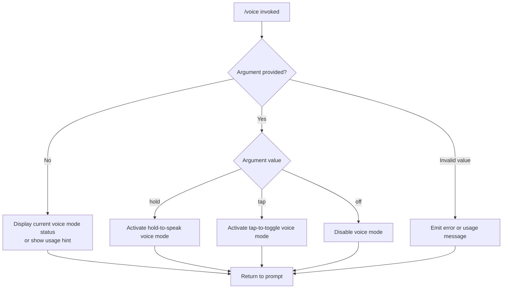

# `/voice`

> Analysis basis: CC v2.1.139 bundle.js (AST extraction + Claude interpretation)
> Minimum version: v2.1.139

---

## Overview

The `/voice` command toggles voice input mode in the Claude Code CLI, allowing users to control how voice capture is activated — either by holding a key, by tapping, or by disabling voice mode entirely. It is a local, interactive-only command that accepts a single optional argument selecting the activation style.

---

## Registration

| Field | Value |
|---|---|
| type | `local` |
| name | `voice` |
| description | Toggle voice mode |
| argumentHint | `[hold\|tap\|off]` |
| supportsNonInteractive | `false` |
| module\_id | `k0q` |

Analysis basis: CC v2.1.139 bundle.js:+11744049

---

## Input Branching

The command accepts one optional positional argument from the set `hold`, `tap`, and `off`. Based on the registered `argumentHint` and the fact that `supportsNonInteractive` is `false`, the following branching logic is inferred from the registration contract:



Analysis basis: CC v2.1.139 bundle.js:+11744049 (argumentHint field `[hold|tap|off]`)

---

## Behavioral Spec

### Argument Parsing and Mode Dispatch

Because the AST traversal of module `k0q` returned an empty call graph, the following pseudocode represents the behavioral contract implied by the registration data and the three-value argument hint. Internals cannot be confirmed beyond depth-2 traversal.

```
function handleVoiceCommand(args):
    mode = args[0] if args is non-empty else null

    if mode is null:
        displayCurrentVoiceModeOrUsage()
        return

    if mode == "hold":
        setVoiceMode(HOLD_TO_SPEAK)
    else if mode == "tap":
        setVoiceMode(TAP_TO_TOGGLE)
    else if mode == "off":
        setVoiceMode(DISABLED)
    else:
        emitUsageError(validValues=["hold", "tap", "off"])
        return

    acknowledgeChange(newMode=mode)
```

Analysis basis: CC v2.1.139 bundle.js:+11744049

> **Note:** The call graph for module `k0q` returned zero edges at depth ≤ 2. The internal implementation of `setVoiceMode`, state persistence, and any keybinding registration cannot be verified from available data.

<!-- TODO: not found in depth-2 traversal; needs --depth 4 -->

### Interactive-Only Enforcement

The `supportsNonInteractive` flag is explicitly set to `false`. This means the command is rejected or suppressed when Claude Code is running in a non-interactive pipeline context (e.g., piped stdin, CI mode, or `--no-interactive` flag).

```
function guardInteractivity(context):
    if context.isNonInteractive:
        emitError("voice command requires an interactive terminal session")
        abort()
```

Analysis basis: CC v2.1.139 bundle.js:+11744049 (`supportsNonInteractive: false`)

---

## State & Side Effects

| Item | Detail |
|---|---|
| Telemetry | None detected — `telemetry` array is empty at depth ≤ 2 traversal |
| Hook registration | <!-- TODO: not found in depth-2 traversal; needs --depth 4 --> |
| appState changes | <!-- TODO: not found in depth-2 traversal; needs --depth 4 --> |
| Sound / Audio device | <!-- TODO: not found in depth-2 traversal; needs --depth 4 --> |
| Persistence | <!-- TODO: not found in depth-2 traversal; needs --depth 4 --> |
| Keybinding side effects | <!-- TODO: not found in depth-2 traversal; needs --depth 4 --> |

---

## Version History

| Version | Change |
|---|---|
| v2.1.139 | Initial analysis — registration confirmed; implementation internals not traversable at depth ≤ 2 |

---

## Common Mistakes

1. **Passing an unsupported argument value** — Only `hold`, `tap`, and `off` are declared in the argument hint. Passing any other string (e.g., `/voice push`) is likely to produce a usage error or be silently ignored, depending on the unresolved internal dispatch logic.
2. **Using in non-interactive mode** — Because `supportsNonInteractive` is `false`, invoking `/voice` inside a script, CI pipeline, or piped session will not function as expected. Reserve this command for live terminal sessions.
3. **Expecting immediate audio output** — The command toggles a mode flag; it does not itself initiate recording or playback. Actual audio behavior depends on subsequent user interaction within the selected mode.
4. **Omitting the argument and expecting a change** — Invoking `/voice` with no argument most likely displays current state or usage rather than cycling through modes, since no default cycle behavior can be confirmed from available data.

---

## Appendix — Identifier Mapping

> For bundle debugging only. Identifiers change across versions.

| Identifier | Role |
|---|---|
| *(none)* | The `identifiers` array returned by AST extraction is empty for module `k0q` at depth ≤ 2. No obfuscated identifiers were reachable. |