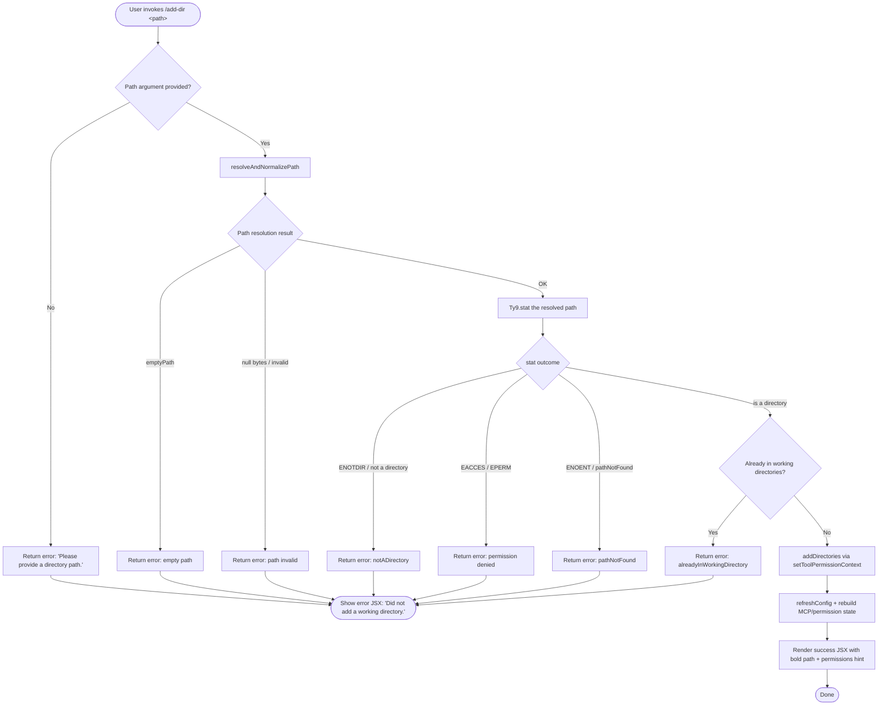

# `/add-dir`

> Analysis basis: CC v2.1.139 bundle.js (AST extraction + Claude interpretation)
> Minimum version: v2.1.139

---

## Overview

`/add-dir` adds a new working directory to the current Claude Code session. It accepts a filesystem path as its argument, validates that path through several sanity checks (existence, type, accessibility, duplicate detection), and — on success — registers the directory in application state, refreshes configuration, and rebuilds the tool-permission context. On failure it renders a specific error code so the user can correct the problem.

---

## Registration

| Field | Value |
|---|---|
| type | `local-jsx` |
| name | `add-dir` |
| description | `Add a new working directory` |
| argumentHint | `<path>` |
| module_id | `Qu9` |
| load_inline | `true` |
| loc_byte | `4037045` |
| loc_byte_end | `4037193` |
| loc_line | `690` |
| arbor_handler.name | `ZQL` |
| arbor_handler.fqn | `claude-2.1.139::ZQL` |
| arbor_handler.kind | `AsyncFunction` |
| arbor_handler.resolution_path | `module_id` |
| arbor_handler.n_hits | `0` |

Analysis basis: CC v2.1.139 bundle.js:+4037045

---

## Input Branching

Seven or more distinct result paths exist (empty input, path-validation errors, duplicate directory, permission errors, not-a-directory, path-not-found, and success), so a Mermaid flowchart is used.



Analysis basis: CC v2.1.139 bundle.js:+4035761 – +4036609

---

## Behavioral Spec

### 1. Entry — `addDirHandler` (bundle ident: `ZQL`)

`ZQL` is an `AsyncFunction` resolved via `module_id` → `Qu9`. It is the primary handler for `/add-dir`.

```
async function addDirHandler(commandInput, appStateProxy):
    # 1. Read current app state
    state = appStateProxy.getAppState()            # _.getAppState

    # 2. Extract the raw path argument from commandInput
    rawPath = commandInput.trim()

    # 3. Immediately guard against empty input
    if rawPath is empty:
        return renderError("Please provide a directory path.")

    # 4. Set the tool-permission context to include "addDirectories"
    #    with scope = { localSettings: 1, session: "session" }
    appStateProxy.setToolPermissionContext(
        "addDirectories",
        { localSettings: 1, session: "session" }
    )

    # 5. Delegate path normalization + stat
    result = await resolveDirectoryPath(rawPath)   # YpH

    # 6. Branch on result code
    match result.code:
        "emptyPath"               -> return renderError("Did not add a working directory.", "emptyPath")
        "notADirectory"           -> return renderError("Did not add a working directory.", "notADirectory")
        "pathNotFound"            -> return renderError("Did not add a working directory.", "pathNotFound")
        "alreadyInWorkingDirectory" -> return renderError("Did not add a working directory.", "alreadyInWorkingDirectory")
        "success"                 -> continue

    # 7. Register the directory in session state
    registerDirectory(result.resolvedPath)         # Uf

    # 8. Refresh config (reads project + user settings from disk)
    p_.refreshConfig()

    # 9. Rebuild local MCP / permission configuration
    rebuildLocalConfig(result.resolvedPath)        # CL_

    # 10. Persist updated state (config writer)
    persistStateChanges()                          # Rb9

    # 11. Compute display label using getDisplayLabel(result.resolvedPath)   # Ls
    label = computeDisplayLabel(result.resolvedPath)

    # 12. Render success JSX
    return renderSuccess(
        boldText(label),
        dimText("· /permissions to manage")
    )
```

Analysis basis: CC v2.1.139 bundle.js:+4035761

---

### 2. Path Resolution — `resolveDirectoryPath` (bundle ident: `YpH`)

```
async function resolveDirectoryPath(rawPath):
    # 2a. Normalize path (tilde expansion, null-byte check, platform handling)
    normalized = normalizePath(rawPath)            # oA
    #   - strips leading/trailing whitespace
    #   - expands "~/" to os.homedir()
    #   - rejects paths containing null bytes → error "Path contains null bytes"
    #   - handles Windows drive-letter paths
    #   - calls path.normalize then path.resolve

    if normalized is null or empty:
        return { code: "emptyPath" }

    # 2b. Resolve symlinks
    resolved = Zr6.resolve(normalized)

    # 2c. stat the resolved path
    try:
        stats = await Ty9.stat(resolved)
    catch err:
        if err.code == "ENOTDIR" or err.code == "EACCES" or err.code == "EPERM":
            return { code: "notADirectory" }
        if err.code == "ENOENT":
            return { code: "pathNotFound" }
        return { code: err.code or "Unknown error" }

    if not stats.isDirectory():
        return { code: "notADirectory" }

    # 2d. Deduplicate against existing working directories
    #     Uses dc (deduplicate-check) which calls A_ (alreadyIn check)
    if directoryAlreadyRegistered(resolved):       # dc → A_
        return { code: "alreadyInWorkingDirectory" }

    # 2e. Normalize macOS /var → /tmp symlink pattern
    #     Sy maps /var/... to /tmp$1 and performs lowercase comparison (i2)
    displayPath = normalizeMacOSPath(resolved)     # Sy

    return { code: "success", resolvedPath: resolved, displayPath: displayPath }
```

Analysis basis: CC v2.1.139 bundle.js:+3626680

---

### 3. Directory Registration — `registerDirectory` (bundle ident: `Uf`)

```
function registerDirectory(resolvedPath):
    # Stores the new path in the in-memory working-directories collection
    # Uses a Map (A.set) and a Set (L.has / L.delete) for deduplication

    # Apply alwaysAllowRules / alwaysDenyRules / alwaysAskRules from
    # existing permission configuration (e4 path-escaping, yH JSON serialiser)
    # bypassPermissions guard:
    if mode == "bypassPermissions" and not available:
        log("Ignoring permission update: setMode 'bypassPermissions' rejected ...")
        return

    # Rule application order: addRules → replaceRules → removeRules
    # For "allow" rules   → alwaysAllowRules
    # For "deny"  rules   → alwaysDenyRules
    # Otherwise           → alwaysAskRules
    applyPermissionRules(resolvedPath)

    # Remove stale removeDirectories entries (A.delete)
    pruneRemovedDirectories()
```

Analysis basis: CC v2.1.139 bundle.js:+3933488, +3934015, +3934055

---

### 4. Local Config Rebuild — `rebuildLocalConfig` (bundle ident: `CL_`)

```
async function rebuildLocalConfig(resolvedPath):
    # Determine environment (production vs test)   # OwH → tTq, kS
    env = detectEnvironment()    # "production" | "test"

    # Resolve real path (Unicode NFC normalisation)
    realPath = await zL.realpath(resolvedPath)
    normalizedKey = realPath.normalize("NFC")

    # Logging pipeline                              # LH → S1 → G7A → CGK
    appendToLogBuffer(normalizedKey)

    # Read existing config from disk if present    # zL.readFile (utf8)
    existing = await zL.readFile(configPath, "utf8")

    # Create directories if missing               # zL.mkdir (mode 448 = 0o700)
    await zL.mkdir(parentDir, { recursive: true, mode: 448 })

    # Append updated config atomically             # zL.appendFile (mode 384 = 0o600)
    await zL.appendFile(configPath, serialized, { mode: 384 })
```

Analysis basis: CC v2.1.139 bundle.js:+11925563, +11925873, +11925940

---

### 5. State Persistence — `persistStateChanges` (bundle ident: `Rb9`)

```
async function persistStateChanges():
    # Clear stale cache entries                    # j2 → aMH.delete
    clearCacheEntry()

    # Read state ordering metadata                 # Q1 → order / stateOrder
    metadata = await readStateMetadata()

    # Write config atomically using random temp filename
    #   _n8.randomBytes → hex suffix
    #   Io.writeFile → temp file
    #   Io.rename    → atomic swap
    await atomicWriteConfig()                      # pf → RD

    # Error handling: warn-level log on parse fail  # "warn"
    # Emit LH log pipeline on error                 # Rb9 → LH
```

Analysis basis: CC v2.1.139 bundle.js:+3926228, +2179223, +2179323

---

### 6. Display Label Computation — `computeDisplayLabel` (bundle ident: `Ls`)

```
function computeDisplayLabel(resolvedPath):
    # Build candidate label list                   # rK_
    candidates = buildLabelCandidates(resolvedPath)

    # Filter to those not already used by other directories
    #   Uses N (path writer), v8, k_ (config reader)
    unusedLabels = candidates.filter(c => not labelInUse(c))

    # Escape special shell characters in the label  # e4 → xVK (replaceAll "\\", "\(", "\)")
    label = escapeShellChars(unusedLabels[0] or resolvedPath)

    # Apply MCP / tool-availability filter          # Ub9 → M.has (tool set)
    return label
```

Analysis basis: CC v2.1.139 bundle.js:+3935685, +1123707

---

### 7. Success & Error Rendering

```
function renderSuccess(boldLabel, dimHint):
    # Uses f6.bold and f6.dim text styling
    # Renders: <bold>{label}</bold> added as working directory
    #          <dim>· /permissions to manage</dim>
    return jsxSuccessBlock(boldLabel, dimHint)

function renderError(message, code):
    # Always includes "Did not add a working directory." as the primary message
    # Secondary line is code-specific (e.g. "Please provide a directory path.")
    # wpH uses f6.bold for path display + Zr6.dirname for parent context
    return jsxErrorBlock(message, code)
```

Analysis basis: CC v2.1.139 bundle.js:+4036042, +4036328, +4036335, +4036492, +4036609, +3627176

---

## State & Side Effects

| Item | Detail |
|---|---|
| Telemetry | `tengu_daemon_config_reload` (emitted at bundle.js:+14324140 via `Q` in the supervisor/daemon config path) |
| `addDirectories` key | Written to `localSettings` scope with value `1`, `session` scope with value `"session"` (bundle.js:+4035807, +4035854, +4035870) |
| `setToolPermissionContext` | Called on every invocation before path resolution (bundle.js:+4035881) |
| `p_.refreshConfig` | Synchronous config reload called after successful registration (bundle.js:+4035965) |
| `CL_` (rebuildLocalConfig) | Reads/writes project config file; creates parent dirs with mode `0o700` (448), appends with mode `0o600` (384) |
| Atomic config write | `_n8.randomBytes` → hex temp filename → `Io.writeFile` → `Io.rename` (bundle.js:+2179223) |
| MCP server state | `Wa7` / `WIH` / `Niq` paths update MCP client connections on config change; `tengu_daemon_config_reload` fires if daemon detects config change (bundle.js:+14324140) |
| CLI flag `--add-dir` | Literal `"--add-dir"` present at bundle.js:+4035995; the command can also be triggered at startup via this CLI flag |
| Permissions hint | Static string `"· /permissions to manage"` rendered in dim style on success (bundle.js:+4036335) |
| Log pipeline | `LH` → `S1` → `G7A` → `CGK` queues log entries; `Jd.logError` on error (bundle.js:+949122) |
| Sound | None detected |

---

## Version History

| Version | Change |
|---|---|
| v2.1.139 | Initial analysis |

---

## Common Mistakes

1. **Forgetting the argument**: Invoking `/add-dir` with no path produces `"Please provide a directory path."` — the argument is mandatory.
2. **Passing a file instead of a directory**: `stat` result `isDirectory()` returns `false`, yielding the `notADirectory` error code and `"Did not add a working directory."`.
3. **Adding the same directory twice**: The deduplication check (`dc` → `A_`) returns `alreadyInWorkingDirectory` silently — no changes are made.
4. **Using a path with null bytes**: The normalisation step (`oA`) rejects it immediately with `"Path contains null bytes"`.
5. **Permission-denied paths**: `EACCES` and `EPERM` both map to `notADirectory` error code — the distinction is not surfaced to the user.
6. **macOS `/var/` symlinks**: The handler automatically remaps `/var/...` → `/tmp$1` during display-label computation (`Sy`); users may see a different path echoed back than the one they supplied.
7. **Expecting immediate tool access after adding**: Config and permissions are refreshed, but MCP servers go through `Wa7`/`WIH`/`Niq` reconnection cycles that are asynchronous.

---

## Appendix — Identifier Mapping

> For bundle debugging only. Identifiers change across versions.

| Identifier | Role |
|---|---|
| `ZQL` | Main async handler for `/add-dir` (arbor_handler) |
| `_` | App-state proxy (getAppState, setToolPermissionContext) |
| `Uf` | Directory registration — applies permission rules to new directory |
| `N` | Low-level path/log writer utility |
| `y9K` | Inner path serialisation helper |
| `Xo_` | Byte-range helper within path writer |
| `yH` | JSON serialiser (wraps JSON.stringify) |
| `LM` | Path formatting — lastIndexOf / slice |
| `os_` | Character-map helper for path display |
| `QyH` | Write-to-stream wrapper |
| `ms_` | Low-level stream write (`H.write`) |
| `R9K` | Config file writer orchestrator |
| `JyH` | Buffered/batched write scheduler (clearTimeout / setTimeout / setImmediate) |
| `n6H` | Directory-entry join helper |
| `B6` | Base-path resolver utility |
| `IV8` | Buffer utility (`w8`) |
| `qt_` | Path-join + variable resolver |
| `At_` | File-rotation helper (stat / rename / unlink / `.txt` extension) |
| `S9K` | Config-append writer (mkdir / appendFile) |
| `C9` | Object-assign state merger |
| `e4` | Shell-escape helper |
| `xVK` | replaceAll-based character escaper (`\\`, `\(`, `\)`) |
| `K` | Rule-set collection (map / filter / padEnd) |
| `L` | File-handle lifecycle manager (open / close / finally) |
| `q` | Temp-file unlink tracker |
| `f` | File-handle wrapper |
| `iI` | Current-directories accessor |
| `D` | Supervisor / daemon message dispatcher |
| `fwH` | Config-file reader (rq_.read, ENOENT handling, Object.keys) |
| `w8` | Low-level buffer/encoding utility |
| `Vp_` | Read-buffer helper (`Zp_`) |
| `IH` | String-coercion wrapper |
| `rWq` | Column-width calculator (Math.max, Object.keys) |
| `T` | Remote-control / supervisor event handler |
| `u` | DOM/input event (preventDefault source) |
| `D2` | Remote-control startup handler (`remoteControlAtStartup`) |
| `k_` | Config loader (policySettings / flagSettings / userSettings / projectSettings) |
| `V` | Daemon process controller (stop / updateConfig / start) |
| `haq` | Heartbeat handler |
| `Ja` | Heartbeat interval source |
| `Z` | Secondary process starter |
| `Q` | Daemon config-reload trigger (`tengu_daemon_config_reload`) |
| `dtH` | Immediate post-add state update helper |
| `CL_` | Local config rebuilder (realpath / readFile / mkdir / appendFile) |
| `OwH` | Environment detector (production / test) |
| `SH` | String-wrapper utility |
| `tTq` | Test-environment flag |
| `kS` | Environment selector |
| `D8` | Error-wrapper (`w8`) |
| `LH` | Structured logger / log-queue flusher |
| `q_` | Error + String converter |
| `S1` | Log-entry formatter |
| `G7A` | Log-entry string builder |
| `CGK` | Log-queue rotator (shift / push) |
| `pQ` | Path qualifier helper |
| `A_` | "Already registered" membership check |
| `Rb9` | State-persistence orchestrator |
| `j2` | Cache-entry deleter (`aMH.delete`) |
| `Q1` | State-metadata reader (order / stateOrder / stat / readFile) |
| `U6` | JSON.parse wrapper |
| `pf` | Atomic-write coordinator (join / yH / j2) |
| `RD` | Atomic file writer (randomBytes / writeFile / rename / unlink / copyFile) |
| `Ls` | Display-label computation |
| `rK_` | Label-candidate builder |
| `Ub9` | Label-candidate ranker / MCP-filter |
| `f56` | Label sub-generator (`v8`) |
| `v8` | VS Code / editor path helper (`VS6`) |
| `pFL` | Canonical-path resolver (wf / f3 / B6 / LG / Y1) |
| `wf` | Project-root joiner (QZ.join / Zd / wIK / ak / YIK / Kr) |
| `f3` | lstatSync + special-file detector (FIFO / socket / char / block / realpathSync) |
| `LG` | Zone/context resolver (`ZU`) |
| `FFL` | Label fallback formatter |
| `qO` | Label string cleaner (mVK / pT / pVK / uVK / substring / replaceAll) |
| `mVK` | Label prefix stripper |
| `pT` | Object.hasOwn property guard |
| `pVK` | Label segment formatter |
| `uVK` | replaceAll-based label character normaliser |
| `M` | MCP server-set manager (WIH / Niq / L.get / N / Wa7) |
| `WIH` | MCP server initialiser / connector (stdio / sse / http / sse-ide / ws-ide / claudeai-proxy) |
| `Niq` | MCP update applier (applyMcpUpdate / cleanup / WI / uD) |
| `$` | NXq config-change notifier |
| `Wa7` | MCP client reconciler (getClients / filter / WIH / Niq / Object.fromEntries) |
| `YpH` | Path-resolution + stat entry point |
| `oA` | Path normaliser (tilde / null-byte / Windows / path.resolve) |
| `C6` | Async-storage context reader (`ry6`) |
| `ry6` | AsyncLocalStorage getStore wrapper |
| `dc` | Duplicate-directory detector |
| `Sy` | macOS `/var` → `/tmp` path normaliser + lowercase comparator |
| `i2` | Lowercase comparator helper |
| `sU_` | Platform-specific path helper (`o6` / `mP`) |
| `br` | Path-comparison finaliser |
| `wpH` | Error-JSX renderer (f6.bold + Zr6.dirname) |

---

Note: index built via Arbor fallback; some signals (telemetry, literals) may be missing — see arbor-fallback.js.