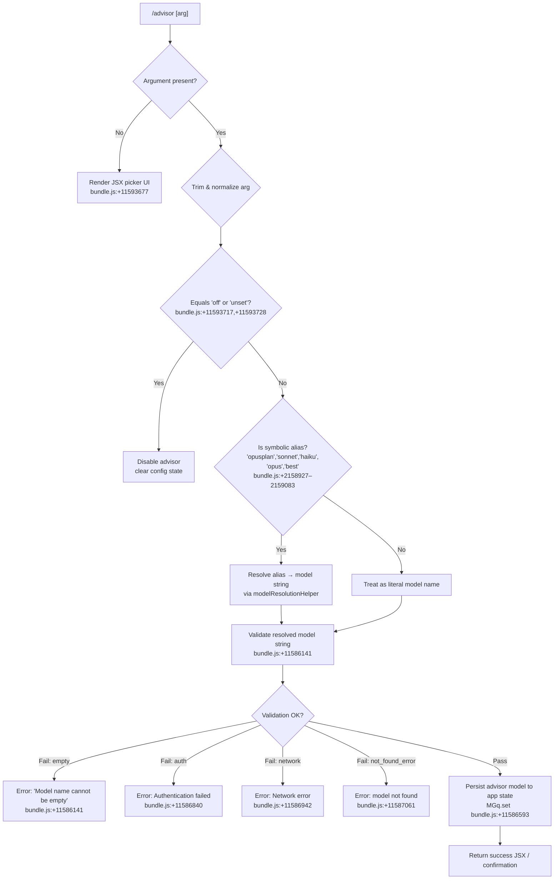

# `/advisor`

> Analysis basis: CC v2.1.142 bundle.js (AST extraction + Claude interpretation)
> Minimum version: v2.1.142

---

## Overview

The `/advisor` command configures the **Advisor Tool**, a feature that consults a stronger (or otherwise specified) model for guidance at key decision points during an active task. It accepts an optional argument specifying the target model or a symbolic tier alias, validates the argument against a known model registry, and updates the advisor configuration in application state. If no argument is supplied the command renders a JSX selection interface.

---

## Registration

| Field | Value |
|---|---|
| type | `local-jsx` |
| name | `advisor` |
| description | `Configure the Advisor Tool to consult a stronger model for guidance at key moments during a task` |
| loc_byte | `11594183` |
| loc_byte_end | `11594470` |
| loc_line | `7217` |
| argumentHint | `null` |
| isHidden | `null` |
| module_id | `DGq` |
| load_inline | `true` |
| arbor_handler.name | `uN7` |
| arbor_handler.fqn | `claude-2.1.142::uN7` |
| arbor_handler.kind | `AsyncFunction` |
| arbor_handler.resolution_path | `module_id` |
| arbor_handler.n_hits | `1` |

Registration block occupies bytes `(11594183, 11594470)` of bundle.js.

Analysis basis: CC v2.1.142 bundle.js:+11594183

---

## Input Branching

Four distinct input paths are identifiable from literals and call-graph evidence: no argument (UI mode), a recognized symbolic alias, a raw model string with validation, and an explicit disable/unset request.



---

## Behavioral Spec

### Top-level handler (`uN7`)

The Arbor-resolved handler `uN7` is an `AsyncFunction` reached via module `DGq` (resolution path: `module_id`).

```
async function advisorHandler(args, context):
    rawArg = args.trim()                          // bundle.js:+11593641
    
    if rawArg is empty:
        return createElement(AdvisorPickerUI, context)  // bundle.js:+11593677
    
    normalized = rawArg.toLowerCase()
    
    if normalized in ["off", "unset"]:            // bundle.js:+11593717, +11593728
        disableAdvisor(context)
        return successElement
    
    resolvedModel = resolveModelAlias(normalized) // uN7 → n1 bundle.js:+11593795
    validationResult = validateModelString(resolvedModel, context)  // uN7 → zP8 bundle.js:+11593809
    
    if validationResult.error:
        return renderError(validationResult.error)
    
    persistAdvisorModel(resolvedModel, context)   // MGq.set bundle.js:+11586593
    
    supportedModels = buildSupportedModelList()   // uN7 → igH.join bundle.js:+11593952
    return renderConfirmation(resolvedModel, supportedModels)
```

Analysis basis: CC v2.1.142 bundle.js:+11593641

---

### Alias resolution (`n1` — modelAliasResolver)

Maps human-friendly shorthand tier names onto concrete model identifiers before validation occurs.

```
function modelAliasResolver(alias):
    normalized = alias.toLowerCase()              // bundle.js:+2158842

    switch normalized:
        case "opusplan":                          // bundle.js:+2158927
            return resolveOpusPlan(context)       // nV → xf, YM
        case "sonnet":                            // bundle.js:+2158968
            return resolveTier("sonnet", context) // VxH → YM
        case "haiku":                             // bundle.js:+2159007
            return resolveTier("haiku", context)  // lV → YM
        case "opus":                              // bundle.js:+2159046
            return resolveTier("opus", context)   // lV → YM
        case "best":                              // bundle.js:+2159083
            return resolveBest(context)           // YtA → lV
        default:
            cleaned = alias.replace(...)          // bundle.js:+2158870
            if isKnownProvider(cleaned):          // zAH bundle.js:+2158906
                return cleaned
            return cleaned                        // passes through to validation

    // Symbolic tier "[1m]" also recognized internally  bundle.js:+2158953
```

Analysis basis: CC v2.1.142 bundle.js:+2158831

---

### Model validation (`zP8` — modelValidator)

Validates the resolved model string by trimming, normalizing, checking against a deny-list, and optionally performing a live network probe.

```
async function modelValidator(modelString, context):
    trimmed = modelString.trim()                  // bundle.js:+11586104

    if trimmed is empty:
        throw Error("Model name cannot be empty") // bundle.js:+11586141

    lower = trimmed.toLowerCase()                 // bundle.js:+11586264

    if lower in blockedModelList (OAH):           // bundle.js:+11586283
        return { error: "blocked" }

    if validatedCache (MGq).has(lower):           // bundle.js:+11586385
        return cachedResult

    // Perform live validation probe via bg (apiRequestDispatcher)
    probeResult = await apiRequestDispatcher(trimmed, context)  // bundle.js:+11586430

    if probeResult.authError:
        return { error: "Authentication failed. Please check your API credentials." }
                                                  // bundle.js:+11586840
    if probeResult.networkError:
        return { error: "Network error. Please check your internet connection." }
                                                  // bundle.js:+11586942
    if probeResult.errorType == "not_found_error":
        return { error: "model: " + trimmed + " not found" }
                                                  // bundle.js:+11587061, +11587143

    // Store validated aliases (e.g. opus-4-7/opus_4_7)
    // bundle.js:+11587410, +11587434, +11587479, +11587503, +11587548, +11587572
    // bundle.js:+11587617, +11587643, +11587692, +11587718
    cacheValidationResult(MGq, lower, probeResult)  // bundle.js:+11586593

    return { ok: true, model: trimmed }
```

Analysis basis: CC v2.1.142 bundle.js:+11586104

---

### Live validation probe (`bg` — apiRequestDispatcher / sideQueryDispatch)

Sends a minimal side-query API request to verify the model string is accessible under the current authentication context. The string `"side_query"` marks this as a lightweight non-task invocation.

```
async function sideQueryDispatch(modelName, context):
    // Dispatches via vu (coreApiRunner) bundle.js:+12353297
    // Request tagged with literal "side_query"  bundle.js:+12353329
    // Buffer limit: 1024 bytes               bundle.js:+12353145
    // Uses globalThis.fetch                  bundle.js:+12353382
    // Checks G.includes / G.push for dedup  bundle.js:+12353449, +12353464

    sessionHash = computeHash(modelName)      // bQ_ bundle.js:+12353490
    // SHA-256 hex, 3-char prefix             bundle.js:+12308273, +12308288

    response = await fetch(apiEndpoint, {
        model: modelName,
        tag: "side_query",
        ...authHeaders
    })

    if response ok:
        emit telemetry("tengu_api_success")   // bundle.js:+12354753
        return parseResponse(response)        // Z3H bundle.js:+12354648

    return parseErrorResponse(response)
```

Analysis basis: CC v2.1.142 bundle.js:+12353297

---

### Model resolution helpers (`YM`, `VU6`, `xf` — tierModelResolver)

Resolves a tier name to a concrete model ID by consulting the available model list and provider routing.

```
function tierModelResolver(tier, context):
    candidates = lookupModelsByTier(tier)     // YM → HhH, D4L bundle.js:+2019535
    
    for each candidate:
        providerEntry = findProvider(candidate, context)  // VU6 → zl8.find bundle.js:+2018655
        
        if providerEntry found:
            modelId = buildModelId(providerEntry)    // VU6 → Ya bundle.js:+2018702
            return modelId
    
    // Fallback: use best-match heuristic
    return selectBestAvailableModel(tier, context)  // VU6 → obH bundle.js:+2018794
```

Known provider strings consulted during resolution:
- `"bedrock"` (bundle.js:+2017459)
- `"foundry"` (bundle.js:+2017509)
- `"anthropicAws"` (bundle.js:+2017565)
- `"mantle"` (bundle.js:+2017619)
- `"vertex"` (bundle.js:+2017667)
- `"firstParty"` (bundle.js:+2017676)
- `"gateway"` (bundle.js:+2018148)

Analysis basis: CC v2.1.142 bundle.js:+2019535

---

### MCP server state integration (`n_5`, `IvH`, `Peq` — mcpStateManager)

The model validation path also integrates with MCP connection state. This is a shared subsystem traversed during context assembly; it is not specific to `/advisor` but is reached in the call graph.

```
function mcpStateManager(context):
    entries = Object.entries(mcpServerConfig)     // bundle.js:+14197318
    activeClients = context.getClients()          // bundle.js:+14197365

    for each [serverId, config] in entries:
        if config matches active client:
            status = resolveConnectionStatus(config)  // v bundle.js:+14196715
            // Status strings: "disabled", "connected", "failed", "needs-auth"
            //                  bundle.js:+9676576, +9677385, +9677958, +9677283

    // On auth recovery:
    applyMcpUpdate(context)                       // Peq → H.applyMcpUpdate bundle.js:+14196944
    // Retry log: "[MCP] Retry: all remote servers recovered, stopping"
    //            bundle.js:+14197514
```

Analysis basis: CC v2.1.142 bundle.js:+14197318

---

## State & Side Effects

| Item | Detail |
|---|---|
| Telemetry — `tengu_api_success` | Emitted when the live model validation probe returns successfully (bundle.js:+12354753) |
| Telemetry — `tengu_prompt_cache_1h_config` | Emitted during cache configuration associated with model context assembly (bundle.js:+12315039) |
| Telemetry — `tengu_feature_ok` | Emitted when a feature flag check passes (bundle.js:+954550) |
| Telemetry — `tengu_feature_bad` | Emitted when a feature flag check fails (bundle.js:+954608) |
| Telemetry — `tengu_bg_dispatch_sigkill_escalate` | Background dispatcher signal escalation (bundle.js:+14462646) |
| Telemetry — `tengu_bg_dispatch_low_mem` | Background dispatcher low-memory condition (bundle.js:+14463225) |
| Telemetry — `tengu_bg_spare_enable` | Spare background session enabled (bundle.js:+14463840) |
| Telemetry — `tengu_bg_spare_claim` | Spare session claimed (bundle.js:+14463961) |
| Telemetry — `tengu_bg_spare_claim_fail` | Spare session claim failed (bundle.js:+14464224) |
| Telemetry — `tengu_bg_proto_mismatch` | Background protocol version mismatch (bundle.js:+14451852) |
| Telemetry — `tengu_bg_dispatch_stale_drop` | Stale dispatch dropped (bundle.js:+14453091) |
| Telemetry — `tengu_bg_attach_legacy_autorespawn` | Legacy attachment triggered auto-respawn (bundle.js:+14454977) |
| Telemetry — `tengu_bg_attach` | Background session attach event (bundle.js:+14455388) |
| Telemetry — `tengu_bg_attach_stall_gave_up` | Attach stall exhausted retries (bundle.js:+14456277) |
| Telemetry — `tengu_bg_attach_stall_respawn` | Attach stall triggered respawn (bundle.js:+14456546) |
| Telemetry — `tengu_bg_attach_kick` | Attach kicked existing session (bundle.js:+14457468) |
| Validation cache write | Successful model strings are stored in `MGq` (a `Map`) via `MGq.set` (bundle.js:+11586593) to avoid redundant network probes |
| Validation cache read | `MGq.has` consulted before issuing live probe (bundle.js:+11586385) |
| appState changes | Advisor model persisted to application state upon successful validation; reflected in subsequent task invocations |
| JSX render | When no argument is provided, a React element (`$J.createElement`) is returned for the interactive picker (bundle.js:+11593677) |
| Network I/O | A `fetch`-based side-query probe is issued to the Anthropic API endpoint `"https://api.anthropic.com"` (bundle.js:+2203172) with a 10 000 ms timeout (bundle.js:+2203295) |
| Sound | None observed in call graph |
| Hook registration | None observed in call graph |

---

## Version History

| Version | Change |
|---|---|
| v2.1.142 | Initial analysis |

---

## Common Mistakes

1. **Supplying an unsupported model string without checking availability** — the command performs a live network probe; if the Anthropic API is unreachable the validation will fail with a network error even if the model name is correct. Ensure connectivity or use a previously validated (cached) model name.

2. **Expecting instant disable via `/advisor off` while a task is already in progress** — the `"off"` / `"unset"` path clears the advisor configuration in `appState`, but any in-flight advisory requests dispatched before the command executes will complete normally.

3. **Using alias shorthand in non-interactive pipelines** — aliases such as `"best"`, `"opus"`, `"sonnet"`, and `"haiku"` are resolved dynamically against the available provider list at runtime. The resolved concrete model ID may differ between environments (Bedrock, Vertex, first-party) or after a model deprecation.

4. **Confusing `/advisor` with model selection for the primary task** — this command configures a *side-channel consultation* model, not the main task execution model. The primary model is governed by a separate configuration path.

5. **Omitting the argument expecting a no-op** — invoking `/advisor` with no argument renders a JSX picker UI rather than returning the current advisor configuration as text. Users expecting a status query should be aware the output is interactive, not a plain text confirmation.

---

## Appendix — Identifier Mapping

> For bundle debugging only. Identifiers change across versions.

| Identifier | Role |
|---|---|
| `uN7` | Top-level `/advisor` async handler (Arbor-resolved entry point) |
| `n1` | Model alias resolver — maps shorthand tier names to concrete model strings |
| `zP8` | Model validator — trims, checks deny-list, consults validation cache, issues live probe |
| `bg` | API request dispatcher / side-query runner |
| `vu` | Core API runner called by `bg`; manages auth headers and request lifecycle |
| `RB` | Model string preprocessor — splits, trims, prefix-checks model name tokens |
| `VN7` | Alias expansion helper called after initial validation cache miss |
| `IN7` | Inner alias-to-tier mapper; normalizes model variant strings |
| `$O6` | Provider inclusion checker — lower-cases and tests against known provider set |
| `YM` | Tier-to-model resolver — looks up concrete model by tier across provider entries |
| `VU6` | Provider entry lookup — finds matching provider record in model registry |
| `D4L` | Model-detail builder — assembles model descriptor from registry fields |
| `MdA` | Model metadata aggregator — iterates `Object.entries` over model map |
| `xf` | Model lookup helper used by alias and tier resolvers |
| `lV` | Tier resolver variant (haiku/opus path) |
| `YtA` | "Best" alias resolver — delegates to `lV` |
| `VxH` | Sonnet-tier resolver — delegates to `YM` |
| `nV` | Opus-plan resolver — calls `xf` then `YM` |
| `sG` | Secondary model string helper called from alias resolver |
| `wAH` | String coercion helper (calls `bH`) |
| `bH` | Primitive-to-string coercion wrapper |
| `zAH` | Provider allowlist inclusion check |
| `aB6` | Model string format validator (calls `dfL.includes`) |
| `IxH` | Model string transformation helper (calls `bH`) |
| `IU6` | Model entry iterator (uses `m_`, `Object.entries`) |
| `m_` | Model map accessor |
| `ZxH` | Blocked-model-list checker (calls `BfL.includes`) |
| `ztA` | Ordered model index lookup (calls `ZxH`, `A.indexOf`) |
| `FfL` | Full-string model inclusion check combining `H.includes`, `zAH`, `n1` |
| `gfL` | Prefix-based model resolver (checks `"claude-"` prefix) |
| `OtA` | Model string prefix tester (`H.startsWith`) |
| `n_5` | MCP server state manager — iterates server config and resolves connection states |
| `IvH` | MCP connection handler — enumerates transports and manages client lifecycle |
| `Peq` | MCP update applier — calls `H.applyMcpUpdate` and cleanup |
| `M` | MCP registry accessor — uses `L.get`, `L.values`, `v`, `$`, `n_5` |
| `v` | API response/model-string post-processor; handles `debug` level and provider routing |
| `$` | Calls `zEq`; used in MCP registry enumeration |
| `K` | Column-padding formatter (`L.map`, `f.padEnd` with width 40) |
| `lVH` | API response content builder — assembles model context payload |
| `G6` | Prompt cache / session record manager |
| `CE` | Cache-entry builder (`s6_`, `bH`) |
| `s6_` | Cache slot resolver (calls `VA`) |
| `VA` | Provider-context value accessor |
| `Iw` | Model invocation wrapper (`ZU6`, `z4L`, `VA`, `EU6`) |
| `mZL` | Session/request-state tracker — assigns UUIDs, manages Map entries |
| `xy` | Context resolver helper (calls `VA`) |
| `uWH` | Request context assembler — calls `I1`, `Iw`, `xy` |
| `I1` | Model invocation initializer — checks `IU6`, `Nw`, `eV8`, `wP` |
| `Gu6` | Proxy auth helper — checks workspace trust, issues token, applies timeout |
| `aO` | Proxy credential applicator (`bH`, `VR`, `hc`, `LC6`, `shA`) |
| `TF6` | WIF credentials resolver — fetches tokens via `fetch` with 10 000 ms timeout |
| `pxH` | Provider-token resolver (`TF6`, `SH`, `uH`, `xML`) |
| `bZL` | Authorization header parser (splits, trims, slices bearer token) |
| `RD` | Store accessor (`wtA.getStore`) |
| `fl` | Session-context accessor (calls `jl6`) |
| `jl6` | Async store retrieval (`SY9.getStore`) |
| `V6` | Module resolver (calls `JV`) |
| `DM` | Dispatch manager (calls `z8_`) |
| `AA` | Auth-state accessor (`bw`, `kB`, `xA`) |
| `zO` | Zero-arg helper referenced across dispatch and validation paths |
| `RZL` | Retry/limit manager (calls `MmH`) |
| `E_` | Error-state sentinel |
| `BfH` | Background fetch helper — uses `Date.now`, `GV8`, `SML`, `mV6` |
| `WV8` | Timestamp helper (`Date.now`) |
| `k46` | Authorization key normalizer (`Object.entries`, `q.toLowerCase`) |
| `yMH` | SDK error logger (`console.error`) |
| `Hl6` | Header builder (`JP`, `h1`, `I1`, `WV`) |
| `QR` | Request router (`RU6`, `OL`, `C46`, `Ja`, `yu`, `bH`) |
| `$P` | Request-state probe (calls `z3`) |
| `ujH` | Model-prefix matcher (`OKK.find`, `H.startsWith`, `aV6`) |
| `h` | Focus/blur tracker (`XF`, `Date.now`, `Math.min`, `wcq`) |
| `W` | Debounce/throttle manager (`setTimeout`, `clearTimeout`, `J3H`, `TBH`) |
| `N` | Away-summary orchestrator (`Ff8`, `Ns7`, `wcq`, `A18`, `uH`) |
| `Ff8` | State snapshot accessor (`OnH.getState`) |
| `Ns7` | Away-summary condition checker (`an_`) |
| `A18` | Away-summary generator (`iEH`, `jZ`, `Y8`, `sz1`) |
| `uH` | Utility helper (calls `d`) |
| `SH` | Utility helper (calls `d`) |
| `q9q` | UUID generator (`BZ.randomUUID`) |
| `g` | Collection accessor (`F`, `$`) |
| `Dhq` | Response diagnostic helper |
| `wP` | Text sanitizer (`H.replace`) |
| `fl6` | Request filter (`ta`, `I1`, `A.includes`) |
| `XX` | Message mapper (`H.map`) |
| `Z3H` | Response parser — handles array/object discrimination, calls `hu`, `M5`, `V6` |
| `RH` | JSON serializer (`JSON.stringify`) |
| `hu` | Random-ID generator (`xE9.randomBytes`, `y6`, `t6`) |
| `M5` | Value wrapper (`bw`, `y6`) |
| `n4H` | Miscellaneous request-shape builder |
| `d` | Low-level I/O primitive |
| `FTH` | Feature-flag evaluator (`UA4`, `NH`) |
| `UA4` | Feature-flag record constructor (`BTH`, `$68.has`) |
| `NH` | Feature-flag logger (`k_`, `bH`, `$q`, `JvK`, `Yc.logError`) |
| `wg` | Agent-prefix dispatcher (`pA4`, `NH`) |
| `pA4` | Agent-path resolver (`H.startsWith`, `H.slice`, `M68`, `dM_`, `X1H`) |
| `QeH` | Response queue handler |
| `VN7` | Alias expansion coordinator (calls `IN7`, coerces with `String`) |
| `IN7` | Alias inner mapper — resolves variant names such as `opus-4-7`, `sonnet-4-5` |
| `$O6` | Provider membership tester (`H.toLowerCase`, `_.includes`) |
| `Ri6` | Cache-control header builder (`Nq`, `VA`, `jl6`, `v`) |
| `Nq` | String coercion helper |
| `Si6` | Cache slot selector (calls `VA`) |
| `P` | Background process I/O handler (`Buffer.concat`, `w`, `vf`, `s95`, `GH`) |
| `j` | Process reference holder (calls `w`) |
| `w` | Background worker manager — spawns, kills, resizes PTY sessions |
| `vf` | Stream finalizer (`H.end`, `RH`) |
| `s95` | Daemon-session protocol handler — full message dispatch loop |
| `GH` | String coercion wrapper |
| `bQ_` | Request-fingerprint hasher (`uyq.createHash`, SHA-256) |
| `kp7` | Model-entry finder (`H.find`, `A.find`) |
| `Nu` | Numeric coercion helper used in side-query path |
| `uWH` | Already listed above |
| `oV8` | Content-slice helper used in response assembly |
| `aV8` | Suffix-match helper in model lookup |