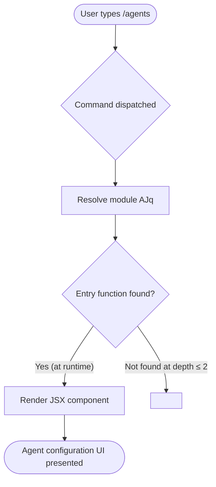

# `/agents`

> Analysis basis: CC v2.1.139 bundle.js (AST extraction + Claude interpretation)
> Minimum version: v2.1.139

---

## Overview

The `/agents` command provides an interface for managing agent configurations within Claude Code. It is registered as a `local-jsx` type slash command, indicating it renders a JSX-based UI component in the CLI rather than producing plain text output. The precise interactive behaviors and sub-commands are encapsulated in module `AJq`, whose entry functions were not reachable at depth ≤ 2 traversal.

---

## Registration

| Field | Value |
|---|---|
| type | `local-jsx` |
| name | `agents` |
| description | `Manage agent configurations` |
| module_id | `AJq` |
| loc_line | `7112` |

Analysis basis: CC v2.1.139 bundle.js:+11382860

---

## Input Branching

<!-- TODO: not found in depth-2 traversal; needs --depth 4 -->

No call graph edges were recovered for module `AJq` at traversal depth ≤ 2. A branching flowchart cannot be constructed from verified data alone. The following is a minimal structural stub based solely on the registration record.



Analysis basis: CC v2.1.139 bundle.js:+11382860 (registration record only; no call edges recovered)

---

## Behavioral Spec

### Command Dispatch and JSX Rendering

Because the command type is `local-jsx`, the CLI framework does not print a text response. Instead it mounts a React/JSX component returned by module `AJq` directly into the terminal UI surface.

```
function handleAgentsCommand(inputArgs):
    module = resolveModule("AJq")
    component = module.renderComponent(inputArgs)
    terminalUI.mount(component)
```

Analysis basis: CC v2.1.139 bundle.js:+11382860 (type field `local-jsx` indicates JSX rendering path)

### Agent Configuration Management

The description field `"Manage agent configurations"` establishes that the command's purpose is CRUD-style management of agent configuration entries. The specific operations (list, add, edit, delete, etc.) are implemented inside module `AJq`.

```
function agentConfigurationManager(args):
    // Specific sub-operations are inside module AJq
    // and were not recovered at traversal depth ≤ 2
    operation = parseOperation(args)
    // <!-- TODO: not found in depth-2 traversal; needs --depth 4 -->
    dispatch(operation)
```

Analysis basis: CC v2.1.139 bundle.js:+11382860 (description field literal)

---

## State & Side Effects

| Item | Detail |
|---|---|
| Telemetry | <!-- TODO: not found in depth-2 traversal; needs --depth 4 --> |
| Hook registration | <!-- TODO: not found in depth-2 traversal; needs --depth 4 --> |
| appState changes | <!-- TODO: not found in depth-2 traversal; needs --depth 4 --> |
| Sound | <!-- TODO: not found in depth-2 traversal; needs --depth 4 --> |

> **Note:** The AST extraction for module `AJq` returned empty `telemetry`, `literals`, `callGraph`, and `identifiers` arrays. No side effects can be stated as verified facts at this traversal depth.

Analysis basis: CC v2.1.139 bundle.js:+11382860 (extraction metadata note: `"no entry functions found for module 'AJq'"`)

---

## Version History

| Version | Change |
|---|---|
| v2.1.139 | Initial analysis — registration record verified; internal behavior pending deeper traversal |

---

## Common Mistakes

1. **Assuming text output**: Because `/agents` is type `local-jsx`, it renders an interactive UI component rather than printing text to stdout. Expecting a plain-text response will cause confusion when scripting or piping output.
2. **Running deeper analysis at depth ≤ 2**: The module `AJq` exposes no entry functions at the default traversal depth. Any behavioral claims about sub-commands, flags, or state mutations beyond what is in the registration record require re-extraction at `--depth 4` or greater.
3. **Treating this spec as complete**: Due to the empty call graph, this document covers only the registration surface. All internal logic, validation rules, configuration schema, and telemetry remain unverified until a deeper extraction is performed.

---

## Appendix — Identifier Mapping

> For bundle debugging only. Identifiers change across versions.

| Identifier | Role |
|---|---|
| `AJq` | Module identifier for the `/agents` command implementation |

> **Note:** The `identifiers` array returned by the AST extraction was empty. `AJq` is the `module_id` field from the registration record, not an obfuscated function identifier recovered from traversal. No additional mangled identifiers are available at this traversal depth.

Analysis basis: CC v2.1.139 bundle.js:+11382860