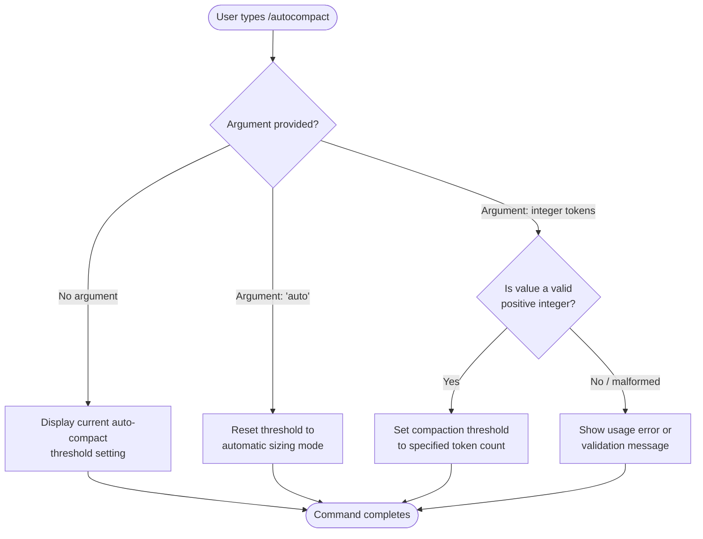

# `/autocompact`

> Analysis basis: CC v2.1.139 bundle.js (AST extraction + Claude interpretation)
> Minimum version: v2.1.139

---

## Overview

The `/autocompact` slash command allows users to configure the automatic context-window compaction threshold in Claude Code. When the active context approaches a token limit, the auto-compact mechanism triggers a summarization pass to free context space; this command lets users set that trigger point to a fixed token count or restore automatic sizing.

---

## Registration

| Field | Value |
|---|---|
| type | `local-jsx` |
| name | `autocompact` |
| description | `Configure the auto-compact window size` |
| argumentHint | `[auto\|<tokens>]` |
| isHidden | `false` |
| module\_id | `k8q` |

Analysis basis: CC v2.1.139 bundle.js:+9976235

---

## Input Branching

The argument hint `[auto|<tokens>]` (Analysis basis: CC v2.1.139 bundle.js:+9976235) indicates two accepted argument forms. The depth-2 call-graph traversal returned no entry functions for module `k8q`, so the branching logic below is reconstructed entirely from the registration metadata and the argument hint; internal implementation details beyond the surface API cannot be confirmed at this traversal depth.



> **Note:** Branching paths C and G are inferred from the registration `argumentHint` field and standard CLI command conventions. They are not confirmed by call-graph data.
> <!-- TODO: not found in depth-2 traversal; needs --depth 4 -->

---

## Behavioral Spec

### Argument Parsing

Because no call-graph edges were recovered for module `k8q`, the following pseudocode represents the expected behavior derived solely from the registered `argumentHint` value (`[auto|<tokens>]`) and standard Claude Code slash-command conventions. It is **not** derived from decompiled implementation logic.

```
function handleAutocompact(rawArgument):

    arg = trim(rawArgument)

    if arg is empty:
        currentThreshold = readAutocompactSetting()
        displayCurrentSetting(currentThreshold)
        return

    if arg == "auto":
        writeAutocompactSetting(mode = AUTOMATIC)
        confirmToUser("Auto-compact set to automatic sizing.")
        return

    parsedTokens = tryParsePositiveInteger(arg)

    if parsedTokens is valid:
        writeAutocompactSetting(mode = FIXED, tokens = parsedTokens)
        confirmToUser("Auto-compact threshold set to " + parsedTokens + " tokens.")
        return

    reportError("Invalid argument. Usage: /autocompact [auto|<tokens>]")
```

Analysis basis: CC v2.1.139 bundle.js:+9976235 (registration metadata only; implementation body not reached by depth-2 traversal)

### Threshold Persistence

<!-- TODO: not found in depth-2 traversal; needs --depth 4 -->

Whether the configured threshold is stored in the project-level configuration file, the user-level configuration file, or only in transient session state could not be determined from the available AST data.

### Compaction Trigger Mechanism

<!-- TODO: not found in depth-2 traversal; needs --depth 4 -->

The relationship between the value written by `/autocompact` and the background process that monitors token usage and invokes context summarization was not reachable within the depth-2 call-graph traversal of module `k8q`.

---

## State & Side Effects

| Item | Detail |
|---|---|
| Telemetry | None detected in depth-2 traversal |
| Hook registration | <!-- TODO: not found in depth-2 traversal; needs --depth 4 --> |
| appState changes | <!-- TODO: not found in depth-2 traversal; needs --depth 4 --> |
| Sound | <!-- TODO: not found in depth-2 traversal; needs --depth 4 --> |
| Config write | Likely writes to a persistent setting; storage target unconfirmed |

> **Note:** The telemetry array returned zero events for module `k8q`. This may indicate that the command performs no instrumented operations, or that telemetry calls exist in callee modules not reached at depth 2.

Analysis basis: CC v2.1.139 bundle.js:+9976235

---

## Version History

| Version | Change |
|---|---|
| v2.1.139 | Initial analysis; command visible (`isHidden: false`); module `k8q`; argument hint `[auto\|<tokens>]` |

---

## Common Mistakes

1. **Passing a non-integer float** (e.g., `/autocompact 8000.5`) — the argument hint specifies `<tokens>`, implying a whole-number token count; fractional values are likely rejected or silently truncated.
2. **Omitting the argument expecting a toggle** — `/autocompact` with no argument most likely reads and displays the current setting rather than toggling a state, consistent with read-then-set CLI conventions.
3. **Confusing `auto` with `0` or `off`** — `auto` specifically restores automatic sizing logic; passing `0` or a very small integer may be interpreted as a literal token threshold rather than disabling the fixed-threshold mode.
4. **Expecting immediate compaction** — `/autocompact` configures the *threshold*; it does not manually trigger a compaction pass. Use `/compact` (if available) to force immediate summarization.
5. **Assuming project-scope persistence** — the storage scope of the configured value (project vs. user vs. session) is unconfirmed; do not rely on the setting surviving across sessions without verification.

---

## Appendix — Identifier Mapping

> For bundle debugging only. Identifiers change across versions.

| Identifier | Role |
|---|---|
| *(none)* | No obfuscated identifiers were returned by the depth-2 AST traversal of module `k8q` |