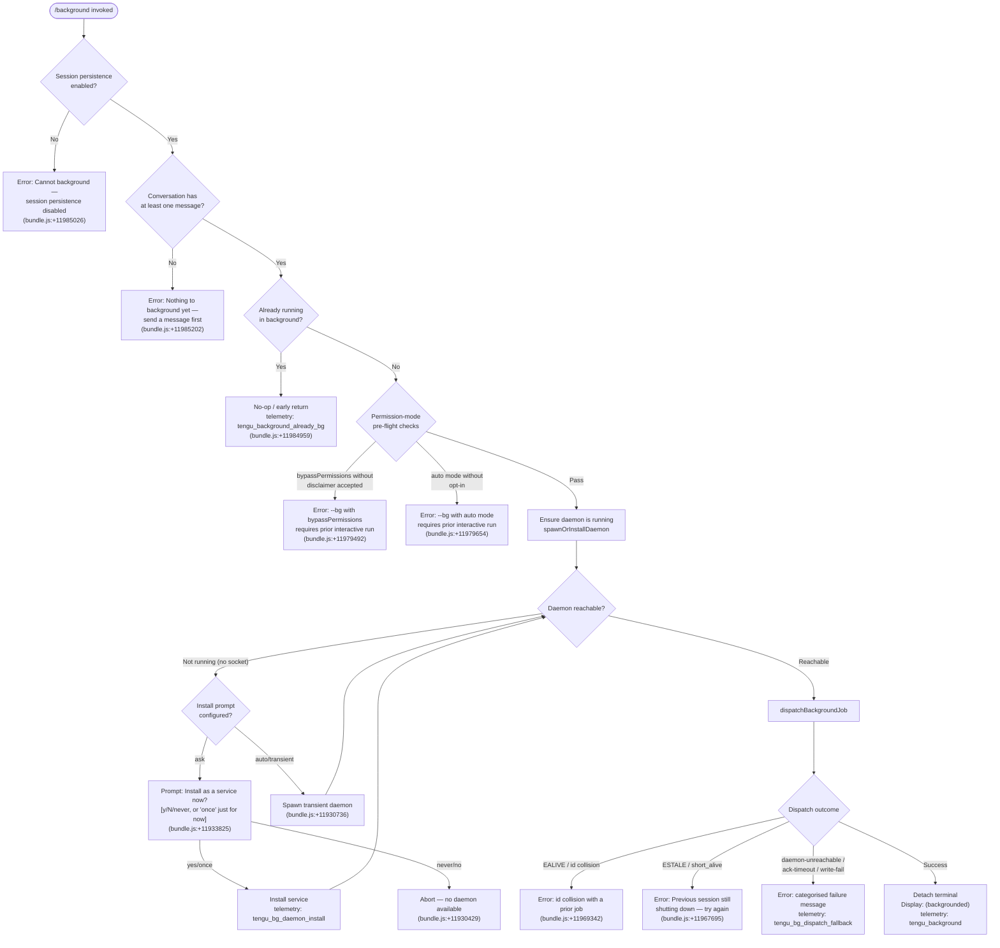

# `/background`

> Analysis basis: CC v2.1.142 bundle.js (AST extraction + Claude interpretation)
> Minimum version: v2.1.142

---

## Overview

`/background` (alias: `/bg`) detaches the current interactive Claude Code session from the terminal and hands it off to a background daemon process, freeing the terminal for other work while the agent continues its task. It serialises the current conversation state, dispatches a job record to the daemon over a Unix-domain control socket, and confirms detachment with a `(backgrounded)` status message. If no daemon is running the command either spawns a transient one or prompts the user to install a persistent service.

---

## Registration

| Field | Value |
|---|---|
| type | `local-jsx` |
| name | `background` |
| description | `Continue this session in the background and free the terminal` |
| aliases | `["bg"]` |
| module_id | `lvq` |
| load_inline | `true` |
| loc_byte | `11985579` |
| loc_byte_end | `11985799` |
| loc_line | `7973` |
| immediate | `null` |
| arbor_handler.name | `Vb7` |
| arbor_handler.fqn | `claude-2.1.142::Vb7` |
| arbor_handler.kind | `AsyncFunction` |
| arbor_handler.resolution_path | `module_id` |
| arbor_handler.n_hits | `0` |

Analysis basis: CC v2.1.142 bundle.js:+11985579

---

## Input Branching

Five distinct execution paths are identified based on pre-flight gate checks followed by daemon dispatch outcomes.



---

## Behavioral Spec

### Handler Entry Point (`Vb7`)

The Arbor-resolved handler `Vb7` is an `AsyncFunction` reached via `module_id` resolution of module `lvq`.

Analysis basis: CC v2.1.142 bundle.js:+11984945 (handler start, `Vb7 → v1`)

```
async function backgroundCommandHandler(context):
    // Pre-flight: persistence guard
    if not sessionPersistenceEnabled(context):
        displayError("Cannot background — session persistence is disabled, so the forked job would have nothing to resume.")
        return

    // Pre-flight: must have at least one message
    messageList = getMessageHistory(context)
    if messageList is empty:
        displayError("Nothing to background yet — send a message first.")
        return

    // Pre-flight: already running in background?
    if isAlreadyBackground(context):
        emit telemetry(tengu_background_already_bg)
        return   // silent no-op

    // Delegate to the core dispatch pipeline
    result = await dispatchToBackground(context)
    if result is error:
        emit telemetry(tengu_background_spawn_failed)
        displayError(result.message)
        return

    emit telemetry(tengu_background)
    renderDetachedUI("(backgrounded)")
```

Analysis basis: CC v2.1.142 bundle.js:+11984957 (`Vb7 → d`), +11984993 (`Vb7 → H`), +11985163 (`Vb7 → UX8`), +11985272 (`Vb7 → iLH.createElement`)

---

### Permission Pre-flight (`permissionGateCheck`, `Gb7`)

Before spawning the daemon the handler validates that the current permission mode is compatible with unattended execution.

```
function permissionGateCheck(argv, settingsSnapshot):
    // Check --dangerously-skip-permissions / bypassPermissions
    if argv includes "--dangerously-skip-permissions"
       or argv includes "--allow-dangerously-skip-permissions"
       or permissionMode == "bypassPermissions":
        if not disclaimerAccepted(settingsSnapshot):
            return Error("--bg with bypassPermissions requires accepting the disclaimer first. Run `claude --dangerously-skip-permissions` once interactively.")

    // Check auto mode
    if permissionMode == "auto":
        if not autoModeOptIn(settingsSnapshot):
            return Error("--bg with auto mode requires opting in first. Run `claude --permission-mode auto` once interactively.")

    return OK
```

Analysis basis: CC v2.1.142 bundle.js:+11979292 (`--permission-mode`), +11979323 (`bypassPermissions`), +11979355 (`--dangerously-skip-permissions`), +11979492 (bypass error string), +11979634 (`auto`), +11979654 (auto error string)

---

### Daemon Lifecycle Management (`spawnOrInstallDaemon`, `sp`, `KG6`)

Ensures a background daemon is reachable before attempting dispatch.

```
async function ensureDaemonRunning(config):
    status = checkDaemonStatus()   // reads daemon.status.json

    if status == "up":
        return OK

    // Check for stale service binary
    if serviceExecPathIsStale():
        emit telemetry(tengu_bg_daemon_service_stale_exec)
        log warning("daemon service exec path is stale — falling back to transient spawn")
        // fall through to transient spawn

    installMode = config.daemonInstallMode   // "ask" | "yes" | "once" | "never" | "no"

    if installMode == "ask":
        emit telemetry(tengu_bg_daemon_cold_start_ask)
        answer = promptUser("Install as a service now? [y/N/never, or 'once' just for now] ")
        emit telemetry(tengu_bg_daemon_cold_start_ask_answer, {answer})
        if answer in ["yes", "y"]:
            installDaemonService()
            emit telemetry(tengu_bg_daemon_install)
            waitForDaemon(timeoutMs=5000)
            return checkReachability()
        elif answer == "once":
            // transient spawn path
        elif answer in ["never", "no"]:
            return Error("No background daemon is running. Run 'claude daemon install' to set it up.")

    if installMode in ["once", transient path]:
        spawnTransientDaemon(args=["run", "--origin", "transient", "--spawned-by", callerPid])
        waitForDaemon(timeoutMs=30000, secondaryMs=60000)
        if not reachable:
            emit telemetry(tengu_bg_daemon_service_poll_fallthrough)
            return Error(daemon_ensure_transient_unreachable)

    return OK
```

Analysis basis: CC v2.1.142 bundle.js:+11929298 (`sp → Date.now`), +11929338 (`daemon_ensure_running`), +11929459 (stale binary warning), +11933825 (install prompt), +11933956 (`yes`), +11933978 (`once`), +11934002 (`never`), +11934356 (5000 ms poll timeout), +11930736 (`run --origin transient`), +11931006 (30 000 ms), +11931028 (60 000 ms)

---

### Job Dispatch (`dispatchBackgroundJob`, `$g_`)

Serialises the job and sends it over the control socket.

```
async function dispatchBackgroundJob(session, argv):
    jobId = generateJobId(randomBytes)        // xvq.randomBytes
    socketPath = buildSocketPath(LNH)         // u$.join path
    dispatchFilePath = buildDispatchFilePath() // uvq.join

    // Write dispatch file (mode 0o600 = 384, 0o700 = 448)
    writeDispatchFile(dispatchFilePath, jobRecord, mode=384)

    // Connect to daemon control socket
    socket = connectToDaemon(socketPath, T3)  // Mw8.connect
    if not connected:
        emit telemetry(tengu_bg_dispatch_fallback, {reason: "daemon-unreachable"})
        return categorisedError("not running")

    // Send dispatch message, await ack
    sendMessage(socket, {type: "cli-bg-dispatch", jobId, dispatchFile: dispatchFilePath})
    ack = awaitAck(socket, timeoutMs=6000)

    if ack == timeout:
        emit telemetry(tengu_bg_dispatch_fallback, {reason: "ack-timeout"})
        unlinkDispatchFile(dispatchFilePath)
        return Error("timed out")

    if ack.code == "EALIVE":
        return Error("id collision with a prior job")

    if ack.code == "ESTALE":
        // Check for short_alive vs stale_short sub-states
        if subState == "short_alive":
            return Error("Previous session is still shutting down — try again in a moment")
        if subState == "stale_short":
            emit telemetry(tengu_bg_dispatch_rescued)
            // continue — daemon recovered

    emit telemetry(tengu_bg_dispatch, {jobId, ...metrics})

    // Clean up dispatch file after successful ack
    unlinkDispatchFile(dispatchFilePath)
    return OK
```

Analysis basis: CC v2.1.142 bundle.js:+11959641 (`$g_ → Date.now`), +11959861 (`cli-bg-dispatch`), +11959957 (`xvq.randomBytes`), +11960031 (T3 connect), +11960102 (6000 ms ack timeout), +11960183 (`code`), +11960204 (`EALIVE`), +11960334 (`ESTALE`), +11960584 (mode 384), +11960661 (mode 448), +11960757 (`await-ack`), +11960853 (`ESTARTING`), +11961059 (`uX8.unlink`), +11961483 (recursive call — respawn), +11961671 (`tengu_bg_dispatch`)

---

### Daemon Control Socket Protocol (`connectSocket`, `T3`)

Low-level framed connection to the daemon.

```
function connectSocket(socketPath, timeoutMs):
    socket = net.createConnection(socketPath)   // Mw8.connect
    if connection fails with ENOCONN:
        return Error("ENOCONN")

    socket.setTimeout(timeoutMs)
    on timeout: socket.destroy(); return Error("ETIMEOUT / control socket timeout")
    on data:    parseFramedMessages(socket, O.indexOf / O.slice)
    on error:   if "connection dropped mid-request": return retriableError
    on close:   cleanup
    socket.unref()   // do not prevent process exit
    return socket
```

Analysis basis: CC v2.1.142 bundle.js:+10529463 (`T3 → Mw8.connect`), +10529508 (`ENOCONN`), +10529632 (`A.setTimeout`), +10529665 (`ETIMEOUT`), +10529682 (`control socket timeout`), +10530063 (drop mid-request message), +10529789 (`A.write`), +10529896 (`O.indexOf`)

---

### Argument Forwarding to Background Job (`buildArgVector`, `Ob7`)

Constructs the argument list passed to the background agent process.

```
function buildArgVector(currentArgv, sessionState):
    args = []

    // Strip delimiter
    rest = currentArgv after "--"

    // Permission-mode forwarding
    if argv includes "--permission-mode":
        append "--permission-mode" + value
    elif bypassPermissions:
        append "--dangerously-skip-permissions"

    // Agent sub-command
    args += ["--agent"]

    // Name / resume flags
    if argv includes "--name" or "-n":
        append "--name" + value
    if argv includes "--resume=" or "-r=":
        append "--resume=" + extractedId   // strip prefix length 9 or 3
    elif argv includes "--resume" or "-r":
        append "--resume" + nextToken

    // Fork / session flags
    if argv includes "--fork-session":
        append "--fork-session"
    if argv includes "--session-id=" or "--session-id":
        append "--session-id=" + id

    // Continue flag
    if argv includes "-c" or "--continue":
        append "--continue"

    // Model / effort
    if argv includes "--model":
        append "--model" + value
    if argv includes "--effort":
        append "--effort" + value
    else:
        append "--effort default"

    // Mode annotation
    append "continue"

    // Environment variable pass-through (cloud provider credentials)
    for var in [CLAUDE_CONFIG_DIR, CLAUDE_INTERNAL_FC_OVERRIDES,
                AWS_REGION, AWS_DEFAULT_REGION, AWS_PROFILE,
                GOOGLE_APPLICATION_CREDENTIALS, GOOGLE_CLOUD_PROJECT, GCLOUD_PROJECT]:
        if var is set in environment:
            propagate to job env

    return args
```

Analysis basis: CC v2.1.142 bundle.js:+11979258 (`--`), +11979292 (`--permission-mode`), +11979355 (`--dangerously-skip-permissions`), +11964221 (`--agent`), +11964249 (`--name`), +11978475 (`--resume=`), +11978570 (`--resume`), +11964451 (`--fork-session`), +11978829 (`--session-id=`), +11964340 (`--continue`), +11981949 (`--model`), +11981971 (`--effort`), +11981995 (`default`), +11982056 (`continue`), +11980270–+11980425 (env-var list)

---

### Dispatch Error Classification (`classifyDispatchError`, `fg_`)

Maps raw error codes to user-facing messages.

```
function classifyDispatchError(errorCode, subState):
    switch errorCode:
        case "daemon-unreachable":  return "not running"
        case "ack-timeout":         return "timed out"
        case "dispatch-write":      return "couldn't write dispatch file"
        case "enoconn":             return "socket missing"
        case "estarting":           return "service still starting"
        case "EALIVE":              return "id collision with a prior job"
        case "short_alive":         return "Previous session is still shutting down — try again in a moment"
        case "stale_short":         return rescued (tengu_bg_dispatch_rescued)
        default:                    return generic daemon_unavailable message
```

Analysis basis: CC v2.1.142 bundle.js:+11962266 (`daemon-unreachable`), +11962310 (`ack-timeout`), +11962341 (`dispatch-write`), +11962377 (`enoconn`), +11962408 (`estarting`), +11969126 (`not running`), +11969164 (`timed out`), +11969203 (`couldn't write dispatch file`), +11969254 (`socket missing`), +11969293 (`service still starting`), +11969342 (`id collision`), +11967695 (shutting down), +11967910 (`daemon_unavailable`)

---

### Session State Serialisation (`serialiseJobRecord`, `C6H`)

Prepares the job record written to the dispatch file.

```
function serialiseJobRecord(session, opts):
    jobId = crypto.randomUUID().slice(0, 8)   // 8-char prefix
    statusFile = buildStatusPath("daemon.status.json")  // h06 path join
    jobDir = buildJobDir(IK → NP.join, "jobs")
    fs.mkdir(jobDir, {recursive: true})

    record = {
        id: jobId,
        sessionId: session.id,
        argv: buildArgVector(session.argv, session.state),
        worktree: session.cwd,
        source: detectJobSource(argv),  // "repl"|"slash"|"resume"|"prompt"|"worktree"|"built-in"|"none"
        mode: currentMode,              // "bg"|"user"|"idle"|"blocked"
        createdAt: Date.now(),
        ...sessionMetadata
    }

    writeJson(gateFilePath, record)
    return { jobId, jobDir, statusFile }
```

Analysis basis: CC v2.1.142 bundle.js:+11963692 (`C6H → Gb7`), +11963757 (`pvq.randomUUID`), +11963789 (slice length 8), +11963794 (`IK` job dir), +11963817 (`x6H.mkdir`), +11963851 (`Ob7` arg build), +11963960 (`x6H.rm`), +11670648 (`daemon.status.json`), +4009930 (`jobs`), +11965896–+11966252 (source/mode literals), +11965874 (`Date.now`)

---

### UI Render after Detach (`renderBackgroundedUI`, `UX8`)

```
function renderBackgroundedUI(jobId, context):
    // Render JSX component via iLH.createElement
    // Displays:  (backgrounded)
    // Stops active spinners / progress indicators (T.stop, Z.stop)
    // Updates terminal title / status line
    // Emits "background session" stopped state to supervisor
    displayStatusLine("(backgrounded)")
    stopAllActiveSpinners()
    updateAppState({mode: "stopped", label: "background session"})
```

Analysis basis: CC v2.1.142 bundle.js:+11983028 (`(backgrounded)`), +11982798 (`O.replace`), +11982872 (`aY8`), +11982886 (`Zb`), +11982906 (`erH`), +11985272 (`iLH.createElement`), +14497498 (`stopped`), +14497541 (`background session`)

---

## State & Side Effects

| Item | Detail |
|---|---|
| Telemetry: `tengu_background` | Fired on successful detach (bundle.js:+11982377) |
| Telemetry: `tengu_background_already_bg` | Fired when session is already backgrounded (bundle.js:+11984959) |
| Telemetry: `tengu_background_spawn_failed` | Fired when daemon spawn/dispatch fails (bundle.js:+11982308) |
| Telemetry: `tengu_bg_dispatch` | Fired after daemon acknowledges job (bundle.js:+11961671) |
| Telemetry: `tengu_bg_dispatch_fallback` | Fired on categorised dispatch failure (bundle.js:+11962197) |
| Telemetry: `tengu_bg_dispatch_rescued` | Fired when `stale_short` state is recovered (bundle.js:+11966786) |
| Telemetry: `tengu_bg_daemon_cold_start_ask` | Fired when user is prompted to install service (bundle.js:+11930364) |
| Telemetry: `tengu_bg_daemon_cold_start_ask_answer` | Records user answer to install prompt (bundle.js:+11933900) |
| Telemetry: `tengu_bg_daemon_install` | Fired after service installed (bundle.js:+11929799) |
| Telemetry: `tengu_bg_daemon_spawn_failed` | Fired when transient daemon spawn fails (bundle.js:+11930798) |
| Telemetry: `tengu_bg_daemon_service_stale_exec` | Fired when service binary is deleted/stale (bundle.js:+11929416) |
| Telemetry: `tengu_bg_daemon_service_poll_fallthrough` | Fired when daemon poll loop exhausted (bundle.js:+11930040) |
| Telemetry: `tengu_config_parse_error` | Config parsing failure during setup (bundle.js:+3155139) |
| Telemetry: `tengu_config_lock_contention` | Config lock held longer than expected (bundle.js:+3152558) |
| Telemetry: `tengu_config_stale_write` | Config write skipped to avoid data loss (bundle.js:+3152694) |
| Telemetry: `tengu_config_auth_loss_prevented` | Auth data loss prevention triggered (bundle.js:+3153037) |
| Telemetry: `tengu_amber_anchor` | Background service lifecycle event (bundle.js:+3146190) |
| Filesystem: dispatch file | Written to jobs directory (mode 0o600), unlinked after ack |
| Filesystem: status file | `daemon.status.json` read for daemon liveness (bundle.js:+11670648) |
| Filesystem: job directory | Created via `mkdir({recursive:true})` under Claude config dir |
| Socket: daemon control socket | Connected via `net.createConnection`; socket is `unref()`-ed |
| appState changes | Mode set to `stopped` / `background session` after detach |
| Terminal | Active spinners and progress indicators stopped; title updated |
| AbortSignal | `AbortSignal.timeout` created for dispatch operation (bundle.js:+11982503) |
| Timeout constants | Ack wait: 6 000 ms (bundle.js:+11960102); service install poll: 5 000 ms (bundle.js:+11934356); transient spawn: 30 000 ms / 60 000 ms (bundle.js:+11931006, +11931028) |

---

## Version History

| Version | Change |
|---|---|
| v2.1.142 | Initial analysis |

---

## Common Mistakes

1. **Invoking `/background` before sending any message.** The command requires at least one user message in the conversation; running it on a fresh session produces "Nothing to background yet — send a message first."
2. **Using `/background` with `--dangerously-skip-permissions` without prior consent.** The bypass-permissions disclaimer must be accepted interactively at least once (`claude --dangerously-skip-permissions`) before the background path will allow it.
3. **Using `/background` in auto-permission mode without opt-in.** `--permission-mode auto` must be run interactively first; otherwise the pre-flight gate rejects the dispatch.
4. **Retrying immediately after a `stale_short` / shutting-down error.** The previous background session is still in its shutdown phase; waiting a few seconds before retrying resolves this.
5. **Expecting `/background` to work when session persistence is disabled.** If the session is configured without persistence the command exits immediately because there is nothing to resume.
6. **Confusing `/background` with a daemon-status query.** The command dispatches a job and exits; use `claude daemon status` to inspect what is running.

---

## Appendix — Identifier Mapping

> For bundle debugging only. Identifiers change across versions.

| Identifier | Role |
|---|---|
| `Vb7` | Main background command handler (AsyncFunction, Arbor-resolved) |
| `pX8` | Core background dispatch orchestrator |
| `C6H` | Session-state serialiser / job-record builder |
| `Gb7` | Argument vector / permission pre-flight builder |
| `Ob7` | Full argument construction for background agent invocation |
| `$g_` | Dispatch-file writer and daemon socket dispatcher |
| `sp` | Daemon ensure-running / liveness check function |
| `KG6` | Daemon service install prompt handler |
| `fg_` | Dispatch error classifier (maps error codes to user messages) |
| `T3` | Low-level daemon control socket connect/framing |
| `$w8` | Control socket client (connect + event handling) |
| `LNH` | Socket path builder |
| `bvq` | Dispatch timing / metrics collector |
| `a8` | Subprocess spawn wrapper with abort/timeout support |
| `SU` | Dispatch rescue logic (stale-short recovery) |
| `UX8` | Post-detach UI renderer |
| `ALH` | Daemon-worker task dispatcher (detach-request) |
| `YJH` | Environment / mode configurator for background job |
| `KLH` | File-system session state persistence (save before hand-off) |
| `_aH` | Pre-flight message preparation for background agent |
| `s$H` | REPL-state snapshot / config bundle for new process |
| `xw` | Background service status reporter |
| `QMH` | Service status string builder |
| `rmH` | Service status renderer (UI component) |
| `Y9H` | Status display formatter |
| `IK` | Job directory path resolver |
| `S0` | Base jobs directory path builder |
| `h06` | Daemon status file path builder |
| `zEq` | Daemon status JSON writer |
| `C9` | Reactive state / subscription manager |
| `Xg_` | State dispatch / update helper |
| `qL` | Selector / derived-state accessor |
| `V8` | Settings reader (userSettings / localSettings / flagSettings / policySettings) |
| `XR` | Settings context accessor (auto-mode opt-in check) |
| `sx` | Settings object builder |
| `y6` | Config file read/write with lock |
| `cMH` | Low-level config file parser (readFileSync + JSON) |
| `XhL` | File-watcher for config live-reload |
| `b6H` | Message-history slice helper |
| `Mb7` | Seen-message set |
| `gvq` | `--resume` flag parser |
| `Eb7` | Flag membership checker (jg_ set) |
| `Xb7` | Session-id flag parser |
| `Qvq` | Combined flag checker (resume + session-id + Tb7 set) |
| `Wb7` | Argument tail-push helper |
| `Zb7` | Additional argv builder |
| `Rvq` | Argument array mapper |
| `H1H` | File state label builder (`working` / `active` / `daemon`) |
| `H5` | Path redaction / REDACTED placeholder helper |
| `gf` | Config file atomic writer (randomBytes temp + rename) |
| `sO` | Atomic-write primitives (writeFile / rename / copyFile / unlink) |
| `a2` | Cache-map delete helper |
| `o1` | Job metadata reader (stat + readFile + JSON cache) |
| `$8` | Generic error formatter |
| `b6` | JSON.parse wrapper |
| `RH` | JSON.stringify wrapper |
| `GH` | String coercion utility |
| `v` | Log-level / debug emit utility |
| `d` | Generic error/result handler |
| `h6` | Async-local-storage context accessor |
| `VS6` | Store getter with fallback (`ZS6.getStore`) |
| `__` | Logger / journal writer (`JV` based) |
| `JV` | Base log emitter |
| `k_` | Error message extractor (Error / String coercion) |
| `NH` | Error-queue / retry logger |
| `$q` | No-telemetry / essential-traffic network filter |
| `NMA` | Network filter predicate |
| `JvK` | Ring-buffer push/shift for error log |
| `lN` | Agent query / run-loop entry point |
| `rq` | Agent config builder |
| `HY8` | Conversation serialiser (file + hash) |
| `bK7` | Message content mapper |
| `CHq` | Content chunker |
| `c0` | Full agent query executor |
| `bNH` | Agent response processor |
| `Sh_` | Streaming response handler |
| `Yhq` | Core streaming query loop |
| `Y8` | Session initialiser |
| `j` | Subprocess manager |
| `J` | Process kill helper |
| `JP` | API client factory |
| `VA` | HTTP client wrapper |
| `UM` | HTTP utility |
| `h1` | Auth / credential provider |
| `VxH` | Auth token resolver |
| `I0` | Final response extractor |
| `j3` | Compact boundary finder |
| `nf7` | Compact marker helper |
| `uP` | Compact boundary constant |
| `V6` | REPL-state context accessor |
| `R0` | Basename + REPL accessor |
| `_aH` | Outbound message builder for background agent |
| `IJ8` | Message serialiser (array/string join) |
| `$K` | Message filter (human-origin) |
| `M1` | Model string accessor |
| `erH` | Input text prefix checker |
| `Bh` | Array-check utility |
| `O` | Output string manipulator (`S8` backed) |
| `S8` | Output state object |
| `aY8` | Some-predicate helper |
| `Zb` | TQ-backed predicate |
| `TQ` | Array filter with $K |
| `c3` | REPL-context + state accessor (V6 + qL) |
| `bp` | Alternative REPL-context accessor |
| `v1` | Daemon-worker message bus |
| `mB` | Worker message emitter |
| `ALH` | Detach-request dispatcher (`detach-request` literal) |
| `_F6` | Task type resolver |
| `Tqq` | Task wrapper (ZDH + S8) |
| `ZDH` | Task descriptor builder |
| `Ui` | Daemon pipe writer (pi.write + RH) |
| `$6H` | Daemon channel multiplexer |
| `sNq` | Environment mode string builder |
| `rS` | Test/production mode flag |
| `JO6` | Job-origin classifier |
| `rgH` | REPL-mode flag accessor |
| `oA_` | Global config save-with-lock |
| `t6` | Session config writer |
| `amH` | Config mutation helper |
| `CE9` | Object.entries config iterator |
| `smH` | Config timestamp recorder |
| `rA_` | Config atomic write (TA6 backed) |
| `TA6` | Atomic file write with fchmod/fsync |
| `aA_` | Backup path builder |
| `qeA` | Config serialiser (ei8 + Object.assign) |
| `h76` | Config validation helper |
| `X` | MCP SDK client |
| `xw` | Background-service status formatter |