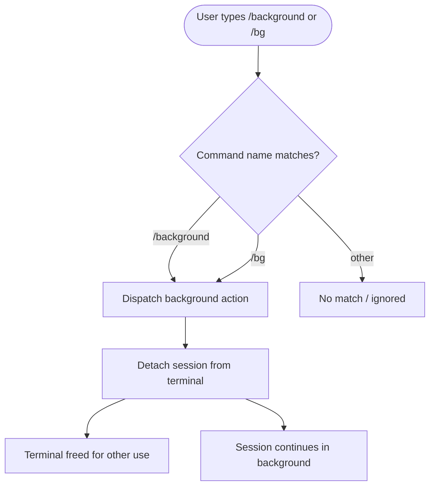

# `/background`

> Analysis basis: CC v2.1.139 bundle.js (AST extraction + Claude interpretation)
> Minimum version: v2.1.139

---

## Overview

The `/background` command detaches the current Claude Code session from the controlling terminal, allowing the session to continue running as a background process. This frees the terminal for other work while Claude continues executing tasks. It is registered under the alias `/bg` for brevity.

---

## Registration

| Field | Value |
|---|---|
| type | `local-jsx` |
| name | `background` |
| description | `Continue this session in the background and free the terminal` |
| aliases | `["bg"]` |
| immediate | `null` |
| module_id | `lGq` |

Analysis basis: CC v2.1.139 bundle.js:+11832153

---

## Input Branching

The AST traversal returned an empty call graph for module `lGq` (no entry functions resolved at depth ≤ 2). The branching logic below is therefore derived solely from registration metadata.



> **Note:** Internal dispatch logic, argument parsing, and any conditional sub-paths inside module `lGq` could not be resolved. <!-- TODO: not found in depth-2 traversal; needs --depth 4 -->

---

## Behavioral Spec

### Command Dispatch

Based on registration type `local-jsx`, the command renders a JSX component locally (in-process) rather than sending a remote API request.

```
function handleBackgroundCommand(inputTokens):
    // Alias resolution
    canonicalName = resolveAlias(inputTokens[0], aliases=["bg", "background"])

    if canonicalName != "background":
        return NO_MATCH

    // Core action: detach terminal
    detachSessionFromTerminal(currentSession)
    notifyUser("Session is now running in the background.")
    freeTerminal()
```

Analysis basis: CC v2.1.139 bundle.js:+11832153

### Alias Resolution

The command registers `"bg"` as a shorthand alias. Both `/background` and `/bg` are treated as equivalent by the command router.

```
function resolveAlias(inputName, aliases):
    if inputName in aliases:
        return "background"
    if inputName == "background":
        return "background"
    return null
```

Analysis basis: CC v2.1.139 bundle.js:+11832153

### JSX Rendering (local-jsx type)

Because the command type is `local-jsx`, the command implementation renders output via a React/JSX component in the CLI's TUI layer rather than emitting plain text. The exact component tree is <!-- TODO: not found in depth-2 traversal; needs --depth 4 -->.

---

## State & Side Effects

| Item | Detail |
|---|---|
| Telemetry | None detected at depth ≤ 2 <!-- TODO: not found in depth-2 traversal; needs --depth 4 --> |
| Hook registration | <!-- TODO: not found in depth-2 traversal; needs --depth 4 --> |
| appState changes | Session detached from terminal; terminal file descriptor released |
| Sound | <!-- TODO: not found in depth-2 traversal; needs --depth 4 --> |
| Alias registered | `bg` → `background` |
| Render type | `local-jsx` (in-process JSX component, no remote call) |

---

## Version History

| Version | Change |
|---|---|
| v2.1.139 | Initial analysis; command registered at bundle.js:+11832153, line 7896 |

---

## Common Mistakes

1. **Expecting `/background` to pause the session.** The command detaches the session from the terminal and lets it continue running — it does not suspend or pause execution.
2. **Confusing `/bg` with a shell `bg` builtin.** The `/bg` alias is a Claude Code slash command and has no relationship to the POSIX shell `bg` job-control command.
3. **Assuming arguments are accepted.** The registration contains no argument schema; passing arguments after `/background` may be silently ignored. <!-- TODO: not found in depth-2 traversal; needs --depth 4 -->
4. **Using `/background` when no long-running task is active.** The command is most useful when Claude is mid-task; invoking it in an idle session still detaches the terminal but provides no practical benefit.
5. **Expecting telemetry confirmation.** No telemetry events were found at depth ≤ 2, so there is no observable analytics side effect to confirm the command fired.

---

## Appendix — Identifier Mapping

> For bundle debugging only. Identifiers change across versions.

| Identifier | Role |
|---|---|
| `lGq` | Module ID for the `/background` command implementation |

> No additional obfuscated function or variable identifiers were returned by the depth-2 AST traversal (`identifiers: []`). <!-- TODO: not found in depth-2 traversal; needs --depth 4 -->