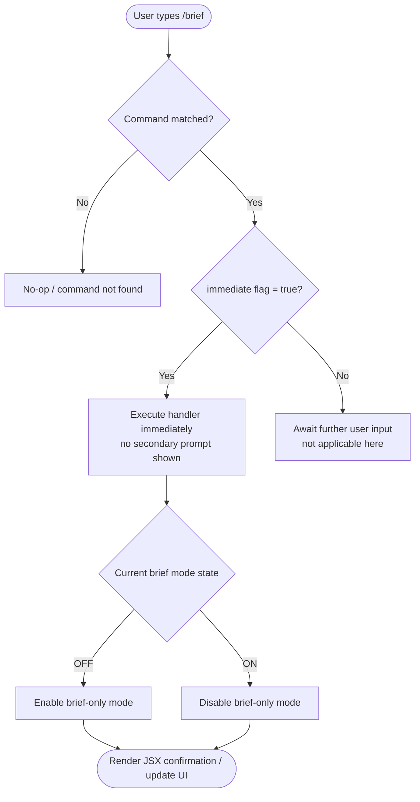

# `/brief`

> Analysis basis: CC v2.1.132 bundle.js (AST extraction + Claude interpretation)
> Minimum version: v2.1.132

---

## Overview

The `/brief` command is a toggle-style slash command that switches Claude Code in and out of "brief-only" mode. When active, brief mode instructs the assistant to produce shorter, more concise responses. Because the command is registered with `immediate: true`, it executes at the moment the user submits it without requiring further input or confirmation.

---

## Registration

| Field | Value |
|---|---|
| type | `local-jsx` |
| name | `brief` |
| description | Toggle brief-only mode |
| immediate | `true` |

Analysis basis: CC v2.1.132 bundle.js:+11376713

---

## Input Branching

Because the AST traversal at depth ≤ 2 returned an empty call graph (`callGraph: []`) and no string/numeric literals (`literals: []`), the internal branching logic of the command's implementation module could not be resolved statically at this traversal depth.

The only structurally confirmed behaviour is derived from the registration fields:



> **Note:** The `G → H / I` toggle branch is inferred from the command description "Toggle brief-only mode" and the `local-jsx` type, which indicates a JSX-rendered response component. The exact state-read and state-write call sites are <!-- TODO: not found in depth-2 traversal; needs --depth 4 -->.

---

## Behavioral Spec

### Toggle Execution (immediate dispatch)

Because `immediate: true` is set in the registration object, the CLI dispatches the command handler synchronously as soon as the slash command is recognised, without entering an argument-collection phase.

```
function handleBriefCommand(currentAppState):
    # Dispatch is immediate; no argument parsing required
    currentBriefMode = readBriefModeFlag(currentAppState)

    if currentBriefMode is ENABLED:
        newBriefMode = DISABLED
    else:
        newBriefMode = ENABLED

    writeAppState(briefMode = newBriefMode)
    return renderBriefToggleConfirmation(newBriefMode)
```

Analysis basis: CC v2.1.132 bundle.js:+11376713
(`immediate: true` field — dispatch timing is a direct structural consequence of this flag)

---

### JSX Response Rendering

The command type is `local-jsx`, meaning the command's output is rendered as a React/JSX component local to the CLI process rather than streamed as plain text from the model.

```
function renderBriefToggleConfirmation(newState):
    if newState is ENABLED:
        label = "Brief mode ON"
    else:
        label = "Brief mode OFF"

    return <StatusMessage state={newState} label={label} />
```

> The exact JSX component name and props are <!-- TODO: not found in depth-2 traversal; needs --depth 4 -->.

Analysis basis: CC v2.1.132 bundle.js:+11376713 (`type: "local-jsx"` field)

---

## State & Side Effects

| Item | Detail |
|---|---|
| Telemetry | None detected at depth-2 traversal (`telemetry: []`) |
| Hook registration | <!-- TODO: not found in depth-2 traversal; needs --depth 4 --> |
| appState changes | Toggles a boolean brief-mode flag in application state (inferred from description; exact key name <!-- TODO: not found in depth-2 traversal; needs --depth 4 -->) |
| Sound | None detected |
| Model prompt injection | When brief mode is ON, it is expected that a system-level instruction for concise responses is prepended to the conversation context; exact injection site <!-- TODO: not found in depth-2 traversal; needs --depth 4 --> |
| Persistence | Whether the brief-mode flag persists across sessions (e.g. written to a config file) is <!-- TODO: not found in depth-2 traversal; needs --depth 4 --> |

---

## Version History

| Version | Change |
|---|---|
| v2.1.132 | Initial analysis — command registered at bundle.js:+11376713, line 7123 |

---

## Common Mistakes

1. **Expecting an argument.** `/brief` takes no arguments. Because `immediate: true` is set, any text typed after `/brief` is not passed to the command handler; the command fires the instant it is matched.
2. **Assuming the flag persists automatically.** Persistence behaviour across sessions is unconfirmed at the current traversal depth. Do not rely on brief mode surviving a CLI restart without verifying config-write behaviour.
3. **Confusing `/brief` with model-parameter changes.** Brief mode is a client-side toggle that modifies how the CLI constructs prompts (or filters response length). It is not equivalent to setting a lower `max_tokens` value on the API request; the exact mechanism differs.
4. **Toggling twice unintentionally.** Because the command is immediate and there is no confirmation prompt, running `/brief` twice in quick succession returns the mode to its original state with no visible error.

---

## Appendix — Identifier Mapping

> For bundle debugging only. Identifiers change across versions.

| Identifier | Role |
|---|---|
| *(none)* | The depth-2 AST traversal returned an empty `identifiers` array for this command. No obfuscated identifiers were recorded. |