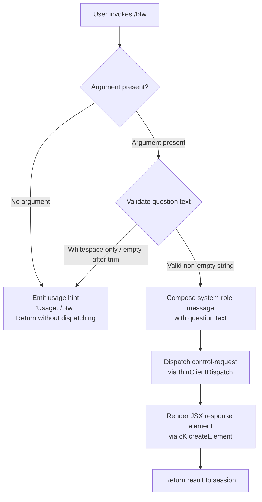

# `/btw`

> Analysis basis: CC v2.1.142 bundle.js (AST extraction + Claude interpretation)
> Minimum version: v2.1.142

---

## Overview

The `/btw` ("by the way") command allows users to inject a quick side question or contextual remark into the current Claude Code session without derailing the main conversation thread. It is a `local-jsx` command that dispatches a `control-request` immediately upon invocation, routing the user's question as a system-level message to the agent. The command is designed for low-friction, non-blocking asynchronous clarification within an ongoing task.

---

## Registration

| Field | Value |
|---|---|
| type | `local-jsx` |
| name | `btw` |
| description | Ask a quick side question without interrupting the main conversation |
| argumentHint | `<question>` |
| immediate | `true` |
| thinClientDispatch | `control-request` |
| module_id | `$1q` |
| load_inline | `true` |
| loc_byte | `10027423` |
| loc_byte_end | `10027662` |
| loc_line | `5573` |
| arbor_handler.name | `v$7` |
| arbor_handler.fqn | `claude-2.1.142::v$7` |
| arbor_handler.kind | `AsyncFunction` |
| arbor_handler.resolution_path | `module_id` |
| arbor_handler.n_hits | `0` |

Analysis basis: CC v2.1.142 bundle.js:+10027423

---

## Input Branching

The command has 3 distinct input branches based on the presence and validity of the user's `<question>` argument, warranting a Mermaid flowchart.



Analysis basis: CC v2.1.142 bundle.js:+10027019, +10027021, +10027060, +10027129

---

## Behavioral Spec

### Main Handler — Async Question Dispatcher

The Arbor-resolved handler (`v$7`) is an `AsyncFunction` reached via `module_id` → `$1q`. It is the sole entry point for `/btw` invocations.

```
async function btwCommandHandler(commandInput, sessionContext):

    # Step 1: Guard — require a non-empty argument
    if commandInput.argument is absent or commandInput.argument.trim() == "":
        return renderUsageHint("Usage: /btw <your question>")
        # Analysis basis: CC v2.1.142 bundle.js:+10027021

    questionText = commandInput.argument.trim()

    # Step 2: Build a system-role message envelope
    message = {
        role: "system",                  # +10027060
        content: questionText
    }

    # Step 3: Dispatch as a control-request (thin-client path)
    # thinClientDispatch = "control-request" means the message bypasses
    # the normal user-turn queue and is injected as a control signal.
    dispatchResult = await dispatchControlRequest(message, sessionContext)
    # Analysis basis: CC v2.1.142 bundle.js:+10027083

    # Step 4: Render JSX output element for the CLI UI
    element = createReactElement(dispatchResult)
    # Analysis basis: CC v2.1.142 bundle.js:+10027129

    return element
```

Analysis basis: CC v2.1.142 bundle.js:+10027019

---

### Usage Hint Renderer

When no valid argument is supplied, a usage hint is rendered in the terminal. The exact hint string is `"Usage: /btw <your question>"`.

```
function renderUsageHint(hintText):
    element = createReactElement({ type: "hint", text: hintText })
    return element
```

Analysis basis: CC v2.1.142 bundle.js:+10027021

---

### Control-Request Dispatch (`t6`)

The handler delegates to a dispatch function (resolved as `t6`) which wraps the message and forwards it through the session's control channel. At depth-2, `t6` calls into:

- `configReadWithLock` — reads current session/config state before dispatch (`oA_`, `cMH`)
- `timestampedMessage` — attaches `Date.now()` metadata (`smH`)
- `configEntryMapper` — serializes config entries for transport (`CE9`)
- `atomicFileWriter` — ensures any side-effect writes are atomic (`rA_`)

```
async function dispatchControlRequest(message, sessionContext):
    config = await readConfigWithLock(sessionContext)
    # Analysis basis: CC v2.1.142 bundle.js:+3149564

    enrichedMessage = attachTimestamp(message)
    # Analysis basis: CC v2.1.142 bundle.js:+3149660

    serialized = mapConfigEntries(enrichedMessage, config)
    # Analysis basis: CC v2.1.142 bundle.js:+3149635

    result = await sendOnControlChannel(serialized)
    return result
```

Analysis basis: CC v2.1.142 bundle.js:+10027083

---

### Randomized Jitter Helper (`H`)

A utility called directly from `v$7` introduces a small random delay, likely for deduplication or back-off when the control channel is busy.

```
function applyJitter():
    base   = Math.random() * 2    # [0, 2)  — Analysis basis: +12592943, +12592945
    offset = 1                    # fixed +1 — Analysis basis: +12592959
    delay  = base + offset        # range [1, 3)
    setTimeout(callback, delay)
    # Analysis basis: CC v2.1.142 bundle.js:+12592982
```

Analysis basis: CC v2.1.142 bundle.js:+10027019, +12592945

---

### Config Lock & Persistence Layer (`oA_` / `cMH`)

Multiple call-graph paths from `t6` reach the config persistence subsystem. Relevant behaviors surfaced at depth-2:

| Behavior | Detail | Basis |
|---|---|---|
| Lock contention warning | Emits `tengu_config_lock_contention` if lock acquisition stalls | +3152558 |
| Stale-write guard | Emits `tengu_config_stale_write` and refuses write if re-read config is missing auth that the cache holds | +3152694 / +3152885 |
| Auth-loss prevention | Emits `tengu_config_auth_loss_prevented`; see GH #3117 note | +3153037 |
| Parse error | Emits `tengu_config_parse_error` on malformed JSON | +3155139 |
| ENOENT tolerance | Missing config file treated as empty/new config | +3152824 |
| Backup retention | Up to 5 rolling backups kept under a `backups/` subdirectory | +3153488 / +3154070 |
| Config access guard | Throws `"Config accessed before allowed."` if accessed too early | +3154502 |
| Encoding | Config files read/written as `utf-8` | +3154585 |
| Lock timeout | Lock acquisition timeout threshold triggers a warning after an expected window; another Claude instance may be running | +3152469 |

```
async function readConfigWithLock(lockPath):
    acquire file-system lock on lockPath
    if lock takes too long:
        emit telemetry("tengu_config_lock_contention")
        warn("Lock acquisition took longer than expected…")

    try:
        rawJson = fs.readFileSync(configPath, "utf-8")
        config  = JSON.parse(rawJson)
    catch ENOENT:
        config = {}   # treat missing file as fresh config
    catch parseError:
        emit telemetry("tengu_config_parse_error")
        throw

    # Auth-loss guard (GH #3117)
    if cachedConfig.hasAuth and not config.hasAuth:
        emit telemetry("tengu_config_auth_loss_prevented")
        refuse write

    return config
```

Analysis basis: CC v2.1.142 bundle.js:+3152258, +3152824, +3154502, +3153037

---

### Atomic File Writer (`TA6`)

Config writes go through an atomic rename pattern with permissions preservation:

```
function atomicWrite(targetPath, data, originalMode):
    tmpPath = targetPath + "." + randomBytes(6).toString("hex")
    # Analysis basis: CC v2.1.142 bundle.js:+1000200, +1000228

    fd = fs.openSync(tmpPath, flags)
    fs.writeFileSync(fd, data)
    if originalMode is available:
        fs.fchmodSync(fd, originalMode)
        # log "Applied original permissions to temp file"
    fs.fsyncSync(fd)
    fs.closeSync(fd)
    fs.renameSync(tmpPath, targetPath)   # atomic on POSIX
    # Analysis basis: CC v2.1.142 bundle.js:+1000888
```

Analysis basis: CC v2.1.142 bundle.js:+999488, +1000636

---

## State & Side Effects

| Item | Detail |
|---|---|
| Telemetry — `tengu_config_lock_contention` | Fired when file-system lock acquisition stalls beyond expected threshold (bundle.js:+3152558) |
| Telemetry — `tengu_config_stale_write` | Fired when a stale config write is detected and suppressed (bundle.js:+3152694) |
| Telemetry — `tengu_config_parse_error` | Fired when config JSON is malformed (bundle.js:+3155139) |
| Telemetry — `tengu_config_auth_loss_prevented` | Fired when a write that would erase auth credentials is blocked (bundle.js:+3153037) |
| Telemetry — `tengu_bg_dispatch_sigkill_escalate` | Fired when a background session process must be force-killed (bundle.js:+14462646) |
| Telemetry — `tengu_bg_dispatch_low_mem` | Fired when free memory falls below threshold during background dispatch (bundle.js:+14463225) |
| Telemetry — `tengu_bg_spare_enable` | Fired when a spare background session slot is enabled (bundle.js:+14463840) |
| Telemetry — `tengu_bg_spare_claim` | Fired when a spare session is successfully claimed (bundle.js:+14463961) |
| Telemetry — `tengu_bg_spare_claim_fail` | Fired when spare session claim fails (bundle.js:+14464224) |
| thinClientDispatch | Sends a `control-request` message; bypasses normal user-turn queue |
| message role | Message injected with role `"system"` (bundle.js:+10027060) |
| immediate flag | Command executes immediately on invocation (`immediate: true`); no confirmation step |
| appState changes | No direct appState mutation observed at depth-2 traversal |
| Config file I/O | May read and write `~/.claude.json` as a side effect of dispatch path |
| Backup files | Rolling config backups written to `backups/` subdirectory (up to 5) |
| Sound | None observed |
| JSX rendering | Result rendered via `cK.createElement` (bundle.js:+10027129) |

---

## Version History

| Version | Change |
|---|---|
| v2.1.142 | Initial analysis |

---

## Common Mistakes

1. **Omitting the argument**: Invoking `/btw` with no text produces only a usage hint — `"Usage: /btw <your question>"` — and dispatches nothing. Always supply a question after the command.
2. **Expecting a user-turn response**: Because `/btw` uses `thinClientDispatch: "control-request"`, the side question is injected at the control layer, not as a normal user message. The agent's reply may appear out of band or interleaved with the active task's output.
3. **Whitespace-only arguments**: A string that is entirely whitespace is treated the same as an absent argument and results in the usage hint rather than a dispatch.
4. **Assuming synchronous execution**: The handler is an `AsyncFunction` with jitter (`H`). In high-concurrency scenarios the response may be slightly delayed.
5. **Confusing `/btw` with a new conversation turn**: This command is explicitly designed to avoid interrupting the main conversation. It does not reset context, does not clear the current tool queue, and does not alter the primary message history visible to the model.

---

## Appendix — Identifier Mapping

> For bundle debugging only. Identifiers change across versions.

| Identifier | Role |
|---|---|
| `v$7` | Main async handler for `/btw` (Arbor-resolved entry point) |
| `H` | Jitter/delay utility (Math.random + setTimeout) |
| `t6` | Control-request dispatch orchestrator |
| `oA_` | Config read-with-lock wrapper (top-level) |
| `_` | Internal filesystem abstraction (used by oA_ and cMH) |
| `x6` | Filesystem existence / access check helper |
| `L` | Filesystem module binding (statSync, mkdirSync, etc.) |
| `q` | Secondary filesystem binding (readFileSync, readdirStringSync, etc.) |
| `f` | Promise/file-handle finalizer |
| `qeA` | Config object factory / initializer |
| `ei8` | Config field populator (called by qeA) |
| `v` | HTTP/API request builder |
| `f7K` | HTTP transport layer helper |
| `RH` | JSON serializer wrapper |
| `H5` | String/path manipulation utility |
| `BhH` | Hash or digest helper (calls gHA) |
| `O7K` | File upload / buffer handler |
| `d` | Logging or debug output function |
| `O8` | Error normalization helper |
| `cMH` | Config file read, parse, and backup manager |
| `b6` | JSON.parse wrapper |
| `DR` | String prefix-strip utility (startsWith / slice) |
| `bE9` | Directory walker / config file locator |
| `NH` | Error reporter / log-error dispatcher |
| `aA_` | Path join helper for config directories |
| `w` | Background session / daemon process manager |
| `h76` | Session state accessor |
| `A` | String case-normalizer (toLowerCase) |
| `V` | Path/string prefix validator |
| `X` | MCP connection manager (SDK/HTTP/SSE) |
| `hT8` | MCP transport factory |
| `k_` | Error constructor wrapper |
| `Z` | Array/buffer slice helper |
| `TA6` | Atomic file writer (temp + rename pattern) |
| `O` | lstat / symbolic-link stat wrapper |
| `$8` | Error code extractor (calls O8) |
| `amH` | Session argument normalizer |
| `CE9` | Config entry Object.entries mapper |
| `smH` | Timestamp attachment helper (Date.now) |
| `rA_` | Atomic write coordinator (calls TA6) |

---

Note: index built via Arbor fallback; some signals (telemetry, literals) may be missing — see arbor-fallback.js.