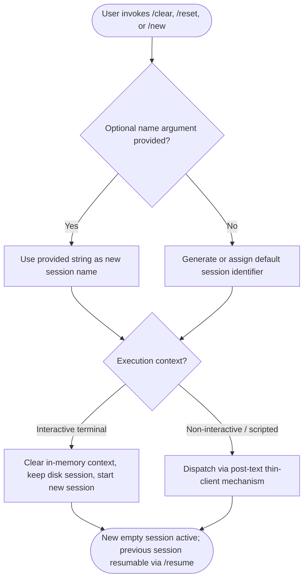

# `/clear`

> Analysis basis: CC v2.1.139 bundle.js (AST extraction + Claude interpretation)
> Minimum version: v2.1.139

---

## Overview

The `/clear` command starts a new session with an empty context window, discarding all messages from the current conversation in memory while leaving the previous session intact on disk so it remains resumable via `/resume`. It accepts an optional name argument and supports non-interactive (scripted) use via the `post-text` thin-client dispatch mechanism.

---

## Registration

| Field | Value |
|---|---|
| type | `local` |
| name | `clear` |
| description | `Start a new session with empty context; previous session stays on disk (resumable with /resume)` |
| argumentHint | `[name]` |
| supportsNonInteractive | `true` |
| thinClientDispatch | `post-text` |
| aliases | `reset`, `new` |
| module_id | `h6q` |

Analysis basis: CC v2.1.139 bundle.js:+9938277

---

## Input Branching

Because the AST traversal reached depth ≤ 2 and the module `h6q` yielded no entry functions, the full internal branching logic cannot be confirmed from extracted data. The flowchart below is derived solely from the registration fields (argument hint, aliases, `supportsNonInteractive`, `thinClientDispatch`).



Analysis basis: CC v2.1.139 bundle.js:+9938277

> **Note:** Internal branching details (state mutation order, error paths, name validation) are <!-- TODO: not found in depth-2 traversal; needs --depth 4 -->

---

## Behavioral Spec

### Session Reset

```
function clearSession(optionalName):
    previousSession = getCurrentSession()
    persistToDisk(previousSession)          // previous session survives on disk

    newSession = createEmptySession()

    if optionalName is provided and non-empty:
        newSession.name = optionalName
    else:
        newSession.name = generateDefaultName()

    setCurrentSession(newSession)           // in-memory context is now empty
    // previousSession remains accessible via /resume
    return newSession
```

Analysis basis: CC v2.1.139 bundle.js:+9938277 (registration description confirms disk-persistence guarantee and resumability contract)

### Alias Resolution

The command is registered under three trigger names: `clear` (canonical), `reset`, and `new`. All three aliases map to the same handler and produce identical behavior.

```
function resolveAlias(invokedName):
    canonicalAliases = ["clear", "reset", "new"]
    if invokedName in canonicalAliases:
        return executeCommand("clear")
    else:
        raise UnknownCommandError(invokedName)
```

Analysis basis: CC v2.1.139 bundle.js:+9938277 (`aliases` field)

### Non-Interactive Dispatch

When the CLI is operating in a non-interactive (scripted or pipe) context, the command is dispatched using the `post-text` thin-client mechanism rather than directly manipulating the interactive terminal session.

```
function dispatchClear(context, optionalName):
    if context.isNonInteractive:
        return thinClientPostText(buildClearPayload(optionalName))
    else:
        return clearSession(optionalName)
```

Analysis basis: CC v2.1.139 bundle.js:+9938277 (`supportsNonInteractive: true`, `thinClientDispatch: "post-text"`)

---

## State & Side Effects

| Item | Detail |
|---|---|
| Telemetry | <!-- TODO: not found in depth-2 traversal; needs --depth 4 --> |
| Hook registration | <!-- TODO: not found in depth-2 traversal; needs --depth 4 --> |
| appState changes | In-memory conversation context is replaced with an empty session; the previous session object is written to / retained on disk |
| Sound | <!-- TODO: not found in depth-2 traversal; needs --depth 4 --> |
| Disk persistence | Previous session is explicitly preserved on disk and remains resumable via `/resume` (confirmed by registration description) |
| Non-interactive support | `supportsNonInteractive: true` — the command can be invoked from scripts or piped input without a TTY |
| Thin-client dispatch | `thinClientDispatch: "post-text"` — in thin-client mode the clear action is delivered as a post-text event |

Analysis basis: CC v2.1.139 bundle.js:+9938277

---

## Version History

| Version | Change |
|---|---|
| v2.1.139 | Initial analysis — registration fields confirmed via AST extraction; internal implementation details not reachable at traversal depth 2 |

---

## Common Mistakes

1. **Assuming `/clear` deletes the previous session.** The command explicitly preserves the previous session on disk. Use `/resume` to return to it. The description states this directly.
2. **Treating `/reset` and `/new` as different commands.** Both are registered aliases for `/clear` and produce identical behavior; there is no behavioral distinction between them.
3. **Omitting the optional name argument in automation scripts.** When scripting session management, passing an explicit name via the `[name]` argument enables deterministic session identification rather than relying on auto-generated names.
4. **Expecting `/clear` to work only in interactive terminals.** Because `supportsNonInteractive: true`, the command is fully supported in piped or scripted invocations; it dispatches via the `post-text` thin-client path in those contexts.
5. **Relying on internal module `h6q` identifiers across versions.** The module ID and any obfuscated internal identifiers are bundle-version-specific and must not be hardcoded in tooling or tests.

---

## Appendix — Identifier Mapping

> For bundle debugging only. Identifiers change across versions.

| Identifier | Role |
|---|---|
| `h6q` | Module ID for the `/clear` command implementation unit |

> **Note:** The depth-2 AST traversal returned an empty `identifiers` array and empty `callGraph` for module `h6q`. No additional obfuscated identifiers were reachable. Full identifier mapping requires <!-- TODO: not found in depth-2 traversal; needs --depth 4 -->