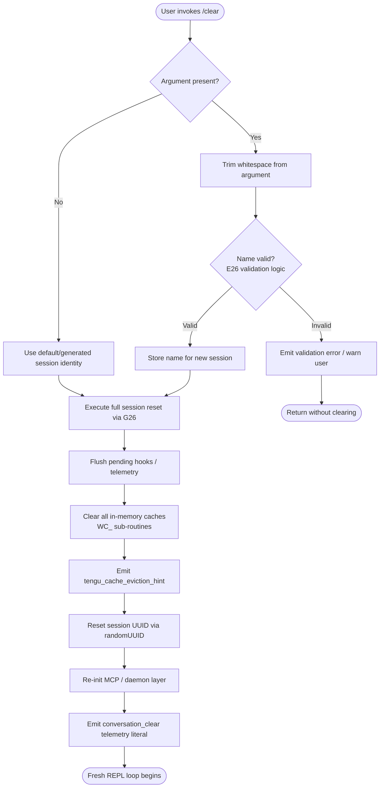

# `/clear`

> Analysis basis: CC v2.1.142 bundle.js (AST extraction + Claude interpretation)
> Minimum version: v2.1.142

---

## Overview

`/clear` starts a brand-new Claude Code session with an empty conversation context while preserving the previous session on disk so it can be resumed later with `/resume`. The command accepts an optional name argument for the new session, trims and validates any input, then orchestrates a full state reset — clearing caches, flushing in-flight hooks, resetting the session UUID, and re-initialising the daemon/MCP infrastructure before handing control back to a fresh REPL loop.

---

## Registration

| Field | Value |
|---|---|
| `type` | `local` |
| `name` | `clear` |
| `description` | Start a new session with empty context; previous session stays on disk (resumable with /resume) |
| `argumentHint` | `[name]` |
| `aliases` | `reset`, `new` |
| `supportsNonInteractive` | `true` |
| `thinClientDispatch` | `post-text` |
| `module_id` | `i1q` |
| `load_inline` | `true` |
| `loc_byte` | `10067464` |
| `loc_byte_end` | `10067755` |
| `loc_line` | `5593` |
| `arbor_handler.name` | `K37` |
| `arbor_handler.fqn` | `claude-2.1.142::K37` |
| `arbor_handler.kind` | `AsyncFunction` |
| `arbor_handler.resolution_path` | `module_id` |
| `arbor_handler.n_hits` | `0` |

Analysis basis: CC v2.1.142 bundle.js:+10067464

---

## Input Branching

Three distinct branches exist: (1) no argument supplied, (2) a valid session name supplied, and (3) an invalid / malformed name is detected.



Analysis basis: CC v2.1.142 bundle.js:+10067290 (trim), +10065493 (validation), +10065584 (session reset entry)

---

## Behavioral Spec

### 1. Handler Entry — `sessionClearHandler` (K37)

```
async function sessionClearHandler(userInput, context):
    rawArg = userInput.trim()            // H.trim at +10067290
    sessionName = rawArg if rawArg != "" else null

    // Validate session name (E26)
    if sessionName is not null:
        parsedOrdinal = parseInt(sessionName, 10)   // +12196029
        if not Number.isFinite(parsedOrdinal):      // +12196051
            pass  // non-numeric names accepted
        clampedOrdinal = clamp(parsedOrdinal, 0, 1000)  // Math.max/min +12196247/+12196260

    // Delegate to full session reset (G26)
    await performFullSessionReset(sessionName, context)
```

Analysis basis: CC v2.1.142 bundle.js:+10067290, +10067326

---

### 2. Full Session Reset — `performFullSessionReset` (G26)

```
async function performFullSessionReset(sessionName, context):
    // Compute new context size budget (E26)
    budget = computeContextBudget(context.model, context.settings)

    // Build fresh session metadata (FvH)
    newSessionMeta = buildSessionMetadata(sessionName)   // includes SessionEnd event at +12187793

    // Set an AbortSignal timeout for the whole operation
    resetSignal = AbortSignal.timeout(resetTimeoutMs)    // +10065553

    // Emit cache eviction hint
    emit("tengu_cache_eviction_hint")                    // +10065597

    // Fire conversation_clear literal marker
    record("conversation_clear")                         // literal +10065632

    // Check backgrounded state
    if context.state["isBackgrounded"]:                  // literal +10065700
        handle backgrounded branch

    // Snapshot running processes / MCP servers
    serverSnapshot = Object.values(context.servers)     // +10065763

    // Initialise fresh data structures
    newSessionId = crypto.randomUUID()                   // c1q.randomUUID +10066728

    // Persist roster entry for the old session
    persistRosterEntry(context)                          // _.rosterEntry via Fr_ +14468413

    // Reset conversation state
    record("conversation_reset")                         // literal +10066689

    // Execute WC_ (full state wipe)
    await wipeAllCaches(context)

    // Re-initialise MCP layer (M → IvH → n_5)
    await reinitMcpLayer(context, serverSnapshot)

    // Flush pending hook queue (Mz)
    flushHookQueue()                                     // +10066302

    // Rebuild logging sinks (xb, oLH)
    rebuildLoggingSinks(newSessionId)

    // Reconstruct REPL state objects (c3, T26, gQ, bb, f6H)
    rebuildReplObjects(newSessionId, sessionName)

    // Start fresh agent loop (Sm → _z6 → tX)
    return startFreshAgentLoop(newSessionId, budget, context)
```

Analysis basis: CC v2.1.142 bundle.js:+10065493, +10065505, +10065553, +10065584, +10065632, +10065700, +10066302, +10066728

---

### 3. Context Budget Computation — `computeContextBudget` (E26)

```
function computeContextBudget(model, settings):
    // Reads policy settings store (V8 → policySettings literal +5372805)
    policy = getPolicySettings()
    // Token arithmetic uses 10 as base (literal +12196040)
    // and 1000 as scaling factor (literal +12196216)
    budget = clamp(
        parseInt(policy.contextLimit, 10),
        Math.max(floor, 0),                   // literal 0 at +10067305
        Math.min(ceiling, 1000)
    )
    return budget
```

Analysis basis: CC v2.1.142 bundle.js:+10065493, +12196029, +12196040, +12196216, +12196247, +12196260

---

### 4. Session Metadata Construction — `buildSessionMetadata` (FvH)

```
function buildSessionMetadata(sessionName):
    // Emits "SessionEnd" event for the outgoing session (literal +12187793)
    emitEvent("SessionEnd", currentSession)

    // Collects effort value from model config (z4 → A.getEffortValue +12197279)
    effort = getEffortValue(currentModel)     // effort literal +4434782

    // Constructs system prompt segments (FZ)
    systemPrompt = buildSystemPrompt()

    // Applies heading formatter (h6)
    heading = formatHeading(sessionName)

    // Sets up notification callback (O2 → j.callback +12233930)
    meta.notifyCallback = registerNotificationCallback()

    return meta
```

Analysis basis: CC v2.1.142 bundle.js:+12187766, +12187793, +12187824, +12188021, +12197279

---

### 5. Full Cache Wipe — `wipeAllCaches` (WC_)

```
async function wipeAllCaches(context):
    wC_()          // inner wipe helper
    nHH()          // clear DqH, Oz8, _t1, mz8 caches
    xn9()          // Ym.clear() — clears primary cache map (+4739255)
                   //   hTH writes new session dirs (BH8.mkdir +4729098, BH8.writeFile +4729148)
    LH6()          // additional state layer clear
    gn()           // multi-system reset:
                   //   dA8 — subagent cache clear (nC.delete, ww_.delete)
                   //   iA8 — c_q.clear() +9843380
                   //   Pq1 — Kz6.clear(), oD_.clear() +5383009/+5383021
                   //   HK1, Fn — internal state resets
                   //   i34.resetAutonomousLoopDelivered() +5457118
                   //   ij  — Object.values reset loop +41587
    zrH()          // Az8.clear() +9320098
    N$6()          // emit session_start event (literal +4817237)
    ny1()          // NVH.clear(), wT_.clear() +7953629/+7953641
    a11()          // ZQH.clear(), sO6.clear() +5368283/+5368295
    Ou8()          // oRH.clear() +1049824
    $d9()          // additional clear
    SL1()          // w98.clear() +5544422
    dV8()          // membership check then wipe +52102
    sx8()          // iRH.clear() +1042364
    le1()          // leaf clear
    d91()          // Rn.clear(), oOH.clear() +5277800/+5277811

    await Promise.resolve()   // yield to event loop +10064773

    // Restore viewport/UI (Iv_, q, l38, QX, mgH)
    restoreUIState()
```

Analysis basis: CC v2.1.142 bundle.js:+10064487 through +10065057

---

### 6. MCP Layer Re-initialisation — `reinitMcpLayer` (M → IvH → n_5)

```
async function reinitMcpLayer(context, serverSnapshot):
    // Iterates server entries (Object.entries +9676477)
    for each [serverId, serverConfig] in Object.entries(serverSnapshot):
        client = buildMcpClient(serverConfig)     // AHH +7644553
        transport = selectTransport(serverConfig) // stdio/sse/sse-ide/ws-ide literals
        // Reconnect
        await connectWithRetry(client)            // lh_ +9635976

    // Retry loop for remote servers (n_5 → a8)
    // "all remote servers recovered" literal +14197514
    await waitForRemoteRecovery()

    // Re-apply MCP updates (Peq → H.applyMcpUpdate +14196944)
    applyPendingUpdates()
```

Analysis basis: CC v2.1.142 bundle.js:+14196656, +9676477, +9677313, +14197514, +14196944

---

### 7. Fresh Agent Loop — `startFreshAgentLoop` (_z6 → tX)

```
async function startFreshAgentLoop(sessionId, budget, context):
    // Generate new conversation UUID
    newConvId = W28.randomUUID()    // +12187211

    // Build agent runner (tX — the main REPL turn handler)
    runner = buildAgentRunner({
        sessionId,
        budget,
        hooks: [],          // hooks list re-populated fresh
        notifyCallback: context.notifyCallback,
    })

    // Runner internally coordinates:
    //   hook execution   (DQ_, jyq, wQ_, v28)
    //   tool dispatch    (N28 → V28.spawn)
    //   output streaming (VS, B6H, bG6)
    //   compact/summarise (tX → Cq1, WS)

    return runner
```

Analysis basis: CC v2.1.142 bundle.js:+12187104, +12187211, +12220822, +12223789

---

## State & Side Effects

| Item | Detail |
|---|---|
| Telemetry — `tengu_cache_eviction_hint` | Fired once per `/clear` invocation at the start of session reset (bundle.js:+10065597) |
| Telemetry — `tengu_run_hook` | Fired for any hooks executed during or after the reset (bundle.js:+12233539) |
| Telemetry — `tengu_repl_hook_finished` | Fired when each REPL hook completes (bundle.js:+12217739) |
| Telemetry — `tengu_hook_plugin_injected` | Fired when a plugin hook is injected into the new session (bundle.js:+12231885) |
| Telemetry — `tengu_session_renamed` | Fired if the new session receives an explicit name argument (bundle.js:+12103375) |
| Telemetry — `tengu_shell_set_cwd` | Fired if working directory is re-validated on clear (bundle.js:+8540636) |
| Telemetry — `tengu_feature_ok` / `tengu_feature_bad` | Feature flag probe at start of clear handler (bundle.js:+954550 / +954608) |
| Literal marker — `conversation_clear` | Written to session log to mark the boundary (bundle.js:+10065632) |
| Literal marker — `conversation_reset` | Written after state is wiped (bundle.js:+10066689) |
| Literal marker — `SessionEnd` | Emitted for the outgoing session via event bus (bundle.js:+12187793) |
| Session UUID | Replaced with a fresh `crypto.randomUUID()` (bundle.js:+10066728) |
| Previous session | Persisted to disk via roster entry write; remains resumable with `/resume` |
| Cache maps cleared | `Ym`, `Az8`, `NVH`, `wT_`, `ZQH`, `sO6`, `oRH`, `w98`, `iRH`, `Rn`, `oOH`, `c_q`, `Kz6`, `oD_` and others (WC_ sub-graph) |
| MCP server connections | Existing connections torn down and re-established for the new session |
| AbortSignal timeout | Set on the overall reset operation to guard against hangs (bundle.js:+10065553) |
| Hook registration | Hook queue flushed (`Mz.flush` +12157769); hooks re-registered after reset |
| Plugin hooks | Re-loaded via `Sm` → `load_plugin_hooks` (literal +5378834) |
| Sound | <!-- TODO: not found in depth-2 traversal; needs --depth 4 --> |

---

## Version History

| Version | Change |
|---|---|
| v2.1.142 | Initial analysis |

---

## Common Mistakes

1. **Expecting context to survive** — `/clear` wipes the full in-memory conversation context. Anything the model "knows" from the current session is gone; only on-disk files remain.
2. **Confusing aliases** — `/reset` and `/new` are exact aliases for `/clear` (registration aliases field). They perform an identical operation; there is no behavioural difference.
3. **Assuming non-interactive mode blocks** — `supportsNonInteractive: true` means the command can be issued from scripts or pipelines; it does not prompt for confirmation before clearing.
4. **Forgetting session is still on disk** — the previous session is persisted to disk and is fully resumable with `/resume`. Running `/clear` is not destructive to prior history.
5. **Passing an invalid name argument** — The `[name]` argument goes through ordinal-clamp validation (E26). Extremely large integers are silently clamped; non-finite values are accepted as string names. Malformed input that fails validation returns early without clearing.
6. **Expecting immediate MCP tool availability** — MCP server connections are torn down and re-established as part of the reset. There may be a brief window after `/clear` where MCP tools are not yet available.

---

## Appendix — Identifier Mapping

> For bundle debugging only. Identifiers change across versions.

| Identifier | Role |
|---|---|
| `K37` | Main async handler for `/clear` (arbor resolved, `AsyncFunction`) |
| `G26` | Full session reset orchestrator |
| `E26` | Session name / context budget validator |
| `rY` | Policy settings reader |
| `V8` | Policy store accessor |
| `yU` | Auxiliary settings helper |
| `JV` | Journal/event emitter primitive |
| `ug` | Context usage accumulator |
| `UD_` | Usage delta helper |
| `FvH` | Session metadata builder (emits `SessionEnd`) |
| `z4` | System prompt / effort assembler |
| `V6` | Prompt segment formatter |
| `Ly` | Locale/language config reader |
| `xX` | Effort value resolver (model capability map) |
| `sE` | Effort level classifier (`high` etc.) |
| `FZ` | System prompt builder |
| `h6` | Heading formatter |
| `O2` | Hook runner / session orchestrator |
| `bH` | String coercion helper |
| `ym` | Model metadata accessor |
| `v` | Debug/log level router (`debug`, `warn`, `info`) |
| `aLH` | AppState reader |
| `jQ_` | Hook configuration parser |
| `Pyq` | Permission query helper |
| `JQ_` | Hook filter (third-party) |
| `Xyq` | Extended hook filter |
| `d` | Async data accessor |
| `RH` | JSON serialiser wrapper |
| `NH` | Hook error logger |
| `uH` | Feature flag checker |
| `gPH` | Feature gate helper |
| `yZ` | Abort/timeout controller |
| `j` | Callback registry |
| `B6H` | Background session dispatcher |
| `VS` | Output stream writer |
| `Z28` | Worktree state manager |
| `wQ_` | MCP tool response parser |
| `v28` | Hook output parser |
| `DQ_` | HTTP hook executor |
| `jyq` | HTTP hook response handler |
| `CLH` | Compact/summarise trigger |
| `N28` | Shell command executor (hook spawn) |
| `SH` | Feature state probe |
| `Lj6` | Log sink connector |
| `geH` | Cache eviction hint emitter |
| `M` | MCP manager top-level |
| `IvH` | MCP server connection loop |
| `AHH` | MCP client builder |
| `dI` | MCP client initialiser |
| `K` | Column/table formatter |
| `H_` | Internal state snapshot helper |
| `lX6` | MCP transport selector |
| `D47` | MCP retry timestamp recorder |
| `O78` | MCP server key enumerator |
| `$78` | MCP option resolver |
| `H8` | MCP debug logger |
| `lh_` | MCP OAuth/connect flow handler |
| `nh_` | MCP OAuth callback completer |
| `o6q` | MCP reconnect scheduler |
| `dh_` | MCP server wipe helper |
| `LG_` | MCP transport capability checker |
| `J` | Process handle list |
| `y` | Daemon write stream |
| `_7` | MCP error logger |
| `GH` | String coercion util |
| `c6q` | MCP queue accessor |
| `nX6` | MCP protocol version parser |
| `JS_` | MCP session ID parser |
| `Peq` | MCP update applier |
| `SY8` | MCP update serialiser |
| `Ov` | MCP cleanup orchestrator |
| `L` | Promise/finaliser wrapper |
| `q` | Socket / file handle store |
| `f` | File handle finaliser |
| `$` | Telemetry event emitter |
| `zEq` | Telemetry event record builder |
| `n_5` | MCP remote server retry loop |
| `_` | Internal utility / state container |
| `Y78` | MCP auth state checker |
| `a8` | Retry timer helper |
| `BrH` | MCP broker request builder |
| `Vj` | Virtual journal writer |
| `w` | Daemon session worker |
| `LG6` | Low-memory monitor |
| `G6` | Memory pressure handler |
| `S` | Session lifecycle manager |
| `xr_` | Daemon claim sender |
| `dQ_` | Claim frame file writer |
| `Q95` | Claim timeout handler |
| `g95` | Claim frame builder |
| `O8` | Async operation wrapper |
| `Cp` | Binary frame encoder (Buffer operations) |
| `Fr_` | Roster entry manager |
| `IK` | Path joiner for session dirs |
| `o1` | Session file reader/writer |
| `dw` | Active session marker writer |
| `gf` | Session order file writer |
| `ZoH` | Daemon yield helper |
| `OLH` | Log file append helper |
| `uk` | Session directory path builder |
| `pp` | Session prefix path helper |
| `i26` | Session index path helper |
| `D` | Daemon lifecycle controller |
| `br_` | Background spare process spawner |
| `u` | Daemon write buffer |
| `lD` | Local daemon connector |
| `WC_` | Full cache wipe orchestrator |
| `wC_` | Inner cache wipe helper |
| `nHH` | Cache group wipe (DqH/Oz8/_t1/mz8) |
| `DqH` | Cache sub-map D |
| `Oz8` | Cache sub-map O |
| `_t1` | Cache sub-map T |
| `mz8` | Cache sub-map m |
| `xn9` | Primary Ym cache clearer |
| `hTH` | New session directory initialiser |
| `LH6` | Additional state layer clearer |
| `gn` | Multi-system reset coordinator |
| `W1H` | Main agent state resetter |
| `dA8` | Subagent cache clearer |
| `N$6` | Session start event emitter |
| `Mn` | Memory node resetter |
| `Je` | Internal event resetter |
| `iA8` | c_q cache clearer |
| `Pq1` | Kz6/oD_ cache clearer |
| `HK1` | Hook key resetter |
| `Fn` | Flag/state resetter |
| `ij` | Output token counter resetter |
| `Nw_` | Notification watcher resetter |
| `zrH` | Az8 cache clearer |
| `ny1` | NVH/wT_ cache clearer |
| `a11` | ZQH/sO6 cache clearer |
| `Ou8` | oRH cache clearer |
| `$d9` | Miscellaneous state clearer |
| `SL1` | w98 cache clearer |
| `dV8` | Membership-gated cache wipe |
| `sx8` | iRH cache clearer |
| `le1` | Leaf-level state clearer |
| `d91` | Rn/oOH cache clearer |
| `qD` | Working directory validator/resolver |
| `x6` | Absolute path resolver helper |
| `$8` | Async op helper |
| `eb8` | AsyncLocalStorage CWD accessor |
| `y8H` | Path normaliser |
| `__` | JV journal primitive invoker |
| `mTH` | Message thread helper |
| `pI` | Process info accessor |
| `Mz` | Hook queue flusher |
| `D28` | Inflight hook set manager |
| `kdH` | Keyed data helper |
| `bY1` | Background yield helper |
| `n1q` | Response record helper |
| `r4H` | Record appender |
| `c3` | REPL state object constructor |
| `qL` | REPL queue manager |
| `C9` | REPL task set manager |
| `Tp` | Text processor |
| `$5` | System message formatter |
| `NU` | Message node util |
| `T26` | Title/label constructor |
| `zZ8` | UUID + event-bus session initiator |
| `gQ` | Queue builder |
| `xb` | Log + event emit helper |
| `oLH` | Append-file log writer |
| `cIH` | Symlink/worktree setup helper |
| `LQ_` | Task directory creator |
| `HiH` | Task path builder |
| `k$` | Task link path builder |
| `Q58` | Worktree open helper |
| `LT` | Subagent path builder |
| `Gf` | Graph/frontier helper |
| `af` | Attachment file helper |
| `bb` | Worktree state writer |
| `f6H` | Isolation latch writer |
| `Lkq` | Async log appender |
| `Sm` | Plugin hook loader |
| `OL` | Byte helper |
| `cFH` | Plugin hook filter |
| `nRH` | Plugin hook log writer |
| `G8` | Sync log appender |
| `z` | Background-session stopper |
| `aR` | Daemon listener registrar |
| `Ax` | Process exit coordinator |
| `_z6` | New agent runner factory |
| `tX` | Main REPL turn handler / agent runner |
| `$9` | Compact session ID generator |