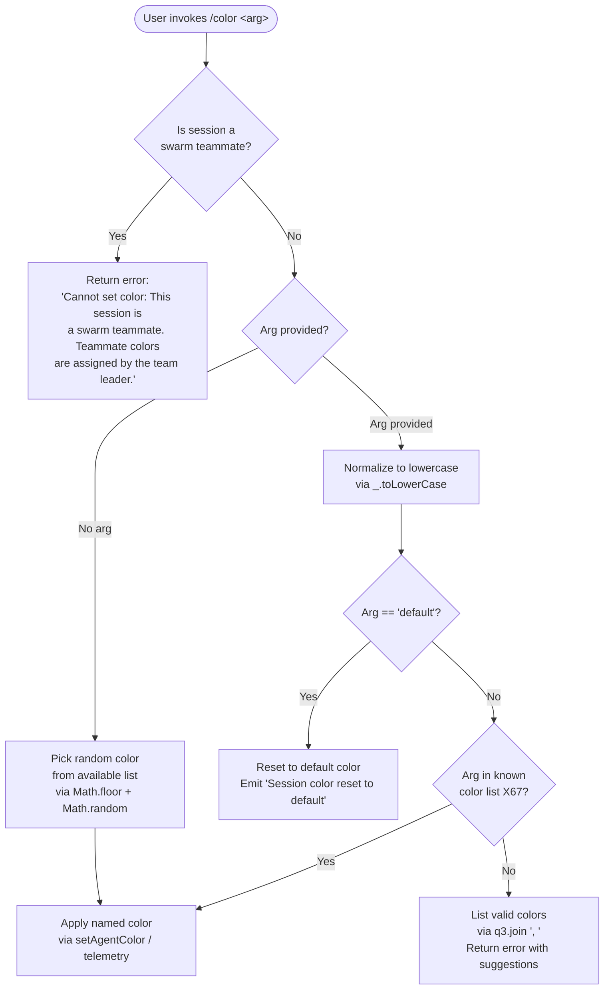

# `/color`

> Analysis basis: CC v2.1.133 bundle.js (AST extraction + Claude interpretation)
> Minimum version: v2.1.133

---

## Overview

The `/color` command sets or resets the prompt bar color for the current Claude Code session. When invoked with a recognized color name, it applies that color to the UI prompt bar; when invoked with `"default"` (or no recognized color argument), it resets the bar to the default color. The command is blocked in swarm teammate sessions, where colors are controlled exclusively by the team leader.

---

## Registration

| Field | Value |
|---|---|
| `type` | `local-jsx` |
| `name` | `color` |
| `description` | `Set the prompt bar color for this session` |
| `argumentHint` | `null` |
| `immediate` | `true` |
| `module_id` | `Qo9` |
| `load_inline` | `true` |
| `loc_byte` | `9844233` |
| `loc_byte_end` | `9844450` |
| `loc_line` | `5513` |
| `arbor_handler.name` | `j67` |
| `arbor_handler.fqn` | `claude-2.1.133::j67` |
| `arbor_handler.kind` | `AsyncFunction` |
| `arbor_handler.resolution_path` | `module_id` |
| `arbor_handler.n_hits` | `0` |

Analysis basis: CC v2.1.133 bundle.js:+9844233

**Notes:**
- `immediate: true` means the command executes synchronously upon slash-command dispatch — no additional confirmation step is required from the user.
- The handler is an `AsyncFunction` (`j67`) resolved via the `module_id` path (`Qo9`). The callGraph entry point `j67 → H, L38` (at bundle.js:+9843151, +9843159) is the real handler; the Arbor-resolved name `j67` is preferred over any synthetic BFS bookkeeping identifier.

---

## Input Branching

Four distinct paths exist based on swarm role, argument presence/value, and color list membership — a Mermaid flowchart is used.



Analysis basis: CC v2.1.133 bundle.js:+9843220 (swarm check), +9843366 (random pick), +9843403 (toLowerCase), +9843421 (X67.includes), +9843445 (q3.includes), +9843467 (q3.join), +9843565 ("default" literal), +9843231 (swarm error string), +9843673 (reset message)

---

## Behavioral Spec

### 1. Entry Point and Swarm Guard

The async handler `j67` is called with the session context object and the raw argument string.

```
async function colorCommandHandler(sessionContext, rawArg):
    isSwarmTeammate = checkSwarmRole(sessionContext)   // calls storeGet (m7 → pP → Qg8.getStore)
    if isSwarmTeammate:
        return errorResult(
            "Cannot set color: This session is a swarm teammate. " +
            "Teammate colors are assigned by the team leader."
        )
    proceed to argument resolution (see §2)
```

Analysis basis: CC v2.1.133 bundle.js:+9843220 (swarm check call), +9843231 (error literal), +2125187 (store lookup), +2124046 (Qg8.getStore)

### 2. Argument Resolution

```
function resolveColorArgument(rawArg, availableColors):
    if rawArg is absent or empty:
        randomIndex = Math.floor(Math.random() * availableColors.length)
        return availableColors[randomIndex]             // random selection
    normalized = rawArg.toLowerCase()
    if normalized == "default":
        return "default"
    if availableColors.includes(normalized):            // X67.includes check
        return normalized
    // Invalid color supplied — build suggestion string
    suggestions = availableColors.join(", ")            // q3.join with literal ", "
    return invalidColorError(normalized, suggestions)
```

Analysis basis: CC v2.1.133 bundle.js:+9843366 (Math.floor), +9843377 (Math.random), +9843403 (toLowerCase), +9843421 (X67.includes), +9843445 (q3.includes), +9843467 (q3.join), +9843475 (", " literal), +9843565 ("default" literal)

### 3. Color Application

When a valid named color (not `"default"`) is resolved:

```
function applyColor(resolvedColor, sessionContext):
    logAgentColorEvent("agent-color", resolvedColor)    // CJ6 → wVH log writer, "agent-color" key
    setStandaloneAgentContext(sessionContext, resolvedColor)  // A.setStandaloneAgentContext
    emitTelemetry("tengu_agent_color_set")              // CJ6 → d, loc_byte 11833049
    scheduleContextFileUpdate(sessionContext)            // tn6 subtree (file I/O)
    renderColorConfirmation(resolvedColor)               // P67 subtree → JSX result
```

Analysis basis: CC v2.1.133 bundle.js:+9843603 (CJ6 call), +9843614 (A.setStandaloneAgentContext), +9843653 (tn6 call), +9843662 (P67 call), +11832965 ("agent-color" literal), +11833049 (telemetry event)

### 4. Default / Reset Path

```
function resetToDefault(sessionContext):
    setStandaloneAgentContext(sessionContext, "default")
    return systemMessage("Session color reset to default")
```

Analysis basis: CC v2.1.133 bundle.js:+9843565 ("default" literal), +9843673 ("Session color reset to default" literal), +9843177 ("system" message type literal)

### 5. Context File Update (`tn6` subtree)

The `tn6` function manages persistence of the color setting to a context file on disk. It orchestrates several sub-operations:

```
async function persistColorToContextFile(sessionContext, color):
    resolvedPaths = buildContextFilePaths(sessionContext)   // xL → VW, Cj.join
    basename = getContextBasename(sessionContext)            // vW → Cj.basename
    existingEntries = readContextFileEntries(resolvedPaths) // r9 → Rj.stat, Rj.readFile
    updatedEntries = mergeColorEntry(existingEntries, color, basename)
    writeContextFile(resolvedPaths, updatedEntries)         // Pf → iY (atomic write via randomBytes + rename)
    evictStaleCache(resolvedPaths)                          // lP → QfH.delete
```

Analysis basis: CC v2.1.133 bundle.js:+3883618 (tn6 entry), +3880692 (Cj.join), +3880767 (Cj.basename), +3881437 (Rj.stat), +3881823 (Rj.readFile), +2867005 (Xa8.randomBytes for atomic write), +2867052 (Lo.writeFile), +2867105 (Lo.rename), +3881298 (QfH.delete cache eviction)

### 6. Result Rendering (`P67` subtree)

`P67` retrieves the current app state and renders a JSX confirmation component:

```
function renderColorResult(resolvedColor, appState):
    state = H.getAppState()                             // P67 → H.getAppState
    formattedLabel = formatColorLabel(resolvedColor)    // dl helper
    paddedLine = L(formattedLabel)                      // L → f.padEnd with "  " padding
    return Qt(/* JSX confirmation node */)
```

Analysis basis: CC v2.1.133 bundle.js:+9843759 (H.getAppState), +9843814 (dl), +9843819 (Promise.resolve), +9843849 (JzH), +9843901 (L), +9843919 (Qt), +14179342 (f.padEnd), +14179363 ("  " padding literal)

---

## State & Side Effects

| Item | Detail |
|---|---|
| Telemetry | `tengu_agent_color_set` (bundle.js:+11833049) — fired once per successful named-color application |
| Agent context mutation | `A.setStandaloneAgentContext` updates the in-memory standalone agent context with the new color value (bundle.js:+9843614) |
| Context file write | `tn6` subtree performs an atomic write (random-bytes temp file → rename) to persist the color to the session's on-disk context file (bundle.js:+9843653) |
| Cache eviction | `lP → QfH.delete` evicts the stale parsed-context cache entry after write (bundle.js:+3881298) |
| Log entry | `CJ6 → wVH` appends a structured log entry keyed `"agent-color"` (bundle.js:+11832965) using `appendFileSync` (bundle.js:+11829593) |
| Sound | <!-- TODO: not found in depth-2 traversal; needs --depth 4 --> |
| Hook registration | <!-- TODO: not found in depth-2 traversal; needs --depth 4 --> |

---

## Version History

| Version | Change |
|---|---|
| v2.1.133 | Initial analysis |

---

## Common Mistakes

1. **Invoking `/color` in a swarm teammate session.** The command is unconditionally blocked for swarm teammates; only the team leader session can assign teammate colors. The error is returned immediately before any argument is evaluated (bundle.js:+9843231).
2. **Passing an unrecognized color name.** If the argument does not match any entry in the internal color list (`X67`) and is not `"default"`, the command returns an error listing all valid options (joined by `", "`). Callers should use the suggestion list rather than guessing (bundle.js:+9843445–+9843475).
3. **Expecting synchronous file persistence before the command returns.** The context file write (`tn6`) is async; downstream code reading the color from disk should await the persistence cycle rather than reading immediately after the command resolves.
4. **Passing `"Default"` (capitalized) instead of `"default"`.** The argument is normalized to lowercase before comparison (bundle.js:+9843403), so mixed-case variants of `"default"` are handled correctly — but passing arbitrary capitalized color names that don't match any list entry after lowercasing will still fall through to the error path.
5. **Assuming no-argument invocation leaves color unchanged.** When invoked without an argument, the command picks a **random** color from the available list (bundle.js:+9843366–+9843377), not a no-op. Pass `"default"` explicitly to reset.

---

## Appendix — Identifier Mapping

> For bundle debugging only. Identifiers change across versions.

| Identifier | Role |
|---|---|
| `j67` | Main async command handler (`colorCommandHandler`); Arbor-resolved entry point |
| `L38` | Core color resolution and dispatch logic |
| `m7` | Swarm-role store accessor wrapper |
| `pP` | Store lookup helper (calls `Qg8.getStore`) |
| `v6` | Shared utility (referenced across multiple callers; exact role varies by call site) |
| `ef` | JSX/text formatting helper used in result construction |
| `tg` | Sub-helper called by `ef` |
| `LA` | Sub-helper called by `ef` |
| `CJ6` | Agent color log writer orchestrator |
| `HN` | Log entry formatting sub-function (called by `CJ6`) |
| `wVH` | File-append log writer (calls `appendFileSync`, `mkdirSync`) |
| `F6` | Sub-helper used in log write path |
| `SH` | JSON serializer wrapper (calls `JSON.stringify`) |
| `RK` | Async state tracker (calls `y1`) |
| `y1` | In-flight request set manager (`d08.add` / `d08.delete`) |
| `d` | Telemetry emission helper (fires `tengu_agent_color_set`) |
| `A` | Agent context object (exposes `setStandaloneAgentContext`, `toUpperCase`) |
| `tn6` | Context file persistence orchestrator |
| `xL` | Context file path resolver |
| `VW` | Path join sub-helper |
| `vW` | Context file basename resolver |
| `H` | Session/app state object (exposes `getAppState`, `slice`, `includes`) |
| `r9` | Context file entry reader (stat + readFile + cache logic) |
| `D8` | Utility used in file reading and persistence paths |
| `w8` | Low-level utility (called by `D8`, `iY`) |
| `k` | Content processing / MIME handling helper |
| `Ztq` | Sub-helper in content processing chain |
| `Uf` | String redaction / truncation utility |
| `LkH` | String utility wrapper (calls `UnA`) |
| `vtq` | File content read-and-parse helper |
| `p6` | JSON parse wrapper |
| `lP` | Cache eviction helper (calls `QfH.delete`) |
| `Pf` | Atomic context file write orchestrator |
| `iY` | Atomic write implementation (randomBytes → writeFile → rename) |
| `fH` | Error/queue management helper |
| `HA` | Error construction helper |
| `kH` | String coercion helper |
| `yq` | Queue drain helper |
| `J9_` | Queue item processor (calls `kH`) |
| `NJL` | Queue shift/push manager |
| `P67` | Result rendering function (retrieves app state, returns JSX confirmation) |
| `dl` | Color label formatter helper |
| `L` | Pad/format line builder (calls `f.padEnd`) |
| `Qt` | JSX result node constructor |

---

Note: index built via Arbor fallback; some signals (telemetry, literals) may be missing — see arbor-fallback.js.