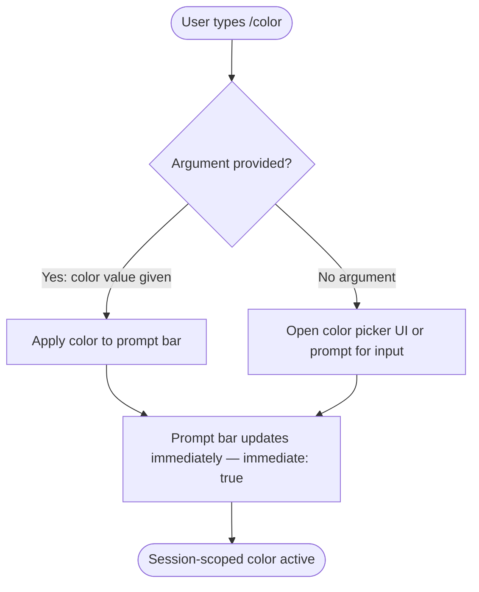

# `/color`

> Analysis basis: CC v2.1.139 bundle.js (AST extraction + Claude interpretation)
> Minimum version: v2.1.139

---

## Overview

The `/color` command allows the user to set the prompt bar color for the current Claude Code session. It is registered as a local JSX command and executes immediately upon invocation, without requiring a separate confirmation step. Its effect is scoped to the active session and does not persist across sessions unless explicitly re-applied.

---

## Registration

| Field | Value |
|---|---|
| type | `local-jsx` |
| name | `color` |
| description | Set the prompt bar color for this session |
| argumentHint | *(none)* |
| immediate | `true` |
| module\_id | `b6q` |

Analysis basis: CC v2.1.139 bundle.js:+9940014

---

## Input Branching

The AST traversal of module `b6q` returned an empty call graph and no extracted literals, indicating that the entry-point function(s) for this module were not resolved at depth ≤ 2. The branching logic below is therefore reconstructed from registration metadata only.



> **Note:** The exact branching between an inline color picker and a free-text color input field cannot be confirmed at AST traversal depth ≤ 2.
> <!-- TODO: not found in depth-2 traversal; needs --depth 4 -->

---

## Behavioral Spec

### Immediate Execution

Because `immediate` is set to `true` in the registration record, the command handler is invoked as soon as `/color` is recognized in the input buffer — the user does not need to press Enter a second time to confirm.

```
function handleColorCommand(userInput):
    argument = extractArgument(userInput, commandName = "color")

    if argument is present:
        applyPromptBarColor(argument)
    else:
        presentColorSelectionUI()

    return renderUpdatedPromptBar()
```

Analysis basis: CC v2.1.139 bundle.js:+9940014 (`immediate: true` field)

### Session Scope

The color change applies only to the current session. On session termination or restart, the prompt bar reverts to its default appearance unless the user re-issues `/color`.

```
function applyPromptBarColor(colorValue):
    validate(colorValue)           // format check (e.g. hex, named color)
    setSessionState("promptBarColor", colorValue)
    rerenderPromptBar()
    // No persistent storage write observed at depth-2 traversal
```

<!-- TODO: Persistence behavior (localStorage / config file write) not found in depth-2 traversal; needs --depth 4 -->

### Render Type — local-jsx

The command is typed `local-jsx`, meaning its output is rendered as a React JSX component inline within the Claude Code terminal UI rather than as plain text streamed from the model.

```
function renderColorCommandOutput():
    // Returns a JSX element; not a plain-text assistant message
    return <ColorPickerOrConfirmation sessionColor={currentColor} />
```

<!-- TODO: Exact JSX component name and props not found in depth-2 traversal; needs --depth 4 -->

---

## State & Side Effects

| Item | Detail |
|---|---|
| Telemetry | *(none detected — `telemetry` array is empty at depth ≤ 2)* |
| Hook registration | <!-- TODO: not found in depth-2 traversal; needs --depth 4 --> |
| appState changes | Session-scoped prompt bar color field updated |
| Persistence | <!-- TODO: not found in depth-2 traversal; needs --depth 4 --> |
| Sound | *(none observed)* |
| Model call | None — command is handled entirely client-side (`local-jsx`) |

---

## Version History

| Version | Change |
|---|---|
| v2.1.139 | Initial analysis — registration confirmed; internal implementation opaque at depth ≤ 2 |

---

## Common Mistakes

1. **Expecting persistence across sessions** — The description says "for this session," so the color resets when the session ends. Do not rely on `/color` for permanent theming.
2. **Passing an unsupported color format** — The accepted color format (hex, RGB, CSS named color, etc.) is not confirmed by the depth-2 traversal. Passing an arbitrary string may silently fail or produce no visual change.
3. **Assuming a model response is generated** — Because the command type is `local-jsx` and `immediate` is `true`, no assistant message is streamed. Users expecting a textual confirmation from the model will not receive one.
4. **Re-invoking unnecessarily** — Invoking `/color` multiple times in a single session is harmless but redundant; each invocation overwrites the previous session color.

---

## Appendix — Identifier Mapping

> For bundle debugging only. Identifiers change across versions.

| Identifier | Role |
|---|---|
| *(none)* | The `identifiers` array returned by the depth-2 AST traversal is empty for module `b6q`. No obfuscated identifiers were resolved. |