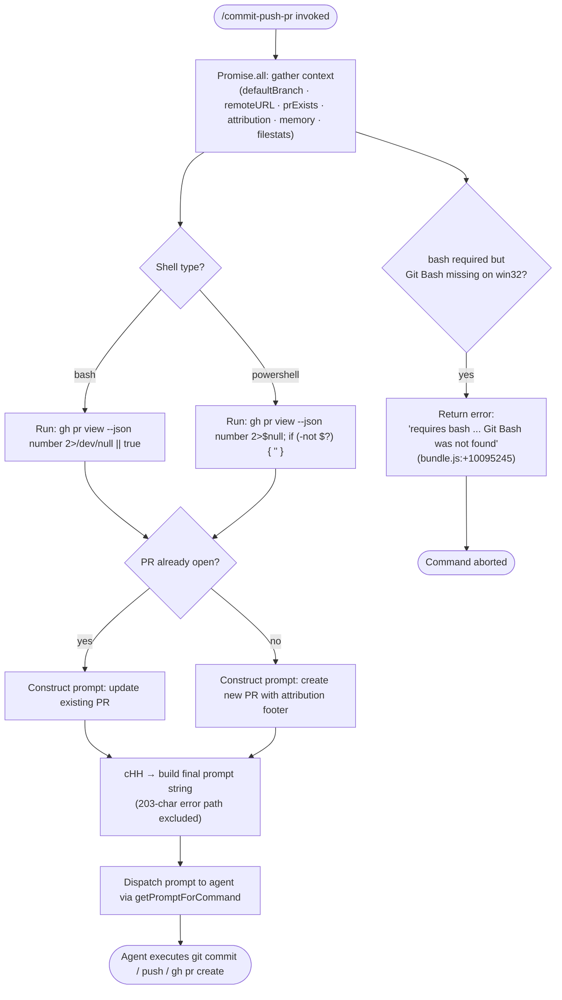

# `/commit-push-pr`

> Analysis basis: CC v2.1.142 bundle.js (AST extraction + Claude interpretation)
> Minimum version: v2.1.142

---

## Overview

`/commit-push-pr` is a prompt-type slash command that instructs the agent to stage and commit all current changes, push them to the remote, and open a GitHub Pull Request. The handler gathers the current Git context (default branch, remote URL, PR existence, attribution data, memory context, and file-change statistics) before constructing and dispatching a fully-parameterised prompt to the agent. Shell-type detection (bash vs. PowerShell) governs which Git Hub CLI invocations are emitted and validates tooling availability at runtime.

---

## Registration

| Field | Value |
|---|---|
| type | `prompt` |
| name | `commit-push-pr` |
| description | `Commit, push, and open a PR` |
| loc_byte | `10094844` |
| loc_byte_end | `10095585` |
| loc_line | `5716` |
| handler_method | `getPromptForCommand` |
| handler_method_start | `10095048` |
| handler_method_end | `10095584` |
| prompt_body.length | `203` |
| prompt_body.trace | `call→cHH(...) (1 literals)` |
| arbor_handler.name | `getPromptForCommand` |
| arbor_handler.fqn | `claude-2.1.142::getPromptForCommand` |
| arbor_handler.kind | `Method` |
| arbor_handler.resolution_path | `direct` |
| arbor_handler.n_hits | `4` |

Analysis basis: CC v2.1.142 bundle.js:+10094844

> **Note on prompt_body.trace:** The prompt body is assembled inside `cHH` via a call that resolves one literal. The 203-character body extracted by the indexer reflects the shell-validation error message path (Git Bash not found on Windows). The full production prompt is longer and constructed dynamically; the 203-character excerpt represents the fallback error text surfaced when the `bash` shell prerequisite cannot be satisfied on `win32`.

---

## Input Branching

The handler has at least four distinct execution paths: (1) normal successful invocation, (2) PR already exists, (3) bash unavailable on Windows, and (4) any async-gather failure. A Mermaid flowchart is therefore used.



Analysis basis: CC v2.1.142 bundle.js:+10095054 (handler entry), +10095094 (`Promise.all` context gather), +10091921 (bash gh-pr literal), +10091968 (powershell gh-pr literal), +10095245 (`cHH` prompt builder call)

---

## Behavioral Spec

### 1. Handler Entry — `getPromptForCommand`

The registration object carries `handler_method: "getPromptForCommand"`, which means the handler is an `ObjectMethod` defined inline on the registration object. Arbor resolved it via `direct` path (symbol falls inside the registration byte range `10094844–10095585`).

```
async function getPromptForCommand(context):
    [results] = await Promise.all([
        resolveDefaultBranch(context),          // hV → _u8 → V_H.get("defaultBranch")
        resolveRemoteAndPRState(context),        // $_q aggregator
        gatherAttributionData(context),          // xqq → SvH
        buildPromptString(context)               // cHH
    ])
    toolPermissionCtx = context.getToolPermissionContext()
    appState          = context.getAppState()
    return finalPromptString
```

Analysis basis: CC v2.1.142 bundle.js:+10095054, +10095094, +10095107, +10095112, +10095135, +10095245, +10095290, +10095406

---

### 2. Default-Branch Resolution — `resolveDefaultBranch`

Queries the local Git store for the symbolic ref that maps to `origin/HEAD`, then falls back to the hardcoded strings `"main"` and `"master"` in that order if the ref is absent.

```
function resolveDefaultBranch(context):
    cached = branchCache.get("defaultBranch")   // V_H.get, literal "defaultBranch"
    if cached: return cached

    result = runGit(["symbolic-ref", "--short", "refs/remotes/origin/HEAD"])
    // literals: "symbolic-ref", "--short", "refs/remotes/origin/HEAD"
    if result.ok:
        branch = result.stdout.trim()
    else:
        // probe "main" then "master"
        for candidate in ["main", "master"]:
            probe = runGit(["show-ref", "--verify", "--quiet", "refs/heads/" + candidate])
            if probe.ok:
                branch = candidate; break
        else:
            branch = "main"   // ultimate fallback

    branchCache.set("defaultBranch", branch)
    return branch
```

Analysis basis: CC v2.1.142 bundle.js:+1058739 (`_u8` / cache lookup), +1058781 (`"symbolic-ref"` literal), +1058796 (`"--short"` literal), +1058806 (`"refs/remotes/origin/HEAD"` literal), +1058876 (`.trim()`), +1058919 (`"main"` literal), +1058926 (`"master"` literal), +1058988 (`"show-ref"` literal), +1058999 (`"--verify"` literal), +1059010 (`"--quiet"` literal)

---

### 3. Remote-State & PR Aggregator — `remoteAndPRStateAggregator`

Determines the git remote URL and whether a PR already exists for the current branch. The `"remote"` literal is passed to the git invocation. PR existence is tested by running a `gh pr view` command in the shell-appropriate syntax.

```
async function remoteAndPRStateAggregator(context):
    remoteInfo  = await getRemoteInfo(context)      // aM6, literal "remote"
    session     = await resolveSession(context)     // dY → s_
    attribution = await buildAttribution(context)   // BM_

    modelAlias  = resolveModelAlias(context)        // m_
    prAttrib    = getPRAttribution(context)         // B77 → u77 / U77

    // log default attribution fallback when no data
    // literal: "PR Attribution: returning default (no data)" @+9787384

    memContext  = gatherMemoryContext(context)      // W18 · WzH

    return {
        remoteInfo, session, attribution,
        modelAlias, prAttrib, memContext
    }
```

Analysis basis: CC v2.1.142 bundle.js:+9786603 (`AhH`), +9786717 (`aM6`), +9786733 (`dY`), +9786756 (`m_`), +9787053 (`Object.keys`), +9787170 (`Promise.all`), +9787183 (`m77`), +9787190 (`B77`), +9787196 (`W18`), +9787200 (`WzH`), +9787384 (attribution fallback literal)

---

### 4. Shell Detection & PR-Existence Check — `buildAttributionAndPRCheck`

The handler (`xqq`) determines whether to use bash or PowerShell for the `gh pr view` probe, then formats the appropriate shell command.

```
function buildAttributionAndPRCheck(context):
    shellContext = buildShellContext(context)        // SvH → h1 / bfH / yi8
    shell        = shellContext.shell               // "bash" or "powershell"

    if shell == "bash":
        prCheckCmd = "gh pr view --json number 2>/dev/null || true"
        // literal @+10091921
    else:  // powershell
        prCheckCmd = "gh pr view --json number 2>$null; if (-not $?) { \"\" }"
        // literal @+10091968

    // run prCheckCmd via MK → c6 / T_H
    prCheckResult = runInShell(prCheckCmd, context)

    prNumber = parseJSONSafe(prCheckResult)?.number ?? null

    return { shell, prNumber }
```

Analysis basis: CC v2.1.142 bundle.js:+10091039 (`SvH`), +10091054 (`uqq`), +10091916 (`MK`), +10091921 (bash gh-pr literal), +10091968 (powershell gh-pr literal)

---

### 5. Prompt Builder — `buildFinalPrompt`

The core prompt-assembly function (`cHH`) validates that `bash` is available when required, then builds the instruction string. On Windows without Git Bash it raises a structured error rather than building the prompt.

```
async function buildFinalPrompt(context, prNumber, attribution, memContext, defaultBranch):
    shell = context.shell

    // Guard: bash required but not found on win32
    if shell == "bash" and platform == "win32" and not gitBashFound():
        throw Error(
            "requires bash (`shell: bash` in frontmatter) but Git Bash was not found. "
            "Install Git for Windows (https://git-scm.com/downloads/win), "
            "or change the skill's frontmatter to `shell: powershell`."
        )
        // literal body excerpt @+10095245 (cHH call site)

    // Substitute template placeholders
    placeholders = {
        defaultBranch,
        prNumber,
        attribution,   // includes model display name via xu → G6 / T_H
        memContext,
        attributionSuffix: ", ending with the attribution text shown in the example below"
        // literal @+10093104
    }

    promptText = templateExpand(BASE_PROMPT_TEMPLATE, placeholders)

    // Inline tool results via pFH if prior tool calls exist in context
    toolResults = mapToolResultsToParams(context)   // pFH
    if toolResults:
        promptText = injectToolResults(promptText, toolResults)

    // Assign a fresh UUID to the prompt turn
    turnId = crypto.randomUUID()                    // me1.randomUUID @+9507294

    return { promptText, turnId }
```

Analysis basis: CC v2.1.142 bundle.js:+9506535 (`"bash"` literal), +9506781 (`"powershell"` literal), +9506544 (`MK`), +9506555 (`Error`), +9506795 (`xu`), +9506800 (`ue1`), +9506822 (`H.matchAll`), +9506840 (`H.includes`), +9506857 (`eH8`), +9506894 (`Promise.all`), +9506973 (`tD`), +9506992 (`Tj`), +9507043 (`v`), +9507256 (`L.call`), +9507286 (`pFH`), +9507294 (`me1.randomUUID`), +10093104 (attribution-suffix literal)

---

### 6. Attribution Construction — `resolveAttribution`

Builds the PR attribution footer using the resolved model display name and optional user-configured suffix.

```
function resolveAttribution(context):
    modelId      = context.getAppState().model
    displayName  = lookupModelDisplayName(modelId)   // xu → T_H / bH / Nq / G6

    // Example model display names found in literals:
    // "Claude Opus 4.7" @+9784873
    // "Opus 4.7", "Sonnet 4.5", "Haiku 3.5", etc.

    if prAttribEnabled:
        attrib = formatAttribution(displayName)
        suffix = ", ending with the attribution text shown in the example below"
        // literal @+10093104
    else:
        attrib = ""

    return attrib
```

Analysis basis: CC v2.1.142 bundle.js:+3184276 (`xu → c6`), +3184300 (`bH`), +3184309 (`Nq`), +3184345 (`T_H`), +3184374 (`G6`), +9784873 (`"Claude Opus 4.7"` literal), +10093104 (attribution suffix literal)

---

### 7. File-Change Statistics — `gatherFileStats`

Before the prompt is dispatched the handler collects a `git diff --cached --name-status` summary to provide the agent with the list of staged files. It also runs `git diff --stat` and parses the "file changed / files changed" summary line.

```
async function gatherFileStats(context):
    nameStatus = await runGit(["diff", "--cached", "--name-status"])
    // literals: "diff" @+6724370, "--cached" @+6724377, "--name-status" @+6724388
    // timeout: 5000 ms @+6724427

    deletedFiles = nameStatus.lines
                    .filter(l => l.startsWith("D\t"))   // literal "D\t" @+6724492

    statOut = await runGit(["diff", "--stat"])           // "--stat" @+6723967

    // Parse summary: "N file changed" or "N files changed"
    // literals: "file changed" @+6724115, "files changed" @+6724143, "file" @+6723275

    return { deletedFiles, statSummary, fileCount }
```

Analysis basis: CC v2.1.142 bundle.js:+6724339 (`GW4`), +6724361 (`O_`), +6724364 (`u_`), +6724370 (`"diff"`), +6724377 (`"--cached"`), +6724388 (`"--name-status"`), +6724427 (5000 ms timeout), +6724492 (`"D\t"`), +6723967 (`"--stat"`), +6724115 (`"file changed"`), +6724143 (`"files changed"`), +6723275 (`"file"`)

---

### 8. Tool-Execution Sub-system (`tD` / `wJ6`)

Once the agent begins executing the generated prompt it may invoke Bash tools. The permission layer (`tD`) is called for each tool invocation and routes through the auto-mode classifier (`wJ6`) if the session is running in `auto` mode.

```
async function handleToolPermission(toolCall, context):
    appState = context.getAppState()           // A.getAppState @+9866472
    mode     = appState.permissionMode         // "auto", "plan", "ask", …

    if mode == "auto":
        decision = await autoModeClassifier(toolCall, context)   // wJ6
    elif toolMatchesDenyRule(toolCall):
        decision = "deny"                      // literal @+9863272
    elif toolMatchesAskRule(toolCall):
        decision = "ask"                       // literal @+9863521
    else:
        decision = evaluatePermissions(toolCall, context)   // t57

    applyDecision(decision, toolCall)

function autoModeClassifier(toolCall, context):   // wJ6
    classifierInput = toolCall.toAutoClassifierInput()   // xS1
    // runs XML 2-stage or fast classifier depending on config
    // stage literals: "xml_2stage","xml_fast","xml_thinking","xml_s1","xml_s2"
    // outcomes: "success","refusal","max_tokens","policy_refusal","unparseable"
    // telemetry: tengu_auto_mode_decision, tengu_auto_mode_outcome
    return classifierDecision
```

Analysis basis: CC v2.1.142 bundle.js:+9866472 (`A.getAppState`), +9866569 (`"auto"`), +9866610 (`fz6`), +9866617 (`rrH`), +9867395 (telemetry `tengu_auto_mode_fallback_to_ask`), +9868187 (telemetry `tengu_auto_mode_decision`), +8097459 (telemetry `tengu_auto_mode_config`), +8098319 (telemetry `tengu_auto_mode_outcome`), +8087780 (`"xml_2stage"`)

---

## State & Side Effects

| Item | Detail |
|---|---|
| Telemetry — `tengu_bg_spare_enable` | Background spare process enable event (bundle.js:+14462063) |
| Telemetry — `tengu_bg_low_mem_mb` | Low memory warning for background process (bundle.js:+11935230) |
| Telemetry — `tengu_bg_spare_spawn` | Background spare process spawned (bundle.js:+14462423) |
| Telemetry — `tengu_daemon_config_reload` | Daemon configuration reloaded (bundle.js:+14476508) |
| Telemetry — `tengu_daemon_control` | Daemon control event (bundle.js:+14497664) |
| Telemetry — `tengu_cobalt_ridge` | Internal attribution/routing signal (bundle.js:+3184377) |
| Telemetry — `tengu_auto_mode_fallback_to_ask` | Auto-mode fell back to interactive ask (bundle.js:+9867395) |
| Telemetry — `tengu_auto_mode_decision` | Auto-mode permission decision recorded (bundle.js:+9868187) |
| Telemetry — `tengu_auto_mode_config` | Auto-mode classifier configuration snapshot (bundle.js:+8097459) |
| Telemetry — `tengu_auto_mode_malformed_tool_input` | Malformed tool input detected in auto mode (bundle.js:+8083040) |
| Telemetry — `tengu_auto_mode_outcome` | Final auto-mode classifier outcome (bundle.js:+8098319) |
| Telemetry — `tengu_bash_allowlist_strip_all` | All bash allowlist entries stripped (bundle.js:+9869495) |
| Telemetry — `tengu_iron_gate_closed` | Auto-mode classifier unavailable; fail-closed path taken (bundle.js:+9872021) |
| Telemetry — `tengu_auto_mode_denial_limit_exceeded` | Too many consecutive denials in headless mode (bundle.js:+9861352) |
| Telemetry — `tengu_tool_empty_result` | Tool returned an empty result (bundle.js:+4835225) |
| Telemetry — `tengu_tool_result_persisted` | Tool result persisted to transcript (bundle.js:+4835465) |
| appState changes | `rrH` calls `H.setAppState` to update permission context after tool execution (bundle.js:+9860898) |
| Tool permission context | Written via `q.setToolPermissionContext` during `a57` (bundle.js:+9860289); read via `_.getToolPermissionContext` (bundle.js:+10095290) |
| File I/O | `RS1` writes files via `dVH.writeFile` / `dVH.mkdir` for transcript persistence (bundle.js:+8081258, +8081803) |
| Process management | Daemon background spare process spawned via `Bun.spawn` when memory headroom allows (bundle.js:+14443317) |
| Hook registration | `GOA` registers `exit` and `error` listeners on the child process via `H.on` (bundle.js:+1031279, +1031284, +1031331) |
| Sound | <!-- TODO: not found in depth-2 traversal; needs --depth 4 --> |
| Literal: `/commit-push-pr` | Self-referencing path literal present at bundle.js:+10095563 |

---

## Version History

| Version | Change |
|---|---|
| v2.1.142 | Initial analysis |

---

## Common Mistakes

1. **Running on Windows without Git Bash installed.** The command requires `shell: bash` by default. If Git Bash is not present on `win32`, `cHH` throws a structured error and the agent never receives the prompt. Install Git for Windows or set `shell: powershell` in the skill's frontmatter.

2. **No GitHub CLI (`gh`) installed.** The PR-existence check and PR-creation step both invoke `gh pr view` / `gh pr create`. If `gh` is absent the shell command silently returns empty output (bash: `2>/dev/null || true`; PowerShell: `2>$null; if (-not $?) { "" }`), and the agent will attempt to create a new PR regardless of whether one already exists.

3. **Invoking in a directory that is not a Git repository.** The `resolveDefaultBranch` step runs `git symbolic-ref` and `git show-ref`; both fail outside a repo, leaving `defaultBranch` as `"main"` (hardcoded fallback) and the subsequent push step will error.

4. **Running in headless/non-interactive mode with auto-mode disabled.** If the permission mode requires interactive approval but no TTY is available, `tD` surfaces the message "Action requires interactive approval and permission prompts are not available in this context" (bundle.js:+9867274) and aborts tool execution.

5. **Context-window exhaustion during auto-mode classification.** If the transcript is too large the auto-mode classifier transcript exceeds the context window and CC either falls back to manual approval (interactive) or aborts the agent in headless mode with "Auto mode classifier transcript exceeded context window" (bundle.js:+9871855).

---

## Appendix — Identifier Mapping

> For bundle debugging only. Identifiers change across versions.

| Identifier | Role |
|---|---|
| `__handler_commit-push-pr` | Synthetic BFS entry node for the command handler; not a real bundle symbol |
| `hV` | Default-branch resolver (runs `git symbolic-ref` / `git show-ref`) |
| `_u8` | Branch cache lookup (`V_H.get("defaultBranch")`) |
| `O_` | Shell-execution orchestrator (wraps `_XH` and `D`) |
| `_XH` | Core child-process spawn wrapper |
| `uOA` | Process argument builder (handles `win32` `.exe` / `cmd /q` path) |
| `Fx8` | stdout stream handler |
| `gx8` | stderr stream handler (also calls `bkK`) |
| `dx8` | Exit-code handler |
| `d3A` | Numeric exit-code validator (`Number.isFinite` guard) |
| `ZA6` | Promise-based output buffer aggregator |
| `Bx8` | `Reflect.apply` / `Reflect.defineProperty` shim for process binding |
| `GOA` | Event listener registrar (`exit`, `error` on child process) |
| `Q3A` | Timeout wrapper (`setTimeout` / `Promise.race` / `clearTimeout`) |
| `c3A` | Kill-on-abort handler (`H.kill`) |
| `F3A` | Child-process factory (bound; calls `qkK`) |
| `g3A` | SIGTERM sender (`H.kill`) |
| `XOA` | Parallel stream collector (`Promise.all` over `Ux8` / `px8`) |
| `NA6` | Output normaliser (`Gx8`) |
| `jOA` | Pipe connector (`A.pipe`) |
| `POA` | PassThrough stream adder (`DOA.default` / `A.add`) |
| `r3A` | `hx8.bind` — stream-read binder |
| `D` | Main agent-loop / session orchestrator |
| `G6` | Model-routing / attribution resolver |
| `$` | Session disposer (`zEq`) |
| `LG6` | Background-process memory check (`c6` + `G6`) |
| `br_` | Daemon background spare spawner (`Bun.spawn`) |
| `d` | Generic async delay / utility |
| `NH` | Error logger (`Yc.logError` / `hRH.push`) |
| `gkK` | String coercion helper |
| `_` | Generic lodash-like utility / placeholder |
| `$_q` | Remote-state & PR aggregator (main context-gather function) |
| `AhH` | Remote info helper |
| `aM6` | Git remote URL resolver (literal `"remote"`) |
| `dY` | Session resolver (calls `s_` / `q` / `BM_`) |
| `s_` | Module-init / ES-module interop shim |
| `kZ6` | Bound module resolver |
| `q` | Cleanup / unlink helper (`g6K.unlinkSync`) |
| `BM_` | Attribution builder (calls `aM6` / `z64`) |
| `z64` | Attribution formatter |
| `m_` | Settings loader (calls `ax`) |
| `ax` | Settings-from-disk loader (calls `iS` / `j1` / `km8` / `OB`) |
| `iS` | Settings schema validator |
| `j1` | Memory-usage sampler (`process.memoryUsage`) |
| `km8` | Settings-load orchestrator (emits `settings_load_started` / `settings_load_completed`) |
| `OB` | Settings object builder |
| `wV6` | Settings watcher / reload trigger |
| `H` | Random-delay helper (`Math.random` + `setTimeout`) |
| `v` | Log / debug emitter |
| `f7K` | Log formatter (`EV` / `L7K` / `Zt_`) |
| `Zt_` | Log-level router (`MKK` / `$KK`) |
| `RH` | JSON stringifier wrapper |
| `H5` | Path/model-string parser |
| `H6A` | Model-ID mapper (`H7K.map`) |
| `A` | Lowercase normaliser (`f.toLowerCase`) |
| `BhH` | Write helper (`gHA`) |
| `gHA` | Raw write (`H.write`) |
| `O7K` | Transcript/log-file writer (mkdir + appendFile + rotate) |
| `YhH` | Buffered-write scheduler (`setTimeout` / `setImmediate`) |
| `i8H` | Log-line formatter |
| `x6` | Path utility |
| `Vv8` | EISDIR guard (`O8`) |
| `$6A` | Path joiner (`ojH.join`) |
| `M6A` | File rotator (`Bv.stat` / `Bv.rename` / `Bv.unlink`) |
| `$7K` | Append-file writer (mkdir + appendFile + rotate) |
| `C9` | Active-write-set manager (`fI8.add` / `fI8.delete`) |
| `m77` | Conversation-message iterator (`Array.from` / `A.keys`) |
| `HP_` | File-stats & compact-boundary inspector |
| `WzH` | Memory/CLAUDE.md context loader (`h6` / `SL`) |
| `V6` | Promise resolver (`JV`) |
| `f` | Connection close helper (`A.close` / `q.close`) |
| `Y` | Supervisor config updater (`Z.stop` / `Z.updateConfig` / `Z.start`) |
| `z` | Daemon stop/start controller (`SH` / `uH` / `aR` / `Ax`) |
| `kY1` | Compact-boundary line classifier |
| `GW4` | Staged-diff runner (`git diff --cached --name-status`) |
| `hY1` | Diff-stat parser (`git diff --stat` → "file changed" / "files changed") |
| `L` | Pending-promise tracker (`q.add` / `q.delete`) |
| `B77` | PR-existence detector (stat + `bS6` + `$XH` + `u77` / `U77`) |
| `$5` | Config-path resolver (`NU` / `Q$` / `__`) |
| `NU` | Resolve helper |
| `__` | Module-export marker (`JV`) |
| `bS6` | File-header BOM reader |
| `tvK` | BOM decoder (`Buffer.from`) |
| `ANK` | Line-splitter (indexOf / hS6 / Z$A) |
| `qNK` | Chunked line reader |
| `KNK` | Buffer copy helper |
| `LNK` | Buffer allocator/copier |
| `fNK` | Final-chunk flusher |
| `$XH` | JSON-stream parser (`VyK` / `IyK` / `NyK` / `vyK`) |
| `VyK` | JSON prefix detector |
| `IyK` | JSON index finder |
| `NyK` | JSON substring extractor |
| `vyK` | JSON value pusher |
| `K` | Table formatter (`L.map` / `f.padEnd`) |
| `u77` | Message filter (user messages, non-sidechain) |
| `x77` | Individual message classifier |
| `U77` | Team-member file checker |
| `gS_` | Team-member file helper (`A_q.isTeamMemFile`) |
| `I1` | Model-alias resolver (`IU6` / `Nw` / `eV8` / `wP`) |
| `IU6` | Model-entry lookup (`Object.entries`) |
| `Nw` | Model-name normaliser (toLowerCase / includes / replace) |
| `eV8` | Extended model alias helper |
| `wP` | Model-name string replacer |
| `h1` | Prompt-context builder (`Ga` / `n1` / `QJ`) |
| `Ga` | Git-context assembler (`jV` / `S8H` / `OA` / `RB`) |
| `jV` | Git-status helper |
| `S8H` | Staged-file formatter |
| `RB` | Repository-context builder |
| `n1` | Normalised-model-name resolver |
| `sG` | Model-name lookup table (`wAH`) |
| `zAH` | Model-family includes check |
| `nV` | xf / YM model-alias pair |
| `VxH` | YM model-alias helper |
| `lV` | xf / YM pair (alternate) |
| `YtA` | Alias chained resolver |
| `xf` | Model provider resolver (`VA`) |
| `aB6` | Model deny-list checker |
| `IxH` | Model-name bH wrapper |
| `QJ` | Prompt-section concatenator (`n1` + `FJ`) |
| `FJ` | Prompt-section builder (AA / bB / xfH / vxH / lV / DP / xf / VA / YM / nV) |
| `CY1` | Model-capability includes checker |
| `xqq` | Attribution + PR-check orchestrator |
| `SvH` | Shell context builder (AhH / aM6 / dY / h1 / bfH / yi8 / m_) |
| `bfH` | Shell-type detector (`H.endsWith` + `I1`) |
| `yi8` | Shell-type validator (wraps `bfH`) |
| `uqq` | String replacer for prompt template tokens |
| `MK` | Shell executor (`c6` + `T_H`) |
| `cHH` | Final prompt-string builder (validates bash, expands template, calls `tD`) |
| `xu` | Attribution string formatter (`c6` / `bH` / `Nq` / `T_H` / `G6`) |
| `bH` | String coercer (calls global `String`) |
| `Nq` | Nullable string coercer |
| `eH8` | Template placeholder replacer |
| `tD` | Tool-dispatch / permission router (main tool loop) |
| `t57` | Permission evaluator (deny / ask / allow logic) |
| `EP6` | Permission-context initialiser |
| `_R_` | Permission-context updater |
| `xZ` | Sandbox-permission gate |
| `v7` | Permission-reason builder |
| `iY8` | Recursive permission-check helper |
| `xQ` | Permission-result reducer |
| `HAq` | Hook-rewrite applier |
| `a_q` | Ask-rule evaluator |
| `t_q` | Tool-context builder |
| `fz6` | App-state delta helper |
| `rrH` | App-state setter (`H.setAppState`) |
| `KAq` | Auto-mode context builder |
| `r1` | MCP-tool prefix checker (`mcp__`) |
| `bA8` | Tool-input sanitiser |
| `Zx` | Permission-string formatter |
| `$E_` | Permission-result emitter |
| `tq1` | Pending-tool-use set manager (`q.add`) |
| `wJ6` | Auto-mode XML classifier pipeline |
| `bS1` | Classifier-state setter |
| `uS1` | Classifier-input normaliser (`xS1`) |
| `VS1` | Classifier session builder (`G6` / `h1`) |
| `dF4` | Permissions-template expander |
| `$K` | Tool-input filter |
| `CS1` | Classifier message assembler |
| `UF4` | Classifier tool-use formatter |
| `xS1` | Auto-classifier input serialiser |
| `J` | Active-session map (`A.values` / `h.kill`) |
| `Dj` | Tool-output truncator |
| `Gi` | Classifier-message appender |
| `fE_` | Auto-mode label tagger (`"auto_mode"`) |
| `tF4` | Fast-classifier wrapper (`BS1`) |
| `aF4` | Full XML classifier pipeline |
| `eF4` | Classifier result emitter (`BS1`) |
| `ZS1` | Classifier-state resetter |
| `US1` | Classifier API caller |
| `HKH` | Classifier response parser |
| `KE_` | Classifier-cache key builder |
| `AE_` | Allow-list result emitter |
| `teH` | Tool-empty-result tagger |
| `qE_` | Classifier-queue flusher |
| `jS1` | Tool-use block finder (`H.find`) |
| `PQ` | Permission-auto-mode result handler (`SH` / `uH`) |
| `ff8` | Classifier fast-path executor |
| `PS1` | Schema validator for classifier response |
| `gS1` | Transcript-save helper (`Yf_`) |
| `GH` | String coercer (global `String`) |
| `RS1` | Transcript file writer (`dVH.writeFile` / `dVH.mkdir`) |
| `FS1` | Classifier error categoriser |
| `KzH` | Pending-tool-use set remover (`q.delete`) |
| `rB6` | Permission-context cleaner (`CfH`) |
| `CfH` | Permission-field pruner (`pfL` / `mfL`) |
| `UeH` | `inputTokens` token counter |
| `ij` | `outputTokens` token counter |
| `BeH` | `cacheReadInputTokens` counter |
| `FeH` | `cacheCreationInputTokens` counter |
| `uE` | Token-usage aggregator (`G6`) |
| `fAq` | Tool-result formatter |
| `Bq1` | Tool-call dispatcher |
| `s57` | Denial-limit tracker |
| `Fq1` | Denial counter helper |
| `LAq` | Tool-output size limiter |
| `a57` | Permission-context pre-processor |
| `mKH` | Permission-request builder (`v` / `z4` / `tX`) |
| `oiH` | Session-permission-context reader |
| `wDH` | Full permission evaluator (mirrors `t57`; called in `a57`) |
| `OC` | `At` — operation context helper |
| `wI` | `Qf` — write-intent checker |
| `k_` | Error formatter |
| `qAq` | Non-interactive context error emitter |
| `Tj` | Tool-result collector (`UAq`) |
| `UAq` | Stop-sequence / message result aggregator |
| `M` | Session-state manager (`IvH` / `Peq` / `L.get`) |
| `pFH` | Tool-result-to-param mapper |
| `$r9` | Tool-result content builder |
| `XA4` | Text-content validator |
| `Yr9` | Array-content checker |
| `Dr9` | Content reducer |
| `AOH` | Persistent tool-result writer (`H68.writeFile`) |
| `KOH` | Tool-result type checker |
| `qOH` | Single tool-result formatter (`l1`) |
| `fr9` | Token-limit guard (`Number.isFinite` / `Math.min`) |
| `pe1` | Prompt-section joiner (trim / push / join) |
| `yq7` | Prompt-part assembler (`pe1` / `GH`) |

---

Note: index built via Arbor fallback; some signals (telemetry, literals) may be missing — see arbor-fallback.js.