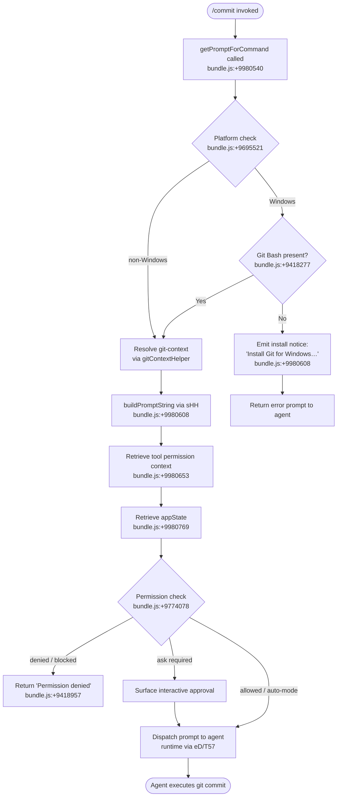

# `/commit`

> Analysis basis: CC v2.1.141 bundle.js (AST extraction + Claude interpretation)
> Minimum version: v2.1.141

---

## Overview

The `/commit` command instructs the Claude Code agent to create a git commit by composing a prompt that is sent to the agent runtime. The handler assembles a prompt string (via `sHH`), resolves tool-permission context, retrieves application state, and then delegates execution to the agent infrastructure. On Windows, the handler checks for the presence of Git Bash and surfaces a user-facing installation notice when it is absent.

---

## Registration

| Field | Value |
|---|---|
| type | `prompt` |
| name | `commit` |
| description | Create a git commit |
| loc_byte | `9980387` |
| loc_byte_end | `9980940` |
| loc_line | `5611` |
| handler_method | `getPromptForCommand` |
| handler_method_start | `9980534` |
| handler_method_end | `9980939` |
| prompt_body.length | `203` |
| prompt_body.trace | `call→sHH(...) (1 literals)` |
| arbor_handler.name | `getPromptForCommand` |
| arbor_handler.fqn | `claude-2.1.141::getPromptForCommand` |
| arbor_handler.kind | `Method` |
| arbor_handler.resolution_path | `direct` |
| arbor_handler.n_hits | `3` |

Analysis basis: CC v2.1.141 bundle.js:+9980387

---

## Input Branching

The handler exhibits four or more distinct branches depending on platform, shell availability, and permission context; a Mermaid flowchart is used.



---

## Behavioral Spec

### Handler Entry Point — `getPromptForCommand`

The method is defined inline on the registration object (ObjectMethod shape). Arbor resolves it directly within the registration byte range `(9980534 – 9980939)`.

```
method getPromptForCommand(context):
    gitContext  = resolveGitContext(context)          // S37 → mvH
    promptText  = buildCommitPrompt(gitContext)       // sHH
    permCtx     = context.getToolPermissionContext()  // loc_byte:9980653
    appState    = context.getAppState()               // loc_byte:9980769
    return { type: "text", prompt: promptText }       // literal "text" loc_byte:9980590
```

Analysis basis: CC v2.1.141 bundle.js:+9980534

---

### Git Context Resolution — `resolveGitContext` (mapped from `S37`)

`S37` is reached immediately after `getPromptForCommand` at `loc_byte:9980571` and delegates to `mvH` for the heavy lifting.

```
function resolveGitContext(context):
    remoteInfo   = detectRemote(context)      // mvH → ThH, literal "remote" loc_byte:9695529
    modelConfig  = resolveModelConfig(context) // mvH → m1
    endpointInfo = resolveEndpoint(context)   // mvH → iY
    shellInfo    = detectShell(context)       // mvH → xfH / gi8
    branchPolicy = resolveBranchPolicy()      // mvH → p_
    return { remoteInfo, modelConfig, endpointInfo, shellInfo, branchPolicy }
```

Analysis basis: CC v2.1.141 bundle.js:+9978157

---

### Platform / Shell Detection — `detectShell` (mapped from `xfH` / `gi8`)

The handler checks whether the active shell identifier ends with a known suffix (e.g., `"bash"`) to decide whether Git Bash is available on Windows.

```
function detectShell(context):
    shellId = context.currentShell
    if shellId.endsWith("bash"):           // xfH → H.endsWith, loc_byte:2146548
        return resolveShellVariant(shellId) // v1
    else:
        return wrapShellFallback(shellId)  // gi8 → xfH, loc_byte:2147200
```

Analysis basis: CC v2.1.141 bundle.js:+9695719

---

### Prompt Construction — `buildCommitPrompt` (mapped from `sHH`)

`sHH` is called from `__handler_commit` at `loc_byte:9980608`. It assembles the final prompt string that the agent receives.

```
function buildCommitPrompt(gitContext):
    // 1. Resolve Windows / Git-Bash availability
    platform = getPlatform()                       // YK → c6, loc_byte:4632142
    if platform == "windows":                      // literal "windows" loc_byte:4632149
        gitBashOk = checkGitBashPresence()         // YK → h_H, loc_byte:4632175
        if not gitBashOk:
            return windowsInstallNotice()          // short fragment: "Install Git for Windows…"

    // 2. Scan staged/unstaged changes
    diffSummary = collectDiffSummary(gitContext)   // Mm → c6/RH/mq/h_H/j6, loc_byte:9418537
    matchedTemplates = scanCommitTemplates(        // H.matchAll, loc_byte:9418564
                           diffSummary)
    hasBangTick = diffSummary.includes("!\`")      // literal "!\`" loc_byte:9418593
                                                   // H.includes, loc_byte:9418582

    // 3. Rewrite any disallowed patterns
    cleanedDiff = rewriteDisallowedPatterns(       // tH8 → H.replace, loc_byte:4757171
                      diffSummary)

    // 4. Resolve shell for Bash tool call
    shellValue = resolveShell(gitContext)           // literal "bash" loc_byte:9418277
    // powershell fallback available                // literal "powershell" loc_byte:9418523

    // 5. Assemble parallel sub-prompts
    subPromises = Promise.all([...])               // loc_byte:9418636
    results     = await subPromises

    // 6. Build final prompt via wj dispatcher
    rawPrompt   = dispatchToAgent(results)         // wj → F_q, loc_byte:9418734

    // 7. Attach UUID and assemble blocks
    uuid        = crypto.randomUUID()              // Ut1.randomUUID, loc_byte:9419036
    blocks      = assembleFinalBlocks(             // Bt1 → H.trim/q.push/_.trim/q.join
                      rawPrompt, uuid)             //   loc_byte:9419094
    cleanBlocks = blocks.replace(...)              // K.replace, loc_byte:9419119

    // 8. Format commit message sections
    finalPrompt = formatSections(cleanBlocks)      // s17 → Bt1/TH, loc_byte:9419177

    return finalPrompt
```

Analysis basis: CC v2.1.141 bundle.js:+9418286

---

### Permission Evaluation — `evaluatePermissions` (mapped from `eD` / `T57`)

After the prompt is built, the pipeline checks whether the Bash tool invocation required by the commit operation is permitted.

```
function evaluatePermissions(toolCall, appState, permCtx):
    // 1. Fetch current app state and sandbox flags
    state       = appState.getAppState()                        // loc_byte:9776876
    sandboxOn   = U_.isSandboxingEnabled()                      // loc_byte:9773836
    autoAllow   = U_.isAutoAllowBashIfSandboxedEnabled()        // loc_byte:9773862

    // 2. Check deny rules (settings + org ceiling)
    denyResult  = checkDenyRules(toolCall)                      // SP6 → _LH/pS_/H_q, loc_byte:9773624
    if denyResult == "deny":                                    // literal loc_byte:9773676
        return blocked("deny rule")

    // 3. Apply ask / plan-mode floor
    askResult   = applyAskRules(toolCall)                       // US_ → gvH/pS_/H_q, loc_byte:9773781
    if askResult == "ask":                                      // literal loc_byte:9773925
        if headlessMode:
            abort("Action requires interactive approval…")      // loc_byte:9777678
        else:
            return promptUser()

    // 4. Auto-mode classifier path
    if autoMode:
        classifierDecision = runAutoModeClassifier(toolCall)    // vJ6, loc_byte:9779551
        emit("tengu_auto_mode_decision")                        // loc_byte:9778591
        if classifierDecision == "allowed":                     // literal loc_byte:9778628
            return allow()
        elif classifierDecision == "blocked":                   // literal loc_byte:9779722
            return blocked("auto-mode classifier")
        elif classifierDecision == "unavailable":               // literal loc_byte:9779694
            if failClosed:
                emit("tengu_iron_gate_closed")                  // loc_byte:9782425
                return blocked("classifier unavailable")
            else:
                emit("tengu_auto_mode_fallback_to_ask")         // loc_byte:9777799
                return promptUser()

    // 5. Fallback: standard permission prompt
    return standardPermissionCheck(toolCall)                    // kH, loc_byte:9774155
```

Analysis basis: CC v2.1.141 bundle.js:+9776834

---

### Auto-Mode Classifier — `runAutoModeClassifier` (mapped from `vJ6`)

```
function runAutoModeClassifier(toolCall):
    // Prepare classifier context
    config      = buildAutoModeConfig(toolCall)          // GS1 → j6/m1, loc_byte:8031185
    emit("tengu_auto_mode_config")                       // loc_byte:8031188

    // Two-stage XML classifier
    stage1      = runFastClassifier(toolCall, config)    // nF4, loc_byte:8022085
    if stage1.result == "success":                       // literal loc_byte:8022338
        if stage1.verdict == "Allowed by fast classifier": // literal loc_byte:8022429
            return "allowed"
        elif stage1.verdict == "Blocked by fast classifier": // literal loc_byte:8023046
            return "blocked"

    stage2      = runThinkingClassifier(toolCall, config) // nF4 → xml_2stage, loc_byte:8021516
    emit("tengu_auto_mode_outcome")                      // loc_byte:8032048

    if classifierUnavailable:
        return "unavailable"

    return stage2.verdict
```

Analysis basis: CC v2.1.141 bundle.js:+8027518

---

### Tool Result Persistence — `persistToolResult` (mapped from `tFH` / `fr9` / `fOH`)

Commit tool results that contain only text content are persisted to disk; non-text content (images, documents) triggers an error.

```
function persistToolResult(result):
    mapped = mapToolResultToParam(result)           // tFH → H.mapToolResultToToolResultBlockParam
                                                   //   loc_byte:4758449
    isEmpty = checkEmpty(mapped)                   // YA4 → H.trim/Array.isArray/H.every
                                                   //   loc_byte:4758692
    if isEmpty:
        emit("tengu_tool_empty_result")            // loc_byte:4758956

    hasNonText = containsNonTextContent(mapped)   // Or9 → Array.isArray/H.some, loc_byte:4759970
    if hasNonText:                                 // literal "image" loc_byte:4760045
        throw Error("Cannot persist tool results containing non-text content")
                                                   // literal loc_byte:4757761

    filePath = computeResultPath(mapped)           // fOH → eH8.writeFile, loc_byte:4757876
    writeFile(filePath, mapped, "wx")              // literal "wx" loc_byte:4757917
    emit("tengu_tool_result_persisted")            // loc_byte:4759196
```

Analysis basis: CC v2.1.141 bundle.js:+4758449

---

## State & Side Effects

| Item | Detail |
|---|---|
| Telemetry — `tengu_cobalt_ridge` | Fired during commit-context collection (loc_byte:4632100) |
| Telemetry — `tengu_auto_mode_fallback_to_ask` | Fired when auto-mode classifier is unavailable and falls back to interactive approval (loc_byte:9777799) |
| Telemetry — `tengu_auto_mode_decision` | Fired for every auto-mode permission decision (loc_byte:9778591) |
| Telemetry — `tengu_auto_mode_config` | Fired when auto-mode classifier config is built (loc_byte:8031188) |
| Telemetry — `tengu_auto_mode_malformed_tool_input` | Fired when classifier receives malformed tool input (loc_byte:8016776) |
| Telemetry — `tengu_auto_mode_outcome` | Fired at conclusion of auto-mode classification (loc_byte:8032048) |
| Telemetry — `tengu_bash_allowlist_strip_all` | Fired when bash allowlist strips all permissions (loc_byte:9779899) |
| Telemetry — `tengu_iron_gate_closed` | Fired when classifier is unavailable and fail-closed policy blocks the action (loc_byte:9782425) |
| Telemetry — `tengu_auto_mode_denial_limit_exceeded` | Fired when auto-mode denial limit is exceeded (loc_byte:9771756) |
| Telemetry — `tengu_tool_empty_result` | Fired when a tool result is empty after mapping (loc_byte:4758956) |
| Telemetry — `tengu_tool_result_persisted` | Fired after successful tool result write to disk (loc_byte:4759196) |
| appState changes | `qoH` calls `H.setAppState` (loc_byte:9771302); `G57` calls `qoH` (loc_byte:9772101) to update state during permission handling |
| Tool permission context | `W57` calls `q.setToolPermissionContext` (loc_byte:9770693) to persist the resolved context |
| File I/O | Tool results written via `oVH.writeFile` / `eH8.writeFile`; directories created via `oVH.mkdir`; temp files removed via `n6K.unlinkSync` (loc_byte:14444736) |
| Hook registration | `iY` / `qA` calls `Uo_.set` (loc_byte:1692) to register a hook entry |
| Telemetry settings load | `loadSettingsFromDisk_start` / `loadSettingsFromDisk_end` markers emitted around settings read (literals loc_byte:1190133, 1190187) |
| Literal sentinel | `/commit` string present at loc_byte:9980926, used internally to identify the command route |

---

## Version History

| Version | Change |
|---|---|
| v2.1.141 | Initial analysis |

---

## Common Mistakes

1. **Missing Git Bash on Windows** — `/commit` requires `bash` shell (literal `"bash"` at loc_byte:9418277). If Git Bash is not installed, the handler emits the "Install Git for Windows" notice and does not proceed. Switching the skill's shell frontmatter to `shell: powershell` is the documented alternative.
2. **Insufficient permissions in auto-mode** — When the auto-mode classifier is unavailable and the deployment policy is fail-closed (`tengu_iron_gate_closed`), the commit is blocked entirely. Use `/compact` to reduce conversation size if the classifier transcript exceeds the context window.
3. **Non-text tool result content** — If a preceding tool call in the same session returns image or document content, `persistToolResult` will throw and the commit pipeline will abort. Ensure all pending tool results are text-only before invoking `/commit`.
4. **Headless / non-interactive context** — In headless mode, any permission that requires interactive approval aborts the agent with the message "Action requires interactive approval and permission prompts are not available in this context" (literal at loc_byte:9777678). Use `--dangerously-skip-permissions` only when the risk is understood.
5. **Denial-limit enforcement** — Repeated auto-mode denials within a session trigger `tengu_auto_mode_denial_limit_exceeded` (loc_byte:9771756) and abort the agent in headless mode ("Agent aborted: too many classifier denials in headless mode", literal loc_byte:9771947).

---

## Appendix — Identifier Mapping

> For bundle debugging only. Identifiers change across versions.

| Identifier | Role |
|---|---|
| `__handler_commit` | Synthetic BFS entry point for the `/commit` handler |
| `S37` | Git-context resolver dispatcher (calls `mvH`) |
| `mvH` | Main git-context assembly function |
| `ThH` | Remote-detection helper (called from `mvH`) |
| `M36` | Shared model/config utility (called from `mvH` and `gM_`) |
| `iY` | Endpoint/hook resolution function |
| `qA` | Hook registration core (sets `Uo_.set`) |
| `q` | Temp-file cleanup helper (calls `n6K.unlinkSync`) |
| `gM_` | Endpoint builder helper |
| `m1` | Model config resolver |
| `Ta` | Model variant selection helper |
| `zq` | Model name normalisation function |
| `mJ` | Model alias mapping function |
| `xfH` | Shell detection / suffix-check function |
| `H` | Shared utility namespace (Math.random, setTimeout, etc.) |
| `v1` | Shell variant resolver |
| `gi8` | Shell fallback wrapper (calls `xfH`) |
| `p_` | Branch policy resolver |
| `ex` | Settings loader (emits `loadSettingsFromDisk_start/end`) |
| `YK` | Platform / OS detection function |
| `sHH` | Commit prompt builder (main prompt assembly) |
| `Mm` | Diff-summary collector |
| `RH` | Boolean-string converter |
| `mq` | Boolean-string converter (alternate) |
| `j6` | Telemetry / event dispatcher |
| `b76` | Telemetry batch helper |
| `x76` | Telemetry serialiser |
| `Js` | Telemetry sink writer |
| `vi6` | Telemetry dedup / rate-limit guard |
| `h6` | Telemetry timestamp annotator |
| `tH8` | Pattern rewriter (H.replace wrapper) |
| `eD` | Agent execution dispatcher |
| `T57` | Core permission-and-dispatch pipeline |
| `A` | App-state namespace |
| `SP6` | Deny-rule evaluator |
| `US_` | Ask-rule evaluator |
| `pT` | Sandbox-aware permission resolver |
| `Z7` | Permission reason / label builder |
| `kH` | Standard permission prompt handler |
| `ZY8` | Recursive permission check helper |
| `bQ` | Permission result aggregator |
| `__q` | Internal queue utility |
| `s8q` | Session queue helper |
| `e8q` | Env-based permission filter |
| `v` | Formatted message builder |
| `SH` | JSON serialiser wrapper |
| `Xz6` | App-state update helper |
| `qoH` | App-state setter (calls `H.setAppState`) |
| `L_q` | Lifecycle queue helper |
| `Q` | Queue utility |
| `P9` | Property ownership / prefix checker |
| `uA8` | Unknown-permission fallback |
| `Nx` | Permission context narrower |
| `$E_` | Early-exit permission helper |
| `rq1` | Allowlist set accumulator |
| `vJ6` | Auto-mode classifier orchestrator |
| `hS1` | Classifier state setter |
| `RS1` | Classifier result reader (calls `SS1`) |
| `GS1` | Classifier config builder |
| `BF4` | Permission template builder |
| `TK` | Tool filter helper |
| `yS1` | Classifier input builder |
| `xF4` | Classifier stage executor |
| `SS1` | Classifier auto-input converter |
| `J` | Process manager namespace |
| `Lj` | Token / context slicer |
| `f` | Connection / file namespace |
| `Ti` | Tool invocation helper |
| `fE_` | Auto-mode event emitter |
| `rF4` | Fast-path result handler |
| `nF4` | XML two-stage classifier runner |
| `oF4` | Outcome handler |
| `WS1` | Classifier write helper |
| `xS1` | Classifier read helper |
| `KKH` | Ephemeral/global classifier cache |
| `KE_` | Classifier error handler |
| `AE_` | Aborted-classifier handler |
| `zH6` | Classifier transcript too-long handler |
| `qE_` | Transcript-length fallback |
| `YS1` | Tool-use block finder |
| `JQ` | Classifier outcome recorder |
| `ff8` | Classifier failure formatter |
| `DS1` | Schema validator (calls `_.safeParse`) |
| `pS1` | Prompt-length guard |
| `TH` | String converter |
| `kS1` | File writer (mkdir + writeFile) |
| `mS1` | Timeout/error classifier |
| `OzH` | Allowlist delete handler |
| `qF6` | Config file reader |
| `bfH` | Config file loader |
| `aeH` | Token-count input aggregator |
| `Uj` | Token-count output aggregator |
| `seH` | Token-count cache-read aggregator |
| `teH` | Token-count cache-creation aggregator |
| `CE` | Commit telemetry emitter |
| `M_q` | Mode query helper |
| `uq1` | Session context builder |
| `G57` | Denial-count tracker / state updater |
| `mq1` | Denial counter |
| `f_q` | Final queue helper |
| `W57` | Tool permission context setter |
| `ALH` | Permission request builder |
| `foH` | Permission request formatter |
| `WDH` | Permission context resolver (sandbox + rules) |
| `OC` | Override context builder |
| `eV` | Edit-acceptance config helper |
| `k_` | Error constructor wrapper |
| `K_q` | Post-execution cleanup |
| `wj` | Agent run dispatcher |
| `F_q` | Agent stop-sequence handler |
| `$` | Agent completion resolver |
| `M` | Agent message router |
| `L` | Async set / lifecycle tracker |
| `tFH` | Tool result mapper |
| `fr9` | Tool result processor |
| `YA4` | Empty-result detector |
| `Or9` | Non-text content detector |
| `zr9` | Content reducer |
| `fOH` | Tool result file writer |
| `$OH` | Overflow content handler |
| `MOH` | Media content handler |
| `Kr9` | Token-limit enforcer (Math.min) |
| `Bt1` | Prompt block assembler |
| `_` | Generic utility namespace |
| `K` | Padding / alignment utility |
| `s17` | Final section formatter |

---

Note: index built via Arbor fallback; some signals (telemetry, literals) may be missing — see arbor-fallback.js.