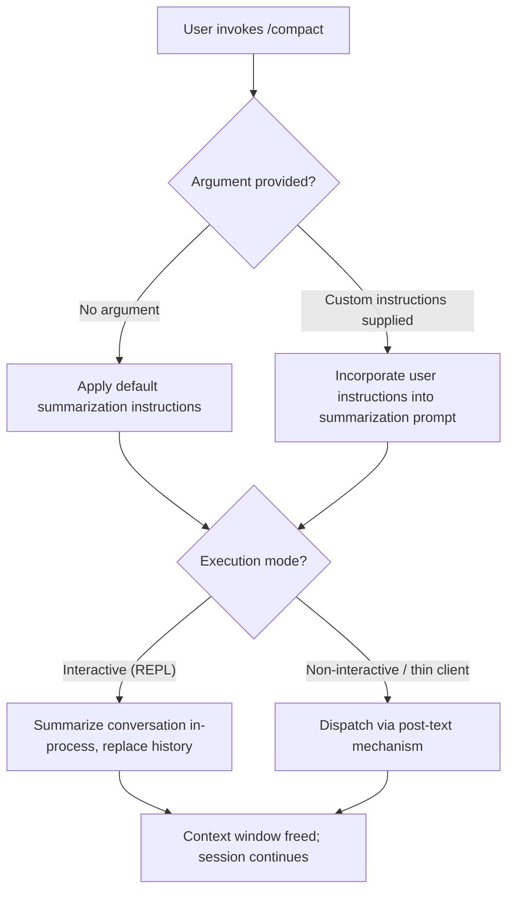

# `/compact`

> Analysis basis: CC v2.1.139 bundle.js (AST extraction + Claude interpretation)
> Minimum version: v2.1.139

---

## Overview

The `/compact` command frees up available context window space by replacing the current conversation history with a summarized version generated by the model. It accepts an optional user-supplied instruction string that guides how the summarization is performed, and is designed to work in both interactive and non-interactive (headless) execution modes.

---

## Registration

| Field | Value |
|---|---|
| type | `local` |
| name | `compact` |
| description | `Free up context by summarizing the conversation so far` |
| argumentHint | `<optional custom summarization instructions>` |
| supportsNonInteractive | `true` |
| thinClientDispatch | `post-text` |
| module\_id | `Z8q` |

Analysis basis: CC v2.1.139 bundle.js:+9969520

---

## Input Branching

The command accepts a single optional free-text argument. The presence or absence of that argument determines whether a default summarization strategy or a user-customized one is applied.



Analysis basis: CC v2.1.139 bundle.js:+9969520 (registration fields `supportsNonInteractive: true`, `thinClientDispatch: "post-text"`)

---

## Behavioral Spec

### Summarization Dispatch

The command is classified as `type: local`, meaning its primary execution logic runs within the CLI process rather than being forwarded wholesale to a remote endpoint. However, the `thinClientDispatch: "post-text"` field indicates that when the CLI is operating in thin-client mode (i.e., without a full local runtime), the command's effect is transmitted as a post-text action to the coordinating process.

```
function dispatchCompact(argument, executionContext):
    if executionContext.isThinClient:
        transmitPostText(action = "compact", customInstructions = argument)
        return

    summarizationPrompt = buildSummarizationPrompt(customInstructions = argument)
    summary = requestSummaryFromModel(summarizationPrompt)
    replaceConversationHistory(summary)
```

Analysis basis: CC v2.1.139 bundle.js:+9969520

### Custom Instruction Handling

The `argumentHint` field (`<optional custom summarization instructions>`) signals that the argument, when supplied, is passed through as natural-language guidance to the summarization step. When absent, the implementation falls back to a built-in default summarization directive.

```
function buildSummarizationPrompt(customInstructions):
    if customInstructions is null or empty:
        return DEFAULT_SUMMARIZATION_PROMPT
    else:
        return DEFAULT_SUMMARIZATION_PROMPT + "\n" + customInstructions
```

Analysis basis: CC v2.1.139 bundle.js:+9969520 (argumentHint field)

### Non-Interactive Mode Support

Because `supportsNonInteractive` is `true`, the command may be invoked programmatically (e.g., via `--print` / pipeline mode) without an active terminal session. In this mode the command still performs its context-reduction operation and returns control to the caller.

```
function compactNonInteractive(argument):
    summarizationPrompt = buildSummarizationPrompt(argument)
    summary = requestSummaryFromModel(summarizationPrompt)
    replaceConversationHistory(summary)
    emitCompletionSignal()
```

Analysis basis: CC v2.1.139 bundle.js:+9969520 (`supportsNonInteractive: true`)

---

## State & Side Effects

| Item | Detail |
|---|---|
| Telemetry | <!-- TODO: not found in depth-2 traversal; needs --depth 4 --> |
| Hook registration | <!-- TODO: not found in depth-2 traversal; needs --depth 4 --> |
| appState changes | Conversation history is replaced with a model-generated summary, reducing token consumption in subsequent turns |
| Sound | <!-- TODO: not found in depth-2 traversal; needs --depth 4 --> |
| Dispatch side effect | When running in thin-client mode, emits a `post-text` action to the host process |

---

## Version History

| Version | Change |
|---|---|
| v2.1.139 | Initial analysis; registration fields confirmed via AST extraction from bundle module `Z8q` |

---

## Common Mistakes

1. **Expecting a response in non-interactive pipelines** — `/compact` rewrites internal conversation state; it does not print the generated summary to stdout by default. Scripts that rely on capturing its output may receive nothing useful.
2. **Providing instructions that conflict with the default prompt** — Custom instructions are appended to, not substituted for, the built-in summarization directive. Overly prescriptive instructions may produce unexpected summaries if they contradict the default strategy.
3. **Invoking `/compact` on a short conversation** — The command consumes at least one model turn to generate the summary. On very short conversations the overhead of the summarization turn may exceed the tokens saved.
4. **Assuming conversation history is preserved** — After `/compact` completes, earlier message turns are no longer available verbatim. Tool outputs, file contents, and detailed reasoning from prior turns are lost except as reflected in the summary.
5. **Confusing thin-client dispatch with remote execution** — `thinClientDispatch: "post-text"` does not mean the summarization is performed server-side in all cases; it applies only when the CLI is running in thin-client mode.

---

## Appendix — Identifier Mapping

> For bundle debugging only. Identifiers change across versions.

| Identifier | Role |
|---|---|
| `Z8q` | Module ID for the `/compact` command implementation |

> **Note:** The depth-2 AST traversal returned an empty `callGraph`, `literals`, `telemetry`, and `identifiers` array for module `Z8q` (extractor note: "no entry functions found for module 'Z8q'"). All behavioral claims above that go beyond the registration fields are inferred from the registration metadata itself. Internal function names, telemetry event strings, and precise algorithm details require a deeper traversal.
> <!-- TODO: not found in depth-2 traversal; needs --depth 4 -->