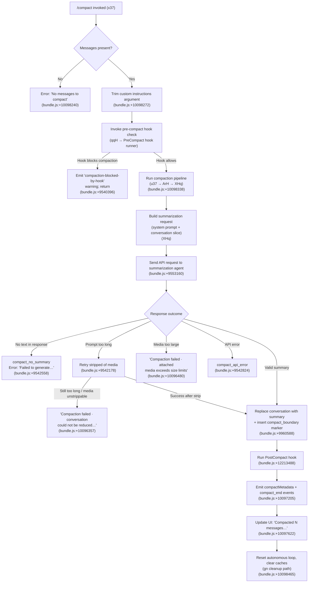

# `/compact`

> Analysis basis: CC v2.1.142 bundle.js (AST extraction + Claude interpretation)
> Minimum version: v2.1.142

---

## Overview

`/compact` frees up conversation context by summarizing the conversation history into a condensed form, replacing the full message history with a summary. The command supports an optional argument for custom summarization instructions and can run in both interactive and non-interactive modes. It is also triggered automatically by the runtime when the context window nears capacity (`autoCompactEnabled`).

---

## Registration

| Field | Value |
|---|---|
| type | `local` |
| name | `compact` |
| description | `Free up context by summarizing the conversation so far` |
| argumentHint | `<optional custom summarization instructions>` |
| supportsNonInteractive | `true` |
| thinClientDispatch | `post-text` |
| module_id | `Fqq` |
| load_inline | `true` |
| loc_byte | `10099125` |
| loc_byte_end | `10099438` |
| loc_line | `5722` |
| arbor_handler.name | `x37` |
| arbor_handler.fqn | `claude-2.1.142::x37` |
| arbor_handler.kind | `AsyncFunction` |
| arbor_handler.resolution_path | `module_id` |
| arbor_handler.n_hits | `0` |

Analysis basis: CC v2.1.142 bundle.js:+10099125

---

## Input Branching

The command has 5+ distinct code paths depending on whether the conversation has messages, whether a PreCompact hook blocks compaction, the summarization outcome, and whether auto-compaction is enabled.



---

## Behavioral Spec

### 1. Entry Guard — Empty Conversation Check

```
async function compactCommandHandler(userArg, context):
    if conversationMessages.length == 0:
        throw Error("No messages to compact")   # bundle.js:+10098240
    customInstructions = userArg.trim()          # bundle.js:+10098272
```

Analysis basis: CC v2.1.142 bundle.js:+10098209

---

### 2. PreCompact Hook Evaluation

```
function runPreCompactHook(context):
    # Calls qqH → Dz6 → G6 hook dispatch chain
    result = dispatchHook("PreCompact", hookPayload)   # bundle.js:+5457462
    if result.blocked:
        emitWarning("compaction-blocked-by-hook",      # bundle.js:+9540396
                    "compaction blocked by PreCompact hook")
        return BLOCKED
    return ALLOWED
```

The hook runner resolves registered `PreCompact` hooks (literal `"PreCompact"` at bundle.js:+12183340) and may block the compact operation entirely if a hook responds with a block signal.

Analysis basis: CC v2.1.142 bundle.js:+10098318

---

### 3. Compact Pipeline Orchestration (`u37`)

```
async function compactPipeline(customInstructions, context):
    startTime = performance.now()              # bundle.js:+10095818
    tokenCount = estimateCurrentTokenCount()   # KZ call
    hookResults = await runPreCompactHooks()   # bundle.js:+10095840

    emitProgress("compact_progress")          # bundle.js:+10095681
    emitProgress("hooks_start")               # bundle.js:+10095712
    emitProgress("pre_compact")               # bundle.js:+10095735
    emitProgress("sdk_status", "compacting")  # bundle.js:+10095777, +10095797

    # Determine trigger mode: "manual" vs auto
    mode = "manual"                            # bundle.js:+10095892

    appState = await getAppState()
    systemPromptParts = await buildSystemPrompt(context)  # Bqq
    summary = await runSummarizationAgent(                # ArH → XHq
                  systemPromptParts,
                  conversationSlice,
                  customInstructions)

    if summary.error:
        handleCompactError(summary.error)
    else:
        applyCompactionResult(summary.text)
```

Analysis basis: CC v2.1.142 bundle.js:+10095818

---

### 4. System Prompt Assembly for Compaction (`Bqq` / `HG`)

```
async function buildSystemPromptForCompaction(context):
    appState = context.getAppState()      # bundle.js:+10097678
    agentMemory = loadAgentMemory()       # Xb
    systemPrompt = assembleSystemPrompt(  # HG — large assembly function
        memoryFiles,                      # c76 reads CLAUDE.md, CLAUDE.local.md
        environmentInfo,
        modelSettings,
        toolPermissions
    )
    return systemPrompt
```

The `HG` function (system prompt builder) calls `c76` which reads memory files (`CLAUDE.md`, `CLAUDE.local.md` per literals at bundle.js:+3158385, +3158427) and optionally team memory when enabled (`Z0H.isTeamMemoryEnabled` at bundle.js:+3247979).

Analysis basis: CC v2.1.142 bundle.js:+10097702

---

### 5. Summarization Agent Call (`ArH` → `XHq`)

```
async function runSummarizationAgent(systemPrompt, messages, customInstructions):
    # ArH: outer compaction controller
    # XHq: inner streaming compaction request loop

    normalizedMessages = normalizeMessagesForCompaction(messages)
    # Strips images → "[image]", documents → "[document]"  bundle.js:+9538111
    # Marks tool use blocks appropriately

    # Deny tool use during compaction (bundle.js:+9551163)
    toolPolicy = "deny"

    systemInstructions = "You are a helpful AI assistant tasked with summarizing conversations."
    # bundle.js:+9553160

    response = await streamingAPICall(
        model = resolveCompactionModel(),
        system = systemInstructions,
        messages = normalizedMessages,
        maxOutputTokens = resolveMaxOutputTokens(),  # CLAUDE_CODE_MAX_OUTPUT_TOKENS env var
        customInstructions = customInstructions
    )

    if response has no text content:
        emit("tengu_compact_no_summary")
        throw Error("Failed to generate conversation summary…")   # bundle.js:+9542558

    if response.stopReason == "prompt_too_long":
        retry with stripped media                  # bundle.js:+9542178
        emit("tengu_compact_ptl_retry")            # bundle.js:+9542218

    return response.summaryText
```

The compaction agent is explicitly prevented from using tools: `"Tool use is not allowed during compaction"` (bundle.js:+9551178). If the agent produces non-text output, the error `"compaction agent should only produce text summary"` is raised (bundle.js:+9551258).

A `setInterval` watchdog with 30 000 ms timeout is established during the streaming call (bundle.js:+9551572) to detect stalled streams.

Analysis basis: CC v2.1.142 bundle.js:+9541168 (ArH entry), +9551458 (XHq entry)

---

### 6. Compact Result Application

```
function applyCompactionResult(summaryText, context):
    # Insert compact_boundary sentinel message
    insertMessage({type: "system", subtype: "compact_boundary"})
    # literals bundle.js:+9960566, +9960588

    # Set autoCompactEnabled flag
    updateFlag("autoCompactEnabled", true)   # bundle.js:+9560534

    # Replace messages in state
    replaceConversationWithSummary(summaryText)

    # Emit "Conversation compacted" confirmation message
    emitMessage("Conversation compacted")    # bundle.js:+9960098

    # Persist compactMetadata
    setState("compactMetadata", metadata)    # bundle.js:+10096689
```

Analysis basis: CC v2.1.142 bundle.js:+9960588

---

### 7. Post-Compact Cleanup (`gn`)

```
function postCompactCleanup(context):
    # Runs after successful compaction (bundle.js:+10098465)
    clearPrecomputedCompactCache()     # iA8, Pq1
    resetAutonomousLoopDelivered()     # i34.resetAutonomousLoopDelivered  bundle.js:+5457118
    clearToolResultCache()             # dA8 cleanup
    reinitializeHookState()            # HK1, Fn
    emitProgress("post_compact_cleanup")   # bundle.js:+5457009
```

Analysis basis: CC v2.1.142 bundle.js:+10098465

---

### 8. Auto-Compact Mode (`ArH` reactive trigger path)

When the runtime detects that the conversation is approaching the context limit, it triggers compaction automatically. The trigger mode is `"compact_auto"` (bundle.js:+9541035) versus `"compact_manual"` for user-invoked compaction (bundle.js:+9541050).

```
function autoCompactCheck(context):
    if tokenUsage / contextWindow > threshold:
        mode = "compact_auto"
        runCompactionPipeline(mode, noCustomInstructions)
    else:
        mode = "compact_manual"  # or skip
```

The threshold calculation uses `Wh_` (auto-threshold resolver) which parses values ending in `"auto"` (bundle.js:+9558476), numeric percentages (÷ 100, bundle.js:+9558617), and integer counts (÷ 1000, bundle.js:+9558581).

Analysis basis: CC v2.1.142 bundle.js:+9541035, +9558862

---

### 9. Reactive Compact (`BA8` / `yw_`)

A background reactive compact can also be triggered separately. It requires at least 2 message groups to proceed:

```
function reactiveCompact(messages):
    if groups < 2:
        log("Reactive compact: fewer than 2 groups, nothing to compact")
        # bundle.js:+5432350
        return {reason: "too_few_groups"}   # bundle.js:+5432440

    summarize subset of messages (seeded selection, groups ≥ 3)
    # bundle.js:+5432587

    if no assistant messages in set:
        log("Reactive compact: no assistant messages in summarize set, bailing")
        # bundle.js:+5432912
        return {reason: "exhausted"}

    result = callSummarizationAPI(subset)

    if result.mediaError:
        retry without media
        if still fails:
            return {reason: "media_unstrippable"}

    emit("tengu_reactive_compact_succeeded")   # bundle.js:+5462530
```

Analysis basis: CC v2.1.142 bundle.js:+5432275

---

### 10. Error Reporting

| Error Condition | User-visible Message | Telemetry |
|---|---|---|
| Prompt too long after strip | `"Compaction failed · conversation could not be reduced below the context limit"` (bundle.js:+10096357) | `tengu_compact_ptl_retry` |
| Media exceeds size | `"Compaction failed · attached media exceeds size limits"` (bundle.js:+10096480) | `tengu_compact_failed` |
| No summary generated | `"Failed to generate conversation summary - response did not contain valid text content"` (bundle.js:+9542586) | `tengu_compact_no_summary` |
| API error | `"unknown error"` fallback (bundle.js:+10096605) | `tengu_compact_api_error` |
| Canceled by user | `"Compaction canceled."` (bundle.js:+10098745) | — |
| Blocked by PreCompact hook | `"compaction blocked by PreCompact hook"` (bundle.js:+9540430) | — |

---

## State & Side Effects

| Item | Detail |
|---|---|
| Telemetry — primary | `tengu_compact` (bundle.js:+9544052) |
| Telemetry — auto trigger | `tengu_compact_cache_prefix` (bundle.js:+9541765), `tengu_compact_cache_sharing_success` (bundle.js:+9551968), `tengu_compact_cache_sharing_fallback` (bundle.js:+9552553) |
| Telemetry — reactive | `tengu_reactive_compact_attempt` (bundle.js:+5433073), `tengu_reactive_compact_failed` (bundle.js:+5460568), `tengu_reactive_compact_succeeded` (bundle.js:+5462530) |
| Telemetry — errors | `tengu_compact_failed` (bundle.js:+9554379), `tengu_compact_ptl_retry` (bundle.js:+9542218), `tengu_compact_no_summary` (via `compact_no_summary` literal bundle.js:+9542487), `tengu_compact_api_error` (via `compact_api_error` literal bundle.js:+9542824) |
| Telemetry — precomputed | `tengu_precomputed_compact_discarded` (bundle.js:+5440567) |
| Telemetry — OTEL | `"compaction"` metric emitted via `fOH` / `YL` pipeline (bundle.js:+4854963) |
| Hook registration | Fires `PreCompact` hook before summarization; fires `PostCompact` hook after successful compaction (literals bundle.js:+12183340, +12213488) |
| appState changes | Sets `autoCompactEnabled = true`; writes `compactMetadata`; replaces full message history with summary + `compact_boundary` sentinel |
| Conversation boundary | Inserts a synthetic `system` / `compact_boundary` message to delimit pre-compaction history (bundle.js:+9960588) |
| Cache clearing | Clears pre-computed compact cache (`iA8`, `Pq1`); clears tool result cache (`dA8`) |
| Autonomous loop reset | Calls `i34.resetAutonomousLoopDelivered()` (bundle.js:+5457118) |
| UI action | Registers `app:toggleTranscript` keybinding `ctrl+o` (bundle.js:+10097483, +10097515); displays `"Compacted N …"` status (bundle.js:+10097622) |
| Sound | <!-- TODO: not found in depth-2 traversal; needs --depth 4 --> |
| Stream watchdog | Sets 30 000 ms `setInterval` during compaction API call; clears with `clearInterval` on completion (bundle.js:+9551572, +9554528) |

---

## Version History

| Version | Change |
|---|---|
| v2.1.142 | Initial analysis |

---

## Common Mistakes

1. **Running `/compact` on an empty session**: The command immediately throws `"No messages to compact"` if the conversation has no messages (bundle.js:+10098240). Start a conversation first.
2. **Assuming tool use works during compaction**: All tool calls are explicitly denied with `"Tool use is not allowed during compaction"` (bundle.js:+9551178). The compaction agent is a text-only summarizer.
3. **Expecting images and documents to be preserved verbatim in the summary**: The normalizer replaces image blocks with `"[image]"` and document blocks with `"[document]"` (bundle.js:+9538111, +9538177) before sending to the summarization model.
4. **Treating `/compact` and auto-compact as identical**: Manual invocation sets mode `"compact_manual"` while the automatic trigger sets `"compact_auto"` (bundle.js:+9541035, +9541050); they follow the same pipeline but are tracked separately in telemetry.
5. **Not accounting for PreCompact hook blocking**: If a `PreCompact` hook is registered and returns a block signal, compaction is silently cancelled with a warning rather than an error (bundle.js:+9540396).
6. **Expecting conversation history to survive after compaction**: After a successful compact, the full message history is permanently replaced in session state by the summary plus the `compact_boundary` marker. This cannot be undone within the session.

---

## Appendix — Identifier Mapping

> For bundle debugging only. Identifiers change across versions.

| Identifier | Role |
|---|---|
| `x37` | Main async handler for `/compact` command (Arbor-resolved entry point) |
| `j3` | Message slice / conversation segment helper |
| `nf7` | Message normalization helper (called from j3) |
| `uP` | Utility called from nf7 |
| `qqH` | PreCompact hook dispatch orchestrator |
| `Dz6` | Hook evaluation core (called by qqH) |
| `E_` | Hook/event emitter primitive |
| `G6` | Hook registry / session event dispatcher |
| `Z76` | Session event helper A |
| `V76` | Session event helper B |
| `ws` | Hook wiring utility |
| `Ji6` | Hook set membership tracker |
| `y6` | Timestamp / state recorder |
| `iJ` | Token / model config resolver |
| `bH` | String conversion utility |
| `sG` | Model name matcher helper |
| `wAH` | Model name string helper |
| `mc` | Model capability resolver |
| `I1` | Model inference profile checker |
| `xy` | Provider type resolver |
| `Iw` | Provider URL builder |
| `DAH` | Model default config builder |
| `ql6` | Token budget calculator |
| `EY` | Context efficiency tracker |
| `H98` | Auto-compact threshold configurator |
| `l0` | Config loader |
| `L7` | Legacy/default config reader |
| `Wh_` | Auto-compact threshold value parser |
| `u37` | Compact pipeline orchestrator (main body) |
| `KZ` | Token counter / context estimator |
| `UK7` | Message serializer for API |
| `PFH` | Message format transformer |
| `xh_` | Message content normalizer (images→`[image]`, etc.) |
| `Ug` | Hook runner for PreCompact |
| `z4` | Hook configuration reader |
| `V6` | Version/config helper |
| `Ly` | Legacy config helper |
| `xX` | Effort-value resolver |
| `sE` | Effort enum mapper |
| `A` | Effort value accessor |
| `FZ` | Effort-to-API param builder |
| `h6` | System prompt section builder |
| `O2` | Hook executor (runs individual hook entries) |
| `ym` | Policy settings accessor |
| `v` | Debug logger |
| `aLH` | Hook event type labeler |
| `jQ_` | Hook configuration parser (PreToolUse, PostToolUse, etc.) |
| `Pyq` | Hook priority queue helper |
| `JQ_` | Hook filter (third-party) |
| `Xyq` | Hook context resolver |
| `d` | App state accessor |
| `RH` | JSON serializer wrapper |
| `NH` | Hook notification logger |
| `uH` | App state reader |
| `gPH` | State metrics helper |
| `yZ` | Abort controller manager |
| `j` | Worker/callback reference |
| `B6H` | Hook batch collector |
| `VS` | Hook validation helper |
| `Z28` | Hook result merger |
| `wQ_` | MCP tool hook runner |
| `v28` | Hook output parser (JSON or plain text) |
| `DQ_` | HTTP hook runner |
| `jyq` | HTTP hook output parser |
| `CLH` | Hook cancellation handler |
| `N28` | Shell/spawn hook executor |
| `SH` | State helper |
| `K` | Collection / array helper |
| `L` | Lifecycle / set helper |
| `f` | Process / stream helper |
| `M` | MCP server manager |
| `IvH` | MCP server connection initializer |
| `Peq` | MCP server update applier |
| `$` | MCP client factory |
| `n_5` | MCP client pool manager |
| `Bqq` | System prompt + app state assembler for compaction |
| `HG` | Full system prompt builder (large orchestrator) |
| `kQ_` | System prompt cache key builder |
| `Lz8` | Language/locale system prompt section |
| `m_` | Axios/HTTP helper |
| `kT` | Token budget system prompt section |
| `Dm7` | Coding style system prompt section |
| `wm7` | PM/policy system prompt section |
| `RQ_` | Model-specific capability section |
| `dm7` | Model capability delegator |
| `hO6` | Tool registration for system prompt |
| `Jm7` | Tool section builder |
| `Nm7` | Tool permission context builder |
| `c76` | Memory file loader (CLAUDE.md, CLAUDE.local.md) |
| `Pm7` | System prompt personality section |
| `bm7` | Brief-mode system prompt section |
| `Cm7` | Context management system prompt section |
| `Xm7` | Scratchpad system prompt section |
| `Wm7` | Worktree awareness section |
| `um7` | Output style section |
| `mm7` | Model override section |
| `pm7` | Reproduce-verify workflow section |
| `Bm7` | Brief feature flag checker |
| `Qm7` | Focus mode system prompt section |
| `hm7` | Env/GrowthBook system prompt section |
| `rq1` | Agent memory compute helper |
| `ym7` | Agent identity section |
| `Gm7` | Goal tracking section |
| `Tm7` | Tone/style section |
| `Em7` | Verified-vs-assumed section |
| `Zm7` | Model restriction section |
| `Vm7` | Verbose/plan mode section |
| `km7` | Session-specific guidance section |
| `nZ9` | Team memory section |
| `SMH` | Token-usage reporter |
| `Xb` | Agent memory loader |
| `rq` | Conversation reset detector |
| `ow` | System prompt accessor |
| `cz8` | App version/config reader |
| `Jh_` | Hook state initializer |
| `yw_` | Reactive compact trigger handler |
| `Dj` | Conversation turn selector |
| `e3H` | Cache entry checker |
| `Fi9` | Compact seed selector |
| `S$6` | Summarization cache store |
| `BA8` | Reactive compact core logic |
| `yQH` | Message accumulator |
| `iq1` | Group boundary calculator |
| `w` | Background daemon session manager |
| `h34` | Summarization API call wrapper |
| `J` | Background job manager |
| `S34` | Gap/seed size calculator |
| `b0` | Model/effort resolver |
| `QD` | Telemetry dispatcher |
| `j8` | State writer |
| `WK1` | Post-compact state restoration handler |
| `W1H` | API client builder |
| `I$6` | Headers-from-entries builder |
| `mTH` | Request metadata builder |
| `$g` | Auth token accessor |
| `$$6` | Cached auth token reader |
| `tyH` | Request timeout setter |
| `UQH` | Queue/rate limiter |
| `wz6` | UUID generator wrapper |
| `je` | Tool schema builder |
| `a34` | Post-compact hook runner |
| `fzH` | Post-compact context restorer |
| `hw_` | Token-at accessor |
| `KqH` | Compact token budget tracker |
| `JA8` | Token rounding helper |
| `wA8` | Output token tracker |
| `z` | Daemon stop helper |
| `gn` | Post-compact cleanup orchestrator |
| `dA8` | Precomputed compact cache manager |
| `QA8` | Cache validity checker |
| `KK1` | Cache timing recorder |
| `N$6` | Cache eviction helper |
| `ET` | Cache TTL evaluator |
| `Mn` | Memory reset helper |
| `Je` | Hook result injector |
| `iV8` | Hook payload validator |
| `AI8` | Hook AI response builder |
| `iA8` | Tool-result cache clearer |
| `Pq1` | Compact cache clearer (Kz6, oD_) |
| `HK1` | Hook state re-initializer |
| `Fn` | Hook teardown handler |
| `ij` | Output token reset |
| `Nw_` | State watcher cleanup |
| `STH` | App state setter |
| `Uqq` | UI notification for compaction |
| `HnH` | Model display name resolver |
| `pg4` | Model tier labeler (opus, sonnet) |
| `eJ` | Keybinding registrar |
| `Ga6` | Keybinding handler A |
| `Ta6` | Keybinding handler B |
| `fOH` | OTEL metrics emitter |
| `YL` | OTEL metric recorder |
| `rZ8` | OTEL attribute builder |
| `gFH` | OTEL instrument factory |
| `MH6` | OTEL scope namer |
| `ut` | Final state setter after compact |
| `un9` | App state updater |
| `ArH` | Compaction agent streaming controller |
| `vQH` | App state reader for compaction |
| `pA8` | Input trimmer |
| `Y8` | Request ID generator |
| `XHq` | Compaction streaming loop (inner) |
| `Sr1` | Cache-sharing hit checker |
| `BiH` | Cache version store accessor |
| `hr1` | Cache-sharing miss handler |
| `jZ` | Agentic turn loop manager |
| `$w_` | Permission context resolver |
| `G` | Tool permission group |
| `Cm` | Random bytes generator |
| `we` | Queue + token watcher |
| `lC` | Turn completion finalizer |
| `RA8` | Abort/stop tracker |
| `qzH` | Error classifier |
| `mA8` | Tombstone message inserter |
| `D` | Daemon process manager |
| `N34` | Turn finalizer helper |
| `Dw_` | Token budget enforcer |
| `AqH` | Max output token resolver |
| `hMH` | Token limit calculator |
| `Bt` | Token value parser (valid/invalid/capped) |
| `NT` | Last-assistant-message finder |
| `Bh` | Array-type guard |
| `Z` | Accumulated text holder |
| `Fd` | Error formatter |
| `ZX6` | Tool search mode resolver |
| `H_` | Tool schema cache |
| `VjH` | Tool search verdict recorder |
| `_ZH` | Model capability for tool search |
| `iIH` | Deferred tool pool checker |
| `kh_` | Tool search status emitter |
| `SK7` | Tool search hit processor |
| `Yw_` | Message content flattener |
| `UA8` | Tool use extractor |
| `HK7` | Tool-use filter |
| `_K7` | Content block mapper |
| `EX6` | Content block extractor |
| `wh_` | Recursive content normalizer |
| `DHq` | Surrogate-pair-aware char slicer |
| `viH` | Streaming response processor (main) |
| `Sh_` | Streaming chunk handler |
| `Yhq` | Full streaming query executor |
| `c0` | Message sequence normalizer |
| `jf7` | Tool-use collector |
| `GR_` | Orphan-message filter |
| `Ef7` | Empty-assistant filter |
| `Tf7` | Whitespace-only assistant filter |
| `Zf7` | Trailing-thinking-block filter |
| `N` | Away-summary throttle guard |
| `aY8` | Media-strip eligibility checker |
| `Rf7` | Request ID assigner |
| `hW` | Compact-hint injector |
| `yZ_` | Abort signal propagator |
| `sY8` | Message role assigner |
| `dh` | Role-to-API mapper |
| `VR_` | Tool reference remover (tool search off) |
| `Pf7` | Tool reference remover (tools unavailable) |
| `T` | Keyboard event interceptor |
| `Xf7` | Image-block filter |
| `EL` | Error literal helper |
| `Y9q` | Media-error classifier |
| `If7` | Media-unstrippable checker |
| `Y` | MCP server lifecycle manager |
| `rAq` | Message queue builder |
| `Cf7` | Context-efficiency message builder |
| `W` | Skills/background watcher |
| `Vf7` | Turn message aggregator |
| `HJ6` | Orphaned-thinking-block detector |
| `rf7` | Last-message accessor |
| `ew6` | Duplicate-message filter |
| `of7` | Slice-normalizer |
| `vf7` | Tool-result appender |
| `iAq` | System-reminder injector |
| `oAq` | Message tail accessor |
| `Gf7` | Group boundary enforcer |
| `q` | File unlink helper (workspace) |
| `X` | Tool execution scheduler |
| `hT8` | Tool batch processor |
| `k_` | Error serializer |
| `JHq` | Conversation slice builder |
| `mBH` | Token usage calculator |
| `ATH` | Array-with-thinking checker |
| `Yf_` | Token match extractor |
| `Am` | Message prefix checker |
| `oA8` | File attachment loader |
| `AK7` | File path resolver for attachments |
| `Bi6` | Path prefix validator |
| `eA` | Path normalizer / safety checker |
| `KK7` | File context builder |
| `IW` | File read helper |
| `D0H` | CLAUDE.md file reader |
| `My_` | At-mention / file reference resolver |
| `$rH` | File read permission checker |
| `FS6` | File system accessor |
| `fpH` | Path type detector (at-mention) |
| `x6` | File read primitive |
| `bA7` | Batch file reader |
| `NI` | File content summarizer for compaction |
| `HXH` | Line-count estimator |
| `H7` | String index helper |
| `$9` | Session UUID generator |
| `v5` | Token rounding precision helper |
| `eA8` | Local agent task snapshot loader |
| `k$` | Task reference builder |
| `HiH` | Task path joiner |
| `aA8` | Plan file loader |
| `A2` | Plan context builder |
| `$8` | Promise-race timeout helper |
| `tA8` | Task state snapshot builder |
| `sA8` | Agent state snapshot builder |
| `QV8` | Agent state map setter |
| `qK7` | Token slice for agent context |
| `LzH` | Deferred tool pool builder |
| `Oy_` | Tool permission set manager |
| `P` | Byte-stream line splitter |
| `J9` | Deferred-tool diff calculator |
| `mQH` | Tool permission context assembler |
| `dY_` | Tool name formatter |
| `Nq` | String coercer |
| `o1H` | Tool access list builder |
| `TnH` | Tool permission set builder |
| `sKH` | MCP tool flatMap helper |
| `s36` | Built-in tool filter |
| `r88` | Case-insensitive tool name matcher |
| `QY_` | Tool label formatter |
| `Lf4` | Tool list joiner |
| `qq` | Anthropic API client factory |
| `jdA` | API client init helper A |
| `JdA` | API client init helper B |
| `bw` | OAuth / API key resolver |
| `pQH` | MCP instructions pool builder |
| `w91` | MCP instruction set updater |
| `Sm` | Hook plugin loader |
| `OL` | Git bare-repo checker |
| `rY` | Process environment builder |
| `V8` | Policy settings loader |
| `cFH` | Plugin capability filter |
| `nRH` | Hook execution logger |
| `G8` | File-append logger |
| `_z6` | Parallel agent session launcher |
| `tX` | Parallel agent turn loop |
| `$5` | System prompt version builder |
| `NU` | Version tag helper |
| `JV` | Module version accessor |
| `__` | System prompt footer builder |
| `GP` | Compact result formatter |
| `HF` | Compact diff header builder |
| `m76` | REPL context accessor |
| `$z6` | REPL context injector |
| `y34` | Mention/reference expander |
| `On` | Cache-prefix setter |
| `PHq` | Compaction error display handler |
| `GH` | Error string formatter |
| `iN` | Shift-register for recent errors |
| `Th_` | Compact summary type builder |