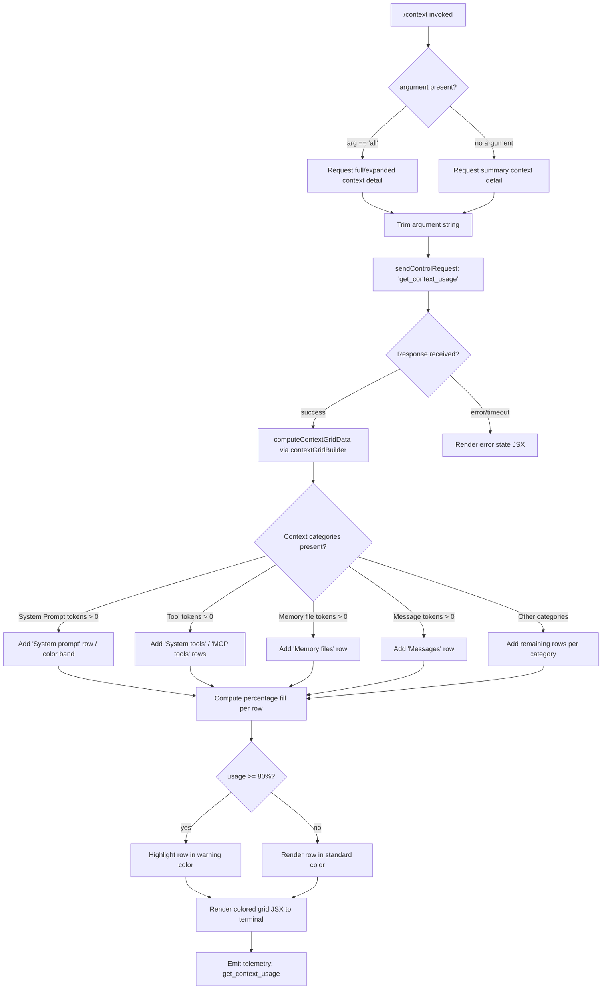

# `/context`

> Analysis basis: CC v2.1.142 bundle.js (AST extraction + Claude interpretation)
> Minimum version: v2.1.142

---

## Overview

`/context` visualizes the current context window usage as a colored grid, giving the user a real-time snapshot of how tokens are distributed across system prompts, tools, memory files, messages, and other categories. It dispatches a `control-request` to the agent process to gather live usage data and renders a JSX component in the terminal. When invoked with the argument `all`, it requests expanded detail across every tracked context category.

---

## Registration

| Field | Value |
|---|---|
| type | `local-jsx` |
| name | `context` |
| description | `Visualize current context usage as a colored grid` |
| argumentHint | `[all]` |
| thinClientDispatch | `control-request` |
| module_id | `J4q` |
| load_inline | `true` |
| loc_byte | `10496138` |
| loc_byte_end | `10496364` |
| loc_line | `5774` |
| arbor_handler.name | `CD7` |
| arbor_handler.fqn | `claude-2.1.142::CD7` |
| arbor_handler.kind | `AsyncFunction` |
| arbor_handler.resolution_path | `module_id` |
| arbor_handler.n_hits | `0` |

Analysis basis: CC v2.1.142 bundle.js:+10496138

---

## Input Branching

Four or more distinct input/state branches are identifiable from the literals and call graph, so a Mermaid flowchart is used.



Analysis basis: CC v2.1.142 bundle.js:+10494772, +10494838, +10495239, +10495008

---

## Behavioral Spec

### 1. Handler Entry — `contextCommandHandler` (CD7)

The Arbor-resolved handler is `CD7`, an `AsyncFunction` reached via `module_id` resolution on module `J4q`.

```
async function contextCommandHandler(args, appState):
    rawArg = args.trim()                          // A.trim at +10494778
    showAll = (rawArg == "all")                   // literal "all" at +10494803

    // Send a control request to the in-process agent
    response = await sendControlRequest(          // K.sendControlRequest at +10494838
        type = "get_context_usage",               // literal at +10494868
        payload = { showAll: showAll }
    )

    // Compute JSX grid representation
    gridData = computeContextGrid(appState, response)  // B26 at +10495008

    // Apply 80% warning threshold                // literal 80 at +10495239
    annotatedGrid = applyUsageThreshold(gridData, warnAt=0.80)

    // Dispatch JSX render
    return renderContextGridJSX(                  // F26.createElement at +10494902
        grid = annotatedGrid,
        systemInfo = buildSystemInfo(appState),   // GH at +10495092
        compactBoundary = getCompactBoundary()    // RD7/j3 at +10495181
    )
```

Analysis basis: CC v2.1.142 bundle.js:+10494772

---

### 2. Control Request Dispatch

`/context` uses `thinClientDispatch: "control-request"` rather than a direct API call. The control-request mechanism serializes the usage query and delivers it to the agent's in-process message loop.

```
function sendControlRequest(type, payload):
    encoded = padEnd(JSON.stringify(payload), width=2)   // f.padEnd at +14485572, literal "  " at +14485593
    emit control channel message with type and encoded payload
    return Promise resolving to context usage object
```

Analysis basis: CC v2.1.142 bundle.js:+10494838, +14485572

---

### 3. Context Grid Builder — `contextGridBuilder` (B26)

This function constructs the colored grid data structure from the raw usage response. It identifies named context categories from the response and maps each to a labeled row with a token count and percentage.

```
function contextGridBuilder(usageResponse, showAll):
    rows = []

    // Filter relevant segments
    segments = usageResponse.filter(segment => showAll OR segment.alwaysShow)
                                                   // A.filter at +10492875
    targetSegment = segments.find(...)             // A.find at +10493193

    // Known category labels (literals from bundle):
    categories = [
        { label: "Free space",          key: "freeSpace"        },  // +10492910
        { label: "Autocompact buffer",  key: "autocompact"      },  // +10492933
        { label: "System prompt",       key: "system"           },  // +9571589
        { label: "System tools",        key: "systemTools"      },  // +9571668
        { label: "MCP tools",           key: "mcpTools"         },  // +9571732
        { label: "MCP tools (deferred)",key: "mcpDeferred"      },  // +9571808
        { label: "System tools (deferred)", key: "sysDeferred"  },  // +9571894
        { label: "Memory files",        key: "memoryFiles"      },  // +9572050
        { label: "Messages",            key: "messages"         },  // +9572613
        { label: "Custom agents",       key: "customAgents"     },  // +9571983
        { label: "Skills",              key: "skills"           },  // +9572112
    ]

    for each category in categories:
        tokenCount = usageResponse[category.key]
        pct        = tokenCount / totalContextTokens
        color      = selectColor(category.key, pct)
        rows.push({ label, tokenCount, pct, color })

    return rows
```

Analysis basis: CC v2.1.142 bundle.js:+10492875, +10492910, +10492933, +9571589–+9572639

---

### 4. Settings Source Labels (used in grid rows)

The bundle contains labels for the named settings sources displayed alongside context usage rows:

| Label | Internal key | loc_byte |
|---|---|---|
| `Project` | `projectSettings` | +10493879 |
| `User` | `userSettings` | +10493899 |
| `Local` | `localSettings` | +10493933 |
| `Flag` | (flag-based settings) | +10493986 |
| `Policy` | (policy settings) | +10494022 |
| `Plugin` | `plugin` | +10494041 |
| `Built-in` | `built-in` | +10494071 |

Analysis basis: CC v2.1.142 bundle.js:+10493859–+10494084

---

### 5. Warning Threshold Application

```
function applyUsageThreshold(rows, warnAt):
    for each row in rows:
        if row.pct >= warnAt:                    // warnAt = 0.80, literal at +10495239
            row.color = "warning"                // literal "warning" at +9572136
        elif row.key == "mcpTools":
            row.color = "cyan_FOR_SUBAGENTS_ONLY"  // literal at +9571759
        elif row.key == "messages":
            row.color = "purple_FOR_SUBAGENTS_ONLY" // literal at +9572639
        else:
            row.color = "standard"               // literal at +9577302
    return rows
```

Analysis basis: CC v2.1.142 bundle.js:+10495239, +9572136, +9571759, +9572639

---

### 6. Compact Boundary Indicator — `compactBoundaryProvider` (RD7 → j3)

```
function getCompactBoundary():
    marker = lookupCompactBoundary()           // j3 -> nf7 at +10494734
    // Literal key: "compact_boundary"         // +9960588
    if marker exists:
        return marker.slice(...)               // H.slice at +9960741
    return null
```

The compact boundary marker is rendered as a visual separator in the context grid, indicating where auto-compaction occurred in the conversation history.

Analysis basis: CC v2.1.142 bundle.js:+10495181, +9960588

---

### 7. System Info Row — `systemInfoFormatter` (GH)

```
function buildSystemInfo(appState):
    infoString = String(appState.systemPromptTokens)   // GH -> String at +171135
    return infoString
```

Analysis basis: CC v2.1.142 bundle.js:+10495092

---

### 8. JSX Render via `gcH` (response listener / streamer)

The handler registers a response listener (`gcH`) on the control channel before rendering:

```
function registerContextResponseListener(controlChannel):
    controlChannel.on("data", handler)         // K.on at +7534214
    rawString = controlChannel.toString()      // f.toString at +7534251
    rendered  = renderJSX(rawString)           // cu -> fL_ -> lR9.createElement at +3709687
    return rendered
```

Analysis basis: CC v2.1.142 bundle.js:+10494898, +7534214

---

### 9. Percentage Formatter — `percentageFormatter` (sjH → rK)

```
function formatPercentage(value, total):
    ratio     = Math.round((value / total) * 100)   // Math.round at +206230
    formatted = tokenCountFormatter(ratio)           // rK -> pq -> D7K at +206104
    suffix    = ".0"                                 // literal at +206171
    if ratio < 20:
        return "< 20"                                // literal at +206210
    if ratio < 10:
        return labelAsSmall(ratio)
    return formatted + suffix
```

Analysis basis: CC v2.1.142 bundle.js:+10494530, +206201, +206210

---

## State & Side Effects

| Item | Detail |
|---|---|
| Telemetry | `get_context_usage` string emitted via control-request response path (literal at +10494868); broader session telemetry events such as `tengu_amber_creek` (+3322149), `tengu_pewter_brook` (+3322057), `tengu_marlin_porch` (+3681213) are reachable in the call graph through shared infrastructure |
| Control request | Dispatches `thinClientDispatch: "control-request"` type `get_context_usage` to the in-process agent |
| appState changes | Read-only access to current token usage; no appState mutations observed within the depth-2 traversal |
| JSX rendering | Creates React elements via `F26.createElement` (+10494902) and `lR9.createElement` (+3709687); renders directly to the terminal UI layer |
| Sound | None detected |
| Hook registration | `gcH` registers a `"data"` event listener on the control channel for the duration of the response; cleaned up after render |

---

## Version History

| Version | Change |
|---|---|
| v2.1.142 | Initial analysis |

---

## Common Mistakes

1. **Omitting the `all` argument** — without `[all]`, deferred MCP tools, system tools (deferred), and lower-priority context categories are hidden. Pass `/context all` for the full picture.
2. **Misreading the warning color** — rows highlighted in the warning color have crossed the 80 % usage threshold (bundle.js:+10495239), not an absolute token ceiling.
3. **Expecting an API call** — `/context` does not make an outbound API request; it uses an internal `control-request` dispatch and returns immediately from cached in-process state.
4. **Confusing the compact boundary separator** — the visual separator in the grid marks where auto-compaction occurred in the conversation, not the current position of the context pointer.
5. **Treating MCP tool rows as standard** — MCP tool rows and deferred MCP tool rows have a distinct color scheme (`cyan_FOR_SUBAGENTS_ONLY`) reserved for subagent display contexts; the colors are not user-configurable.

---

## Appendix — Identifier Mapping

> For bundle debugging only. Identifiers change across versions.

| Identifier | Role |
|---|---|
| `CD7` | Main async handler for `/context` (Arbor-resolved, AsyncFunction) |
| `lA` | Context environment / fullscreen mode resolver |
| `WRH` | Terminal environment type checker |
| `w1_` | Color support / terminal capability detector |
| `Nq` | String formatter for terminal output |
| `bH` | Logging / debug output utility |
| `Vl` | Terminal feature flag reader |
| `sRL` | Terminal type detector (iTerm, screen, tmux) |
| `aRL` | Terminal prefix checker (startsWith) |
| `v` | Core message/content helper |
| `f7K` | Content block formatter |
| `Zt_` | Token type classifier |
| `RH` | JSON serializer wrapper |
| `H5` | File path segment extractor |
| `H6A` | File extension mapper |
| `BhH` | Write/output helper |
| `gHA` | Terminal write dispatcher |
| `O7K` | Conversation log / transcript manager |
| `YhH` | Batch output scheduler (setTimeout/setImmediate) |
| `i8H` | Log join / buffer accumulator |
| `Vv8` | File existence checker |
| `$6A` | Path join wrapper |
| `M6A` | File stat / rename / unlink utility |
| `$7K` | Append-file-with-rotation writer |
| `C9` | Active request set manager (add/delete) |
| `e76` | Boolean/Windows platform branch |
| `m_` | Settings loader entry point |
| `ax` | Settings disk read orchestrator |
| `iS` | Settings cache check |
| `j1` | Settings deduplication tracker |
| `km8` | Settings parse and merge |
| `OB` | Settings object builder |
| `wV6` | Settings post-processor |
| `tRL` | Session init helper |
| `G6` | Session state manager |
| `Z76` | Session init sub-step A |
| `V76` | Session init sub-step B |
| `ws` | Session write helper |
| `Ji6` | Session dedup tracker |
| `y6` | Timestamp recorder |
| `E$` | Argument normalizer |
| `xjH` | Argument parse utility |
| `K` | Control channel / sendControlRequest object |
| `gcH` | Control-response data listener registrar |
| `cu` | JSX render entry point |
| `fL_` | React createElement wrapper |
| `p9H` | Terminal UI component root |
| `MUH` | Context display panel component |
| `B26` | Context grid data builder |
| `rK` | Number/token count formatter |
| `pq` | Locale-aware number formatter |
| `D7K` | Compact number formatter core |
| `qCH` | Context category sorter |
| `sjH` | Percentage formatter |
| `GH` | System info string builder |
| `RD7` | Compact boundary provider |
| `j3` | Compact boundary lookup |
| `nf7` | Compact boundary key resolver |
| `uP` | Compact boundary storage reader |
| `ut` | App state updater |
| `un9` | setState dispatcher |
| `nz8` | Full context assembly orchestrator |
| `m2` | Model info resolver |
| `Ga` | Model registry lookup |
| `RB` | Model metadata builder |
| `lV` | Model display name resolver |
| `xf` | Provider type checker |
| `YM` | Model display label formatter |
| `nV` | Alternate model name formatter |
| `l0` | Auto-compact setting reader |
| `L7` | Legacy config migrator |
| `ix` | Config dedup filter |
| `V8` | Config merger |
| `ii` | Context window size calculator |
| `I1` | System prompt token counter |
| `IU6` | Settings entry mapper |
| `Nw` | Text normalizer (lowercase/replace) |
| `wP` | Text replacer |
| `iJ` | Context token allocator |
| `sG` | Token source mapper |
| `mc` | Token category calculator |
| `DAH` | Token category sub-calculator |
| `ql6` | Token count parser |
| `EY` | Context environment state |
| `Bt` | Token limit validator |
| `H98` | Context row data assembler |
| `E_` | Error state checker |
| `Wh_` | Token size parser (float/int/round) |
| `HG` | System prompt assembler |
| `kQ_` | System prompt key resolver |
| `h6` | Async store context getter |
| `VS6` | Store getter wrapper |
| `__` | Base logger |
| `Lz8` | System prompt section loader |
| `kT` | Knowledge/tool prompt builder |
| `Dm7` | Instruction section builder |
| `D9_` | Instruction sub-section |
| `Y9_` | Instruction formatter |
| `wm7` | Prompt metadata builder |
| `RQ_` | Role/context prompt builder |
| `dm7` | Role prompt wrapper |
| `hO6` | Session context injector |
| `Jm7` | Session context wrapper |
| `Nm7` | Tool/knowledge prompt builder |
| `hU` | Feature gate checker |
| `dz` | Debug logger |
| `Im7` | Instruction formatter sub |
| `o36` | Output format descriptor |
| `GT` | Tool availability checker |
| `m4` | Message content helper |
| `vm7` | Verbose mode prompt |
| `ILH` | Prompt injection guard |
| `yp` | Content array flattener |
| `c76` | Memory/CLAUDE.md prompt builder |
| `xK` | Memory file path resolver |
| `T9H` | Directory creator |
| `Xl` | File type checker (isFile/isDirectory) |
| `SH` | Stat helper |
| `gz` | Memory glob helper |
| `pZ9` | Memory path joiner |
| `E0H` | Memory file loader |
| `mZ9` | Memory config reader |
| `uZ9` | Memory path list builder |
| `y9_` | Memory entry formatter |
| `d` | File descriptor / stat object |
| `Pm7` | Prompt metadata tagger |
| `bm7` | Base model context builder |
| `WX` | Model context validator |
| `yQ_` | Model context token counter |
| `Cm7` | Comprehensive model context builder |
| `SQ_` | OS/release info collector |
| `af` | Feature flag reader |
| `hQ_` | Shell detector |
| `Xm7` | Language prompt builder |
| `Wm7` | Output style prompt builder |
| `um7` | Background session prompt builder |
| `mm7` | Scratchpad prompt builder |
| `U6H` | Scratchpad state getter |
| `JJH` | Scratchpad path joiner |
| `pm7` | Fast-response-context builder |
| `Bm7` | Brief mode checker |
| `Qm7` | Focus/brief mode prompt builder |
| `hm7` | GrowthBook experiment prompt builder |
| `rq1` | Remote tool fetcher |
| `a4H` | Remote tool cache |
| `nV8` | Remote tool normalizer |
| `ym7` | Reproduce/verify workflow prompt |
| `Gm7` | Generic prompt segment builder |
| `Tm7` | Tool listing prompt builder |
| `jm7` | Tool listing sub-builder |
| `Em7` | Extended tool prompt builder |
| `Zm7` | Role context wrapper |
| `Vm7` | Tool permission prompt builder |
| `GP` | Permission prompt formatter |
| `km7` | Knowledge prompt assembler |
| `nZ9` | Memory path normalizer |
| `lZ9` | Memory path sub-normalizer |
| `SMH` | Settings merge helper |
| `CE` | Config entry loader |
| `UM` | Config update merger |
| `VA` | Provider type validator |
| `Xb` | System prompt extractor |
| `rq` | Request queue |
| `ow` | Output writer |
| `YK7` | System prompt section assembler |
| `zK7` | System prompt section parser |
| `rz8` | System prompt section combiner |
| `xm7` | System prompt combined builder |
| `iZ9` | Memory section builder |
| `yyq` | Section prefix resolver |
| `yrH` | Context row assembler |
| `EvH` | Context row token counter |
| `NH` | Error logger with push |
| `kHq` | Context row color selector |
| `DK7` | Built-in tool context builder |
| `k$6` | AutoMem tool filter |
| `wK7` | MCP/external tool context builder |
| `M` | MCP server state manager |
| `IvH` | MCP tool inventory builder |
| `Peq` | MCP update applicator |
| `$` | MCP event emitter |
| `n_5` | MCP client reconciler |
| `FDH` | Deferred tool context builder |
| `oz8` | MCP tool metadata formatter |
| `z` | Daemon stop/signal helper |
| `uH` | File descriptor helper |
| `aR` | Agent route descriptor |
| `Ax` | Process race/exit helper |
| `G` | Tool search index |
| `lX6` | Tool search lookup |
| `hT8` | Tool search metadata |
| `P` | Protocol buffer handler |
| `j` | Protocol index |
| `w` | Worker/daemon process manager |
| `vf` | Stream end/flush helper |
| `s95` | Supervisor session handler |
| `PK7` | Permission prompt context builder |
| `v5` | Math.round wrapper |
| `O` | Output segment accumulator |
| `S8` | Segment storage |
| `D` | Daemon process lifecycle manager |
| `LG6` | Low-memory logger |
| `br_` | Background session spawner |
| `XK7` | Extended context row builder |
| `JK7` | Tool-join context builder |
| `sz_` | Feature gate + hU helper |
| `l1H` | Feature flag filter |
| `NHq` | Tool context key resolver |
| `iq` | Cached symbol resolver |
| `EK7` | Expanded context window builder |
| `WK7` | Context window token counter A |
| `GK7` | Context window token counter B |
| `TK7` | Context window token counter C |
| `c0` | Main conversation turn processor |
| `jf7` | Message block builder |
| `GR_` | Message role resolver |
| `Ef7` | Message content extractor |
| `Tf7` | Attachment type dispatcher |
| `Zf7` | Attachment presence checker |
| `N` | Away-summary / rate-limit guard |
| `aY8` | Content some-checker |
| `Rf7` | UUID generator |
| `Y8` | Turn ID generator |
| `hW` | Hook wait helper |
| `yZ_` | Yield/defer helper |
| `sY8` | System message injector |
| `dh` | Standard/Vertex tool mode selector |
| `VR_` | Tool-reference remover (unavailable) |
| `Pf7` | Tool-reference remover (not enabled) |
| `T` | Remote control keyboard handler |
| `Z` | MCP server lifecycle manager |
| `Xf7` | Array content checker |
| `EL` | End-of-list marker |
| `Y9q` | Yield/next helper |
| `If7` | Orphaned thinking filter |
| `Y` | Supervisor output writer |
| `rAq` | Content push accumulator |
| `xh_` | Full context message normalizer |
| `Cf7` | Content join formatter |
| `W` | Skill/event debouncer |
| `Vf7` | Turn validator |
| `HJ6` | Orphaned thinking block remover |
| `rf7` | Trailing thinking block remover |
| `ew6` | Whitespace-only assistant filter |
| `of7` | Empty assistant content fixer |
| `vf7` | Message window slicer |
| `iAq` | Message array normalizer |
| `oAq` | Message append helper |
| `Gf7` | Content-every/filter/join helper |
| `jK7` | Tool-join row builder |
| `tz_` | Feature gate + hU (alt path) |
| `tG` | Tool name normalizer |
| `n1` | Tool display name formatter |
| `GX6` | Token grid row formatter |
| `_h_` | Grid cell helper |
| `k_` | Error/string coercer |
| `dHH` | Context window min calculator |
| `AqH` | Max output token resolver |
| `hMH` | Token limit table lookup |
| `AH` | Voice/recording toggle helper |
| `Q` | File read/unlink scheduler |
| `Q26` | File read helper |
| `d4q` | File unlink helper |
| `r` | Worker/daemon route |
| `l` | Daemon channel helper |
| `rH8` | Usage-state checker |
| `e3H` | Usage-state set lookup |
| `qqH` | Context size estimator |
| `Dz6` | Context size error logger |
| `L6` | Tool configuration loader |
| `AHH` | Tool config assembler |
| `FqH` | Full tool config builder |
| `_HH` | Tool entry lister |
| `Hw6` | Tool deduplication map |
| `H6` | Tool state reconciler |
| `YH` | Tool lifecycle mapper |
| `OG_` | Tool origin getter |
| `Y6K` | Tool version reconciler |
| `ZH` | Tool stack manager |
| `J9` | Tool registry lookup |
| `hH` | Tool metadata reporter |
| `ox` | Tool cache checker |
| `lH` | Tool lazy loader |
| `KH` | MCP tool reconciler |
| `d6` | Keyboard shortcut handler |
| `p6` | UI panel renderer |
| `_8q` | MCP SDK connect orchestrator |
| `ld9` | VSCode MCP session finder |
| `FHK` | CCD session finder |
| `JH` | Done-state message handler |
| `XH` | Abort controller helper |
| `vH` | Version/variant handler |
| `V` | MCP lifecycle variant |
| `D6` | Plugin/marketplace reconciler |
| `nRH` | Telemetry logger |
| `G8` | File-append logger |
| `Z18` | Settings wait helper |
| `cHK` | Headless plugin installer |
| `vg` | Plugin config validator |
| `jz8` | Plugin state tracker |
| `SDH` | Plugin state clear |
| `VT` | Plugin version tracker |
| `W81` | Plugin zip-cache error reporter |
| `G81` | Plugin install error reporter |
| `ub` | Plugin entry updater |
| `HT8` | Marketplace reconciler |
| `V81` | Plugin install diff reporter |
| `QHK` | Plugin server registrar |
| `n28` | Plugin MCP reconciler |
| `ewH` | Elapsed-ms formatter |
| `WH` | AbortController map |