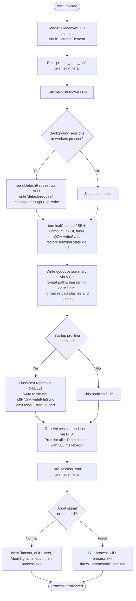

# `/exit`

> Analysis basis: CC v2.1.142 bundle.js (AST extraction + Claude interpretation)
> Minimum version: v2.1.142

---

## Overview

The `/exit` command (aliased as `/quit`) terminates the Claude Code CLI session. When invoked, it immediately renders a farewell UI element ("Goodbye!"), performs an orderly shutdown sequence — flushing output, retiring background workers, writing telemetry, and optionally saving startup-profiling data — before calling `process.exit`. The command is classified as `immediate`, meaning it executes without waiting for any in-progress agent turn.

---

## Registration

| Field | Value |
|---|---|
| type | `local-jsx` |
| name | `exit` |
| description | `null` |
| aliases | `["quit"]` |
| immediate | `true` |
| loc_byte | `11607217` |
| loc_byte_end | `11607378` |
| loc_line | `7220` |
| module_id | `hGq` |
| load_inline | `true` |
| arbor_handler.name | `sN7` |
| arbor_handler.fqn | `claude-2.1.142::sN7` |
| arbor_handler.kind | `AsyncFunction` |
| arbor_handler.resolution_path | `module_id` |
| arbor_handler.n_hits | `1` |

Analysis basis: CC v2.1.142 bundle.js:+11607217

---

## Input Branching

The handler has more than three distinct execution paths (immediate JSX render, ordered shutdown, background-process teardown, startup-perf flush, and process termination), so a Mermaid flowchart is used.



Analysis basis: CC v2.1.142 bundle.js:+11606467 (handler entry), +11606544 (JSX render), +5214016 (terminal cleanup branch), +5214337 (profiling flush), +5214453 (session-end promise), +5214479 (final writeSync)

---

## Behavioral Spec

### 1. Handler Entry — `exitCommandHandler` (`sN7`)

The handler is an `AsyncFunction` resolved via `module_id` → `hGq`.

```
async function exitCommandHandler(context):
    // Step 1: Render farewell UI
    displayGoodbyeComponent()                  // fB_.createElement + aN7/xP
    emitLiteralTelemetry("prompt_input_exit")  // literal at +11606655

    // Step 2: Propagate quit signal to background layers
    sendDetachIfNeeded(context)                // ALH / "detach-request"

    // Step 3: Perform full shutdown
    await performShutdown(context)             // R9
```

Analysis basis: CC v2.1.142 bundle.js:+11606467

---

### 2. Farewell Render — `goodbyeComponent` (`aN7` → `xP`)

```
function goodbyeComponent():
    return createElement(TextComponent, {}, "Goodbye!")  // literal at +11606431
```

The string `"Goodbye!"` is the only user-visible text emitted directly by the command.

Analysis basis: CC v2.1.142 bundle.js:+11606422, +11606544

---

### 3. Background-Session Detach — `detachIfNeeded` (`ALH`)

```
function detachIfNeeded(context):
    sessionType = classifySession()           // _F6
    if sessionType in ["bg", "daemon", "daemon-worker"]:  // literals at +2165871–+2165895
        message = buildDetachRequest()        // Tqq -> ZDH, S8
        sendIPCMessage("detach-request", message)  // Ui -> pi.write, RH -> JSON.stringify
        notifyParent($6H)
```

The session-type literals `"bg"`, `"daemon"`, and `"daemon-worker"` determine whether a detach handshake is required before the process exits.

Analysis basis: CC v2.1.142 bundle.js:+11606483, +10085269, +10085294, +10085303

---

### 4. Scheduled-Task Drain — `scheduledTaskDrain` (`ZD8`)

Before the terminal is torn down, any pending scheduled tasks are drained:

```
function scheduledTaskDrain():
    tasks = collectScheduledTasks("scheduled task")   // literal at +10078890
    for task in tasks:
        scheduleEntry = buildEntry(XV, JV)
        taskQueue.push(task)                          // H.push at +10078876
        result = formatTaskResult(Z37, HZ, II, XFH)
        columnFormat(c1)                              // uses Bun.stringWidth via f8
```

Analysis basis: CC v2.1.142 bundle.js:+11606514, +10078871, +10078876

---

### 5. Terminal Cleanup — `terminalCleanup` (`SEH`)

```
function terminalCleanup():
    QOH.writeSync(terminalOutput)          // flush pending stdout bytes
    inkInstance = E4.get(instanceKey)
    inkInstance.unmount()                  // H.unmount at +5211954
    restoreTerminalState(io6)              // saves/restores cursor: ESC-7 / ESC-8
    applyTermCompatPatches(c0H):           // ghostty >= 1.2.0, iTerm >= 3.6.6
        if terminal == "ghostty": coerce(kk9)
        applyGhosttyFix(gE)
    fixMultiplexerEscapes(k0):             // tmux: replace \t with ESC-ESC
        replaceAll("tmux" prefix, "\x1b\x1b")   // literals at +3314449, +3314495
        handle "screen" multiplexer            // literal at +3314522
```

Terminal-save sequence uses ANSI escape literals `ESC 7` (+3655540) and `ESC 8` (+3655551).

Analysis basis: CC v2.1.142 bundle.js:+5212036, +5211877, +5211954, +3655407

---

### 6. Goodbye Summary Write — `writeSummary` (`VY_`)

```
function writeSummary():
    paths = collectRelevantPaths(PV, rS)
    normalized = paths.replaceAll("\\", "\\\\")   // literals at +5212265, +5212288
    formatted = applyDimStyle(M6.dim, normalized)
    QOH.writeSync(formatted)                       // final stdout flush at +5212346
    statSync check via XO6 (q.statSync)            // verify path exists before display
    joinPaths(qw.join)
```

Analysis basis: CC v2.1.142 bundle.js:+5212177, +5212247, +5212346, +5212362

---

### 7. Force-Kill Fallback — `forceKillFallback` (`IY_`)

```
function forceKillFallback():
    clearTimeout(pendingTimer)
    inkInstance = E4.get(instanceKey)
    process.kill(pid, signal)          // +5212579
    process.exit(code)                 // +5212554
    throw new Error("unreachable")     // sentinel literal at +5212627
```

This path is taken when the graceful shutdown path exceeds its timeout or an abort signal fires.

Analysis basis: CC v2.1.142 bundle.js:+5212473, +5212554, +5212579

---

### 8. Main Shutdown Orchestrator — `performShutdown` (`R9`)

```
async function performShutdown(context):
    // Parallel teardown with timeout guardrails
    await Promise.resolve()                        // +5213942
    shutdownTimer = setTimeout(forceKillFallback, Math.max(5000, 3500))
                                                   // literals at +5214039, +5214046
    dOH.unref(shutdownTimer)                       // allow GC if resolved early

    await terminalCleanup(SEH)
    await writeSummary(VY_)
    await flushStartupProfiling(X66)               // conditional
    await sessionEndTasks(D_8):                    // Promise.all + Promise.race
        timeout = AbortSignal.timeout(500)         // literal at +5213631 (500 ms)
    emitSessionEnd("session_end")                  // literal at +5214410
    collectCacheEvictionHint(geH)                  // tengu_cache_eviction_hint
    QOH.writeSync(finalBytes)                      // +5214479
    await drainSupervisorState(Y):                 // supervisor literal at +14475715
        stopTracker(T.stop)
        updateDaemonConfig(Z.updateConfig, Z.stop, Z.start)
        emitTelemetry("tengu_daemon_config_reload")
        writeQueue(q.write)
        heartbeat(J8K, "heartbeat")                // literal at +14474937
    clearTimeout(shutdownTimer)
    process.exit()
```

The shutdown timer uses `Math.max(5000, 3500)` — effectively 5 000 ms maximum wait before force-kill.

Analysis basis: CC v2.1.142 bundle.js:+5213942, +5214039, +5214046, +5214055, +5214135, +5214159, +5214236, +5214284, +5214301, +5214337, +5214350, +5214362, +5214373, +5214453, +5214479

---

### 9. Startup-Profiling Flush — `flushStartupProfiling` (`X66` → `V6A` → `av8`)

```
function flushStartupProfiling():
    if not profilingEnabled:
        log("Startup profiling not enabled")      // literal at +209030
        return
    checkpoints = collectCheckpoints()
    if checkpoints.empty:
        log("No profiling checkpoints recorded")  // literal at +209120
        return
    report = buildReport(G6A):                    // width 80, header "STARTUP PROFILING REPORT"
        entries = _.entries(checkpoints)
        align columns to width 8
        join into text block (A.join)
    writeToFile(c8H):
        fd = d8H.openSync(path)
        d8H.writeFileSync(fd, report, {encoding: "utf8"})
        d8H.fsyncSync(fd)
        d8H.closeSync(fd)
    log("Startup profiling report:", path)        // literal at +209699
    emitTelemetry("tengu_startup_perf", metrics)  // rounds via Math.round, caps at 1 048 576
```

Analysis basis: CC v2.1.142 bundle.js:+5214337, +209524, +209663, +209699, +210485

---

### 10. Background Worker Management (reached via `Y` / supervisor)

The supervisor object manages background daemon workers; upon exit, it:

```
function supervisorShutdown(supervisorState):
    for worker in A.values(workerMap):
        worker.retireIfSettled()
    if spareEnabled:
        emitTelemetry("tengu_bg_spare_enable")
        if spareClaimed:
            emitTelemetry("tengu_bg_spare_claim")
        else:
            emitTelemetry("tengu_bg_spare_claim_fail")
    for worker in A.values(workerMap):
        if worker needs SIGKILL escalation:
            emitTelemetry("tengu_bg_dispatch_sigkill_escalate")
            worker.kill("SIGKILL")              // literal at +14462694
            setTimeout(followUp, 100)           // literal at +14462718
    if lowMemory(QT8.freemem, threshold 1024):  // literal at +14463119
        emitTelemetry("tengu_bg_dispatch_low_mem")
    spawnSpare(HU.spawn) if conditions met
    emitTelemetry("tengu_bg_spare_spawn")
```

SIGTERM is sent first (+14464459); SIGKILL is the escalation signal (+14462694). Grace period before kill: 30/15 ms thresholds seen at +14462601/+14462612; 2 000 ms daemon timeout at +14462356.

Analysis basis: CC v2.1.142 bundle.js:+14462646, +14463225, +14463840, +14463961, +14464224, +14462423

---

## State & Side Effects

| Item | Detail |
|---|---|
| Telemetry: `tengu_bg_dispatch_sigkill_escalate` | Emitted when a background worker requires SIGKILL escalation (bundle.js:+14462646) |
| Telemetry: `tengu_bg_dispatch_low_mem` | Emitted when free memory is below threshold during shutdown (bundle.js:+14463225) |
| Telemetry: `tengu_bg_spare_enable` | Emitted when spare-worker feature is active (bundle.js:+14463840) |
| Telemetry: `tengu_bg_spare_claim` | Emitted on successful spare-worker claim (bundle.js:+14463961) |
| Telemetry: `tengu_bg_spare_claim_fail` | Emitted when spare-worker claim fails (bundle.js:+14464224) |
| Telemetry: `tengu_bg_spare_spawn` | Emitted when a new spare worker is spawned (bundle.js:+14462423) |
| Telemetry: `tengu_daemon_config_reload` | Emitted when daemon config is persisted on exit (bundle.js:+14476508) |
| Telemetry: `tengu_startup_perf` | Emitted with startup profiling metrics when profiling was enabled (bundle.js:+210485) |
| Telemetry: `tengu_scroll_summary` | Emitted during scroll/summary accounting in shutdown path (bundle.js:+5213342) |
| Telemetry: `tengu_amber_creek` | Emitted inside fullscreen/display layer during teardown (bundle.js:+3322149) |
| Telemetry: `tengu_pewter_brook` | Emitted inside fullscreen/display layer during teardown (bundle.js:+3322057) |
| Telemetry: `tengu_cache_eviction_hint` | Emitted as final cache-eviction signal before process exit (bundle.js:+5214375) |
| Literal: `"session_end"` | Written as shutdown-event marker (bundle.js:+5214410) |
| Literal: `"prompt_input_exit"` | Written as command-invocation marker (bundle.js:+11606655) |
| IPC message | `"detach-request"` written via `pi.write` when background/daemon session is detected |
| Ink UI | Unmounted via `H.unmount` during terminal cleanup |
| stdout | `QOH.writeSync` called twice: once in terminal cleanup, once as final flush |
| Terminal state | Cursor/state saved (ESC 7) and restored (ESC 8); multiplexer escapes patched for tmux/screen |
| Startup-profiling file | Written synchronously with `fsyncSync` when profiling is enabled |
| Supervisor heartbeat | Stopped (`J8K` / `"heartbeat"`) and daemon config updated |
| Timer | A `setTimeout` of `Math.max(5000, 3500)` = 5 000 ms arms the force-kill fallback; unreffed immediately |
| `process.exit` | Called unconditionally at end of graceful path; `process.kill` used for force path |
| appState changes | Tracker stopped (`T.stop`), remote-control config cleared (`"remoteControlAtStartup"` key), user-settings flushed (`"userSettings"`) |

---

## Version History

| Version | Change |
|---|---|
| v2.1.142 | Initial analysis |

---

## Common Mistakes

1. **Assuming `/exit` is synchronous** — The handler is declared `AsyncFunction` (`arbor_handler.kind`). Callers that do not `await` it may observe premature teardown.
2. **Ignoring the `/quit` alias** — The `aliases: ["quit"]` field means both `/exit` and `/quit` invoke identical logic; treating them as separate commands is incorrect.
3. **Expecting a description string** — `registration.description` is `null`; do not expect a help-text string to appear in command-listing UI.
4. **Missing the 5-second force-kill window** — If shutdown tasks (session-end promises, profiling flush) take longer than 5 000 ms, the process is killed unconditionally. Long-running background tasks should not rely on a clean drain.
5. **Overlooking the `immediate` flag** — Because `immediate: true`, the command bypasses any in-progress agent turn. Invoking `/exit` mid-stream cancels the stream rather than waiting for it to complete.
6. **Assuming terminal cleanup is unconditional** — The ESC-7/ESC-8 restore sequence and multiplexer escape fixes are applied only when the relevant terminal environment variables are detected (ghostty ≥ 1.2.0, iTerm ≥ 3.6.6, tmux, screen).

---

## Appendix — Identifier Mapping

> For bundle debugging only. Identifiers change across versions.

| Identifier | Role |
|---|---|
| `sN7` | `exitCommandHandler` — top-level async handler for `/exit` |
| `v1` | `classifyProcessMode` — determines bg/daemon/daemon-worker session type |
| `mB` | `processModeLookup` — helper called by classifyProcessMode |
| `H` | Overloaded utility (random delay helper at +12592945; also array/string accumulator in other scopes) |
| `ALH` | `detachIfNeeded` — sends detach-request to parent process |
| `_F6` | `getSessionTypeFlag` — returns session-type string |
| `Tqq` | `buildDetachRequestMessage` — constructs IPC detach payload |
| `ZDH` | `detachRequestEncoder` — helper for buildDetachRequestMessage |
| `S8` | `detachRequestSerializer` — helper for buildDetachRequestMessage |
| `Ui` | `sendIPCMessage` — writes JSON over IPC pipe |
| `RH` | `jsonStringifyHelper` — wraps JSON.stringify |
| `$6H` | `notifyParentOfDetach` — post-detach parent notification |
| `af` | `quitSignalEmitter` — emits quit/exit signal to UI layer |
| `ZD8` | `scheduledTaskDrain` — collects and formats pending scheduled tasks |
| `XV` | `taskEntryBuilder` — builds a single task entry object |
| `JV` | `baseEntryFactory` — low-level entry constructor (shared) |
| `Z37` | `taskResultFormatter` — formats task result for display |
| `HZ` | `humanReadableSchedule` — converts cron-like spec to human string ("Every minute", "Every hour") |
| `K` | `columnPadFormatter` — pads columns with spaces (also used as Set in other scopes) |
| `w` | `workerLifecycleManager` — manages spawn/kill/retire of background workers |
| `L` | `pendingTaskSet` — tracks in-flight tasks via add/delete/finally |
| `J` | `killAllWorkers` — iterates worker map and sends SIGTERM |
| `D` | `workerDisposer` — disposes a single worker with LG6/G6 helpers |
| `$` | `workerStateStore` — Map-like store for worker state; calls zEq |
| `j` | `weekdayCalculator` — UTC date arithmetic for schedule parsing |
| `II` | `parseCronToken` — parses a single cron-expression token |
| `y64` | `expandCronRange` — expands range strings (e.g. "1-5") into Sets |
| `A` | `caseNormalizerOrArray` — toLowerCase helper; also used as push accumulator |
| `XFH` | `resolveNextScheduledTime` — computes next Date from parsed cron fields |
| `_` | Generic accumulator / string operand (context-dependent) |
| `O` | `dateManipulator` — Date object being mutated in schedule resolution |
| `f` | `serverConnectionManager` — manages A.close / q.close for server connections |
| `q` | `fileSystemOrTimer` — overloaded: unlinkSync in one scope, statSync in another |
| `t1` | `durationFormatter` — converts millisecond durations to human strings (floor/round) |
| `c1` | `truncateToWidth` — truncates string to terminal column width |
| `f8` | `measureStringWidth` — wraps Bun.stringWidth |
| `t9` | `wrapStringWidth` — wraps f8 with gO fallback |
| `gO` | `graphemeFallback` — grapheme-segment width fallback |
| `aN7` | `goodbyeComponentWrapper` — wraps xP in farewell render |
| `R9` | `performShutdown` — main async shutdown orchestrator |
| `SEH` | `terminalCleanup` — unmounts Ink, flushes stdout, restores terminal |
| `sy` | `cleanupHelper` — auxiliary cleanup step inside SEH |
| `io6` | `restoreTerminalState` — writes ESC-7/ESC-8 sequences, handles cursor restore |
| `c0H` | `terminalCompatPatcher` — applies ghostty/iTerm compatibility patches |
| `g0H` | `terminalStateStore` — stores terminal state for restore |
| `k0` | `fixMultiplexerEscapes` — replaces tmux/screen escape sequences |
| `bH` | `stringCoercer` — wraps `String()` constructor |
| `VY_` | `writeSummary` — formats and writes goodbye summary to stdout |
| `PV` | `pathCollector` — collects relevant paths for summary |
| `rS` | `relativePath` — makes paths relative for display |
| `V6` | `pathJoiner` — joins path segments (calls JV) |
| `XO6` | `pathStatChecker` — checks path existence via q.statSync before display |
| `NU` | `pathNormalizer` — normalizes path separators |
| `__` | `pathResolver` — resolves absolute paths |
| `x6` | `existsCheck` — filesystem existence helper |
| `c3` | `configPathResolver` — resolves config-related paths via qL |
| `qL` | `configDirLookup` — looks up config directory via C9 |
| `FA1` | `summaryLineFormatter` — formats a single summary line |
| `IY_` | `forceKillFallback` — calls process.kill / process.exit as last resort |
| `DhH` | `allSettledHelper` — Promise.all + Array.from wrapper |
| `Y` | `supervisorStateShutdown` — drains supervisor, stops trackers, updates daemon config |
| `$JH` | `sessionMetricsWriter` — writes final session metrics (token counts, costs, etc.) |
| `u7` | `asyncLocalStoreReader` — reads from bcL AsyncLocalStorage |
| `O8` | `metricsFormatter` — formats session metrics object |
| `IF_` | `metricsFilter` — filters metrics through VF_ predicate |
| `GH` | `stringCaster` — String() cast helper with code-field extraction |
| `FVq` | `costSummaryFormatter` — formats cost/token summary via Object.keys + Math.max |
| `T` | `inputTracker` — tracks keyboard input; stopped on exit |
| `p` | `inputEvent` — raw input event object |
| `l2` | `userSettingsFlusher` — persists userSettings via p_ |
| `Z` | `daemonConfigManager` — stop/updateConfig/start lifecycle for daemon config |
| `J8K` | `heartbeatStopper` — stops heartbeat timer (js helper) |
| `js` | `heartbeatClearHelper` — clears the heartbeat interval |
| `V` | `remoteControlStopper` — stops remote-control server on exit |
| `d` | `genericDispose` — context-dependent dispose/cleanup helper |
| `X66` | `flushStartupProfiling` — top-level profiling flush entry point |
| `av8` | `profilingMetricsCollector` — gathers perf marks and emits tengu_startup_perf |
| `hx` | `perfHooksRequire` — dynamic require("perf_hooks") |
| `V6A` | `profilingReportWriter` — orchestrates report build and file write |
| `k6A` | `reportLineBuilder` — builds individual report lines |
| `c8H` | `atomicFileWriter` — openSync/writeFileSync/fsyncSync/closeSync sequence |
| `G6A` | `reportFormatter` — formats full profiling report with 80-char width header |
| `v` | `envVariableReader` — reads environment variables for debug/display |
| `Y_8` | `scrollSummaryEmitter` — emits tengu_scroll_summary with session metrics |
| `BA1` | `scrollDataCollector` — collects scroll/display metrics |
| `UA1` | `sessionDurationCalculator` — computes session duration via Date.now / Math.round |
| `mA1` | `durationAggregator` — aggregates per-turn durations |
| `lA` | `fullscreenModeManager` — manages fullscreen on/off; emits tengu_amber_creek / tengu_pewter_brook |
| `WRH` | `flickerSuppressCheck` — checks _IK Set for CLAUDE_CODE_NO_FLICKER override |
| `w1_` | `tmuxITermDetector` — detects tmux -CC (iTerm2 integration) mode |
| `Vl` | `srlHelper` — helper calling sRL for render-layer teardown |
| `e76` | `booleanCoercer` — wraps Boolean() with c6 helper |
| `m_` | `axHelper` — calls ax utility |
| `tRL` | `fullscreenTeardown` — triggers G6 fullscreen disable with telemetry |
| `G6` | `fullscreenController` — Z76/V76/ws orchestrator; checks gMH, Ji6, T76, MF |
| `geH` | `cacheEvictionHintEmitter` — emits tengu_cache_eviction_hint before final exit |
| `D_8` | `sessionEndTaskRunner` — runs Promise.all/race for session-end tasks with 500 ms abort |
| `a8` | `timeoutRace` — races a promise against a setTimeout, clears on resolve |

---

Note: index built via Arbor fallback; some signals (telemetry, literals) may be missing — see arbor-fallback.js.