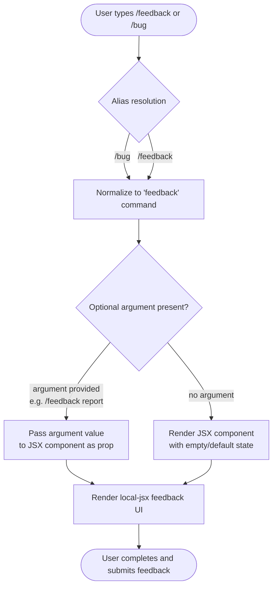

# `/feedback`

> Analysis basis: CC v2.1.139 bundle.js (AST extraction + Claude interpretation)
> Minimum version: v2.1.139

---

## Overview

The `/feedback` command (also accessible via `/bug`) provides users with a direct mechanism to submit feedback or bug reports about Claude Code. Based on its `local-jsx` registration type, it renders a JSX component locally within the CLI rather than dispatching a remote API call for its primary UI. The command accepts an optional `[report]` argument to pre-populate or categorize the submission.

---

## Registration

| Field | Value |
|---|---|
| type | `local-jsx` |
| name | `feedback` |
| description | `Submit feedback about Claude Code` |
| argumentHint | `[report]` |
| aliases | `bug` |
| module_id | `J6q` |

Analysis basis: CC v2.1.139 bundle.js:+9922710

---

## Input Branching

The AST traversal did not resolve any entry-point functions for module `J6q` at depth ≤ 2. The following flowchart is derived from the registration metadata (type, argumentHint, aliases) and the structural implications of the `local-jsx` command type. Behavioral details of internal branching beyond this point require deeper traversal.



> **Note:** Internal branching within the JSX render tree — such as form field rendering, submission endpoint selection, or validation logic — is <!-- TODO: not found in depth-2 traversal; needs --depth 4 -->

---

## Behavioral Spec

### Command Dispatch and Alias Resolution

```
function resolveAndDispatch(rawInput):
    commandName = extractCommandName(rawInput)   // "feedback" or "bug"
    argument    = extractArgument(rawInput)       // optional trailing text

    if commandName is in aliases["bug"]:
        commandName = "feedback"                 // normalize alias

    return invokeCommand("feedback", argument)
```

Analysis basis: CC v2.1.139 bundle.js:+9922710 (aliases field, registration object)

---

### Local JSX Rendering

```
function renderFeedbackComponent(argument):
    // "local-jsx" type: component is rendered inline in the CLI
    // No remote pre-flight call is made solely to display the UI

    props = {
        initialReport: argument ?? null
    }

    mountComponent(FeedbackJSXComponent, props)
    // Component body: <!-- TODO: not found in depth-2 traversal; needs --depth 4 -->
```

Analysis basis: CC v2.1.139 bundle.js:+9922710 (type: "local-jsx", module_id: "J6q")

---

### Submission Behavior

```
// Internal submission logic of the JSX component
function onSubmit(formData):
    // Exact endpoint, payload shape, and error handling:
    // <!-- TODO: not found in depth-2 traversal; needs --depth 4 -->
    pass
```

---

## State & Side Effects

| Item | Detail |
|---|---|
| Telemetry | <!-- TODO: not found in depth-2 traversal; needs --depth 4 --> |
| Hook registration | <!-- TODO: not found in depth-2 traversal; needs --depth 4 --> |
| appState changes | <!-- TODO: not found in depth-2 traversal; needs --depth 4 --> |
| Sound | <!-- TODO: not found in depth-2 traversal; needs --depth 4 --> |
| Alias | `/bug` is a registered alias; resolves identically to `/feedback` at dispatch time |
| Render model | `local-jsx` — UI is mounted as an inline JSX component, not printed as plain text |

> **Note:** The AST extraction for module `J6q` returned an empty `callGraph`, `literals`, `telemetry`, and `identifiers` array because no entry functions were resolved at depth ≤ 2. All internal side effects (network calls, state mutations, telemetry events) require a deeper traversal pass to enumerate.

---

## Version History

| Version | Change |
|---|---|
| v2.1.139 | Initial analysis — registration metadata confirmed; internal call graph not yet resolved |

---

## Common Mistakes

1. **Expecting `/bug` to behave differently from `/feedback`** — `/bug` is a registered alias and is fully normalized to the `feedback` command before any logic executes. There is no distinct "bug report" code path separate from the general feedback flow at the registration level.
2. **Assuming the argument is mandatory** — The `argumentHint` is `[report]` (square-bracket notation), indicating the argument is optional. Invoking `/feedback` with no argument is a valid invocation.
3. **Assuming a remote API call drives the initial UI** — The `local-jsx` type means the feedback interface is rendered locally. Any network activity belongs to the submission action, not to the initial display of the component.
4. **Treating this as a conversational turn** — `/feedback` is a CLI slash command handled by the command registry, not a message sent to the Claude model. It does not consume conversation context or produce an assistant reply in the normal sense.
5. **Expecting detailed behavioral coverage from this spec** — Because the AST traversal found no entry functions in module `J6q` at depth ≤ 2, large portions of this spec are marked TODO. Submission logic, telemetry events, and internal state changes are not yet verified from bundle data.

---

## Appendix — Identifier Mapping

> For bundle debugging only. Identifiers change across versions.

| Identifier | Role |
|---|---|
| `J6q` | Module ID for the `/feedback` command implementation (not an obfuscated function name, but included for bundle navigation reference) |

> No obfuscated function identifiers were returned by the depth-2 AST traversal for this module. If additional identifiers are discovered at greater traversal depth, they should be added here.