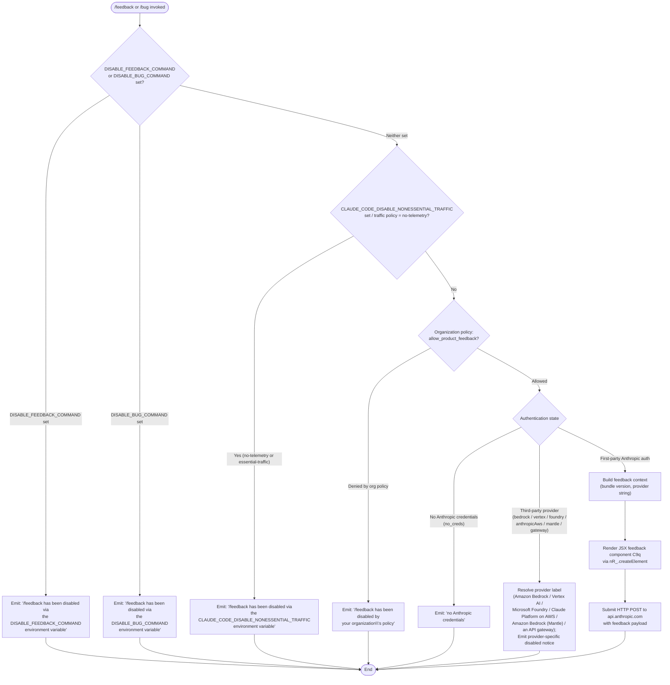

```markdown
---
type: feature-spec
feature: "feedback"
cc_version: "2.1.142"
updated: "2026-06-01"
tags: ["feedback", "commands", "slash-commands"]
source: "bundle-analysis"
bundle_verified: true
inherited_from: "2.1.141"
analysis_basis: "CC v2.1.141 bundle.js (AST extraction + Claude interpretation)"
author: "ryujaeuk <ryujaeuk@gmail.com>"
repository: "https://github.com/MyLittleLuckyDog/cc-gnothi"
license: "AGPL-3.0-only"
---

# `/feedback`

> Analysis basis: CC v2.1.141 bundle.js (AST extraction + Claude interpretation)
> Minimum version: v2.1.141

---

## Overview

The `/feedback` command (also aliased as `/bug`) allows users to submit product feedback or bug reports about Claude Code directly from the CLI. Before presenting the feedback UI, the handler evaluates a multi-layered eligibility check — inspecting environment variables, network traffic policies, organization policies, and authentication state — and either renders a JSX feedback component or emits a descriptive disabled message. The command interacts with `api.anthropic.com` via an HTTP `POST` request to deliver the feedback payload.

---

## Registration

| Field | Value |
|---|---|
| type | `local-jsx` |
| name | `feedback` |
| description | Submit feedback about Claude Code |
| aliases | `["bug"]` |
| argumentHint | `[report]` |
| module_id | `b9q` |
| load_inline | `true` |
| loc_byte | `9960248` |
| loc_byte_end | `9960456` |
| loc_line | `5566` |
| arbor_handler.name | `K37` |
| arbor_handler.fqn | `claude-2.1.141::K37` |
| arbor_handler.kind | `AsyncFunction` |
| arbor_handler.resolution_path | `module_id` |
| arbor_handler.n_hits | `0` |

Analysis basis: CC v2.1.141 bundle.js:+9960248

---

## Input Branching

The handler passes through **six or more distinct guard branches** before reaching the feedback UI, warranting a Mermaid flowchart.



Analysis basis: CC v2.1.141 bundle.js:+9939136, +9939154, +9939308, +9939426, +9939590, +9940197, +9940214

---

## Behavioral Spec

### 1. Handler Entry (`K37`)

The Arbor-resolved handler `K37` is an `AsyncFunction` reached via the `module_id` resolution path through module `b9q`.

```
async function feedbackHandler(context):
    eligibilityResult = checkFeedbackEligibility(context)
    if eligibilityResult.disabled:
        return renderDisabledMessage(eligibilityResult.reason)
    feedbackContext = buildFeedbackContext(context)
    component = createFeedbackComponent(feedbackContext)
    return component
```

Analysis basis: CC v2.1.141 bundle.js:+9960039, +9960075, +9960111

### 2. Eligibility Check (`QR_`)

The eligibility checker (`QR_`) is the central gate. It runs the following checks in order:

```
function checkFeedbackEligibility(context):
    // Check 1: DISABLE_FEEDBACK_COMMAND env var
    if env.DISABLE_FEEDBACK_COMMAND is set:
        return { disabled: true, reason: REASON_DISABLE_FEEDBACK_CMD }

    // Check 2: DISABLE_BUG_COMMAND env var
    if env.DISABLE_BUG_COMMAND is set:
        return { disabled: true, reason: REASON_DISABLE_BUG_CMD }

    // Check 3: Non-essential traffic restriction
    trafficPolicy = getTrafficPolicy()   // returns "essential-traffic", "no-telemetry", or "default"
    if trafficPolicy in ["essential-traffic", "no-telemetry"]:
        return { disabled: true, reason: REASON_NONESSENTIAL_TRAFFIC }

    // Check 4: Organization policy
    orgPolicies = getOrganizationPolicies(context)
    if NOT orgPolicies.allow_product_feedback:
        return { disabled: true, reason: REASON_ORG_POLICY }

    // Check 5: Authentication & provider
    authState = resolveAuthAndProvider(context)
    if authState.hasNoCredentials:
        return { disabled: true, reason: REASON_NO_CREDS }
    if authState.isThirdParty:
        return { disabled: true, reason: resolveProviderLabel(authState.provider) }

    return { disabled: false }
```

Analysis basis: CC v2.1.141 bundle.js:+9939083, +9939391, +9939531, +9939658

#### 2a. Environment Variable Guards

| Variable | Disabled Message |
|---|---|
| `DISABLE_FEEDBACK_COMMAND` | `/feedback has been disabled via the DISABLE_FEEDBACK_COMMAND environment variable` |
| `DISABLE_BUG_COMMAND` | `/feedback has been disabled via the DISABLE_BUG_COMMAND environment variable` |
| `CLAUDE_CODE_DISABLE_NONESSENTIAL_TRAFFIC` | `/feedback has been disabled via the CLAUDE_CODE_DISABLE_NONESSENTIAL_TRAFFIC environment variable` |

Analysis basis: CC v2.1.141 bundle.js:+9939154, +9939308, +9939426

#### 2b. Traffic Policy Check (`Vq` → `cMA`)

```
function getTrafficPolicy():
    rawValue = readEnvironmentOrConfig()
    // Recognized values: "essential-traffic", "no-telemetry", "default"
    return normalizePolicy(rawValue)
```

If the policy resolves to `"essential-traffic"` or `"no-telemetry"`, feedback is disabled.

Analysis basis: CC v2.1.141 bundle.js:+9939391, +949578, +949637, +949711

#### 2c. Organization Policy Check (`pq` → `kAq` / `J0H`)

```
function getOrganizationPolicies(context):
    policies = fetchOrgPolicies(context)   // may consult tf7 Set cache
    return policies    // relevant key: "allow_product_feedback"
```

The string key `"allow_product_feedback"` is checked directly.
Analysis basis: CC v2.1.141 bundle.js:+9903369, +9903388, +9903400, +9903426

#### 2d. Authentication & Provider Resolution (`QR_` → `WA` / `QR`)

```
function resolveAuthAndProvider(context):
    providerKind = detectProvider(context)
    // Recognized third-party providers:
    //   "bedrock"        → label "Amazon Bedrock"
    //   "vertex"         → label "Vertex AI"
    //   "foundry"        → label "Microsoft Foundry"
    //   "anthropicAws"   → label "Claude Platform on AWS"
    //   "mantle"         → label "Amazon Bedrock (Mantle)"
    //   "gateway"        → label "an API gateway"
    //   "firstParty"     → first-party Anthropic

    if providerKind == "firstParty":
        authHeaders = buildAuthHeaders(context)
        // Validates presence of ANTHROPIC_API_KEY or OAuth token
        if noCredentials:
            return { hasNoCredentials: true }
        return { isThirdParty: false }
    else:
        return { isThirdParty: true, provider: providerKind }
```

Analysis basis: CC v2.1.141 bundle.js:+9939658, +9939690, +9939705, +9939722, +9939797, +9939868, +9939952, +9940035, +9940120, +9940197

Provider label resolution table:

| Provider Key | Display Label |
|---|---|
| `bedrock` | Amazon Bedrock |
| `vertex` | Vertex AI |
| `foundry` | Microsoft Foundry |
| `anthropicAws` | Claude Platform on AWS |
| `mantle` | Amazon Bedrock (Mantle) |
| `gateway` | an API gateway |
| `firstParty` | (first-party; feedback allowed) |

Analysis basis: CC v2.1.141 bundle.js:+9939722, +9939797, +9939868, +9939952, +9940035, +9940120

#### 2e. No-Credential Path

When the provider is first-party but no credentials are present, a specific `"no_creds"` state is returned with the human-readable label `"no Anthropic credentials"`.

Analysis basis: CC v2.1.141 bundle.js:+9940197, +9940214

### 3. Auth Header Construction (`QR` → `_s` / `KA` / `ej`)

When authentication proceeds, headers are assembled in layered steps:

```
function buildAuthHeaders(context):
    headers = {}

    // Third-party providers are short-circuited before this point
    if isThirdPartyProvider(context):
        raise "Anthropic auth not used on third-party providers"

    // OAuth path
    oauthToken = getOAuthToken(context)
    if oauthToken is null:
        raise "No OAuth token available"

    // Cloud gateway path
    if isCloudGateway(context):
        raise "Not available when using a Cloud gateway"

    // API key path
    apiKey = getApiKey(context)    // reads ANTHROPIC_API_KEY
    if apiKey is null:
        raise "No API key available"

    headers["x-api-key"] = apiKey
    headers["anthropic-beta"] = betaVersion

    return headers
```

Analysis basis: CC v2.1.141 bundle.js:+2921323, +2921352, +2921407, +2921467, +2921551, +2921617, +2921667, +2921702, +2921742

### 4. Feedback Component Render & Submission (`C9q` → `nR_.createElement`)

```
function renderFeedbackComponent(feedbackContext):
    element = nR_.createElement(FeedbackForm, {
        bundleVersion: feedbackContext.bundle,     // "bundle" key
        provider: feedbackContext.providerLabel,   // "provider" key
        onSubmit: async (formData) => {
            response = await httpPost("https://api.anthropic.com", formData)
            return response
        }
    })
    return element
```

The HTTP method is `"post"` (lowercase).

Analysis basis: CC v2.1.141 bundle.js:+9959902, +9959887, +9939690, +9939705

### 5. Jitter Utility (`H`)

The call graph reveals a utility `H` that uses `Math.random` and `setTimeout`. This pattern corresponds to a jitter/delay helper, likely used to stagger feedback submission retries or to debounce rapid submissions.

```
function jitterDelay(baseMs):
    jitter = Math.random() * baseMs    // factor of 2 applied (literal: 2)
    await sleep(jitter)
```

Analysis basis: CC v2.1.141 bundle.js:+12516056, +12516058, +12516095

### 6. Token/Session Management (`j$` / `bp` / `j6`)

A group of identity and session helpers is called during the authentication pipeline:

- **credentialResolver** (`j$`): resolves `ANTHROPIC_API_KEY` / `CLAUDE_CODE_OAUTH_TOKEN`, falls back to `apiKeyHelper`, and raises a structured `Error` if neither is present. The required env var message is: `"ANTHROPIC_API_KEY or CLAUDE_CODE_OAUTH_TOKEN env var is required"`.
- **providerBootstrap** (`bp`): orchestrates provider detection, calling `WA` (provider-kind resolver), `UM` (unknown — <!-- TODO: not found in depth-2 traversal; needs --depth 4 -->), `j$` (credential resolver), `xA` (unknown — <!-- TODO: not found in depth-2 traversal; needs --depth 4 -->), and `j6` (session/cache manager). Emits telemetry event `tengu_slate_kestrel` at this stage.
- **sessionCacheManager** (`j6`): uses Set objects (`gMH`, `R76`, `OF`) to track active sessions and prevent duplicate submissions.

Analysis basis: CC v2.1.141 bundle.js:+9899831, +9899864, +9899893, +9899963, +9900035, +2895985, +2896079, +2896118, +2896406, +9900038

Enterprise/team plan detection occurs inside `bp`:

| Plan String | Meaning |
|---|---|
| `"enterprise"` | Enterprise-tier account |
| `"team"` | Team-tier account |

Analysis basis: CC v2.1.141 bundle.js:+9900124, +9900159

---

## State & Side Effects

| Item | Detail |
|---|---|
| Telemetry | `tengu_slate_kestrel` — fired during provider bootstrap / credential resolution (bundle.js:+9900038) |
| HTTP request | HTTP `POST` to `api.anthropic.com` with feedback payload (bundle.js:+9959887, +2007407) |
| Session cache | Set structures (`gMH`, `R76`, `OF`) updated to track submission state (bundle.js:+3120555, +3120578, +3120592) |
| Environment reads | `DISABLE_FEEDBACK_COMMAND`, `DISABLE_BUG_COMMAND`, `CLAUDE_CODE_DISABLE_NONESSENTIAL_TRAFFIC`, `ANTHROPIC_API_KEY`, `CLAUDE_CODE_OAUTH_TOKEN` (bundle.js:+9939154, +9939308, +9939426, +2895985) |
| JSX render | `nR_.createElement` called to produce the feedback form component (bundle.js:+9959902) |
| Jitter/delay | `Math.random` + `setTimeout` used for submission timing (bundle.js:+12516058, +12516095) |
| appState changes | <!-- TODO: not found in depth-2 traversal; needs --depth 4 --> |
| Sound | <!-- TODO: not found in depth-2 traversal; needs --depth 4 --> |
| Hook registration | <!-- TODO: not found in depth-2 traversal; needs --depth 4 --> |

---

## Version History

| Version | Change |
|---|---|
| v2.1.141 | Initial analysis |

---

## Common Mistakes

1. **Setting `DISABLE_FEEDBACK_COMMAND` but expecting `/bug` to still work** — both the `/feedback` and `/bug` aliases share the same eligibility pipeline; `DISABLE_BUG_COMMAND` is the separate guard for the bug alias, but `DISABLE_FEEDBACK_COMMAND` disables both paths through the shared handler.
2. **Using `/feedback` on a third-party provider (Bedrock, Vertex, Foundry, etc.)** — the command is explicitly disabled for all non-first-party providers. The error message names the specific provider label to aid diagnosis.
3. **Expecting `/feedback` to work when `CLAUDE_CODE_DISABLE_NONESSENTIAL_TRAFFIC` is set** — even if authentication is valid, this environment variable disables the command because feedback submission is classified as non-essential traffic.
4. **Organization-managed deployments blocking feedback silently** — when `allow_product_feedback` is denied via org policy, the user receives only the policy-disabled message; there is no override path from the CLI.
5. **Assuming the command is synchronous** — `K37` is an `AsyncFunction`; callers that do not await it will miss disabled-state returns and may render stale UI.

---

## Appendix — Identifier Mapping

> For bundle debugging only. Identifiers change across versions.

| Identifier | Role |
|---|---|
| `K37` | Main async feedback handler (Arbor-resolved entry point for `/feedback`) |
| `C9q` | Feedback JSX component factory (renders the feedback form UI) |
| `QR_` | Central eligibility checker (gates all disable conditions) |
| `RH` | String utility / normalizer (used by multiple callers) |
| `Vq` | Traffic policy reader (checks essential-traffic / no-telemetry) |
| `cMA` | Policy normalization helper (called by traffic policy reader) |
| `pq` | Organization policy fetcher (checks `allow_product_feedback`) |
| `kAq` | Organization policy sub-fetcher |
| `ZR_` | Policy resolution sub-step (calls provider bootstrap and credential helper) |
| `bp` | Provider bootstrap / credential orchestrator (emits `tengu_slate_kestrel`) |
| `WA` | Provider-kind resolver (identifies bedrock / vertex / foundry / etc.) |
| `UM` | Unknown helper called from provider bootstrap |
| `j$` | Credential resolver (reads `ANTHROPIC_API_KEY` / OAuth token) |
| `j6` | Session/cache manager (uses Set structures for deduplication) |
| `J0H` | Organization policy helper (wraps `RH` string utility) |
| `QR` | Auth-header assembler (builds `x-api-key` / `anthropic-beta` headers) |
| `_s` | Third-party provider auth short-circuit |
| `tj` | Provider-kind sub-check helper |
| `KA` | OAuth token retriever |
| `mw` | OAuth token resolution pipeline |
| `RB` | Boolean guard (wraps `Boolean()` coercion for auth state) |
| `ej` | API key path assembler |
| `H` | Jitter/delay utility (`Math.random` + `setTimeout`) |

---

Note: index built via Arbor fallback; some signals (telemetry, literals) may be missing — see arbor-fallback.js.
```