# `/goal`

> Analysis basis: CC v2.1.139 bundle.js (AST extraction + Claude interpretation)
> Minimum version: v2.1.139

---

## Overview

The `/goal` slash command allows the user to set a persistent goal condition that Claude Code will continue working toward until the stated condition is satisfied. Invoking the command with a condition string registers that condition as the active goal; invoking it with `clear` removes any previously registered goal. Because the command is flagged `immediate`, it takes effect without requiring a conversational round-trip.

---

## Registration

| Field | Value |
|---|---|
| type | `local-jsx` |
| name | `goal` |
| description | `Set a goal — keep working until the condition is met` |
| argumentHint | `[<condition> \| clear]` |
| immediate | `true` |
| module\_id | `m0q` |

Analysis basis: CC v2.1.139 bundle.js:+11750109

---

## Input Branching

```mermaid
flowchart TD
    A([User invokes /goal]) --> B{Argument provided?}
    B -- No argument --> C[Display current goal\nor prompt for condition]
    B -- "Argument = 'clear'" --> D[Clear / unset the active goal]
    B -- Argument is condition string --> E[Register condition as active goal]
    D --> F([Command completes immediately])
    E --> F
    C --> F
```

The command accepts an optional argument token. Based on the registration metadata (specifically `argumentHint: "[<condition> | clear]"`) three input paths exist:



Analysis basis: CC v2.1.139 bundle.js:+11750109

> **Note:** The depth-2 AST traversal recovered no call-graph edges and no literal constants from module `m0q`. The three-path branching above is derived solely from the `argumentHint` field in the registration object and the command description. Internal dispatch logic, persistence mechanism, and exact UI rendering cannot be confirmed from available data.

---

## Behavioral Spec

### Goal Registration

```
function handleGoalCommand(rawArgument):
    token = trim(rawArgument)

    if token is empty:
        displayCurrentGoalOrUsageHint()
        return

    if token == "clear":
        clearActiveGoal()
        confirmGoalCleared()
        return

    setActiveGoal(condition = token)
    confirmGoalRegistered(condition = token)
```

Analysis basis: CC v2.1.139 bundle.js:+11750109
(Pseudocode derived from `argumentHint` and `description` fields; internal implementation details not recoverable at depth-2 traversal — see note in module `m0q`.)

### Immediate Execution Semantics

Because `immediate: true` is set in the registration record, the command handler is invoked synchronously at parse time — before any assistant turn is generated. This means the goal condition is stored in application state before Claude begins (or resumes) processing, allowing the goal to influence subsequent agentic steps within the same session.

Analysis basis: CC v2.1.139 bundle.js:+11750109

### `clear` Sub-command

When the sole argument is the literal string `clear`, the command removes whatever goal condition was previously active. After clearing, Claude Code no longer evaluates whether a stopping condition is met between agentic steps.

Analysis basis: CC v2.1.139 bundle.js:+11750109 (`argumentHint` enumerates `clear` as a discrete token)

---

## State & Side Effects

| Item | Detail |
|---|---|
| Telemetry | <!-- TODO: not found in depth-2 traversal; needs --depth 4 --> |
| Hook registration | <!-- TODO: not found in depth-2 traversal; needs --depth 4 --> |
| appState changes | Goal condition string written to (or cleared from) application state; exact state key not recoverable at depth-2 traversal |
| Sound | <!-- TODO: not found in depth-2 traversal; needs --depth 4 --> |
| Persistence scope | <!-- TODO: not found in depth-2 traversal; needs --depth 4 --> |

---

## Known Limitations of This Analysis

The AST extractor reported `"no entry functions found for module 'm0q'"`. As a result:

- The `callGraph` array is empty — no internal call edges are available.
- The `literals` array is empty — no numeric limits (e.g., maximum condition length) or sentinel strings beyond those in `argumentHint` are confirmed.
- The `telemetry` array is empty — no `tengu_*` event names are confirmed.
- The `identifiers` array is empty — no obfuscated symbol names are available.

All behavioral claims in this spec beyond registration metadata are inferred from the registration fields (`description`, `argumentHint`, `immediate`) and must be validated against a deeper traversal (recommended: `--depth 4` targeting module `m0q`).

---

## Version History

| Version | Change |
|---|---|
| v2.1.139 | Initial analysis; registration metadata confirmed; internal implementation pending deeper AST traversal |

---

## Common Mistakes

1. **Omitting the condition argument entirely** — `/goal` with no argument does not set a goal; a condition string must be supplied for the goal to become active.
2. **Expecting `clear` to accept additional tokens** — the `clear` sub-command is a discrete keyword; passing `/goal clear <anything>` may not behave as expected, as `clear` is enumerated as a standalone alternative to a condition string.
3. **Assuming persistence across sessions** — the persistence scope of the goal condition (session-only vs. project-level) is not confirmed by available data; do not assume the goal survives a CLI restart without verification.
4. **Confusing `immediate` with background execution** — `immediate: true` means the command executes synchronously at parse time, not that it runs asynchronously in the background; the goal is registered before the next assistant turn, not after.
5. **Using `/goal` as a task description** — the command is specifically a *stopping condition*, not a general task prompt; the condition should be evaluable (e.g., "all tests pass") rather than a broad directive.

---

## Appendix — Identifier Mapping

> For bundle debugging only. Identifiers change across versions.

| Identifier | Role |
|---|---|
| *(none recovered)* | AST traversal returned an empty `identifiers` array for module `m0q`; re-run extraction at `--depth 4` to populate this table |