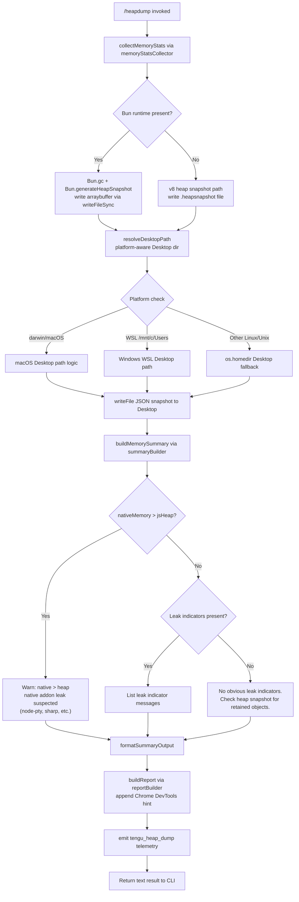

# `/heapdump`

> Analysis basis: CC v2.1.142 bundle.js (AST extraction + Claude interpretation)
> Minimum version: v2.1.142

---

## Overview

`/heapdump` is a hidden developer-diagnostic command that captures a full JavaScript heap snapshot of the running Claude Code process, writes it to `~/Desktop`, and prints a human-readable memory-usage summary alongside a suggestion to open the `.heapsnapshot` file in Chrome DevTools. It is designed for debugging memory leaks and is not exposed in the normal user-facing command list.

---

## Registration

| Field | Value |
|---|---|
| type | `local` |
| name | `heapdump` |
| description | `Dump the JS heap to ~/Desktop` |
| supportsNonInteractive | `true` |
| isHidden | `true` |
| module_id | `f0q` |
| load_inline | `true` |
| loc_byte | `11541800` |
| loc_byte_end | `11541963` |
| loc_line | `7193` |
| arbor_handler.name | `Cv7` |
| arbor_handler.fqn | `claude-2.1.142::Cv7` |
| arbor_handler.kind | `AsyncFunction` |
| arbor_handler.resolution_path | `module_id` |
| arbor_handler.n_hits | `0` |

Analysis basis: CC v2.1.142 bundle.js:+11541800

---

## Input Branching

The command follows 4+ distinct execution paths based on runtime conditions (heap-snapshot engine availability, platform, memory ratio, leak indicators), so a flowchart is used.



---

## Behavioral Spec

### Top-Level Handler (`Cv7`)

The Arbor-resolved handler (`Cv7`, an `AsyncFunction`) orchestrates the full flow. It calls the core dump orchestrator (`K0q`), collects the result lines into an output array, joins them, and returns the final text response.

```
async function heapdumpHandler(context):
    lines = []
    lines.push("Open the .heapsnapshot in Chrome DevTools → Memory → Load to inspect retainers.")
    reportLines = await dumpOrchestrator(context)
    lines.push(...reportLines)
    return lines.join("\n")
```

Analysis basis: CC v2.1.142 bundle.js:+11540669, +11540788, +11540815, +11540937

---

### Dump Orchestrator (`K0q`)

This function coordinates all phases: collecting memory statistics, resolving the output path, writing the snapshot file, building the summary, and emitting telemetry.

```
async function dumpOrchestrator(context):
    // Phase 1: collect memory stats
    stats = await memoryStatsCollector()        // Sv7

    // Phase 2: resolve Desktop path
    desktopPath = resolveDesktopPath()          // k$A

    // Phase 3: build output filename with timestamp
    filePath = pathJoin(desktopPath, generateFilename())  // pU_.join

    // Phase 4: write snapshot
    await writeSnapshotFile(filePath)           // Rv7

    // Phase 5: serialize stats to JSON, write companion file
    await fs.writeFile(filePath + ".json", JSON.stringify(stats), mode=0o600)
    // file mode 384 decimal = 0o600 (owner read/write only)

    // Phase 6: build summary
    summary = buildMemorySummary(stats)         // bv7 + daH

    // Phase 7: emit telemetry
    emitTelemetry("tengu_heap_dump")            // loc_byte 11539920

    // Phase 8: format final lines
    return formatReport(filePath, summary)
```

Analysis basis: CC v2.1.142 bundle.js:+11539330, +11539343, +11539389, +11539626, +11539638, +11539735, +11539778, +11539794, +11539813, +11539869, +11539918, +11539920, +11540089, +11540098, +11540177

---

### Memory Statistics Collector (`Sv7`)

Gathers a comprehensive snapshot of process memory from multiple Node.js / Bun APIs and, on Linux, from the kernel's `/proc` filesystem.

```
async function memoryStatsCollector():
    result = {}

    // Node.js / Bun built-in APIs
    result.memoryUsage      = process.memoryUsage()           // +11536831
    result.heapStatistics   = v8.getHeapStatistics()          // LP8.getHeapStatistics +11536855
    result.resourceUsage    = process.resourceUsage()         // +11536881
    result.uptime           = process.uptime()                // +11536907
    result.heapSpaceStats   = v8.getHeapSpaceStatistics()     // LP8.getHeapSpaceStatistics +11536932
    result.activeHandles    = process._getActiveHandles()     // +11536974
    result.activeRequests   = process._getActiveRequests()    // +11537011

    // Linux-only: open file descriptors (best-effort)
    try:
        fdList = await fs.readdir("/proc/self/fd")            // +11537062, +11537074
        result.openFdCount = fdList.length
    catch: pass

    // Linux-only: smaps_rollup for native/RSS memory breakdown (best-effort)
    try:
        smaps = await fs.readFile("/proc/self/smaps_rollup", "utf8")  // +11537124, +11537137, +11537163
        result.smaps = smaps
    catch: pass

    // JSC / Bun introspection (bun:jsc module)          // +11537222
    try:
        jscStats = importModule("bun:jsc").getMemoryUsage()
        result.jscStats = jscStats
    catch: pass

    // Cap open-file count reporting at 3600 entries      // +11537363
    // Convert bytes to MB using divisor 1048576          // +11537368

    return result
```

Analysis basis: CC v2.1.142 bundle.js:+11536831 – +11537416

---

### Snapshot Writer (`Rv7`)

Writes the actual heap snapshot. Branches on whether the Bun runtime is available.

```
async function writeSnapshotFile(filePath):
    if typeof Bun !== "undefined":
        // Bun path: force GC then capture snapshot as arraybuffer
        Bun.gc(true)                                 // +11540426
        snapshot = Bun.generateHeapSnapshot()        // +11540369
        // format: "v8" / "arraybuffer"              // +11540394, +11540399
        fs.writeFileSync(filePath, snapshot)         // q0q.writeFileSync +11540349
    else:
        // Node.js / standard V8 path
        // Uses v8.writeHeapSnapshot or equivalent inspector protocol
        writeHeapSnapshotToFile(filePath)
```

Analysis basis: CC v2.1.142 bundle.js:+11540349, +11540369, +11540394, +11540399, +11540426

---

### Desktop Path Resolver (`k$A`)

Determines the platform-appropriate Desktop directory, with special handling for WSL.

```
function resolveDesktopPath():
    home = os.homedir()                         // $x8.homedir +1003764

    // Default: ~/Desktop
    candidate = path.join(home, "Desktop")      // "Desktop" literal +1003810, A5.join +1003800

    // WSL detection: if home is under /mnt/c/Users, rewrite to Windows Desktop
    if home.startsWith("/mnt/c/Users"):         // +1004032
        // Exclude pseudo-users: Public, Default, Default User, All Users
        // +1004076, +1004095, +1004115, +1004140
        windowsUser = extractWindowsUsername(home)
        candidate = path.join("/mnt/c/Users", windowsUser, "Desktop")

    // Attempt path substitution / normalization
    candidate = candidate.replace(...)          // q.replace +1003940

    return candidate
```

Analysis basis: CC v2.1.142 bundle.js:+1003757, +1003764, +1003800, +1003810, +1003940, +1003977, +1004032 – +1004140

---

### Memory Summary Builder (`bv7` + `daH`)

Produces the human-readable diagnostic lines printed to the user after the snapshot is written.

```
function buildMemorySummary(stats):
    heapUsed   = stats.memoryUsage.heapUsed
    rss        = stats.memoryUsage.rss
    nativeMem  = rss - heapUsed

    lines = []

    // Threshold: nativeMem > heapUsed flags a native-addon leak    // Math.max +11541044
    if nativeMem > heapUsed:
        lines.push("Native memory > heap - leak may be in native addons (node-pty, sharp, etc.)")
        // literal +11537601
        lines.push("— most memory is native (NOT in the .heapsnapshot)")
        // literal +11541172
    else:
        lines.push("— most memory is JS heap (inspect the .heapsnapshot)")
        // literal +11541112

    // If no leak indicators were found
    if lines.length == 0 OR noLeakIndicators:
        lines.push("  (no obvious leak indicators)")
        // literal +11541309

    // Format RSS and heapUsed in MB with 1 decimal place (toFixed)
    // divisor 1048576, precision 8                              // +11537368, +11541444
    // column width 100 chars for alignment                      // literal 100 +11537515

    // daH formats the detailed per-space heap breakdown
    detailLines = formatHeapSpaces(stats.heapSpaceStats)        // daH +11541356

    return lines.concat(detailLines)
```

Analysis basis: CC v2.1.142 bundle.js:+11541044, +11541112, +11541172, +11541309, +11541356, +11541444, +11537601

---

### Platform Identification for Summary (`c6` at `+11538448`)

The summary includes a platform label. On macOS/Darwin the label `"macos"` is used; the `"darwin"` kernel string is tested internally.

```
function getPlatformLabel():
    if process.platform == "darwin":    // +11538874
        return "macos"                  // +11538455
    else:
        return process.platform
```

Analysis basis: CC v2.1.142 bundle.js:+11538448, +11538455, +11538874

---

### No-Leak Fallback Message

When analysis finds no specific indicators, the output includes:

> "No obvious leak indicators. Check heap snapshot for retained objects." (bundle.js:+11538720)

Analysis basis: CC v2.1.142 bundle.js:+11538720

---

### Heap-Snapshot Hint

The very first line of the command's output (prepended before the stats) is an instruction to open the file in Chrome DevTools:

> "Open the .heapsnapshot in Chrome DevTools → Memory → Load to inspect retainers." (bundle.js:+11540825)

Analysis basis: CC v2.1.142 bundle.js:+11540825

---

### File Write Mode

The companion JSON statistics file is written with file mode `384` (decimal) = `0o600`, granting read/write access to the owner only.

Maximum auto-size label: `"auto-1.5GB"` (bundle.js:+11539986); this label appears in the snapshot filename or metadata.

Analysis basis: CC v2.1.142 bundle.js:+11539813, +11539986

---

## State & Side Effects

| Item | Detail |
|---|---|
| Telemetry | `tengu_heap_dump` (loc_byte +11539920); also indirectly reachable: `tengu_bg_dispatch_sigkill_escalate`, `tengu_bg_dispatch_low_mem`, `tengu_bg_spare_enable`, `tengu_bg_spare_claim`, `tengu_bg_spare_claim_fail`, `tengu_bg_proto_mismatch`, `tengu_bg_dispatch_stale_drop`, `tengu_bg_attach_legacy_autorespawn`, `tengu_bg_attach`, `tengu_bg_attach_stall_gave_up`, `tengu_bg_attach_stall_respawn`, `tengu_bg_attach_kick` (these are background-session subsystem events reachable from shared utilities in the call graph, not directly fired by `/heapdump`) |
| File I/O | Writes `.heapsnapshot` (binary V8/Bun format) and a companion `.json` statistics file to `~/Desktop` (platform-resolved). File mode `0o600`. |
| GC side effect | On Bun runtime: `Bun.gc(true)` is called before snapshot generation, triggering a synchronous full garbage collection. |
| `/proc` reads | On Linux: reads `/proc/self/fd` (directory listing) and `/proc/self/smaps_rollup` (text); both are best-effort and silently ignored on failure. |
| `bun:jsc` import | Attempts a dynamic `import("bun:jsc")` for JSC heap introspection; silently ignored on Node.js. |
| appState changes | None observed in depth-2 traversal. |
| Hook registration | None observed in depth-2 traversal. |
| Sound | None observed in depth-2 traversal. |

---

## Version History

| Version | Change |
|---|---|
| v2.1.142 | Initial analysis |

---

## Common Mistakes

1. **Expecting output on a headless server without a Desktop folder.** The Desktop path resolver targets `~/Desktop`. If that directory does not exist (common on servers or Docker containers), the file write will fail. Pre-create `~/Desktop` or use a symlink.
2. **Running on Node.js and expecting a Bun-format snapshot.** The `Bun.generateHeapSnapshot` / `Bun.gc` path is only taken when the Bun runtime is detected. On standard Node.js, the V8 inspector snapshot path is used instead.
3. **Opening the `.json` companion file in Chrome DevTools.** Chrome DevTools requires the `.heapsnapshot` file, not the `.json` statistics file. The `.json` file is a plain-text memory-stats dump for offline analysis.
4. **Running `/heapdump` repeatedly to compare snapshots.** Each invocation overwrites or creates a new file; without comparing two snapshots with a tool like `heapdump-diff`, the raw snapshot alone does not show growth.
5. **Misinterpreting the "native > heap" warning.** This warning fires when RSS minus `heapUsed` exceeds `heapUsed`. It does not conclusively identify a leak — it may reflect large native buffers or shared libraries mapped into process memory by `node-pty`, `sharp`, or similar native addons.
6. **Expecting the command in autocomplete.** `isHidden: true` means `/heapdump` does not appear in the slash-command menu. It must be typed in full.

---

## Appendix — Identifier Mapping

> For bundle debugging only. Identifiers change across versions.

| Identifier | Role |
|---|---|
| `Cv7` | Top-level async handler for `/heapdump` (Arbor-resolved entry point) |
| `K0q` | Dump orchestrator — coordinates stats collection, path resolution, file write, summary, telemetry |
| `Sv7` | Memory statistics collector (process.memoryUsage, v8 heap stats, /proc reads, bun:jsc) |
| `Rv7` | Heap snapshot writer (Bun.generateHeapSnapshot or V8 path) |
| `k$A` | Desktop path resolver (cross-platform, WSL-aware) |
| `bv7` | Memory summary builder (JS-vs-native ratio analysis, leak heuristics) |
| `daH` | Heap-space breakdown formatter (per-V8-space detail lines) |
| `V6` | Filesystem utility (used in multiple phases) |
| `JV` | Lower-level I/O helper called from `V6` |
| `G` | Async helper / utility (called from `Sv7`) |
| `lX6` | Sub-helper called from `G` |
| `hT8` | Sub-helper called from `G` and `X` |
| `X` | Connection/channel manager (background session subsystem, reachable from `Sv7`) |
| `NH` | Network/dispatch helper (background session layer) |
| `k_` | Error construction utility |
| `P` | Protocol message handler (background IPC layer) |
| `j` | Buffer/stream utility |
| `w` | Background worker/session manager |
| `vf` | Stream end/flush helper |
| `s95` | Background session supervisor protocol handler |
| `GH` | String coercion helper |
| `v` | Log/debug writer (level "debug") |
| `f7K` | Log formatting helper |
| `Zt_` | Log level/transport router |
| `H` | Various roles (timing helper / random / includes check — context-dependent) |
| `RH` | JSON serialization wrapper |
| `H5` | Path/string manipulation helper |
| `H6A` | Header map helper |
| `q` | Cleanup / unlink utility |
| `A` | Case-normalisation / collection utility |
| `BhH` | Output writer dispatcher |
| `gHA` | Low-level write helper |
| `O7K` | File append / rotate log writer |
| `YhH` | Log queue / batch flusher |
| `i8H` | Log entry constructor |
| `x6` | Filesystem mkdirp / ensure-dir helper |
| `Vv8` | Error-code classifier |
| `$6A` | Path join + existence check |
| `M6A` | File rotate helper (stat / rename / unlink) |
| `$7K` | Log file append orchestrator |
| `C9` | Active-writer set manager |
| `K` | Result formatter (padEnd column layout) |
| `L` | Promise lifecycle tracker |
| `f` | Resource handle (close/finalise) |
| `d` | Generic error handler / rethrow |
| `L7H` | UI result renderer |