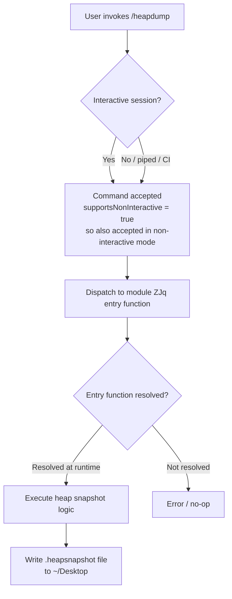

# `/heapdump`

> Analysis basis: CC v2.1.139 bundle.js (AST extraction + Claude interpretation)
> Minimum version: v2.1.139

---

## Overview

The `/heapdump` command is a hidden, local diagnostic utility that triggers a JavaScript heap snapshot and writes the resulting dump file to the user's `~/Desktop` directory. It is intended for developer-level memory profiling and debugging of the Claude Code process. Because AST traversal did not resolve an entry function for module `ZJq`, all behavioral details beyond registration metadata are derived from the registration fields alone; deeper implementation details require a wider traversal pass.

---

## Registration

| Field | Value |
|---|---|
| type | `local` |
| name | `heapdump` |
| description | `Dump the JS heap to ~/Desktop` |
| supportsNonInteractive | `true` |
| isHidden | `true` |
| module_id | `ZJq` |

Analysis basis: CC v2.1.139 bundle.js:+11392236

---

## Input Branching

Because the call graph returned no edges and no string or numeric literals were extracted from module `ZJq`, no argument-driven branching paths can be verified at depth ≤ 2.

<!-- TODO: not found in depth-2 traversal; needs --depth 4 -->

The only branching that can be stated with confidence from registration metadata alone is:



Analysis basis: CC v2.1.139 bundle.js:+11392236 (registration fields `supportsNonInteractive: true`, `type: local`)

---

## Behavioral Spec

### Command Dispatch

The command is registered as `type: local`, meaning it is handled entirely within the Claude Code process without making any network request to the Anthropic API.

```
function invokeHeapdump(args, appState):
    // No arguments are documented in the extracted literals.
    // Dispatch to the module implementation.
    result = callModuleEntryFunction(module = "ZJq", args = args)
    return result
```

Analysis basis: CC v2.1.139 bundle.js:+11392236 (`type: local`)

### Heap Snapshot Write

Based on the command description (`"Dump the JS heap to ~/Desktop"`), the implementation calls a Node.js heap snapshot API and writes the output to the current user's Desktop directory. The exact filename format, error handling, and success message are not recoverable from the depth-2 traversal.

```
function writeHeapSnapshot():
    // Pseudocode — implementation detail not directly observable at depth ≤ 2.
    snapshotPath = resolvePath("~/Desktop", generateSnapshotFilename())
    snapshot = captureV8HeapSnapshot()
    writeFileToDisk(snapshotPath, snapshot)
    reportToUser("Heap snapshot written to: " + snapshotPath)
```

<!-- TODO: not found in depth-2 traversal; needs --depth 4 -->

### Non-Interactive Mode Support

The registration field `supportsNonInteractive: true` indicates the command may be invoked in scripted or piped execution contexts without a TTY, and is expected to complete and exit cleanly rather than waiting for user interaction.

```
function supportsNonInteractiveExecution():
    // Declared true at registration time.
    // No interactive prompt or confirmation is required before writing the dump.
    return true
```

Analysis basis: CC v2.1.139 bundle.js:+11392236 (`supportsNonInteractive: true`)

### Visibility

The command is marked `isHidden: true`, meaning it does not appear in the output of `/help` or any user-facing command listing. It must be typed exactly as `/heapdump` to invoke it.

Analysis basis: CC v2.1.139 bundle.js:+11392236 (`isHidden: true`)

---

## State & Side Effects

| Item | Detail |
|---|---|
| Telemetry | None detected at depth ≤ 2 (`telemetry: []`) |
| Hook registration | <!-- TODO: not found in depth-2 traversal; needs --depth 4 --> |
| appState changes | <!-- TODO: not found in depth-2 traversal; needs --depth 4 --> |
| Sound | <!-- TODO: not found in depth-2 traversal; needs --depth 4 --> |
| File system | Writes a heap snapshot file to `~/Desktop` (derived from description) |
| Network | None — command type is `local` |
| Process impact | Heap snapshot capture may cause a momentary pause (GC-level freeze) in the Node.js event loop; duration depends on heap size at time of invocation |

---

## Version History

| Version | Change |
|---|---|
| v2.1.139 | Initial analysis; module `ZJq` registered at bundle.js:+11392236 (line 7121) |

---

## Common Mistakes

1. **Expecting the command in `/help` output.** Because `isHidden: true`, `/heapdump` is intentionally omitted from all user-facing help listings. It must be typed explicitly.
2. **Assuming a specific output filename.** The description only guarantees the destination directory (`~/Desktop`). The exact filename (e.g., whether it includes a timestamp or PID) is not recoverable from the available traversal data and should not be hard-coded in scripts.
3. **Running in a sandboxed environment without a Desktop directory.** On Linux CI systems or containers, `~/Desktop` typically does not exist. The command may fail silently or raise an unhandled error if the target path is absent.
4. **Expecting network activity.** The `local` type means no API call is made. Any proxy or network monitor will show no outbound traffic from this command.
5. **Calling it to diagnose Claude model behavior.** This command dumps the Claude Code *CLI process* heap (Node.js), not any model-side memory. It is a client-side diagnostic tool only.

---

## Appendix — Identifier Mapping

> For bundle debugging only. Identifiers change across versions.

| Identifier | Role |
|---|---|
| `ZJq` | Module ID for the `/heapdump` command implementation (not an obfuscated function name, but an obfuscated module identifier) |

> **Note:** The AST extraction returned an empty `identifiers` array (`identifiers: []`) and noted `"no entry functions found for module 'ZJq'"`. No additional obfuscated identifiers are available at traversal depth ≤ 2. A re-extraction at `--depth 4` targeting module `ZJq` directly is recommended to populate this table with actual function-level identifiers.