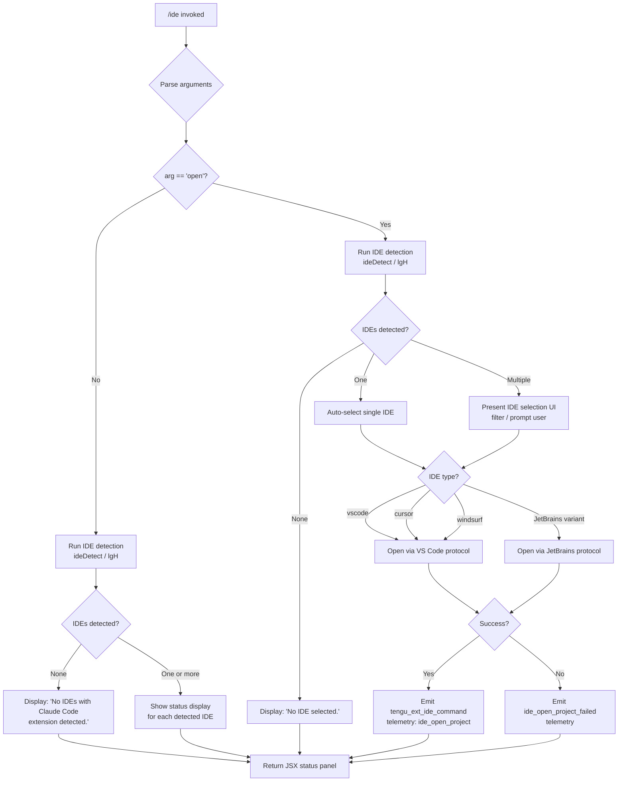

# `/ide`

> Analysis basis: CC v2.1.142 bundle.js (AST extraction + Claude interpretation)
> Minimum version: v2.1.142

---

## Overview

The `/ide` command manages IDE integrations for Claude Code, providing status information about detected IDEs and, when invoked with the `open` subcommand, opening the current project in a selected IDE. It probes the system for running IDE instances (VS Code, Cursor, Windsurf, JetBrains family), displays connection status, and can drive IDE open actions via the Claude Code extension protocol.

---

## Registration

| Field | Value |
|---|---|
| type | `local-jsx` |
| name | `ide` |
| description | `Manage IDE integrations and show status` |
| argumentHint | `[open]` |
| module_id | `N5q` |
| load_inline | `true` |
| loc_byte | `10602093` |
| loc_byte_end | `10602249` |
| loc_line | `5829` |
| arbor_handler.name | `SJ7` |
| arbor_handler.fqn | `claude-2.1.142::SJ7` |
| arbor_handler.kind | `AsyncFunction` |
| arbor_handler.resolution_path | `module_id` |
| arbor_handler.n_hits | `0` |

Analysis basis: CC v2.1.142 bundle.js:+10602093

---

## Input Branching

The command has four distinct paths based on detection results and the presence of the `open` subargument, requiring a flowchart.



Analysis basis: CC v2.1.142 bundle.js:+10598153 (handler `SJ7`), +10598261 (`open` literal), +10598299 (detection call), +10598370 (no-IDE message)

---

## Behavioral Spec

### Top-Level Handler (`SJ7`)

```
async function ideCommandHandler(context, args):
    emit telemetry("tengu_ext_ide_command", ...)  // +10598155

    subcommand = args[0] ?? null

    detectedIDEs = await ideDetect(context)       // lgH, +10598313

    if subcommand == "open":                       // +10598261
        if detectedIDEs.length == 0:
            return render("No IDE selected.")      // +10598508

        selectedIDE = await selectIDE(detectedIDEs, context)
        if selectedIDE == null:
            return render("No IDE selected.")

        result = await openProjectInIDE(selectedIDE, context)  // D8 / SJ7 branch
        if result.success:
            emit telemetry("ide_open_project")     // +10598708
            return render(successPanel)
        else:
            emit telemetry("ide_open_project_failed")  // +10598815
            return render(errorPanel, "Exited without opening IDE")  // +10599105
    else:
        if detectedIDEs.length == 0:
            return render("No IDEs with Claude Code extension detected.")  // +10598370

        return render(ideStatusPanel(detectedIDEs))
```

Analysis basis: CC v2.1.142 bundle.js:+10598153

---

### IDE Detection (`lgH`)

```
async function ideDetect(context):
    emit telemetry("ide_detect")                   // +5196614

    detectedList = []
    platform = getPlatform()

    if platform == "linux":                        // +5200122
        // Run process scan
        psOutput = shell("ps aux | grep -E 'code|cursor|windsurf|idea|...'")  // +5200148
        // Parse process list for known IDE names

    candidatePaths = buildIDESearchPaths()         // x54, +5191825
        // Checks homedir, ~/.claude, WSL paths (/mnt/c/Users), +5193362
        // Skips: Public, Default, Default User, All Users, +5193456..5193520

    for each candidate in candidatePaths:
        ideInfo = await probeIDECandidate(candidate)   // C54 / PtA
        if ideInfo != null:
            detectedList.push(ideInfo)

    if detectedList.length == 0:
        emit telemetry("ide_detect_failed")        // +5196678

    return detectedList
```

Analysis basis: CC v2.1.142 bundle.js:+5195271 (`lgH`), +5196614 (telemetry)

---

### IDE Candidate Resolution (`x54`)

```
function buildIDESearchPaths(existingSet):
    paths = []
    paths.push(path.join(homedir(), ".claude"))    // +5193155, +5193141

    if platform == "wsl":                          // +5193200
        // Scan /mnt/c/Users but skip system accounts
        windowsUsers = listDir("/mnt/c/Users")     // +5193362
        for user in windowsUsers:
            if user in ["Public","Default","Default User","All Users"]: continue
            paths.push(windowsUserPath(user))

    for each candidate in paths:
        stat = lstatSync(candidate)
        if stat.isDirectory() or stat.isSymbolicLink():  // +5193398, +5193416
            resolved = realpath(candidate)         // +5193817
            if not alreadySeen(resolved):
                markSeen(resolved)
                results.push(resolved)

    return results
```

Analysis basis: CC v2.1.142 bundle.js:+5191825 (`x54`), +5193064, +5193362

---

### IDE Type Normalization (`cD`)

```
function normalizeIDEType(rawType):
    lower = rawType.toLowerCase()                  // +5201023
    base = extractBaseName(lower)                  // u1, +5201067
    basename = path.basename(base)                 // +5201081

    // Maps process/binary names to canonical types:
    // "code"      → "vscode"    (+10598568)
    // "cursor"    → "cursor"    (+10598609)
    // "windsurf"  → "windsurf"  (+10598650)
    // JetBrains variants → "jetbrains" (+5191721)
    //   includes: idea, pycharm, webstorm, phpstorm, rubymine,
    //             clion, goland, rider, datagrip, dataspell,
    //             aqua, gateway, fleet, android-studio, appcode (+5200522)

    return canonicalType
```

Analysis basis: CC v2.1.142 bundle.js:+5201023 (`cD`), +5200122

---

### Open Project in IDE (`D8`)

```
async function openProjectInIDE(selectedIDE, context):
    ideType = selectedIDE.type                     // +10598568..+10598650

    connectionTarget = resolveIDEConnection(selectedIDE)  // O_ / D8, +1037487

    // Check connection style: SSE ("sse-ide", +10596140) or
    //                         WebSocket ("ws-ide", +10596160)

    if ideType in ["vscode", "cursor", "windsurf"]:
        openMode = determineOpenMode(context)      // worktree vs project, +10598742/+10598753
        sendOpenCommand(connectionTarget, openMode)
    else if ideType == "jetbrains":
        sendJetBrainsOpenCommand(connectionTarget)

    // On connection failure → "restart your IDE" advice  // +10599373
    // Prompt rendered with M6.bold formatting             // +10598769
```

Analysis basis: CC v2.1.142 bundle.js:+1037487 (`D8`), +10598681, +10596140, +10596160

---

### IDE Extension Installation Hint (`XY_` / `g54`)

```
function buildExtensionInstallHint(detectedIDEs):
    // Called when IDE detected but extension not active
    // Builds per-IDE installation guidance via ej/_XH  +5199293
    // Checks capabilities: q.includes, K.includes     +5199619, +5200064
    // Normalizes IDE display name to lowercase         +5200075
    // Emits install instructions                       +10599282
    //   _.onInstallIDEExtension callback registered
```

Analysis basis: CC v2.1.142 bundle.js:+5200660 (`XY_`), +5199259 (`g54`), +10599282

---

### Status Panel Rendering (`SJ7` display path)

```
function renderIDEStatusPanel(detectedIDEs):
    lines = []
    for ide in detectedIDEs:
        statusLine = formatIDEStatus(ide)
        // Bold IDE name via M6.bold              +10598769
        // Append connection indicator (uH/SH)    +10598793, +10598705
        lines.push(statusLine)

    // Show condensed list with ", " separator   +10601855
    // Truncate with ", …" if overlong           +10601869
    // Slice limited to first N entries          +10601773 / +10601832
    // N derived from: Math.floor(100 / 3)       +10601557, +10601630, +10601661

    return JSX panel
```

Analysis basis: CC v2.1.142 bundle.js:+10598705, +10601557, +10601855, +10601869

---

## State & Side Effects

| Item | Detail |
|---|---|
| Telemetry: `tengu_ext_ide_command` | Fired at handler entry (bundle.js:+10598155) |
| Telemetry: `ide_detect` | Fired when IDE detection starts (bundle.js:+5196614) |
| Telemetry: `ide_detect_failed` | Fired when no IDEs are detected (bundle.js:+5196678) |
| Telemetry: `ide_open_project` | Fired on successful IDE open (bundle.js:+10598708) |
| Telemetry: `ide_open_project_failed` | Fired on IDE open failure (bundle.js:+10598815) |
| Hook registration | `_.onInstallIDEExtension` registered during extension hint rendering (bundle.js:+10599282) |
| appState changes | IDE connection state potentially updated via `h6`/`VS6` store access (bundle.js:+10598299, +964528) |
| File system reads | Scans `~/.claude`, home directory, and WSL `/mnt/c/Users` paths during detection |
| Process scan (Linux) | Runs `ps aux` with grep for known IDE process names (bundle.js:+5200148) |
| Connection protocols | Opens SSE (`sse-ide`) or WebSocket (`ws-ide`) connections to IDE extension sockets (bundle.js:+10596140, +10596160) |
| Sound | None detected |

---

## Version History

| Version | Change |
|---|---|
| v2.1.142 | Initial analysis |

---

## Common Mistakes

1. **Invoking `/ide open` with no IDE running** — The command will display "No IDE selected." rather than launching an IDE automatically. The IDE must already be running with the Claude Code extension installed and active.
2. **Expecting automatic IDE launch** — `/ide` and `/ide open` both require an already-running IDE instance; the command connects to an existing extension socket, it does not start the IDE process.
3. **Missing extension** — If an IDE process is detected but the Claude Code extension is not installed or active, the command shows installation guidance rather than a connection status. Follow the hint output and restart the IDE (`restart your IDE` message, bundle.js:+10599373).
4. **WSL path confusion** — Under WSL, the detection logic scans `/mnt/c/Users` but deliberately skips system accounts (`Public`, `Default`, `Default User`, `All Users`). A personal user account must exist at that path for Windows-side IDE detection to succeed.
5. **Multiple IDEs** — When more than one IDE with the extension is running, `/ide open` presents a selection UI. Failing to make a selection returns "No IDE selected."
6. **JetBrains IDEs on Linux** — Detection relies on the `ps aux` scan pattern, which covers the main JetBrains product binaries. Custom launcher wrappers or Toolbox-managed installations with non-standard process names may not be detected.

---

## Appendix — Identifier Mapping

> For bundle debugging only. Identifiers change across versions.

| Identifier | Role |
|---|---|
| `SJ7` | Top-level async handler for `/ide` command (arbor_handler) |
| `Gx_` | IDE list formatter / display truncation helper |
| `lgH` | IDE detection orchestrator |
| `L_8` | IDE candidate path builder (parallel resolution) |
| `x54` | IDE filesystem path scanner and symlink resolver |
| `C54` | IDE candidate probe wrapper |
| `PtA` | IDE process info parser (port/PID extraction) |
| `O_` | IDE connection resolver |
| `_A1` | IDE name pattern matcher |
| `cD` | IDE type normalizer (binary name → canonical type) |
| `u1` | String base-name extractor utility |
| `D8` | IDE open-project dispatcher |
| `XY_` | IDE extension install hint renderer |
| `g54` | Per-IDE extension instruction builder |
| `ej` | Extension installation detail formatter |
| `_XH` | Low-level extension capability handler |
| `kn` | IDE connection status helper |
| `IJ7` | IDE status JSX panel component |
| `h6` | App state accessor |
| `VS6` | Store get helper |
| `bd` | Store value extractor |
| `__` | Async utility / continuation helper |
| `JV` | Promise/async utility |
| `Gx_` | Display list truncation / slice formatter |
| `jA1` | Process kill utility |
| `j8` | Logging/debug helper |
| `af` | Context/arguments accessor |
| `NH` | Error logger / reporter |
| `SH` | Sync state read helper |
| `uH` | Async state read helper |
| `bH` | String buffer helper |
| `RH` | JSON serialization helper |
| `GH` | String coercion helper |
| `O8` | Error object constructor helper |
| `k_` | Error builder utility |
| `d` | Logging sink |
| `v` | Log-level formatter |
| `b6` | JSON parse wrapper |
| `cgH` | IDE status formatting helper |
| `IT` | UI text rendering helper |