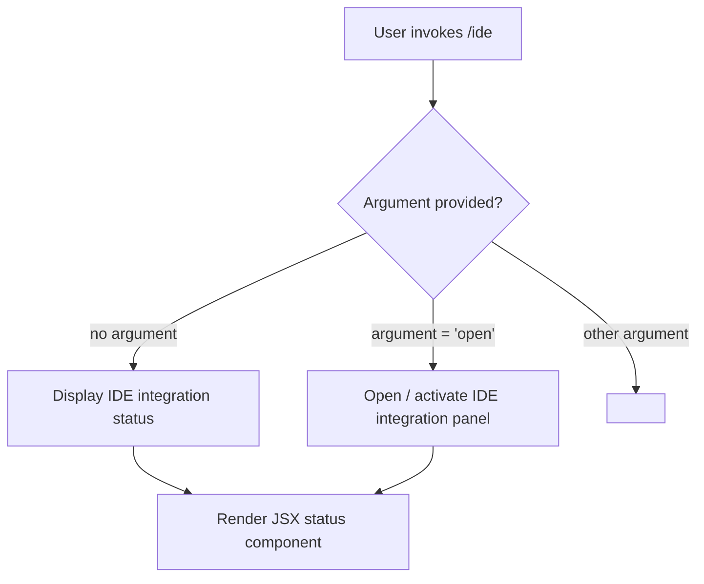

# `/ide`

> Analysis basis: CC v2.1.139 bundle.js (AST extraction + Claude interpretation)
> Minimum version: v2.1.139

---

## Overview

The `/ide` slash command provides an interface for managing IDE integrations within Claude Code and displaying their current connection status. It accepts an optional `open` argument, suggesting it can launch or surface an IDE integration panel in addition to showing status information. The command is registered as a `local-jsx` type, meaning its output is rendered as a JSX component directly within the CLI interface rather than as plain text.

---

## Registration

| Field | Value |
|---|---|
| type | `local-jsx` |
| name | `ide` |
| description | `Manage IDE integrations and show status` |
| argumentHint | `[open]` |
| module_id | `qqq` |

Analysis basis: CC v2.1.139 bundle.js:+10463951

---

## Input Branching

The `[open]` argument hint indicates at minimum two execution paths. Based on the registration fields alone, the following branching logic is inferred:



> **Note:** The branching logic above is derived solely from the `argumentHint` field `[open]` in the registration object. No call graph data was available to confirm additional paths.

Analysis basis: CC v2.1.139 bundle.js:+10463951

---

## Behavioral Spec

### Status Display

When invoked without arguments, the command renders a JSX component showing the current state of all detected or configured IDE integrations.

```
function renderIdeStatus():
    integrations = getConnectedIdeIntegrations()
    return JSX component displaying:
        - list of detected IDEs and their connection state
        - any actionable hints (e.g., how to connect an IDE)
```

Analysis basis: CC v2.1.139 bundle.js:+10463951
<!-- TODO: Internal render logic not found in depth-2 traversal; needs --depth 4 -->

### Open Action

When invoked with the `open` argument, the command likely triggers an action to open or surface the IDE integration interface.

```
function handleIdeOpen():
    if argument == "open":
        triggerOpenIdeIntegration()
    else:
        renderIdeStatus()
```

Analysis basis: CC v2.1.139 bundle.js:+10463951
<!-- TODO: triggerOpenIdeIntegration implementation not found in depth-2 traversal; needs --depth 4 -->

---

## State & Side Effects

| Item | Detail |
|---|---|
| Telemetry | <!-- TODO: not found in depth-2 traversal; needs --depth 4 --> |
| Hook registration | <!-- TODO: not found in depth-2 traversal; needs --depth 4 --> |
| appState changes | <!-- TODO: not found in depth-2 traversal; needs --depth 4 --> |
| Sound | <!-- TODO: not found in depth-2 traversal; needs --depth 4 --> |
| Render type | Outputs a `local-jsx` component; rendered inline within the Claude Code terminal UI |

> **Extraction note:** The AST traversal for module `qqq` produced an empty call graph, empty literals list, and empty telemetry list. The note in the source data explicitly states: `"no entry functions found for module 'qqq'"`. All behavioral details beyond the registration fields cannot be verified from this dataset.

---

## Version History

| Version | Change |
|---|---|
| v2.1.139 | Initial analysis — registration fields confirmed; implementation internals unresolved pending deeper traversal |

---

## Common Mistakes

1. **Assuming `/ide open` opens a browser or external window** — the exact effect of the `open` argument is unconfirmed; it may open an in-terminal panel, trigger a VS Code extension handshake, or perform another IDE-specific action. Do not treat this as equivalent to a shell `open` command.
2. **Expecting plain-text output** — because the type is `local-jsx`, the command renders a JSX component. Piping or capturing stdout may not capture the rendered output as expected.
3. **Using undocumented arguments** — only `open` is hinted in the registration. Passing any other argument has undefined behavior based on available data.
4. **Conflating "status" with a persistent monitor** — `/ide` displays a point-in-time status snapshot; it is not a live-updating daemon or watcher unless additional implementation detail (unavailable in this traversal) indicates otherwise.

---

## Appendix — Identifier Mapping

> For bundle debugging only. Identifiers change across versions.

| Identifier | Role |
|---|---|
| `qqq` | Module ID assigned to the `/ide` command implementation; no entry functions were resolved under this module ID during depth-2 AST traversal |

> **Note:** The `identifiers` array in the source data was empty. No additional obfuscated identifiers were available to map. If a deeper traversal (`--depth 4` or greater) resolves entry functions within module `qqq`, this table should be updated with the resulting mangled-to-descriptive name mappings.