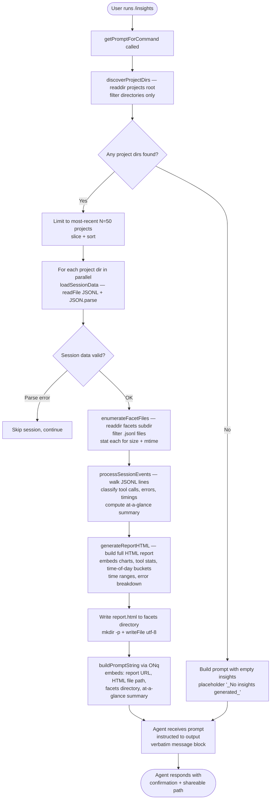

# `/insights`

> Analysis basis: CC v2.1.142 bundle.js (AST extraction + Claude interpretation)
> Minimum version: v2.1.142

---

## Overview

`/insights` generates a self-contained HTML usage report that aggregates data from the user's Claude Code session history (JSONL transcripts, facet files, and session-meta records), writes it to disk, and instructs the agent to surface a short shareable link or file path to the user. The command's handler (`getPromptForCommand`) collects, processes, and formats session analytics in-process before embedding them in a prompt that tells the agent to output a pre-rendered confirmation message verbatim.

---

## Registration

| Field | Value |
|---|---|
| type | `prompt` |
| name | `insights` |
| description | `Generate a report analyzing your Claude Code sessions` |
| loc_byte | `12061401` |
| loc_byte_end | `12062705` |
| loc_line | `8871` |
| handler_method | `getPromptForCommand` |
| handler_method_start | `12061575` |
| handler_method_end | `12062704` |
| prompt_body.length | `513` |
| prompt_body.trace | `call→ONq(...) (1 literals)` |
| arbor_handler.name | `getPromptForCommand` |
| arbor_handler.fqn | `claude-2.1.142::getPromptForCommand` |
| arbor_handler.kind | `Method` |
| arbor_handler.resolution_path | `direct` |
| arbor_handler.n_hits | `1` |

Analysis basis: CC v2.1.142 bundle.js:+12061401

---

## Input Branching

The handler has more than three distinct execution paths (session discovery, per-session data loading, facet file enumeration, report HTML generation, file write, and prompt assembly), so a Mermaid flowchart is used.



---

## Behavioral Spec

### 1 · Handler Entry (`getPromptForCommand`)

```
async function getPromptForCommand(context):
    rawInsights = await collectInsightsData(context)
    roundedDuration = Math.round(rawInsights.totalDuration)
    summaryLine   = buildSummaryLine(roundedDuration, ...)   // " · " separator
    promptText    = buildPromptString(                        // via ONq
                        insightsData   = rawInsights,
                        reportURL      = rawInsights.reportURL,
                        htmlFilePath   = rawInsights.htmlPath,
                        facetsDir      = rawInsights.facetsDir,
                        atAGlance      = summaryLine
                    )
    return { role: "user", content: promptText }
```

Analysis basis: CC v2.1.142 bundle.js:+12061575

---

### 2 · Project Directory Discovery (`discoverProjectDirs`)

```
async function discoverProjectDirs(projectsRoot):
    entries = await fs.readdir(projectsRoot, { withFileTypes: true })
    dirs    = entries.filter(e => e.isDirectory())
    if dirs.length == 0:
        return []
    // Limit to the most-recent window (literals: 50 upper, 200 outer)
    sorted = dirs.sort(byMtime descending)
    return sorted.slice(0, 50)                // literal: 10/9 batch sizes for setImmediate pacing
```

Analysis basis: CC v2.1.142 bundle.js:+12048329 (readdir), +12048383 (filter), +12048633 (sort), +12048579 (batch limit 10), +12048584 (batch size 9)

---

### 3 · Facet File Enumeration (`enumerateFacetFiles`)

```
async function enumerateFacetFiles(projectDir):
    facetsPath = path.join(projectDir, "facets")         // literal: "facets" +11988147
    entries    = await fs.readdir(facetsPath, { withFileTypes: true })
    jsonlFiles = entries.filter(e => e.isFile() && isJsonlExtension(e.name))
                                                         // literal: ".jsonl" +12128380
    stats      = await Promise.all(
                     jsonlFiles.map(f => fs.stat(path.join(facetsPath, f.name)))
                 )
    return jsonlFiles.map((f, i) => ({ name: f.name, ...stats[i] }))
```

Analysis basis: CC v2.1.142 bundle.js:+12128274 (readdir), +12128351 (isFile), +12128380 (".jsonl"), +12128515 (Promise.all), +12128583 (stat)

---

### 4 · Session Data Loading (`loadSessionData`)

```
async function loadSessionData(projectDir):
    usageDataPath   = path.join(projectDir, "usage-data")    // literal +11988097
    sessionMetaPath = path.join(projectDir, "session-meta")  // literal +11988193
    raw  = await fs.readFile(usageDataPath, "utf-8")         // literal "utf-8" +11994228
    parsed = safeJsonParse(raw)                               // JSON.parse wrapped
    return parsed
```

Analysis basis: CC v2.1.142 bundle.js:+11994204 (readFile), +11994245 (parse call), +11988097 ("usage-data"), +11988193 ("session-meta")

---

### 5 · Session Event Processing (`processSessionEvents`)

```
function processSessionEvents(sessionLines):
    for each line in sessionLines:
        classify message role (assistant / user / system / attachment)
        if toolCall:
            bucket by tool name (Edit, Write, WebSearch, WebFetch, git commit, git push, Other)
            // literals: "Edit" +11988921, "Write" +11988933, "WebSearch" +11988790, "WebFetch" +11988814
            // "git commit" +11989177, "git push" +11989209
        if toolResult contains error signals:
            classify as: Command Failed, User Rejected, Edit Failed,
                         File Changed, File Too Large, File Not Found,
                         Request Interrupted
            // literals: +11989808, +11989886, +11989980, +11990038, +11990118, +11990204
        record timestamps; compute session duration
        cap session duration at 3600s (literal +11989594)
    return aggregated stats
```

Analysis basis: CC v2.1.142 bundle.js:+11988631 (array check), +11989594 (3600s cap), +11988921–11990204 (tool/error labels)

---

### 6 · HTML Report Generation (`generateReportHTML`)

The report builder (`Ox7`) assembles a self-contained HTML file with embedded charts and statistics sections.

```
function generateReportHTML(insightsData):
    // Time-of-day buckets (hours)
    timeBuckets = [
        "Morning (6-12)"   : hours [7, 8, 9, 10, 11]    // literals +12005720
        "Afternoon (12-18)": hours [12, 13, 14, 15, 16, 17]
        "Evening (18-24)"  : hours [18, 19, 20, 21, 22, 23]
        "Night (0-6)"      : hours [0, 1, 2, 3, 4, 5]
    ]
    // Response-time buckets
    rtBuckets = ["2-10s","10-30s","30s-1m","1-2m","2-5m","5-15m",">15m"]
    // Thresholds: 120s, 900s (literals +12005092, +12005174)

    // Chart colors
    colors = ["#2563eb", "#0891b2", "#10b981", "#8b5cf6",
              "#dc2626", "#16a34a", "#eab308"]
    // literals +12042537, +12042675, +12042847, +12042990, +12046253, +12046502, +12046995

    html = buildHTMLSections(
        toolUsageSection   using renderBarChart(toolCounts),
        errorSection       using renderBarChart(errorCounts),    // empty: "<p class=\"empty\">No tool errors</p>"
        timeOfDaySection   using renderBarChart(timeBuckets),
        responsTimeSection using renderBarChart(rtBuckets),
        atAGlanceSection   (context-only, not shown to user yet)
    )
    // Max HTML size hint: 8192 chars per section (literal +12004041)
    return html
```

Analysis basis: CC v2.1.142 bundle.js:+12006506 (Ox7 entry), +12005720 (time buckets), +12004041 (8192 limit), +12042537 (colors), +12046253 (error color)

---

### 7 · Report File Write (`writeReport`)

```
async function writeReport(facetsDir, htmlContent):
    await fs.mkdir(facetsDir, { recursive: true })
    outPath = path.join(facetsDir, "report.html")    // literal +12050758
    await fs.writeFile(outPath, htmlContent, "utf-8")
    return outPath
```

Analysis basis: CC v2.1.142 bundle.js:+12050700 (mkdir), +12050744 (join), +12050758 ("report.html"), +12050786 (writeFile)

---

### 8 · Prompt Assembly (`buildPromptString` via `ONq`)

The 513-character prompt body is constructed by `ONq` and follows this structure (paraphrased; never quoted verbatim beyond short fragments):

```
function buildPromptString(insightsData, reportURL, htmlPath, facetsDir, atAGlance):
    body  = "The user just ran /insights …"   // context preamble
    body += interpolate(insightsData)          // full structured data block
    body += "Report URL: "  + reportURL
    body += "HTML file: "   + htmlPath
    body += "Facets directory: " + facetsDir
    body += "At-a-glance summary (for your context only …):\n" + atAGlance
    body += instructionBlock                   // "Output the text between <message> tags verbatim …"
    body += "<message>\nYour shareable insights report is ready:\n …\n"
    body += "Want to dig into any section or try one of the suggestions?\n</message>"
    return body
```

Key behavioral constraint from prompt body: the agent is instructed to output the text between `<message>` tags **verbatim as its entire response** and must not omit any line. The at-a-glance summary is injected into the prompt for the agent's context only — the user has not seen it before the agent speaks.

Analysis basis: CC v2.1.142 bundle.js:+12062607 (ONq call), +12061962 (Math.round for duration), +12062033 (" · " separator), +12062472 ("_No insights generated_" fallback), +12062625 (RH / JSON serialization)

---

### 9 · Fallback: No Sessions Found

```
if atAGlance is empty or no sessions found:
    atAGlance = "_No insights generated_"    // literal +12062472
    // report.html still written but with empty-state sections
    // e.g. "<p class=\"empty\">No data</p>" +12004363
```

Analysis basis: CC v2.1.142 bundle.js:+12062472

---

## State & Side Effects

| Item | Detail |
|---|---|
| File created | `<facetsDir>/report.html` — self-contained HTML analytics report (Analysis basis: +12050758) |
| Directories created | `<facetsDir>` created with `mkdir -p` if not already present (Analysis basis: +12050700) |
| Files read | Per-project `usage-data` and `session-meta` JSONL/JSON files under the projects root (Analysis basis: +11994204) |
| Facet files stat'd | All `.jsonl` files under each project's `facets/` subdirectory are `stat()`-called for size and mtime (Analysis basis: +12128583) |
| Telemetry | No `tengu_insights_*` event found in depth-2 traversal; telemetry events present are from unrelated subsystems (daemon, voice, transcript chain) — <!-- TODO: not found in depth-2 traversal; needs --depth 4 --> |
| appState changes | None detected in depth-2 traversal |
| Hook registration | None detected in depth-2 traversal |
| Sound | None detected |
| Agent output | Agent is instructed to reproduce a verbatim `<message>` block; no tool calls are initiated by the command itself |

---

## Version History

| Version | Change |
|---|---|
| v2.1.142 | Initial analysis |

---

## Common Mistakes

1. **Running `/insights` with no prior sessions.** If no project directories are found under the projects root, the report is empty and the agent replies with the `_No insights generated_` fallback. The HTML file is still written.
2. **Expecting live data.** The report is assembled entirely from on-disk JSONL/JSON files at invocation time. Sessions in-progress are not yet reflected until their transcript data is flushed to disk.
3. **Assuming the agent adds commentary.** The prompt instructs the agent to output the pre-rendered `<message>` block verbatim. Any extra analysis offered by the agent is only triggered if the user asks a follow-up question.
4. **Misinterpreting the at-a-glance summary.** The summary is injected into the prompt for the agent's contextual awareness only; it does not appear as a separate user-visible message before the `<message>` block.
5. **Expecting a URL to an online service.** The "Report URL" field is a local `file://` path or equivalent pointing to the written `report.html`; there is no network upload performed by this command.

---

## Appendix — Identifier Mapping

> For bundle debugging only. Identifiers change across versions.

| Identifier | Role |
|---|---|
| `__handler_insights` | Synthetic BFS entry node for the `/insights` command handler |
| `$Nq` | Main insights data-collection and report-orchestration function |
| `Yx7` | Project directory discovery and batched iteration helper |
| `JF` | Path-join helper (joins with "projects" literal) |
| `TsH` | Facet file enumerator — readdir + stat `.jsonl` files |
| `pn` | Filename extension predicate (regex `.test`) |
| `tb7` | Per-project session data loader (readFile + parse) |
| `Gg_` | Session-meta path resolver |
| `gX8` | Usage-data path resolver ("usage-data" / "session-meta" subdirs) |
| `b6` | Safe JSON parse wrapper |
| `Eg_` | Session event classifier and aggregator |
| `fNq` | Per-line JSONL event classifier (tools, errors, timestamps) |
| `Ox7` | Full HTML report builder |
| `_x7` | Per-section statistics aggregator |
| `MNq` | Numeric statistics helper (percentiles, sorted accumulations) |
| `KNq` | Per-session report data assembler |
| `qx7` | Report-section renderer (maps sessions to HTML sections) |
| `rLH` | Bar-chart HTML renderer |
| `fx7` | Chart scale calculator (Math.max over values) |
| `Mx7` | Multi-series chart layout helper |
| `$x7` | HTML escaping / serialisation helper (wraps `RH`) |
| `p7` | HTML entity encoder (ampersand, lt, gt, quot, apos) |
| `Q5` | String replaceAll wrapper for HTML encoding |
| `FX8` | Inline template renderer (calls `p7`) |
| `DDH` | Report document shell builder |
| `HY8` | Cache/hash helper for report file identity (sha1 + hex) |
| `Y8` | UUID generation helper for report artifacts |
| `bNH` | Assistant-message extractor from transcript |
| `nb7` | Conversation turn slicer / token budget enforcer |
| `ob7` | Parallel session summary aggregator |
| `Hx7` | Top-level report package assembler (calls `ob7`, `DDH`, `LNq`) |
| `LNq` | Report locale/format resolver |
| `lV` | Locale value helper |
| `eb7` | Writes processed session data back to disk (mkdir + writeFile) |
| `sb7` | Writes secondary output file (QX8 path + writeFile) |
| `ab7` | Reads and cleans up a cached partial-report file (readFile + unlink) |
| `cb7` | NaN guard for numeric session fields |
| `db7` | File extension extractor (`path.extname`) |
| `dx7` | Input content-type validator (trim + Array.isArray + some) |
| `cx7` | Additional content-type validator |
| `eW6` | JSONL line renderer for report body |
| `pg_` | Prompt-text sanitiser (replaceAll + slice) |
| `ulH` | Map-over-sessions helper |
| `Bg_` | Content block type checker |
| `Qx7` | Transcript chain deduplication and sort |
| `Bx7` | Transcript chain boundary resolver |
| `iqH` | Transcript chain loader and validator |
| `gx7` | Chain entry NaN / validity checker |
| `qkq` | Transcript chain Map accessor |
| `eX8` | Chain entry getter/setter |
| `H28` | Chain snapshot builder (Array.from + values) |
| `jHH` | Session store initialiser (sets all Map/Set entries for a session) |
| `dX8` | Session store accessor / dispatcher |
| `iHA` | Nested-object key-path resolver |
| `FNq` | Session relink / orphan-walk helper |
| `ex7` | JSONL binary parser (Buffer-based low-level reader) |
| `Hu7` | Synchronous header reader (openSync + readSync + closeSync) |
| `tx7` | Secondary JSONL parser variant |
| `kx7` | Session store key enumerator |
| `tm` | Session timestamp helper |
| `uP` | Session UUID generator / validator |
| `RH` | JSON.stringify wrapper |
| `QX8` | Secondary path resolver (joins with `gX8`) |
| `zNq` | Post-parse validation / normalisation step |
| `ONq` | Prompt-body string builder (1-literal interpolation, 513 chars) |
| `GsH` | Object.entries aggregation helper for stats |
| `u1` | String index/slice helper |
| `r3H` | Diff computation helper (`Yn9.diff`) |
| `H7` | String indexOf wrapper |
| `iM` | Numeric rounding helper (Math.round) |
| `Tg_` | "warmup_minimal" mode gate check |
| `Dx7` | Object key enumerator for report sections |
| `Hx7` | Report packaging entry (also listed above) |
| `$K` | Assistant-message filter helper |
| `k_` | Error construction helper (Error + String) |
| `NH` | Structured error logger (logError + push to error buffer) |
| `bH` | String coercion helper |
| `GH` | String cast wrapper |
| `lh_` | MCP OAuth flow initiator |
| `nh_` | MCP OAuth callback handler |
| `o6q` | MCP connection state poller |
| `dh_` | MCP server disconnection handler |
| `IvH` | MCP client manager (connects/reconnects all servers) |
| `Peq` | MCP update applicator |
| `n_5` | MCP server list reconciler |
| `M` | MCP manager object (get/set/values/push) |
| `D47` | MCP connection timestamp tracker |
| `O78` | MCP tool schema validator |
| `$78` | MCP tool registration helper |
| `H8` | MCP debug logger |
| `_7` | MCP error logger |
| `LG_` | MCP capability inclusion checker |
| `J` | Process/kill queue (values + kill) |
| `y` | Write-stream helper |
| `Zp` | MCP state snapshot helper |
| `oKH` | MCP keepalive helper |
| `Kn` | MCP handshake helper |
| `c6q` | MCP queue helper |
| `nX6` | parseInt wrapper (radix 3) |
| `JS_` | parseInt wrapper (radix 20) |
| `SY8` | MCP update signal helper |
| `Ov` | MCP cleanup orchestrator |
| `BrH` | MCP retry signal |
| `zEq` | MCP event timestamp emitter |
| `Y78` | MCP set membership checker (sx4/tx4) |
| `a8` | Timeout/abort helper |
| `AHH` | MCP tool descriptor builder |
| `dI` | MCP schema type resolver |

---

Note: index built via Arbor fallback; some signals (telemetry, literals) may be missing — see arbor-fallback.js.