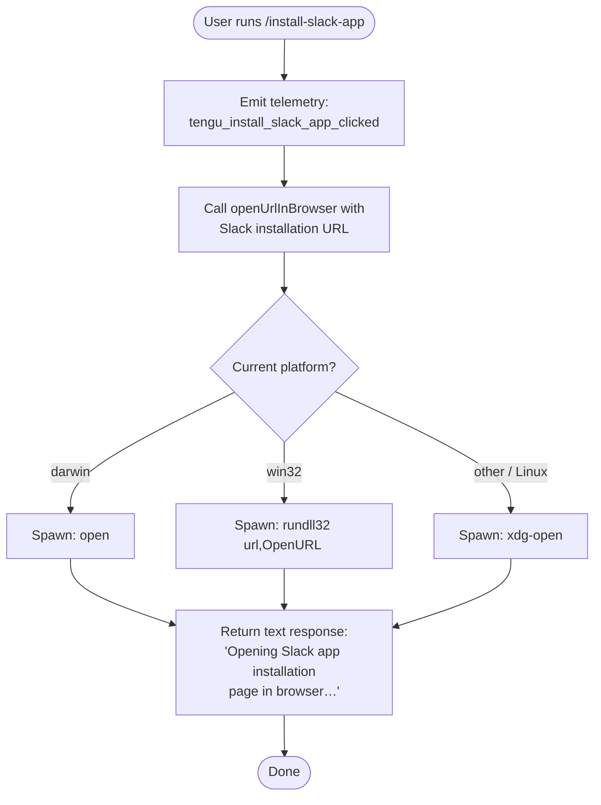

# `/install-slack-app`

> Analysis basis: CC v2.1.142 bundle.js (AST extraction + Claude interpretation)
> Minimum version: v2.1.142

---

## Overview

The `/install-slack-app` command opens the Claude Slack app installation page directly in the user's default web browser. It is a non-interactive, fire-and-forget action: it fires a telemetry event, resolves the correct platform-native open-URL mechanism, launches the browser, and immediately returns a short confirmation message to the terminal.

---

## Registration

| Field | Value |
|---|---|
| type | `local` |
| name | `install-slack-app` |
| description | `Install the Claude Slack app` |
| supportsNonInteractive | `false` |
| module_id | `Bfq` |
| load_inline | `true` |
| loc_byte | `10689172` |
| loc_byte_end | `10689358` |
| loc_line | `6461` |
| arbor_handler.name | `Hj7` |
| arbor_handler.fqn | `claude-2.1.142::Hj7` |
| arbor_handler.kind | `AsyncFunction` |
| arbor_handler.resolution_path | `module_id` |
| arbor_handler.n_hits | `0` |

Analysis basis: CC v2.1.142 bundle.js:+10689172

---

## Input Branching

The command accepts no user-supplied arguments; however, the URL-open helper (`openUrlInBrowser`) has 3+ distinct platform branches (darwin / win32 / other), making a flowchart the appropriate representation.



Analysis basis: CC v2.1.142 bundle.js:+10688778, +7528229, +7528301, +7528317, +7528401, +7528475, +7528482, +10688924

---

## Behavioral Spec

### Main Handler (`Hj7` → `installSlackAppHandler`)

```
async function installSlackAppHandler(context):
    emit telemetry("tengu_install_slack_app_clicked")   // +10688778

    call openUrlInBrowser(SLACK_INSTALL_URL)             // +10688816
        // openUrlInBrowser validates URL scheme (http/https)  // +7527992, +7528014
        // then dispatches platform-specific subprocess

    return { type: "text",                               // +10688911
             content: "Opening Slack app installation page in browser…" }  // +10688924
```

Analysis basis: CC v2.1.142 bundle.js:+10688776, +10688891

---

### URL Validation and Browser Launch (`sq` → `openUrlInBrowser`)

```
function openUrlInBrowser(url):
    if url.protocol not in ["http:", "https:"]:          // +7527992, +7528014
        throw Error("Invalid URL scheme")                // +7527942

    platform = process.platform
    if platform == "darwin":                             // +7528301
        spawn("open", [url])                             // +7528475
    else if platform == "win32":                         // +7528317
        spawn("rundll32", ["url,OpenURL", url])          // +7528401, +7528413
    else:
        spawn("xdg-open", [url])                         // +7528482

    await subprocess completion
    return success
```

Analysis basis: CC v2.1.142 bundle.js:+7528229, +7528242, +7528350

---

### Platform Detection Sub-flow (`D8` → `platformAwareLaunch`)

```
function platformAwareLaunch(url):
    // Validates OS via process.platform string           // +7528301, +7528317
    // Falls back to system open utility for all
    // non-Windows, non-macOS platforms                   // +7528482
    // Uses IJ (internal browser-spawn helper) for
    // subprocess management                              // +7528242
```

Analysis basis: CC v2.1.142 bundle.js:+7528350

---

### Config Lock / Save Path (reachable via `t6` → `saveConfig`)

Although the command itself does not directly write configuration, the call graph includes the config-save pathway (via `t6` → `oA_` → `cMH`). This is a shared infrastructure path reached transitively. Key behaviors observable in the traversal:

- **Lock contention warning**: if another Claude instance holds the config lock for longer than expected, a `"Lock acquisition took longer than expected - another Claude instance may be running"` warning is emitted. (bundle.js:+3152469)
- **Auth-loss guard**: before writing, the implementation checks that the re-read config still contains auth data; if missing it refuses to write and logs `tengu_config_auth_loss_prevented`. (bundle.js:+3153037)
- **Config-parse error**: if the on-disk JSON is malformed, `tengu_config_parse_error` fires and the error is surfaced. (bundle.js:+3155139)
- **Backup limit**: the backup rotation keeps at most **5** snapshots. (bundle.js:+3153488)
- **Backup file mode**: written with permissions octal `600` (decimal **384**). (bundle.js:+3153770)
- **Config access guard**: reading config before the initialization gate is complete raises `"Config accessed before allowed."` (bundle.js:+3154502)

> Note: these behaviors belong to shared config infrastructure and are not unique to `/install-slack-app`. They appear in the depth-2 call graph because the async handler uses the same module that hosts the config subsystem.

---

### Background Session Subsystem (reachable via `w`)

The call graph surfaces several background-session helpers at depth 2. These are shared daemon infrastructure, not triggered directly by this command:

- **SIGKILL escalation** (`tengu_bg_dispatch_sigkill_escalate`): if a background process does not terminate within 30 s (then 15 s grace), SIGKILL is sent. (bundle.js:+14462601, +14462612, +14462694)
- **Low-memory guard** (`tengu_bg_dispatch_low_mem`): free memory is sampled; threshold is 1024 units. (bundle.js:+14463119)
- **Spare session lifecycle** (`tengu_bg_spare_enable`, `tengu_bg_spare_claim`, `tengu_bg_spare_claim_fail`, `tengu_bg_spare_spawn`): spare background sessions are pre-spawned and claimed on demand. (bundle.js:+14463840, +14463961, +14464224, +14462423)

---

## State & Side Effects

| Item | Detail |
|---|---|
| Telemetry (direct) | `tengu_install_slack_app_clicked` (bundle.js:+10688778) |
| Telemetry (transitive – config) | `tengu_config_lock_contention` (+3152558), `tengu_config_stale_write` (+3152694), `tengu_config_parse_error` (+3155139), `tengu_config_auth_loss_prevented` (+3153037) |
| Telemetry (transitive – bg session) | `tengu_bg_dispatch_sigkill_escalate` (+14462646), `tengu_bg_dispatch_low_mem` (+14463225), `tengu_bg_spare_enable` (+14463840), `tengu_bg_spare_claim` (+14463961), `tengu_bg_spare_claim_fail` (+14464224), `tengu_bg_spare_spawn` (+14462423) |
| Browser subprocess | Spawns platform-specific open-URL binary; does not block the CLI on browser close |
| Config writes | None initiated directly by this command |
| Hook registration | None found at depth ≤ 2 |
| appState changes | None found at depth ≤ 2 |
| Sound | None found at depth ≤ 2 |
| Return value | `{ type: "text", content: "Opening Slack app installation page in browser…" }` (bundle.js:+10688911, +10688924) |
| supportsNonInteractive | `false` — command must be run in an interactive session |

---

## Version History

| Version | Change |
|---|---|
| v2.1.142 | Initial analysis |

---

## Common Mistakes

1. **Running in non-interactive mode**: `supportsNonInteractive` is `false`; invoking this command in a headless/CI pipeline will not work as intended. (bundle.js:+10689172)
2. **No browser installed / headless environment**: the subprocess (`open`, `rundll32`, or `xdg-open`) will fail silently or with an OS-level error if no default browser is configured — the CLI will still return the success message.
3. **Expecting confirmation of installation**: the command only opens the browser page; it does not poll or verify that the Slack app was actually installed.
4. **Mistaking the config-lock warning for a command failure**: if the shared config lock is contended at the moment the command runs, a warning about another Claude instance is logged but the URL-open action proceeds independently.
5. **Assuming arguments are accepted**: the command takes no input arguments; any text typed after `/install-slack-app` is ignored.

---

## Appendix — Identifier Mapping

> For bundle debugging only. Identifiers change across versions.

| Identifier | Role |
|---|---|
| `Hj7` | Main async handler for `/install-slack-app` (arbor_handler) |
| `d` | Internal debug/logger utility |
| `t6` | Config save coordinator (global config write path) |
| `oA_` | Config write-with-lock implementation |
| `_` | Filesystem abstraction (fs wrapper) |
| `x6` | Error classification / typed error constructor |
| `L` | File-lock manager (lock acquire / release) |
| `q` | Node.js `fs` module proxy |
| `f` | File-handle or stream object |
| `qeA` | Config object builder / merger |
| `ei8` | Config schema or defaults initializer |
| `v` | HTTP/network request dispatcher |
| `f7K` | HTTP request builder |
| `H` | Jitter / retry scheduler (uses Math.random + setTimeout) |
| `RH` | JSON serialization helper |
| `H5` | String redaction / masking utility |
| `BhH` | Header builder helper |
| `O7K` | HTTP response handler / streamer |
| `O8` | Structured error emitter |
| `cMH` | Config file reader and backup manager |
| `b6` | JSON parse wrapper |
| `DR` | String prefix stripper |
| `bE9` | Directory traversal / config locator |
| `NH` | Error logger (uses `Yc.logError`) |
| `aA_` | Config backup path resolver |
| `w` | Background session / daemon process manager |
| `h76` | Auth data presence checker |
| `A` | Case normalizer (toLowerCase) |
| `V` | String prefix matcher |
| `X` | MCP connection/session manager |
| `hT8` | MCP transport initializer |
| `k_` | Generic error wrapper |
| `Z` | Array / buffer slice helper |
| `TA6` | Atomic file write utility (temp-file + rename) |
| `O` | File stat / symbolic-link resolver |
| `$8` | Structured error constructor |
| `amH` | Config migration helper |
| `CE9` | Object entries iterator helper |
| `smH` | Timestamp / elapsed-time tracker |
| `rA_` | Config file path writer |
| `sq` | URL open in browser (platform dispatch) |
| `Jb4` | URL scheme validator |
| `IJ` | Browser subprocess spawn helper |
| `D8` | Platform-aware launch coordinator |
| `O_` | Subprocess execution wrapper |
| `_XH` | Low-level process spawn implementation |
| `D` | Background process lifecycle manager |
| `gkK` | Process exit-code stringifier |
| `h6` | Async-local-storage context reader |
| `VS6` | Store accessor for async context |
| `__` | Top-level context/store initializer |

---

Note: index built via Arbor fallback; some signals (telemetry, literals) may be missing — see arbor-fallback.js.