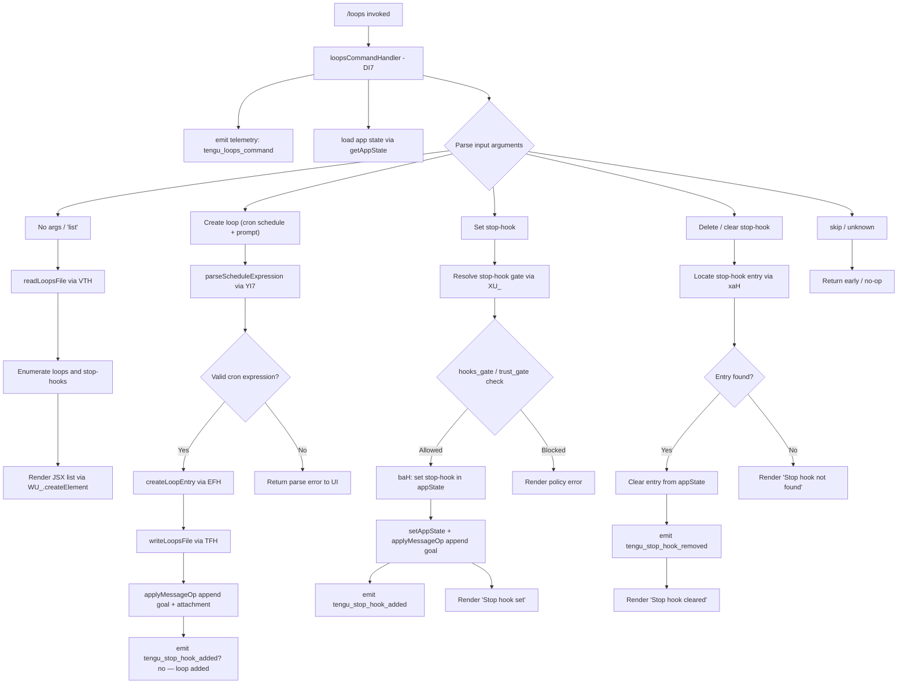

# `/loops`

> Analysis basis: CC v2.1.142 bundle.js (AST extraction + Claude interpretation)
> Minimum version: v2.1.142

---

## Overview

The `/loops` command provides a management interface for recurring scheduled tasks ("loops") and stop-hooks within Claude Code. It allows users to list all active loops and stop-hooks, create new recurring loops with cron-style scheduling, and delete existing entries. The command renders as a local JSX component and dispatches directly against the application state via `getAppState`/`setAppState`/`applyMessageOp`.

---

## Registration

| Field | Value |
|---|---|
| type | `local-jsx` |
| name | `loops` |
| description | List, create, and delete recurring loops and stop-hooks |
| loc_byte | `11445792` |
| loc_byte_end | `11445974` |
| loc_line | `7071` |
| immediate | `true` |
| module_id | `z2q` |
| load_inline | `true` |
| arbor_handler.name | `DI7` |
| arbor_handler.fqn | `claude-2.1.142::DI7` |
| arbor_handler.kind | `AsyncFunction` |
| arbor_handler.resolution_path | `module_id` |
| arbor_handler.n_hits | `0` |

Analysis basis: CC v2.1.142 bundle.js:+11445792

---

## Input Branching

The command handles 4+ distinct execution branches depending on sub-command intent (list, create loop, set stop-hook, delete/clear stop-hook), making a Mermaid flowchart the appropriate representation.



Analysis basis: CC v2.1.142 bundle.js:+11444749 through +11445626

---

## Behavioral Spec

### Main Handler — `loopsCommandHandler` (`DI7`)

```
async function loopsCommandHandler(context):
    emit telemetry("tengu_loops_command")          // +11444751
    appState = context.getAppState()               // +11444800

    loopEntries  = loadLoopsData(appState)         // Rt  +11444789
    stopHookList = buildStopHookList(appState)     // lj8 +11444796
    parsedArgs   = parseInputArguments(context)    // internal

    subCommand = determineSubCommand(parsedArgs)   // V6  +11444816

    switch subCommand:
        case "list"   : return renderLoopsList(loopEntries, stopHookList)
        case "cron"   : return handleCreateLoop(parsedArgs, appState)
        case "stophook": return handleSetStopHook(parsedArgs, appState)
        case "delete" : return handleDeleteStopHook(parsedArgs, appState)
        case "skip"   : return                     // +11445658

    return renderJSX(WU_.createElement, ...)       // +11445552
```

Analysis basis: CC v2.1.142 bundle.js:+11444749

---

### Loop File Reader — `readLoopsFile` (`VTH`)

```
async function readLoopsFile(basePath):
    configPath = pathJoin(basePath, ".claude")     // G1H +4683845
    rawText    = fs.readFile(configPath, "utf-8")  // +4683914, +4683942
    parsed     = parseLoopsEntries(rawText)        // NH  +4683986
    validated  = validateEntries(parsed)           // y9  +4683964, M1 +4684001
    if Array.isArray(validated):
        mapped = validated.map(normalizeEntry)     // v   +4684237
    serialized = serialize(mapped)                 // RH  +4684284
    filtered   = applyActiveFilter(serialized)     // II  +4684306
    return filtered
```

Analysis basis: CC v2.1.142 bundle.js:+4683895

---

### Stop-Hook List Builder — `buildStopHookList` (`lj8`)

```
function buildStopHookList(appState):
    result = []
    for entry in appState.hooks:
        if entry.type == "Stop":                   // +11442190
            row = formatHookRow(entry)             // rYH +11442182
            result.push(row)                       // +11442306
    return result                                  // type "prompt" +11442297
```

Analysis basis: CC v2.1.142 bundle.js:+11442182

---

### Schedule Expression Parser — `parseScheduleExpression` (`YI7`)

```
function parseScheduleExpression(input):
    trimmed = input.trim()
    // Match numeric components via regex
    parts   = trimmed.match(scheduleRegex)         // +11444337
    if not parts: return error

    minute  = parseInt(parts.minute)               // +11444374
    // Clamp: minutes 0-59, hours 0-23, days 1-31  // +11444516, +11444587, +11444640
    minute  = Math.max(0, Math.min(minute, 59))    // +11444459 / +11444516
    hour    = Math.ceil(resolveHour(parts))        // +11444470
    hour    = Math.min(hour, 23)                   // +11444587
    day     = Math.round(resolveDay(parts))        // +11444543
    day     = Math.min(day, 31)                    // +11444640
    // Also handles "Every minute" / "Every hour" shorthand
    // "Every minute" literal  +4681806
    // "Every hour"   literal  +4682023
    // Range "1-5"    literal  +4682730
    schedule = buildCronFields(minute, hour, day)
    return schedule
```

Analysis basis: CC v2.1.142 bundle.js:+11444337

---

### Loop Entry Creator — `createLoopEntry` (`EFH`)

```
async function createLoopEntry(schedule, promptText, appState):
    id        = crypto.randomUUID()                // bl9.randomUUID +4685242
    createdAt = Date.now()                         // +4685304
    goal      = buildGoalObject(promptText)        // CjH +4685350
    // Validate existing loop file
    existing  = await readLoopsFile(appState)      // VTH +4685394
    existing.push({ id, schedule, goal,            // +4685407
                    type: "cron", createdAt })
    await writeLoopsFile(existing)                 // TFH +4685501
    // Attach to message thread
    context.applyMessageOp("append", {             // +11443179
        type: "attachment",                        // +11443308
        subType: "goal",                           // +11443267
        status: "goal_status"                      // +11443395
    })
    return resolveBase(existing)                   // Va +4685488
```

Analysis basis: CC v2.1.142 bundle.js:+4685242

---

### Loops File Writer — `writeLoopsFile` (`TFH`)

```
async function writeLoopsFile(entries):
    dir  = getRootPath()                           // RK +4685051
    fs.mkdir(dir, { recursive: true })             // VH8.mkdir +4685062
    dest = pathJoin(dir, ".claude", ...)           // IH8.join +4685072
    data = entries.map(serializeEntry)             // H.map +4685123
    await fs.writeFile(dest, data)                 // VH8.writeFile +4685159
    summary = buildSummary(data)                   // G1H +4685173
    return serialize(summary)                      // RH +4685180
```

Analysis basis: CC v2.1.142 bundle.js:+4685051

---

### Set Stop-Hook — `setStopHookHandler` (`baH`)

```
async function setStopHookHandler(args, context):
    // Gate checks
    gateResult = checkHooksGate(args)              // XU_ +11442482
    // hooks_gate  literal +11442378
    // trust_gate  literal +11442432
    if gateResult.blocked: return renderError(gateResult)

    appState  = context.getAppState()              // +11442567
    timestamp = Date.now()                         // +11442731
    counts    = getOutputTokenCounts(appState)     // ij +11442756
    // Generate unique ID
    hookId    = crypto.randomUUID()                // O2q +11442853, f2q.randomUUID +11443326

    newState  = applyStopHook(appState, {
        id: hookId, type: "Stop",                  // +11442190
        promptText: args.promptText,
        createdAt: timestamp
    })
    context.setAppState(newState)                  // +11442769
    context.applyMessageOp("append", {             // +11442811, "append" +11443202
        type: "goal_set"                           // +11442510
    })
    emit telemetry("tengu_stop_hook_added")        // +11442868
    return renderMessage("Stop hook set")          // +11445509
```

Analysis basis: CC v2.1.142 bundle.js:+11442482

---

### Clear / Delete Stop-Hook — `clearStopHookHandler` (`xaH`)

```
async function clearStopHookHandler(args, context):
    appState  = context.getAppState()              // +11442981
    hookIndex = findStopHookIndex(appState, args)  // +11442970 V6
    if hookIndex == -1:
        return renderMessage("Stop hook not found") // +11445191

    // Mutate state
    newState = removeHookAt(appState, hookIndex)
    context.setAppState(newState)                  // +11443110
    context.applyMessageOp("append", ...)          // +11443179
    emit telemetry("tengu_stop_hook_removed")      // (see State section)
    return renderMessage("Stop hook cleared")      // +11445213
```

Analysis basis: CC v2.1.142 bundle.js:+11442970

---

### Active-Filter / Cron-Line Parser — `parseCronLine` (`II` / `y64`)

```
function parseCronLine(rawLine):
    line = rawLine.trim()                          // H.trim +4680515
    // Tokenise on whitespace, parse up to 5 fields
    fields = tokenizeScheduleLine(line)            // y64 +4680601
    // parseInt each numeric field                 // +4680000
    // Max field value check: 10                   // +4680014
    // Cardinality constants: 3, 6, 7              // +4680176, +4680212, +4680218
    // Populate up to 5 slots                      // +4680551
    result = Array.from(fields)                    // +4680463
    lineEntries.push(result)                       // A.push +4680636
    return lineEntries
```

Analysis basis: CC v2.1.142 bundle.js:+4680515

---

## State & Side Effects

| Item | Detail |
|---|---|
| Telemetry: `tengu_loops_command` | Fired on every `/loops` invocation (bundle.js:+11444751) |
| Telemetry: `tengu_stop_hook_added` | Fired when a new stop-hook is registered (bundle.js:+11442868) |
| Telemetry: `tengu_stop_hook_removed` | Fired when a stop-hook is deleted (bundle.js:+11443236) |
| Telemetry: `tengu_bg_dispatch_sigkill_escalate` | Fired during background worker SIGKILL escalation reachable from the loop scheduler (bundle.js:+14462646) |
| Telemetry: `tengu_daemon_control` | Fired during daemon control operations (bundle.js:+14497664) |
| Telemetry: `tengu_daemon_yield` | Fired when supervisor yields to foreground daemon (bundle.js:+14480594) |
| Telemetry: `tengu_bg_low_mem_mb` | Fired when available memory is below threshold (bundle.js:+11935230) |
| Telemetry: `tengu_bg_dispatch_low_mem` | Fired during low-memory background dispatch (bundle.js:+14463225) |
| Telemetry: `tengu_bg_spare_enable` | Fired when spare background worker pool is enabled (bundle.js:+14463840) |
| Telemetry: `tengu_bg_sendclaim_failed` | Fired on failed background claim send (bundle.js:+14444612) |
| Telemetry: `tengu_bg_spare_claim` | Fired on successful spare worker claim (bundle.js:+14463961) |
| Telemetry: `tengu_bg_spare_spawn` | Fired when a spare background worker is spawned (bundle.js:+14462423) |
| Telemetry: `tengu_bg_spare_claim_fail` | Fired when spare worker claim fails (bundle.js:+14464224) |
| Telemetry: `tengu_feature_bad` / `tengu_feature_ok` / `tengu_feature_sad` | Feature-health probes in supporting infrastructure (bundle.js:+954608, +954550, +954683) |
| `appState` changes | Stop-hooks read/written via `getAppState` / `setAppState`; loops file written to `.claude` directory in project root |
| `applyMessageOp` | Appends `goal`, `attachment`, and `goal_set` records to the active message thread |
| File I/O | Reads and writes the loops configuration file under `.claude/` (bundle.js:+4683914, +4685159) |
| Filesystem | `mkdir` with `recursive: true` ensures parent directories exist before writing (bundle.js:+4685062) |
| Background daemon | Deep call graph touches background worker pool management (`Fr_`, `br_`, `xr_`) including `Bun.spawn`, Unix socket, and `randomBytes`-based IPC claim framing |
| Sound | <!-- TODO: not found in depth-2 traversal; needs --depth 4 --> |
| Hook registration | Stop-hooks stored in appState and persisted to `.claude/` loops file; gated by `hooks_gate` and `trust_gate` policy checks (bundle.js:+11442378, +11442432) |

---

## Version History

| Version | Change |
|---|---|
| v2.1.142 | Initial analysis |

---

## Common Mistakes

1. **Omitting the schedule expression**: `/loops` without a valid cron-style schedule when trying to create a loop will fail the `parseScheduleExpression` step and return a parse error. Use recognized shorthands such as "Every minute", "Every hour", or a `1-5` day-range notation.
2. **Attempting to clear a non-existent stop-hook**: If the hook ID or name passed to the delete sub-command does not match any entry in the current appState, the command silently returns "Stop hook not found" and emits no telemetry.
3. **Policy gate violations**: Creating stop-hooks in policy-restricted environments (where `hooks_gate` or `trust_gate` blocks the operation) will prevent the hook from being registered. The command renders a policy error instead of storing anything.
4. **Confusing "loops" and "stop-hooks"**: Loops are cron-scheduled recurring prompts stored in the `.claude/` file; stop-hooks are one-time callback prompts tied to session-stop events stored in appState. The `/loops` command manages both, but they follow different creation and deletion paths.
5. **Stale loop file**: Because the loops configuration is read from disk on every invocation (`readLoopsFile` via `VTH`), external edits to the `.claude/` loops file are reflected immediately. However, concurrent writes from multiple sessions are not coordinated, and the last writer wins.

---

## Appendix — Identifier Mapping

> For bundle debugging only. Identifiers change across versions.

| Identifier | Role |
|---|---|
| `DI7` | Main async handler for `/loops` command (`loopsCommandHandler`) |
| `Rt` | Loop data loader — orchestrates `VTH` and `XV` |
| `VTH` | Loops file reader — reads `.claude/` config, UTF-8 |
| `G1H` | Path builder for loops config file |
| `RK` | Project root path resolver |
| `y9` | Entry validator (calls `O8`) |
| `NH` | Loop-entry normalizer / error handler |
| `k_` | Error classifier (checks `Error`, `String`) |
| `bH` | String coercion helper |
| `$q` | Essential-traffic queue helper |
| `JvK` | Queue shift/push manager |
| `v` | Entry normalizer / mapper |
| `f7K` | Sub-normalizer for loop entries |
| `RH` | JSON serializer (`JSON.stringify` wrapper) |
| `H5` | String-path trimmer / slicer |
| `BhH` | Goal helper (calls `gHA`) |
| `O7K` | File write helper with byte-length check |
| `II` | Active-filter for cron lines |
| `y64` | Cron-line tokenizer / field parser |
| `XV` | Secondary loader called from `Rt` |
| `JV` | Path join utility |
| `lj8` | Stop-hook list builder |
| `rYH` | Stop-hook row formatter |
| `Lm1` | Map-over-hooks helper |
| `V6` | Stop-hook index finder / path resolver |
| `HZ` | Schedule-to-string converter / cron descriptor |
| `w` | Background worker runner / loop executor |
| `y` | Worker write helper (calls `d`) |
| `z` | Daemon write channel |
| `uH` | Daemon bad-feature reporter |
| `SH` | Daemon ok-feature reporter |
| `LG6` | Low-memory guard (macOS, 1 024 MB threshold) |
| `G6` | Background session dispatcher |
| `xr_` | Spare worker claim sender (IPC framing) |
| `dQ_` | Claim writer (mkdir + writeFile + JSON.stringify) |
| `Q95` | Claim timeout / error handler (5 000 ms timeout) |
| `g95` | Claim frame builder |
| `GH` | String error formatter |
| `Cp` | Binary frame packer (Buffer, writeUInt32BE) |
| `Fr_` | Loop/worker lifecycle manager |
| `IK` | Path+state helper for worker lifecycle |
| `o1` | Worker stat reader / cache manager |
| `dw` | Active-state setter |
| `gf` | Roster-file writer |
| `ZoH` | Async-completion waiter with Date.now timeout |
| `OLH` | Path-based lock helper |
| `uk` | Split-path helper for lock files |
| `pp` | Pre-claim path helper |
| `i26` | Lock file writer (ib_ helper) |
| `D` | Worker disposal and re-spawn decision |
| `$` | Disposable worker token |
| `br_` | Spare worker spawner (Bun.spawn, randomBytes) |
| `u` | Clearable timeout wrapper for worker |
| `J` | Worker kill iterator |
| `h` | Worker kill with blur/focus and Math.min backoff |
| `XF` | Kill-state flag |
| `N` | Away-summary generator |
| `V` | Async queue/concurrency primitive |
| `wcq` | Worker completion queue |
| `j` | UTC date arithmetic helper |
| `St` | Loop-execution orchestrator (calls `VTH`, `TFH`) |
| `Do` | Existence check helper |
| `TFH` | Loops file writer |
| `xaH` | Clear-stop-hook handler |
| `O2q` | UUID generator wrapper (crypto.randomUUID) |
| `YI7` | Schedule expression parser (cron fields) |
| `EFH` | Loop entry creator (UUID + Date.now + VTH + TFH) |
| `CjH` | Goal object builder |
| `M` | MCP/loop update coordinator |
| `IvH` | MCP client connection manager |
| `AHH` | MCP tool registration helper |
| `dI` | MCP descriptor builder |
| `H_` | MCP feature flag checker |
| `lX6` | MCP filter helper |
| `D47` | MCP timing recorder |
| `O78` | MCP object-key inspector |
| `$78` | MCP option builder |
| `H8` | MCP debug logger |
| `lh_` | MCP OAuth flow handler |
| `nh_` | MCP OAuth callback handler |
| `o6q` | MCP retry scheduler |
| `dh_` | MCP error logger |
| `LG_` | MCP transport type checker |
| `_7` | MCP error telemetry emitter |
| `c6q` | MCP queued notification handler |
| `nX6` | MCP parseInt helper (server ID) |
| `JS_` | MCP parseInt helper (tool index) |
| `Peq` | MCP update applier |
| `SY8` | MCP state serializer |
| `Ov` | MCP client cleanup |
| `n_5` | MCP client roster synchronizer |
| `Y78` | MCP server capability checker |
| `a8` | Timeout/abort helper |
| `BrH` | MCP serializer |
| `Va` | Base resolver for loop entries |
| `ufH` | Trim + slice helper |
| `Z_H` | Slice/pipe utility |
| `baH` | Set-stop-hook handler |
| `XU_` | Policy gate checker for hooks |
| `ym` | Policy settings loader |
| `V8` | Policy object reader |
| `rY` | Policy path resolver |
| `E_` | Policy error renderer |
| `K7` | Trust-gate evaluator |
| `whL` | Trust-gate resolve helper |
| `j8` | Gate error emitter |
| `ij` | Output-token count extractor |

---

Note: index built via Arbor fallback; some signals (telemetry, literals) may be missing — see arbor-fallback.js.