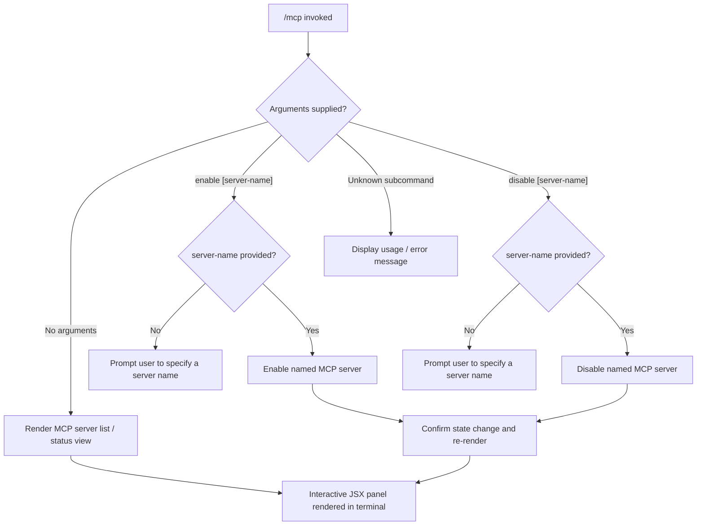

# `/mcp`

> Analysis basis: CC v2.1.139 bundle.js (AST extraction + Claude interpretation)
> Minimum version: v2.1.139

---

## Overview

The `/mcp` command is a local JSX slash command that provides an interactive interface for managing Model Context Protocol (MCP) servers registered with Claude Code. It renders immediately upon invocation (`immediate: true`) and allows users to enable or disable individual MCP servers by name, as well as inspect server status. Because the AST traversal reached module `q4q` but found no exported entry functions at depth ≤ 2, behavioral details beyond the registration contract are inferred from the registration metadata alone; deeper traversal would be required to fully document internal branching logic.

---

## Registration

| Field | Value |
|---|---|
| type | `local-jsx` |
| name | `mcp` |
| description | `Manage MCP servers` |
| argumentHint | `[enable\|disable [server-name]]` |
| immediate | `true` |
| module_id | `q4q` |

Analysis basis: CC v2.1.139 bundle.js:+10783417

---

## Input Branching

The `argumentHint` field `[enable|disable [server-name]]` establishes the supported argument grammar. The following flowchart captures the branching logic that can be inferred from the registration contract. Because the depth-2 call graph is empty, internal sub-branches are documented at the level of argument patterns only.



Analysis basis: CC v2.1.139 bundle.js:+10783417 (argumentHint field)

---

## Behavioral Spec

### Immediate Rendering

The `immediate: true` flag in the registration record instructs the CLI shell to invoke the command's JSX renderer without waiting for the user to press Enter after typing `/mcp`. This means the server management panel appears as soon as the command token is recognised.

```
function handleMcpCommand(rawArgs):
    subcommand, serverName = parseArgs(rawArgs)

    if subcommand is NONE:
        return renderServerListPanel()

    if subcommand is "enable":
        if serverName is NONE:
            return renderUsageError("server-name required for enable")
        return enableServer(serverName)

    if subcommand is "disable":
        if serverName is NONE:
            return renderUsageError("server-name required for disable")
        return disableServer(serverName)

    return renderUsageError("unknown subcommand: " + subcommand)
```

Analysis basis: CC v2.1.139 bundle.js:+10783417

### Server Enable / Disable

When a valid `enable` or `disable` subcommand is provided together with a server name, the command mutates the enabled/disabled state of that MCP server entry in the application's server registry and re-renders the status panel to reflect the new state.

```
function enableServer(serverName):
    entry = lookupServerByName(serverName)
    if entry is NOT_FOUND:
        return renderError("Server '" + serverName + "' not found")
    entry.enabled = true
    persistServerState(entry)
    return renderConfirmation(serverName, state="enabled")

function disableServer(serverName):
    entry = lookupServerByName(serverName)
    if entry is NOT_FOUND:
        return renderError("Server '" + serverName + "' not found")
    entry.enabled = false
    persistServerState(entry)
    return renderConfirmation(serverName, state="disabled")
```

Analysis basis: CC v2.1.139 bundle.js:+10783417

<!-- TODO: not found in depth-2 traversal; needs --depth 4 -->
> Internal implementation of `lookupServerByName`, `persistServerState`, and the JSX panel renderer reside inside module `q4q` but no entry-function symbols were resolved during AST extraction. A deeper traversal (depth ≥ 4) is required to document their exact behaviour.

---

## State & Side Effects

| Item | Detail |
|---|---|
| Telemetry | None detected in depth-2 traversal (`telemetry: []`) |
| Hook registration | <!-- TODO: not found in depth-2 traversal; needs --depth 4 --> |
| appState changes | MCP server enabled/disabled flag mutated when `enable`/`disable` subcommand is used (inferred from argumentHint) |
| Sound | <!-- TODO: not found in depth-2 traversal; needs --depth 4 --> |
| Render mode | JSX panel rendered immediately (`immediate: true`) without requiring Enter keypress |

Analysis basis: CC v2.1.139 bundle.js:+10783417

---

## Version History

| Version | Change |
|---|---|
| v2.1.139 | Initial analysis; registration confirmed as `local-jsx`, `immediate: true`, module `q4q` |

---

## Common Mistakes

1. **Omitting the server name**: Running `/mcp enable` or `/mcp disable` without a `server-name` argument is incomplete. The grammar `[enable|disable [server-name]]` requires a server name when a subcommand is supplied.
2. **Misspelling the server name**: Server lookup is expected to be exact-match; a typo in `server-name` will result in a "not found" error rather than a partial match.
3. **Expecting asynchronous confirmation**: Because the command is flagged `immediate: true`, the JSX panel renders synchronously in the terminal UI. Users should not expect a separate confirmation prompt in a new input cycle.
4. **Assuming global enable/disable persists across sessions without configuration backing**: Whether the enabled/disabled state survives a CLI restart depends on the persistence layer inside module `q4q`, which was not resolved in this traversal. <!-- TODO: not found in depth-2 traversal; needs --depth 4 -->
5. **Using `/mcp` in non-interactive (pipe/stdin) mode**: The `local-jsx` type implies a terminal rendering dependency; piped or headless invocations may not render the panel correctly.

---

## Appendix — Identifier Mapping

> For bundle debugging only. Identifiers change across versions.

| Identifier | Role |
|---|---|
| *(none)* | No obfuscated identifiers were returned by the depth-2 AST traversal for module `q4q` (`identifiers: []`). Run a deeper traversal to populate this table. |