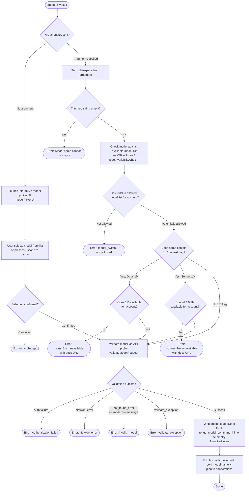

# `/model`

> Analysis basis: CC v2.1.142 bundle.js (AST extraction + Claude interpretation)
> Minimum version: v2.1.142

---

## Overview

The `/model` command allows users to set or switch the AI model used by Claude Code for the current session. When invoked with a model name argument, it validates the requested model against the user's account capabilities and available model catalog, applies the change to application state, and — when invoked inline without an argument — renders an interactive model-selection UI that allows browsing and choosing from available models with their tier and feature metadata displayed.

---

## Registration

| Field | Value |
|---|---|
| type | `local` |
| name | `model` |
| description | Set the AI model for Claude Code |
| argumentHint | `<model>` |
| supportsNonInteractive | `true` |
| module_id | `sGq` |
| load_inline | `true` |
| loc_byte | `11630755` |
| loc_byte_end | `11630929` |
| loc_line | `7224` |
| arbor_handler.name | `jk7` |
| arbor_handler.fqn | `claude-2.1.142::jk7` |
| arbor_handler.kind | `AsyncFunction` |
| arbor_handler.resolution_path | `module_id` |
| arbor_handler.n_hits | `0` |

Analysis basis: CC v2.1.142 bundle.js:+11630755

---

## Input Branching

The command has 4+ distinct execution paths depending on whether an argument is supplied, what validation results it produces, whether extended-context (1M) is requested, and account/plan eligibility checks — a Mermaid flowchart is used.



Analysis basis: CC v2.1.142 bundle.js:+11623474, +11623490, +11623513, +11623557, +11623630, +11586104, +11586141, +11586430, +11586480, +11586840, +11586942, +11587040, +11588068, +11588285, +11588579, +11588687

---

## Behavioral Spec

### 1. Handler Entry — `handleModelCommand` (`jk7`)

The Arbor-resolved handler is `jk7`, an `AsyncFunction` reached via `module_id` resolution from module `sGq`.

```
async function handleModelCommand(args, context):
    rawArg = args.trim()                       // bundle.js:+11623474

    if rawArg is in validModelSet (zS6):       // bundle.js:+11623490
        appState = getAppState(context)        // bundle.js:+11623513
        result   = await buildModelDisplay(appState, rawArg)  // DP8 — bundle.js:+11623557

    if rawArg is in inlineModelSet (l7H):      // bundle.js:+11623577
        emitTelemetry("tengu_model_command_inline") // bundle.js:+11623632
        runInlineModelPicker(context, rawArg)  // d — bundle.js:+11623630

    result = await resolveAndValidateModel(rawArg, context)  // YP8 — bundle.js:+11623697
    return result
```

Analysis basis: CC v2.1.142 bundle.js:+11623474

---

### 2. Model Name Validation — `validateModelInput` (`zP8`)

```
async function validateModelInput(rawInput, context):
    trimmed = rawInput.trim()                  // bundle.js:+11586104

    if trimmed == "":
        throw Error("Model name cannot be empty")  // bundle.js:+11586141

    modelRecord = lookupModelInCatalog(trimmed)  // RB — bundle.js:+11586175
    normalized  = trimmed.toLowerCase()        // bundle.js:+11586264

    if normalized in blockedModelSet (OAH):    // bundle.js:+11586283
        return blocked result

    if modelValidationCache (MGq).has(trimmed):  // bundle.js:+11586385
        return cached result

    probeResult = await probeModelWithApi(trimmed, context)  // bg — bundle.js:+11586430

    if probeResult.ok:
        MGq.set(trimmed, probeResult)          // bundle.js:+11586593
        displayModelConfirmation(trimmed, probeResult, context)  // VN7 — bundle.js:+11586634

    return probeResult
```

Analysis basis: CC v2.1.142 bundle.js:+11586104

---

### 3. Model Catalog Lookup — `resolveModelAlias` (`RB`)

The catalog lookup normalizes an incoming alias (e.g. `"sonnet"`, `"haiku"`, `"opus"`, `"best"`, `"opusplan"`) to a concrete API model string, applies prefix checks, and enriches with tier metadata.

```
function resolveModelAlias(input, accountState):
    // Known short aliases (bundle.js:+2158968, +2159007, +2159046, +2159083)
    ALIASES = {
        "sonnet":   <current sonnet model id>,
        "haiku":    <current haiku model id>,
        "opus":     <current opus model id>,
        "best":     <highest available model id>,
        "opusplan": <opus in plan mode, else sonnet>  // bundle.js:+2157485, +2157502
    }

    if input.startsWith("anthropic."):          // bundle.js:+2153086
        // Treat as Bedrock ARN prefix — pass through
        return input

    if input.startsWith("claude-"):            // bundle.js:+2152707
        // Appears to be a direct model id
        return normalizeDirectModelId(input)   // gfL — bundle.js:+2153435

    if input contains "[1m]" context flag:     // bundle.js:+2158953
        return resolveExtendedContextModel(input)

    canonicalized = resolveShortAlias(input)   // FfL — bundle.js:+2153244
    return enrichWithTierInfo(canonicalized, accountState)  // n1 — bundle.js:+2153279
```

Analysis basis: CC v2.1.142 bundle.js:+2153010

---

### 4. Extended-Context (1M) Eligibility Checks

Two separate eligibility gates exist for extended-context variants.

**Opus 1M gate** (`kN7`):

```
function checkOpus1mEligibility(accountState):
    modelKey = "opus_1m_unavailable"           // bundle.js:+11588068
    errorMessage = "Opus with 1M context is not available for your account. " +
                   "Learn more: https://code.claude.com/docs/en/model-config#extended-context-with-1m"
                                               // bundle.js:+11588106
    tier = accountState.toLowerCase()          // bundle.js:+11589748
    if tier disqualifies 1M access:
        return { allowed: false, reason: modelKey, message: errorMessage }
    return { allowed: true }
```

**Sonnet 4.6 1M gate** (`yN7`):

```
function checkSonnet1mEligibility(accountState):
    modelKey = "sonnet_1m_unavailable"         // bundle.js:+11588285
    errorMessage = "Sonnet 4.6 with 1M context is not available for your account. " +
                   "Learn more: https://code.claude.com/docs/en/model-config#extended-context-with-1m"
                                               // bundle.js:+11588325
    tier = accountState.toLowerCase()          // bundle.js:+11589846
    if tier disqualifies 1M access:
        return { allowed: false, reason: modelKey, message: errorMessage }
    return { allowed: true }
```

The 1M context flag sentinel in model name strings is `"[1m]"` (bundle.js:+2158953). Extended-context aliases include `"sonnet[1m]"` (bundle.js:+11589888) and `"sonnet-4-6[1m]"` (bundle.js:+11589914).

Analysis basis: CC v2.1.142 bundle.js:+11588068, +11588285

---

### 5. API Probe / Validation — `probeModelWithApi` (`bg`)

```
async function probeModelWithApi(modelId, context):
    // Sends a minimal "Hi" ephemeral test message    // bundle.js:+11586549, +11586574
    // to confirm the model is accessible for this account

    payload = buildMinimalRequest(modelId, "Hi")
    response = await sendApiRequest(payload, context)  // vu

    on AuthError:
        return { error: "Authentication failed. Please check your API credentials." }
                                                // bundle.js:+11586840
    on NetworkError:
        return { error: "Network error. Please check your internet connection." }
                                                // bundle.js:+11586942

    if response.error?.type == "not_found_error"      // bundle.js:+11587061
        OR response.error?.message contains "model:": // bundle.js:+11587143
        return { error: "invalid_model" }      // bundle.js:+11588579

    on any other thrown exception:
        return { error: "validate_exception" } // bundle.js:+11588687

    return { ok: true, modelId: modelId }
```

A SHA-256 hash (bundle.js:+12308288) with hex encoding (bundle.js:+12308315) is computed for caching probe results. The result cache uses `MGq` as the Map object (bundle.js:+11586385, +11586593).

Analysis basis: CC v2.1.142 bundle.js:+11586430, +11586840, +11587061

---

### 6. Model Tier / Account Plan Resolution — `buildModelDisplay` (`DP8`) and helpers

```
function buildModelDisplay(appState, modelId):
    // Reads billing/plan context from appState:
    //   firstParty   — bundle.js:+2157693
    //   max          — bundle.js:+2924048
    //   team         — bundle.js:+2924119
    //   default_claude_max_5x — bundle.js:+2924134
    //   enterprise   — bundle.js:+2924229
    //   enterprise_usage_based — bundle.js:+2924251

    // Provider backend resolution:
    //   anthropicAws — bundle.js:+2018128
    //   gateway      — bundle.js:+2018148
    //   bedrock      — bundle.js:+2017459
    //   foundry      — bundle.js:+2017509
    //   mantle       — bundle.js:+2017619
    //   vertex       — bundle.js:+2017667

    displayLine = boldModelName(modelId)       // M6.bold — bundle.js:+11588944

    if fastModeActive:
        displayLine += " · Fast mode ON"       // bundle.js:+11589052
    if billedAsExtraUsage:
        displayLine += " · Billed as extra usage"  // bundle.js:+11589103
    if fastModeOff:
        displayLine += " · Fast mode OFF"      // bundle.js:+11589146

    return displayLine
```

The `"opusplan"` alias (bundle.js:+2157485) maps to `"Opus Plan"` display label (bundle.js:+2157793) with the description `"Opus in plan mode, else Sonnet"` (bundle.js:+2157502).

Analysis basis: CC v2.1.142 bundle.js:+11623557, +2157485, +11589052

---

### 7. Interactive Model Picker — `interactiveModelPicker` (`$Gq`)

```
function interactiveModelPicker(context, initialValue):
    settings = loadSettings([
        "projectSettings",   // bundle.js:+1194492
        "localSettings",     // bundle.js:+1194556
        "flagSettings",      // bundle.js:+1085269
        "policySettings"     // bundle.js:+1085291
    ])
    // Settings path: .claude/settings.json      // bundle.js:+1194525, +1194535
    // Local override:  .claude/settings.local.json // bundle.js:+1194597

    availableModels = filterModelsForAccount(settings, context)
    // Each entry displays: model id (bold), tier annotation, feature flags

    renderPickerUI(availableModels, initialValue)
    selectedModel = awaitUserSelection()

    if selectedModel != null:
        applyModelToState(selectedModel, context)
        displayConfirmation(selectedModel)
    // Escape / cancel → no-op
```

Known concrete model identifiers resolved during picker population (from literals):
- `"claude-opus-4-0"` (bundle.js:+2896850)
- `"claude-opus-4-1"` (bundle.js:+2897043)
- `"claude-opus-4-5"` (bundle.js:+2897066)
- `"claude-opus-4-6"` (bundle.js:+2897089)
- `"claude-sonnet-4-0"` (bundle.js:+2896873)
- `"claude-sonnet-4-5"` (bundle.js:+2897137)
- `"claude-sonnet-4-6"` (bundle.js:+2897162)
- `"claude-haiku-4-5"` (bundle.js:+2897187)

Short alias strings also recognized at picker build time: `"opus-4-5"` (bundle.js:+11587548), `"opus-4-6"` (bundle.js:+2145673), `"opus-4-7"` (bundle.js:+2145727), `"sonnet-4-5"` (bundle.js:+11587692), `"sonnet-4-6"` (bundle.js:+10152103).

Picker default model fallback sentinel is `"default"` (bundle.js:+11587866).

Analysis basis: CC v2.1.142 bundle.js:+11588507, +11588789, +11589178

---

### 8. MCP / Server-Side Model List Refresh — `mcpModelListRefresh` (`n_5`, `IvH`)

When the session includes active MCP servers, the model command triggers an MCP client state sync before presenting or applying the model list. This path calls `_.getClients()` (bundle.js:+14197365) and iterates `Object.entries` (bundle.js:+14197318) over the current MCP server map. Recovery logic logs `"[MCP] Retry: all remote servers recovered, stopping"` (bundle.js:+14197514) when all remote MCP servers recover.

MCP transport types checked during this path: `"stdio"` (bundle.js:+9676678), `"sse"` (bundle.js:+9676712), `"http"` (bundle.js:+9676744), `"sse-ide"` (bundle.js:+9676777), `"ws-ide"` (bundle.js:+9676813). A `"disabled"` state (bundle.js:+9676576) short-circuits the connection.

Analysis basis: CC v2.1.142 bundle.js:+14197318, +14197365, +9676678

---

## State & Side Effects

| Item | Detail |
|---|---|
| Telemetry — `tengu_model_command_inline` | Fired when `/model` is invoked inline (with argument) and the model is in the inline-allowed set. bundle.js:+11623632 |
| Telemetry — `tengu_feature_bad` | Fired on feature flag / capability check failure path. bundle.js:+954608 |
| Telemetry — `tengu_feature_ok` | Fired on successful feature flag / capability check. bundle.js:+954550 |
| Telemetry — `tengu_prompt_cache_1h_config` | Fired during API probe request construction (1-hour prompt cache configuration). bundle.js:+12315039 |
| Telemetry — `tengu_api_success` | Fired on successful API probe response. bundle.js:+12354753 |
| appState changes | Active model identifier written to `appState` via `_.getAppState` after successful validation. bundle.js:+11623513 |
| Validation cache | Probe results stored in `MGq` (Map) keyed by trimmed model name string. bundle.js:+11586385, +11586593 |
| Settings read | `projectSettings` (`.claude/settings.json`) and `localSettings` (`.claude/settings.local.json`) read during picker initialization. bundle.js:+1194492, +1194556 |
| API side-effect | A minimal ephemeral test message (`"Hi"`) is sent to the Anthropic API when validating an unrecognized model string. bundle.js:+11586549, +11586574 |
| Sound | <!-- TODO: not found in depth-2 traversal; needs --depth 4 --> |
| Hook registration | <!-- TODO: not found in depth-2 traversal; needs --depth 4 --> |

---

## Version History

| Version | Change |
|---|---|
| v2.1.142 | Initial analysis |

---

## Common Mistakes

1. **Passing an empty argument**: Running `/model ` (with only whitespace) triggers the `"Model name cannot be empty"` error (bundle.js:+11586141). Either omit the argument entirely to open the interactive picker, or provide a non-empty model name.

2. **Using an alias that requires a plan not held**: Short aliases such as `"opus"` or `"opusplan"` may return `model_switch / not_allowed` if your account tier does not include that model. Check your subscription tier against the `max`, `team`, `enterprise`, or `default_claude_max_5x` plan identifiers.

3. **Requesting extended-context (1M) models on ineligible accounts**: Appending `[1m]` to a model alias (e.g. `sonnet[1m]`) when the account does not support extended context will produce a descriptive error with a documentation URL. Verify eligibility at `https://code.claude.com/docs/en/model-config#extended-context-with-1m`.

4. **Specifying a model ID that does not exist for your region/backend**: The command probes the API with a live test message. A `not_found_error` or an error message containing `"model:"` produces an `invalid_model` result — double-check the exact model identifier string.

5. **Expecting instant effect in non-interactive (`--no-interactive`) mode**: The command supports `supportsNonInteractive: true`, but the interactive picker path is skipped entirely in that mode — the argument must be supplied explicitly.

---

## Appendix — Identifier Mapping

> For bundle debugging only. Identifiers change across versions.

| Identifier | Role |
|---|---|
| `jk7` | Main handler — `handleModelCommand` (AsyncFunction, Arbor-resolved) |
| `H` | Generic utility / string helper (also async delay helper via `Math.random` + `setTimeout`) |
| `_` | App-state accessor namespace (`getAppState`, `toLowerCase`, etc.) |
| `DP8` | Model display builder — `buildModelDisplay` |
| `ES` | Model enrichment / selection pipeline entry |
| `Nq6` | Model list construction helper |
| `gJ` | Model entry builder sub-helper |
| `n1` | Model normalization — lowercase, replace, alias resolution |
| `FJ` | Model tier / plan filter pipeline |
| `AA` | Account plan classifier |
| `bB` | Max-plan model filter |
| `xfH` | Team-plan model filter |
| `vxH` | Enterprise-plan model filter |
| `lV` | Model list renderer (xf + YM composition) |
| `DP` | Plan-aware display builder |
| `xf` | VA-delegating display helper |
| `VA` | Backend-type resolver (bedrock, foundry, mantle, vertex, gateway) |
| `YM` | Full model display row builder |
| `nV` | Model list item renderer |
| `d` | Feature-flag capability check (emits `tengu_feature_ok` / `tengu_feature_bad`) |
| `YP8` | Resolve-and-validate model orchestrator |
| `RB` | Model catalog lookup / alias resolution |
| `A` | Generic array/map iteration helper |
| `f` | WebSocket / connection close helper |
| `M` | MCP client manager |
| `IvH` | MCP server connection initializer |
| `Peq` | MCP update applier |
| `L` | Promise/task queue manager |
| `v` | Model ID normalizer (uppercase, trim, prefix checks) |
| `$` | Auxiliary MCP state helper |
| `n_5` | MCP model list refresh orchestrator |
| `K` | Column formatter (padEnd) |
| `q` | File-system / cache cleanup helper |
| `IU6` | Model entry constructor with Object.entries |
| `m_` | Axios/request base helper |
| `ZxH` | Blocked-model-list checker |
| `ztA` | Model indexOf search helper |
| `FfL` | Short alias resolver |
| `zAH` | Blocked alias membership test |
| `gfL` | `claude-` prefix direct model resolver |
| `OtA` | `startsWith` prefix gate |
| `uH` | Feature-flag reader |
| `kN7` | Opus 1M eligibility checker |
| `EHH` | Tier-aware model capability builder |
| `wAH` | Base model representation builder |
| `bR1` | Credit/billing status resolver |
| `yN7` | Sonnet 4.6 1M eligibility checker |
| `fKH` | Sonnet tier-aware capability builder |
| `NN7` | Blocked-list + lowercase checker for 1M models |
| `$Gq` | Interactive model picker orchestrator |
| `XXH` | Feature-flag settings loader |
| `ix` | Flag-settings reader (flagSettings, policySettings) |
| `V8` | Settings cache reader (HC6 + OB) |
| `SH` | Feature-flag state evaluator |
| `KK` | Model confirmation display builder (VA + bH) |
| `bH` | String coercion helper |
| `RfH` | Result formatter helper |
| `BY` | Model picker row builder (KK + FJ + n1 + uc) |
| `uc` | Model status indicator (bH delegation) |
| `AwH` | "Billed as extra usage" annotation builder |
| `QJ` | n1 + FJ composition helper |
| `sG` | wAH-delegating display helper |
| `vN7` | Model confirmation display renderer |
| `Iy` | Settings path joiner (`.claude/settings.json`) |
| `CB` | Opus Plan display builder (zAH + gJ + n1) |
| `zP8` | Model name validation and API probe orchestrator |
| `bg` | API probe sender (globalThis.fetch, vu) |
| `vu` | Anthropic API HTTP request builder and sender |
| `P` | Stream/buffer reader (Buffer.concat, subarray) |
| `uWH` | Streaming response handler / token checker |
| `G` | MCP server map (lX6, hT8) |
| `kp7` | Request-cache lookup (H.find + A.find) |
| `bQ_` | SHA-256 cache-key hasher (uyq.createHash) |
| `Ri6` | Response decoder / formatter |
| `Si6` | Minimal response builder (VA) |
| `lVH` | Prompt-cache configuration builder (1h) |
| `CE` | Response content extractor (s6_ + bH) |
| `N` | Away-summary / rate-limit checker |
| `Dhq` | Request metadata appender |
| `wP` | Header string replacer |
| `fl6` | Temperature / sampling config builder |
| `XX` | Content array mapper |
| `Z3H` | Request body serializer |
| `n4H` | Request options builder |
| `FTH` | Retry / exponential backoff handler |
| `wg` | Backoff delay calculator |
| `QeH` | Cache-control header builder |
| `VN7` | Post-validation display renderer |
| `IN7` | Model display row with lowercase + includes checks |
| `GH` | String coercion output helper |