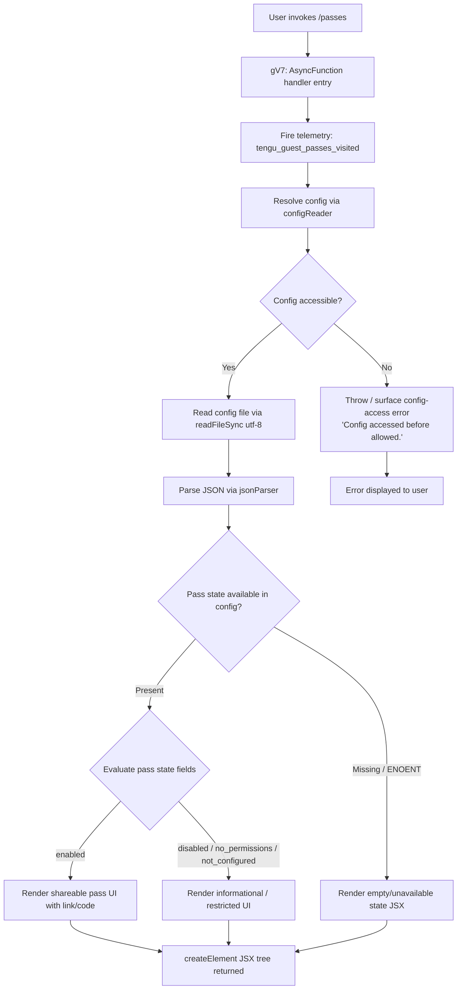

# `/passes`

> Analysis basis: CC v2.1.142 bundle.js (AST extraction + Claude interpretation)
> Minimum version: v2.1.142

---

## Overview

The `/passes` command displays a UI for sharing a free week of Claude Code with friends (the "guest passes" feature). It is implemented as an async JSX-rendering handler (`gV7`) that reads the current pass state from configuration, constructs a React element tree, and fires a telemetry event upon being visited.

---

## Registration

| Field | Value |
|---|---|
| type | `local-jsx` |
| name | `passes` |
| description | `Share a free week of Claude Code with friends` |
| loc_byte | `11392318` |
| loc_byte_end | `11392638` |
| loc_line | `6977` |
| isHidden | `null` (not hidden) |
| module_id | `TXq` |
| load_inline | `true` |
| arbor_handler.name | `gV7` |
| arbor_handler.fqn | `claude-2.1.142::gV7` |
| arbor_handler.kind | `AsyncFunction` |
| arbor_handler.resolution_path | `module_id` |
| arbor_handler.n_hits | `2` |

Analysis basis: CC v2.1.142 bundle.js:+11392318

---

## Input Branching

The handler has three meaningful branches driven by pass availability state (config read → state evaluation → JSX render or error path), warranting a Mermaid flowchart.



Analysis basis: CC v2.1.142 bundle.js:+11392001, +11392035, +11392139, +11392190

---

## Behavioral Spec

### 1. Handler Entry and Telemetry Emission

When the user invokes `/passes`, the async handler `gV7` is called. The very first observable side-effect is the emission of a telemetry event signalling that the guest passes UI has been visited.

```
async function passesCommandHandler(context):
    emit telemetry("tengu_guest_passes_visited")
    result = await resolvePassesUI(context)
    return result
```

Analysis basis: CC v2.1.142 bundle.js:+11392001 (handler entry), +11392141 (telemetry event)

---

### 2. Configuration Access and Pass State Loading

The handler calls into a config-read subsystem (`configReader`, Arbor-resolved via `cMH`) that guards access behind a readiness check. If the config subsystem is not yet ready, it raises a guard error with the message `"Config accessed before allowed."`. When ready, the config file is read synchronously (`readFileSync`, encoding `"utf-8"`) and parsed as JSON.

```
function readPassConfig():
    if not configReady():
        throw Error("Config accessed before allowed.")
    raw = readFileSync(configPath, "utf-8")
    data = parseJSON(raw)
    return data
```

Key error code handled: `"ENOENT"` — if the config file does not exist, the function returns a safe default/empty state rather than propagating the error.

Analysis basis: CC v2.1.142 bundle.js:+3154502 (guard message), +3154558 (readFileSync), +3154585 ("utf-8"), +3154605 (JSON parse), +3154732 ("ENOENT" handling)

---

### 3. Pass State Classification

Once the config data is loaded, the pass state value is classified into one of several named states. These state strings are the primary driver of which UI branch is rendered:

| State string | Meaning |
|---|---|
| `"enabled"` | Passes are active and shareable |
| `"disabled"` | Passes are explicitly turned off |
| `"no_permissions"` | Account lacks permission for passes |
| `"not_configured"` | Passes have not been set up |
| `"installed"` | Pass has been installed/redeemed |
| `"migrated"` | Pass was migrated from a previous state |
| `"native"` | Pass is available natively |
| `"local"` | Pass is in local mode |
| `"global"` | Pass is in global scope |
| `"unknown"` | Fallback / unrecognised state |

```
function classifyPassState(config):
    stateValue = config.passState ?? "unknown"
    switch stateValue:
        case "enabled":    return { canShare: true,  display: "enabled" }
        case "disabled":   return { canShare: false, display: "disabled" }
        case "no_permissions": return { canShare: false, display: "no_permissions" }
        case "not_configured": return { canShare: false, display: "not_configured" }
        default:           return { canShare: false, display: stateValue }
```

Analysis basis: CC v2.1.142 bundle.js:+3150220 ("unknown"), +3150282 ("migrated"), +3150295 ("local"), +3150313 ("installed"), +3150327 ("native"), +3150346 ("disabled"), +3150372 ("enabled"), +3150386 ("no_permissions"), +3150407 ("not_configured"), +3150426 ("global")

---

### 4. Backup and File Rotation during Config Saves

The config subsystem reached from this command (`configWriter`, `oA_`) implements a file-rotation strategy using a `"backups"` subdirectory and backup filename markers containing `".backup."`. Up to `5` backup files are retained; older entries beyond that limit are pruned via `unlinkSync`. File permissions of `384` (octal `0600`) are applied to written config files. A lock-contention warning is surfaced if acquiring the config write lock takes unexpectedly long (`"Lock acquisition took longer than expected - another Claude instance may be running"`).

```
function saveConfigWithRotation(configPath, data, cache):
    acquireLock(configPath)   // may emit tengu_config_lock_contention
    backupDir = join(dirname(configPath), "backups")
    mkdirSync(backupDir, { recursive: true })   // EEXIST tolerated
    backupName = basename(configPath) + ".backup." + Date.now()
    copyFileSync(configPath, join(backupDir, backupName))
    existing = readdirStringSync(backupDir)
                 .filter(n => n.startsWith(".backup."))
                 .sortedByTimestamp()
    if existing.length > 5:
        remove oldest entries beyond 5
    if cache has auth AND re-read config lacks auth:
        emit tengu_config_auth_loss_prevented
        log warning("saveConfigWithLock: re-read config is missing auth...")
        return   // refuse write — GH #3117 guard
    writeFileSync(configPath, JSON.stringify(data), { mode: 384 })
    releaseLock()
```

Analysis basis: CC v2.1.142 bundle.js:+3154070 ("backups"), +3153355 (".backup."), +3153488 (limit of 5), +3153770 (permission 384), +3155318 (mkdirSync), +3155353 ("EEXIST"), +3155629 (Date.now timestamp), +3155647 (copyFileSync), +3152469 (lock warning), +3152885 (auth-loss guard message), +3153037 (auth-loss telemetry)

---

### 5. JSX UI Rendering

The handler terminates by constructing a React element tree via `$U_.createElement` and returning it. The exact UI content is determined by the pass state classification from step 3. The `local-jsx` registration type causes the CLI to render this element tree inline in the terminal UI.

```
function renderPassesUI(passState, context):
    if passState.canShare:
        return createElement(ShareablePassView, { state: passState, ... })
    else:
        return createElement(InformationalPassView, { state: passState, reason: passState.display, ... })
```

Analysis basis: CC v2.1.142 bundle.js:+11392190 (`$U_.createElement` call)

---

### 6. Config Stale-Write Protection

A secondary guard (`tengu_config_stale_write`) prevents overwriting a config file with data that is stale relative to what was last read. This is invoked in the save path reached via `oA_`.

```
function guardAgainstStaleWrite(cachedVersion, diskVersion):
    if diskVersion.timestamp > cachedVersion.timestamp:
        emit telemetry("tengu_config_stale_write")
        return false  // abort write
    return true
```

Analysis basis: CC v2.1.142 bundle.js:+3152694 (tengu_config_stale_write)

---

## State & Side Effects

| Item | Detail |
|---|---|
| Telemetry | `tengu_guest_passes_visited` (bundle.js:+11392141) — fired on every invocation of `/passes` |
| Telemetry | `tengu_config_parse_error` (bundle.js:+3155139) — fired if config JSON cannot be parsed |
| Telemetry | `tengu_config_lock_contention` (bundle.js:+3152558) — fired on slow lock acquisition |
| Telemetry | `tengu_config_stale_write` (bundle.js:+3152694) — fired if a stale config write is detected |
| Telemetry | `tengu_config_auth_loss_prevented` (bundle.js:+3153037) — fired when a write is aborted to prevent auth data loss (GH #3117) |
| Telemetry | `tengu_bg_dispatch_sigkill_escalate` (bundle.js:+14462646) — fired in background worker escalation (indirect, via daemon subsystem) |
| Telemetry | `tengu_daemon_yield` (bundle.js:+14480594) — fired when daemon yields to foreground |
| Telemetry | `tengu_feature_ok` / `tengu_feature_bad` (bundle.js:+954550, +954608) — feature-flag evaluation result |
| Telemetry | `tengu_bg_low_mem_mb`, `tengu_bg_dispatch_low_mem` (bundle.js:+11935230, +14463225) — background low-memory events |
| Telemetry | `tengu_bg_spare_enable`, `tengu_bg_spare_claim`, `tengu_bg_spare_spawn`, `tengu_bg_spare_claim_fail` (bundle.js:+14463840, +14463961, +14462423, +14464224) — background spare-worker lifecycle |
| Telemetry | `tengu_bg_sendclaim_failed` (bundle.js:+14444612) — background claim failure |
| appState changes | Config file may be updated (backup rotation, stale-write guard, auth-loss guard) |
| File I/O | Reads config file synchronously; may write backups to `backups/` subdirectory |
| JSX render | Returns a `local-jsx` React element tree for inline terminal rendering |
| Hook registration | File watch registered via `vi6.watchFile` / `vi6.unwatchFile` for config change detection (bundle.js:+3150898, +3151225) |
| Sound | <!-- TODO: not found in depth-2 traversal; needs --depth 4 --> |

---

## Version History

| Version | Change |
|---|---|
| v2.1.142 | Initial analysis |

---

## Common Mistakes

1. **Invoking `/passes` before config is initialised** — the config guard will reject the read with `"Config accessed before allowed."` and no UI will be shown. Ensure Claude Code has finished its startup sequence.
2. **Assuming pass state is binary** — the state field has at least 10 distinct values (`enabled`, `disabled`, `no_permissions`, `not_configured`, `installed`, `migrated`, `native`, `local`, `global`, `unknown`). Code or tooling that only checks for `enabled`/`disabled` will mishandle the other states.
3. **Expecting a text response** — `/passes` is registered as `local-jsx`, meaning it returns a rendered React element tree, not plain text. Shell scripts or integrations that parse command output as plain text will see only the rendered terminal representation.
4. **Concurrent writes to config** — the command indirectly triggers config saves with a lock. Running multiple Claude Code instances simultaneously may cause `tengu_config_lock_contention` events and delayed writes.
5. **Ignoring GH #3117 auth-loss guard** — if the config on disk has lost its auth fields relative to the in-memory cache, the command's config save path will refuse to write and emit `tengu_config_auth_loss_prevented`. This is a safety guard, not a bug; re-authenticate to resolve it.

---

## Appendix — Identifier Mapping

> For bundle debugging only. Identifiers change across versions.

| Identifier | Role |
|---|---|
| `gV7` | Main async handler for `/passes` command (Arbor-resolved, `claude-2.1.142::gV7`) |
| `y6` | Config file watcher / change-notification helper |
| `x6` | Path resolution utility |
| `dA_` | Config change dispatch helper |
| `cMH` | Config read/write core (reads file, parses JSON, guards access) |
| `q` | Filesystem operations namespace (readFileSync, statSync, mkdirSync, etc.) |
| `b6` | JSON parse wrapper |
| `DR` | String prefix/slice utility |
| `H` | General-purpose utility / random / setTimeout helper |
| `_` | Filesystem extended ops (readdirStringSync, statSync, toUpperCase) |
| `O8` | Output/render helper |
| `bE9` | Directory listing and file-lookup helper |
| `aA_` | Path join + backup-dir resolver |
| `M` | MCP server map / registry accessor |
| `$` | Module/feature registry or disposable set |
| `v` | HTTP/API request builder |
| `f7K` | Request construction sub-helper |
| `RH` | JSON stringify wrapper |
| `H5` | String replacement / path suffix helper |
| `BhH` | Header builder helper |
| `O7K` | HTTP send / buffer-length handler |
| `NH` | Subprocess / worker manager |
| `k_` | Error constructor wrapper |
| `bH` | String coercion helper |
| `$q` | Network traffic classifier |
| `JvK` | Queue shift/push helper |
| `d` | Logger / debug output |
| `w` | Background worker / daemon manager |
| `A` | Process/worker map |
| `y` | Worker write/kill handle |
| `uH` | Feature-flag bad-state handler |
| `SH` | Feature-flag ok-state handler |
| `LG6` | Memory metric reporter |
| `S` | Worker retirement helper |
| `G6` | Session dispatch / background session starter |
| `xr_` | Daemon claim/connect handler |
| `Fr_` | Worker lifecycle finaliser (done/killed/stopped/failed/crashed states) |
| `L` | Worker promise lifecycle tracker |
| `D` | Daemon polling loop |
| `u` | Timeout/write disposable |
| `XhL` | File-watch registration helper |
| `wl` | Watch listener callback |
| `C9` | AbortController / signal-set manager |
| `fKK` | Undefined-check helper |
| `UJ8` | Pass UI component loader |
| `M5` | Pass data fetcher |
| `bw` | Auth resolution wrapper |
| `OL` | Credential string helper |
| `QR` | OAuth / API-key resolver |
| `MP` | First-party auth provider |
| `z3` | API key / helper credential resolver |
| `C46` | Credential formatter |
| `t6` | Config persistence orchestrator (save with lock and backup) |
| `oA_` | Config save-with-rotation implementation |
| `qeA` | Config object merger |
| `ei8` | Config field applicator |
| `h76` | Config post-write hook |
| `V` | Config path string |
| `X` | MCP server connection manager |
| `hT8` | MCP transport factory |
| `Z` | Config array slicer |
| `TA6` | Atomic file write helper (temp file + rename, with fchmod/fsync) |
| `O` | Symlink/stat checker |
| `$8` | Error wrapper for atomic write |
| `f` | File handle / stream abstraction |
| `amH` | Config migration helper |
| `CE9` | Config entries iterator |
| `smH` | Timestamp helper |
| `rA_` | Config read-before-write helper |

---

Note: index built via Arbor fallback; some signals (telemetry, literals) may be missing — see arbor-fallback.js.