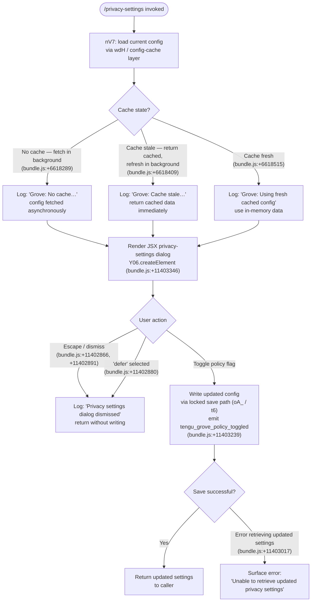

# `/privacy-settings`

> Analysis basis: CC v2.1.142 bundle.js (AST extraction + Claude interpretation)
> Minimum version: v2.1.142

---

## Overview

The `/privacy-settings` command opens an interactive JSX dialog that displays the user's current privacy configuration and allows them to toggle privacy-related policy flags (such as telemetry and data-sharing preferences). It is implemented as a `local-jsx` command: the handler (`nV7`) renders a React element via `Y06.createElement`, reads the current privacy state from the configuration layer, and writes any changes back through the locked config-save path. A `tengu_grove_policy_toggled` event is emitted whenever a policy flag changes.

---

## Registration

| Field | Value |
|---|---|
| type | `local-jsx` |
| name | `privacy-settings` |
| description | `View and update your privacy settings` |
| loc_byte | `11403699` |
| loc_byte_end | `11403891` |
| loc_line | `6987` |
| module_id | `vXq` |
| load_inline | `true` |
| arbor_handler.name | `nV7` |
| arbor_handler.fqn | `claude-2.1.142::nV7` |
| arbor_handler.kind | `AsyncFunction` |
| arbor_handler.resolution_path | `module_id` |
| arbor_handler.n_hits | `0` |

Analysis basis: CC v2.1.142 bundle.js:+11403699

---

## Input Branching

The handler exhibits three or more distinct control-flow branches depending on the state of the cached configuration and the user's interaction with the dialog. A Mermaid flowchart is used below.



---

## Behavioral Spec

### 1. Entry — Handler Dispatch (`nV7`)

```
async function privacySettingsHandler(context):
    // Parallelize: load existing config and gather MCP state
    [configData, mcpState] = await Promise.all([
        loadConfigCached(),      // wdH → config-cache layer
        loadMcpManagerState()    // M → IvH
    ])

    // Render the interactive dialog
    dialogElement = createElement(PrivacySettingsComponent, {
        config: configData,
        mcpState: mcpState,
        onDismiss: handleDismiss,
        onToggle: handlePolicyToggle
    })
    return dialogElement
```

Analysis basis: CC v2.1.142 bundle.js:+11402703, +11402743, +11402756, +11403346

---

### 2. Config Cache Layer (`wdH` / `Iz1`)

```
function loadConfigCached():
    cacheEntry = readConfigCache()   // y6 → cMH
    now = Date.now()

    if cacheEntry is empty:
        log("Grove: No cache, fetching config in background (dialog skipped this session)")
        // Trigger background fetch; return empty/default
        scheduleBackgroundFetch()
        return defaultConfig()

    elif isStale(cacheEntry, now):
        log("Grove: Cache stale, returning cached data and refreshing in background")
        scheduleBackgroundFetch()
        return cacheEntry.data

    else:
        log("Grove: Using fresh cached config")
        return cacheEntry.data
```

Analysis basis: CC v2.1.142 bundle.js:+6618263, +6618289, +6618409, +6618515

---

### 3. Privacy Dialog — Dismiss Paths

```
function handleDismiss(reason):
    // reason ∈ { "escape", "defer" }
    if reason == "escape" or reason == "defer":
        log("Privacy settings dialog dismissed")
        return { dismissed: true }
```

Dismiss reasons observed in literals: `"escape"` (bundle.js:+11402866), `"defer"` (bundle.js:+11402880), with log message `"Privacy settings dialog dismissed"` (bundle.js:+11402891).

---

### 4. Policy Toggle — Write Path (`oA_` / `t6`)

```
async function handlePolicyToggle(flagName, newValue):
    // Acquire config lock
    lock = acquireConfigLock()   // t6 → oA_

    try:
        currentConfig = readConfigWithLock()

        // Safety check: do not wipe auth fields
        if currentConfig is missing auth that cache holds:
            log("saveConfigWithLock: re-read config is missing auth …
                 refusing to write … See GH #3117.")
            releaseLock(lock)
            return { error: AUTH_LOSS_PREVENTED }

        // Apply the toggle
        currentConfig[flagName] = newValue

        // Write atomically (backup rotation, max 5 backups)
        writeConfigAtomic(currentConfig)

        // Emit telemetry
        emit("tengu_grove_policy_toggled", { flag: flagName, value: newValue })

        // Re-read to confirm
        updatedConfig = readConfigWithLock()
        if updatedConfig is null:
            return { error: "Unable to retrieve updated privacy settings" }

        return { ok: true, config: updatedConfig }

    finally:
        releaseLock(lock)
```

Analysis basis: CC v2.1.142 bundle.js:+11403239, +11403017, +3152885, +3153126, +3153488

Backup file retention: maximum **5** backups (bundle.js:+3153488). Lock contention timeout: **60 000 ms** (bundle.js:+3153239). Config permission mode: **384** (octal 0600) (bundle.js:+3153770).

---

### 5. Config Read — File I/O (`cMH`)

```
function readConfigFile(path):
    if not configAccessAllowed():
        throw Error("Config accessed before allowed.")   // bundle.js:+3154502

    try:
        raw = fs.readFileSync(path, "utf-8")   // bundle.js:+3154558, +3154585
        return parseJSON(raw)
    catch ENOENT:                              // bundle.js:+3154732
        return null
    catch parseError:
        emit("tengu_config_parse_error")       // bundle.js:+3155139
        return null
```

Analysis basis: CC v2.1.142 bundle.js:+3154496, +3154558, +3154585, +3154732, +3155139

---

### 6. Telemetry — Grove Policy Toggled

The sole command-specific telemetry event is `tengu_grove_policy_toggled` (bundle.js:+11403239). It fires once per successful policy write. The event's payload is derived from the flag name and new value; no PII is expected in the payload because config keys are well-known string identifiers (e.g. `"system"`, bundle.js:+11402936).

---

### 7. Error Surface

| Condition | Message / Behavior |
|---|---|
| Config not yet readable | `"Config accessed before allowed."` (bundle.js:+3154502) |
| Config file missing | Silent `null` return; ENOENT swallowed (bundle.js:+3154732) |
| Auth fields would be wiped | Refuses write; logs GH #3117 message (bundle.js:+3152885) |
| Post-write re-read returns null | Returns `"Unable to retrieve updated privacy settings"` (bundle.js:+11403017) |
| Lock contention | Emits `tengu_config_lock_contention`; logs warning (bundle.js:+3152558) |
| Stale write detected | Emits `tengu_config_stale_write` (bundle.js:+3152694) |

---

## State & Side Effects

| Item | Detail |
|---|---|
| Telemetry: grove policy toggled | `tengu_grove_policy_toggled` — emitted on every successful policy flag write (bundle.js:+11403239) |
| Telemetry: config parse error | `tengu_config_parse_error` — emitted when config JSON fails to parse (bundle.js:+3155139) |
| Telemetry: config lock contention | `tengu_config_lock_contention` — emitted when lock acquisition is slow (bundle.js:+3152558) |
| Telemetry: config stale write | `tengu_config_stale_write` — emitted when a stale write is detected (bundle.js:+3152694) |
| Telemetry: auth loss prevented | `tengu_config_auth_loss_prevented` — emitted when a write is refused to preserve auth (bundle.js:+3153037) |
| appState changes | Privacy flags are persisted to `~/.claude.json` via the locked write path; in-memory config cache is invalidated and refreshed |
| JSX rendering | Renders an interactive dialog component via `Y06.createElement` (bundle.js:+11403346) |
| File I/O | Reads/writes `~/.claude.json`; creates backup files (`.backup.<timestamp>`, up to 5) via `cMH` / `oA_` |
| File watch | Config file is watched for external changes via `XhL` → `vi6.watchFile` / `vi6.unwatchFile` (bundle.js:+3150898, +3151225) |
| Sound | None observed |
| Hook registration | None observed |

---

## Version History

| Version | Change |
|---|---|
| v2.1.142 | Initial analysis |

---

## Common Mistakes

1. **Dismissing the dialog does not save changes.** Both `"escape"` and `"defer"` actions return without writing to disk. Users who close the dialog without explicitly toggling a setting will see no change persisted.
2. **Concurrent Claude instances may contend on the config lock.** If another instance holds the lock, the write will be delayed and `tengu_config_lock_contention` will fire. The log message `"Lock acquisition took longer than expected - another Claude instance may be running"` (bundle.js:+3152469) is the visible signal.
3. **Auth fields must not be stripped before calling the write path.** The handler guards against writing a config that omits auth credentials present in the cache (GH #3117 guard at bundle.js:+3152885). Any external pre-processing that strips the `oauthAccount` / API-key fields from the config object will cause the write to be silently refused.
4. **Cache staleness can cause the dialog to show outdated values.** If the cache is stale and the background refresh has not yet completed, the displayed settings may not reflect the most recently written values.
5. **The `"Unable to retrieve updated privacy settings"` error** (bundle.js:+11403017) indicates a post-write re-read failure, not a write failure. The write may have succeeded; users should retry the command rather than re-toggle the flag.

---

## Appendix — Identifier Mapping

> For bundle debugging only. Identifiers change across versions.

| Identifier | Role |
|---|---|
| `nV7` | Main async handler for `/privacy-settings` (Arbor: `claude-2.1.142::nV7`) |
| `wdH` | Config-cache load orchestrator (Grove layer entry) |
| `UWH` | Config state reader / selector |
| `qq` | Config value getter with subscription support |
| `jdA` | Config field accessor A |
| `JdA` | Config field accessor B |
| `bw` | Config object builder / shape constructor |
| `AA` | Alternate config accessor combining `bw` and `kB` |
| `kB` | Boolean coercion helper for config flags |
| `PVL` | Config policy value lookup |
| `M5` | Supplementary config loader called from `wdH` |
| `y6` | Config file read + cache-population function |
| `x6` | Config path resolver |
| `dA_` | Config default values provider |
| `cMH` | Low-level config file I/O (read, backup, atomic write) |
| `XhL` | Config file watcher (watchFile / unwatchFile) |
| `v` | Logger / debug output utility |
| `f7K` | Debug log formatter |
| `Zt_` | Log level comparator |
| `H` | Sampled-logging / rate-limiter helper |
| `RH` | JSON serialiser wrapper |
| `_` | Generic utility / lodash-like helper |
| `H5` | String redaction / sanitisation for log output |
| `H6A` | Header/key mapping builder |
| `q` | File-system synchronous operations namespace |
| `A` | String normalisation helper |
| `BhH` | Terminal write helper |
| `gHA` | Raw stdout/stderr write wrapper |
| `O7K` | Persistent log-file writer (append, rotate, size-check) |
| `YhH` | Debounced / batched log flush |
| `i8H` | Log file path builder |
| `Vv8` | Error-to-string converter |
| `$6A` | Log directory path resolver |
| `M6A` | Log file rotation handler |
| `$7K` | Append-to-log-file with rotation |
| `C9` | Active-operation tracker (add/delete) |
| `Iz1` | Grove cache stale-check and background-refresh orchestrator |
| `t6` | Global config save with lock (fallback path) |
| `oA_` | Config save with lock (primary path, backup rotation, GH #3117 guard) |
| `amH` | Config merge helper |
| `CE9` | Config entry enumerator |
| `smH` | Timestamp-stamped config snapshot writer |
| `h76` | Config hash / fingerprint helper |
| `d` | Path/directory utilities |
| `rA_` | Config save helper (reduced path) |
| `M` | MCP manager state loader |
| `IvH` | MCP server registry enumerator |
| `AHH` | MCP server collection builder |
| `FqH` | Individual MCP server record builder |
| `_HH` | MCP tool list builder |
| `Hw6` | MCP server deduplication / suppression checker |
| `dI` | MCP connection initialiser |
| `j$` | MCP transport factory |
| `zG_` | MCP transport options resolver |
| `K` | Active-process map helper |
| `L` | Async operation set manager |
| `f` | Stream / connection close helper |
| `H_` | Generic identity / pass-through helper |
| `lX6` | MCP server list filter |
| `D47` | MCP server state transition handler |
| `wS_` | MCP needs-auth cache reader |
| `O78` | MCP server options builder |
| `Di` | MCP connection descriptor builder |
| `Wj` | MCP server ID hasher (SHA-256) |
| `$78` | MCP key normaliser |
| `oK` | Object key extractor |
| `H8` | MCP debug log emitter |
| `lh_` | MCP OAuth + connection lifecycle manager |
| `IL7` | OAuth provider builder |
| `MB` | OAuth token store accessor |
| `aHH` | MCP OAuth flow runner (full OAuth 2.0 PKCE flow) |
| `CrH` | OAuth pending-request tracker |
| `D` | Background spare-session manager |
| `PY8` | MCP needs-auth cache writer |
| `RQ` | MCP reconnect handler |
| `ox` | OAuth token reader |
| `Y` | Daemon/supervisor MCP config reload handler |
| `_7` | MCP error log emitter |
| `GH` | String conversion helper (used in error paths) |
| `vL7` | MCP connection capability checker |
| `VL7` | SSH / remote session transport selector |
| `nh_` | MCP client shutdown handler |
| `RrH` | Pending step-up request checker |
| `brH` | Active OAuth pending-request checker |
| `o6q` | MCP needs-auth cache loader |
| `u7` | AsyncLocalStorage context getter |
| `hY8` | MCP needs-auth cache path builder |
| `dh_` | MCP tool-call dispatcher |
| `LG_` | MCP server scope filter (includes config-save check) |
| `J` | Child-process kill-all helper |
| `h` | Process lifecycle / blur-focused manager |
| `y` | Transient background-session writer |
| `z` | Daemon control message handler |
| `c6q` | MCP version-range parser |
| `qn` | Async iterator / readable-stream helper |
| `nX6` | Integer parser (base-10) |
| `JS_` | Integer parser (base-20) |
| `Peq` | MCP update applicator |
| `SY8` | MCP update serialiser |
| `Ov` | MCP server cleanup orchestrator |
| `BrH` | MCP server state serialiser |
| `$` | MCP daemon status wrapper |
| `zEq` | Daemon status file reader |
| `Va` | Daemon status object builder |
| `h06` | Daemon status file path builder |
| `n_5` | MCP full-reconcile loop (diff + apply) |
| `Y78` | MCP server allow-list checker |
| `a8` | Child-process spawn wrapper with abort support |
| `O` | OS resource / signal helper |

---

Note: index built via Arbor fallback; some signals (telemetry, literals) may be missing — see arbor-fallback.js.