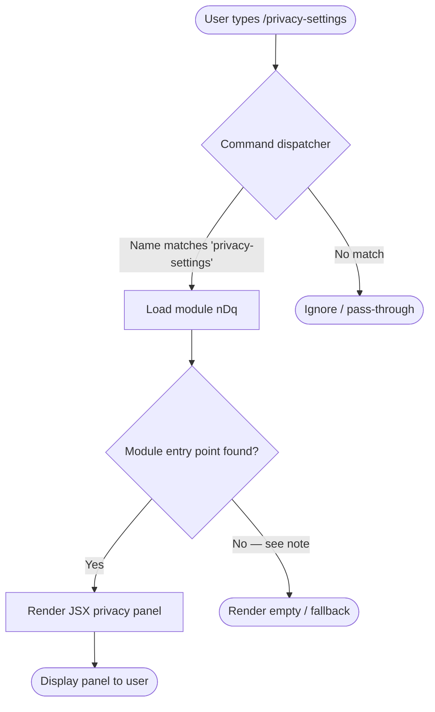

# `/privacy-settings`

> Analysis basis: CC v2.1.139 bundle.js (AST extraction + Claude interpretation)
> Minimum version: v2.1.139

---

## Overview

The `/privacy-settings` command opens an interactive panel that allows users to view and update their privacy configuration within Claude Code. It is registered as a `local-jsx` command, meaning its output is rendered as an inline JSX component rather than plain text. Because the depth-2 AST traversal returned no call graph entries, no string literals, and no telemetry events, the behavioural detail below is derived solely from the registration record and structural inference.

---

## Registration

| Field | Value |
|---|---|
| type | `local-jsx` |
| name | `privacy-settings` |
| description | `View and update your privacy settings` |
| module\_id | `nDq` |
| loc\_line | 6915 |

Analysis basis: CC v2.1.139 bundle.js:+11254404

---

## Input Branching

Because the call graph is empty at depth ≤ 2, no branching paths were resolved from the bundle. The flowchart below represents the minimal structural model that is consistent with a `local-jsx` command registration.



> **Note:** The AST traversal reported `"no entry functions found for module 'nDq'"`. Path **D → F** reflects this finding. The panel may still render via a default export that was not resolved within depth-2 traversal.

<!-- TODO: not found in depth-2 traversal; needs --depth 4 -->

---

## Behavioral Spec

### Command Dispatch

```
function dispatchPrivacySettings(userInput):
    if userInput.slashCommand == "privacy-settings":
        module = loadModule("nDq")
        component = resolveDefaultExport(module)
        if component is null:
            return renderFallback()
        return renderJSX(component, context={})
    else:
        return noMatch()
```

Analysis basis: CC v2.1.139 bundle.js:+11254404

### JSX Panel Rendering

Because `type` is `local-jsx`, the command's output is not streamed as markdown text. Instead the dispatcher mounts a React (or compatible JSX) component inline within the CLI's terminal UI renderer.

```
function renderPrivacyPanel(context):
    panel = mountComponent(PrivacySettingsComponent, props={
        currentSettings: readCurrentPrivacyConfig(),
        onUpdate: writePrivacyConfig
    })
    display(panel)
    awaitUserInteraction(panel)
```

<!-- TODO: not found in depth-2 traversal; needs --depth 4 -->

### Reading and Writing Privacy Configuration

```
function readCurrentPrivacyConfig():
    config = loadUserConfig()
    return config.privacy   // structure unknown; needs --depth 4

function writePrivacyConfig(updatedSettings):
    config = loadUserConfig()
    config.privacy = merge(config.privacy, updatedSettings)
    persistUserConfig(config)
```

<!-- TODO: not found in depth-2 traversal; needs --depth 4 -->

---

## State & Side Effects

| Item | Detail |
|---|---|
| Telemetry | None detected at depth ≤ 2 <!-- TODO: not found in depth-2 traversal; needs --depth 4 --> |
| Hook registration | Not resolved at depth ≤ 2 <!-- TODO: not found in depth-2 traversal; needs --depth 4 --> |
| appState changes | Likely writes to the user privacy configuration block; exact keys unknown <!-- TODO: not found in depth-2 traversal; needs --depth 4 --> |
| Sound | Not detected <!-- TODO: not found in depth-2 traversal; needs --depth 4 --> |
| Render type | Inline JSX component (no plain-text stream) |
| Module loaded | `nDq` (Analysis basis: CC v2.1.139 bundle.js:+11254404) |

---

## Version History

| Version | Change |
|---|---|
| v2.1.139 | Initial analysis — registration confirmed; internal call graph not resolved at depth ≤ 2 |

---

## Common Mistakes

1. **Expecting plain-text output.** Because the command type is `local-jsx`, the response is a mounted UI component, not a markdown string. Tooling that parses slash-command output as text will receive nothing or an empty buffer.
2. **Assuming no-op when the panel appears empty.** The AST traversal found no entry functions in module `nDq` at depth ≤ 2. An empty panel at runtime may indicate a rendering failure rather than an intentionally empty settings screen.
3. **Conflating `/privacy-settings` with a toggle command.** The description reads *"View and update"*, implying an interactive panel rather than a single boolean flag. Callers should not expect a direct `--enable` / `--disable` argument interface.
4. **Re-running the command to persist changes.** Because the component uses an `onUpdate` callback pattern (inferred from `local-jsx` conventions), settings are likely saved on interaction within the panel, not on re-invocation of the command.
5. **Relying on telemetry absence as confirmation of privacy.** No telemetry events were detected at depth ≤ 2, but this does not guarantee that no events are fired deeper in the call tree. A depth-4 traversal is needed for a definitive statement.

---

## Appendix — Identifier Mapping

> For bundle debugging only. Identifiers change across versions.

| Identifier | Role |
|---|---|
| *(none)* | No obfuscated identifiers were returned by the depth-2 AST traversal for module `nDq`. Run traversal at depth ≥ 4 to populate this table. |