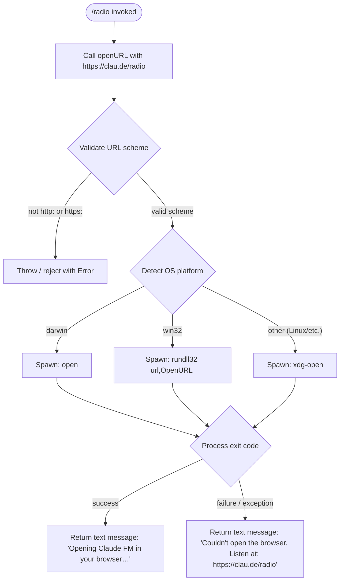

# `/radio`

> Analysis basis: CC v2.1.141 bundle.js (AST extraction + Claude interpretation)
> Minimum version: v2.1.141

---

## Overview

The `/radio` command opens the Claude FM lo-fi radio stream (`https://clau.de/radio`) in the user's default web browser. It is a lightweight, non-interactive local command that delegates to the host OS's URL-opening mechanism and returns a text message confirming the action (or an error message if the browser could not be launched).

---

## Registration

| Field | Value |
|---|---|
| type | `local` |
| name | `radio` |
| description | `Listen to Claude FM lo-fi radio` |
| supportsNonInteractive | `false` |
| module_id | `D0q` |
| load_inline | `true` |
| loc_byte | `11496727` |
| loc_byte_end | `11496932` |
| loc_line | `7182` |
| arbor_handler.name | `Bv7` |
| arbor_handler.fqn | `claude-2.1.141::Bv7` |
| arbor_handler.kind | `AsyncFunction` |
| arbor_handler.resolution_path | `module_id` |
| arbor_handler.n_hits | `0` |

Analysis basis: CC v2.1.141 bundle.js:+11496727

---

## Input Branching

The command produces two distinct runtime branches (browser-open success vs. failure) plus an internal OS-dispatch sub-branch (three platform paths). Because the OS dispatch has 3+ paths, a Mermaid flowchart is used.



Analysis basis: CC v2.1.141 bundle.js:+11496485, +7462238, +7462510, +7462526, +7462610, +7462684, +7462691, +11496538, +11496606

---

## Behavioral Spec

### 1. Handler Entry — `radioCommandHandler` (`Bv7`)

The handler is an `AsyncFunction` resolved via `module_id` → `D0q`.

```
async function radioCommandHandler(context):
    targetURL = "https://clau.de/radio"
    result = await openURLOnHost(targetURL)
    if result.success:
        return { type: "text", content: "Opening Claude FM in your browser…" }
    else:
        return { type: "text", content: "Couldn't open the browser. Listen at: https://clau.de/radio" }
```

Analysis basis: CC v2.1.141 bundle.js:+11496485, +11496525, +11496538, +11496606

---

### 2. URL Validation — `validateAndOpenURL` (`eq`)

Before dispatching to the OS, the URL string is validated. Only `http:` and `https:` schemes are accepted; any other scheme causes an immediate rejection.

```
function validateAndOpenURL(url):
    parsed = parseURL(url)
    if parsed.protocol not in ["http:", "https:"]:
        raise Error("Invalid URL scheme")
    return dispatchURLToOS(url)
```

Analysis basis: CC v2.1.141 bundle.js:+7462238, +7462260, +7462188

---

### 3. OS-Level URL Dispatch — `dispatchURLToOS` (`O8`)

After validation, the URL is opened using a platform-specific child-process command.

```
async function dispatchURLToOS(url):
    platform = process.platform

    if platform == "darwin":
        spawnProcess("open", [url])
    else if platform == "win32":
        spawnProcess("rundll32", ["url,OpenURL", url])
    else:
        // Linux and other POSIX systems
        spawnProcess("xdg-open", [url])

    await processCompletion()
```

Analysis basis: CC v2.1.141 bundle.js:+7462510, +7462526, +7462610, +7462622, +7462684, +7462691

---

### 4. Child-Process Spawning — `spawnManagedProcess` (`M_` / `jXH`)

The actual process spawning is handled by a managed process wrapper that tracks memory, handles lifecycle events, and enforces limits.

```
function spawnManagedProcess(command, args, options):
    // Memory ceiling check (1,000,000 bytes observed)
    if currentMemoryUsage() > MEMORY_LIMIT:
        reject with resource error

    process = spawn(command, args, options)

    process.on("eOA" /* data */, handleStdoutChunk)
    process.on("sx8" /* data */, handleStderrChunk)
    process.on("tx8" /* close */, handleClose)
    process.on("Hu8" /* error */, handleError)
    process.on("MOA" /* exit */, handleExit)

    if error during spawn:
        return Promise.reject(error)

    // Bind cleanup callbacks
    onClose = closeHandler.bind(process)
    onExit  = exitHandler.bind(process)

    registerWithProcessManager(process)
    return process
```

Memory limit constant: `1,000,000` bytes (Analysis basis: CC v2.1.141 bundle.js:+1026380)
Spawn concurrency pool size constant: `10` (Analysis basis: CC v2.1.141 bundle.js:+1025858)

---

### 5. Process Registry — `registerProcess` (`kH`)

Spawned processes are added to a global process registry for lifecycle management. Errors during registration are logged.

```
function registerProcess(proc):
    processKey = buildProcessKey(proc)   // k_
    registryRecord = buildRecord(proc)   // RH
    validated = validateEntry(proc)      // Vq
    resolved = resolveGlobalRef(proc)    // GvK

    globalProcessList.push(registryRecord)   // aRH.push

    if error:
        logger.logError("error", errorDetail)  // Oc.logError
```

Analysis basis: CC v2.1.141 bundle.js:+950653, +950666, +950912, +950995, +951013, +951053

---

### 6. Context Store Lookup — `resolveContext` (`N6` / `bS6`)

Before spawning, the command resolves the current execution context via an async-local storage store.

```
function resolveContext():
    store = contextStorage.getStore()   // CS6.getStore
    if store is null:
        return defaultContext()          // Cd
    return store
```

Analysis basis: CC v2.1.141 bundle.js:+955544, +955565, +955595, +955614

---

### 7. Process Manager Lifecycle — `processManagerTick` (`D`)

The process manager runs periodic bookkeeping, including background spare-process management.

```
function processManagerTick():
    emit telemetry("tengu_bg_spare_enable")   // at startup
    freeMemory = os.freemem()                 // HE8.freemem
    currentTime = Date.now()

    if platform == "windows":
        applyWindowsPolicy()                  // _o_

    wait(2000 ms)                             // polling interval

    emit telemetry("tengu_bg_spare_spawn")    // when spawning spare
    scheduleNext(processManagerTick)          // recursive scheduling: D → D
    enqueue(Q)
    registerWithRegistry(kH)
```

Polling interval: `2000` ms (Analysis basis: CC v2.1.141 bundle.js:+14464813)

Analysis basis: CC v2.1.141 bundle.js:+14464520, +14464554, +14464586, +14464600, +14464676, +14464683, +14464721, +14464789, +14464818, +14464878, +14464920

---

### 8. String Conversion Utility — `toStringHelper` (`lkK`)

A utility used during process argument assembly that coerces values to `String`.

```
function toStringHelper(value):
    return String(value)
```

Analysis basis: CC v2.1.141 bundle.js:+1026187

---

## State & Side Effects

| Item | Detail |
|---|---|
| Telemetry: `tengu_bg_spare_enable` | Fired by process manager when background spare-process pool is enabled (bundle.js:+14464520) |
| Telemetry: `tengu_bg_spare_spawn` | Fired when a background spare process is spawned (bundle.js:+14464880) |
| Browser side effect | Opens `https://clau.de/radio` in the host's default browser via OS command (`open` / `rundll32` / `xdg-open`) |
| Process registry | Spawned child process is registered in the global process list (`aRH.push`) |
| Async-local storage | Context store is read (not mutated) via `CS6.getStore` |
| Error logging | Spawn errors are routed through `Oc.logError` with level `"error"` |
| supportsNonInteractive | `false` — command must be invoked in an interactive session |
| Memory guard | Spawn is gated on a memory ceiling of 1,000,000 bytes |

---

## Version History

| Version | Change |
|---|---|
| v2.1.141 | Initial analysis |

---

## Common Mistakes

1. **Running in non-interactive mode**: `/radio` sets `supportsNonInteractive: false`. Invoking it from a script or pipe will not produce browser-launch behavior; the command requires an interactive terminal session.
2. **Expecting audio output inside the terminal**: The command opens a browser URL — it does not embed an audio player in the CLI. If the browser fails to open, the fallback message instructs the user to visit `https://clau.de/radio` directly.
3. **Firewall / default-browser misconfiguration**: On Linux systems the command relies on `xdg-open`. If no default browser is configured, the URL-open will silently fail and the error message will be displayed instead.
4. **Scheme-restricted URLs**: The underlying URL-opener only accepts `http:` and `https:` schemes. Any attempt to pass alternative schemes (e.g., via programmatic invocation) will throw immediately before OS dispatch.

---

## Appendix — Identifier Mapping

> For bundle debugging only. Identifiers change across versions.

| Identifier | Role |
|---|---|
| `Bv7` | `radioCommandHandler` — async entry point for `/radio`; opens the Claude FM URL |
| `eq` | `validateAndOpenURL` — validates URL scheme then dispatches to OS opener |
| `jb4` | `urlSchemeValidator` — checks `http:`/`https:` and throws on invalid schemes |
| `O8` | `dispatchURLToOS` — platform-switching URL opener (darwin / win32 / other) |
| `M_` | `spawnManagedProcess` — managed child-process spawner with memory guard |
| `jXH` | `processLifecycleSetup` — attaches stdout/stderr/close/error/exit event handlers |
| `D` | `processManagerTick` — periodic process-manager bookkeeping and spare-pool logic |
| `lkK` | `toStringHelper` — coerces values to `String` during argument assembly |
| `kH` | `registerProcess` — adds spawned process to global registry |
| `N6` | `resolveContext` — retrieves current execution context from store |
| `bS6` | `contextStoreReader` — reads async-local storage via `CS6.getStore` |
| `e8` | `defaultContextFactory` — produces a default context when store is empty |

---

Note: index built via Arbor fallback; some signals (telemetry, literals) may be missing — see arbor-fallback.js.