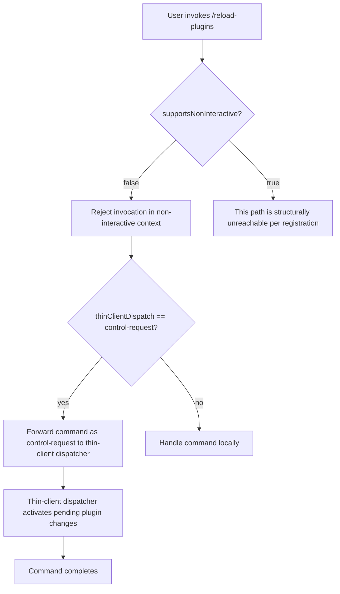

# `/reload-plugins`

> Analysis basis: CC v2.1.139 bundle.js (AST extraction + Claude interpretation)
> Minimum version: v2.1.139

---

## Overview

The `/reload-plugins` command activates any pending plugin changes in the current Claude Code session without requiring a full restart. It is registered as a `local` command with a `thinClientDispatch` value of `"control-request"`, meaning execution is delegated to a control-request dispatch pathway rather than handled inline. Deep behavioral details are not recoverable at depth-2 traversal because no entry functions were resolved for module `wJq`.

---

## Registration

| Field | Value |
|---|---|
| type | `local` |
| name | `reload-plugins` |
| description | `Activate pending plugin changes in the current session` |
| supportsNonInteractive | `false` |
| thinClientDispatch | `"control-request"` |
| module_id | `wJq` |

Analysis basis: CC v2.1.139 bundle.js:+11386704

---

## Input Branching

Because `callGraph` returned no edges and `literals` returned no constants for module `wJq`, a full branch-level flowchart cannot be constructed from the available data. The only structural fact available is the `thinClientDispatch` field, which indicates the command routes through a control-request channel.



> **Note:** The `supportsNonInteractive: false` field means the command is only valid in interactive sessions. The `thinClientDispatch: "control-request"` field means execution is forwarded to the thin-client control channel rather than resolved in the local command handler.

Analysis basis: CC v2.1.139 bundle.js:+11386704

---

## Behavioral Spec

### Command Dispatch

Because `callGraph` is empty (note: `"no entry functions found for module 'wJq'"`), the internal implementation logic of the command cannot be described from this traversal. The following pseudocode captures only the guaranteed structural behavior derived from the registration object.

```
function handleReloadPlugins(context):

    // Guard: command requires interactive mode
    if context.isNonInteractive:
        raise CommandNotAvailableError("/reload-plugins requires an interactive session")

    // Route via thin-client control-request dispatch
    dispatchControlRequest(
        command  = "reload-plugins",
        payload  = {},          // no literals found; payload structure unknown
        session  = context.currentSession
    )

    // Outcome: pending plugin changes are activated in the current session
    // (further internal steps are not recoverable at depth-2 traversal)
    return
```

Analysis basis: CC v2.1.139 bundle.js:+11386704

### Thin-Client Dispatch Pathway

The registration declares `thinClientDispatch: "control-request"`. This means the command does not execute its full logic inside the local CLI process; instead it emits a control-request message that is handled by the thin-client layer. The exact handler on the receiving end is <!-- TODO: not found in depth-2 traversal; needs --depth 4 -->.

```
function dispatchControlRequest(command, payload, session):
    message = buildControlRequestMessage(
        type    = "control-request",
        name    = command,
        body    = payload,
        session = session
    )
    thinClientTransport.send(message)
    // acknowledgement / result handling:
    // <!-- TODO: not found in depth-2 traversal; needs --depth 4 -->
```

Analysis basis: CC v2.1.139 bundle.js:+11386704

---

## State & Side Effects

| Item | Detail |
|---|---|
| Telemetry | None detected (`telemetry: []` — no `tengu_*` events found in module `wJq`) |
| Hook registration | <!-- TODO: not found in depth-2 traversal; needs --depth 4 --> |
| appState changes | Plugin registry is refreshed with pending changes; exact state fields unknown <!-- TODO: not found in depth-2 traversal; needs --depth 4 --> |
| Sound | <!-- TODO: not found in depth-2 traversal; needs --depth 4 --> |
| Session scope | Restricted to the current session (`supportsNonInteractive: false`; local type) |
| Dispatch channel | Routes as `"control-request"` through the thin-client transport layer |

---

## Version History

| Version | Change |
|---|---|
| v2.1.139 | Initial analysis; module `wJq` resolved at registration level only; depth-2 call graph empty |

---

## Common Mistakes

1. **Invoking `/reload-plugins` in a non-interactive context** — The command registration explicitly sets `supportsNonInteractive: false`. Calling it from a script, pipe, or headless session will fail or be silently rejected. Always run it inside an active interactive Claude Code session. Analysis basis: CC v2.1.139 bundle.js:+11386704

2. **Expecting immediate effect without a running thin-client** — Because dispatch type is `"control-request"`, the command relies on the thin-client transport layer being active. If the thin-client connection is not established, the control-request may be dropped or queued indefinitely.

3. **Confusing "reload-plugins" with a full session restart** — The description states it activates *pending* plugin changes in the *current session*. It does not restart Claude Code, reset conversation state, or reload non-plugin configuration. Analysis basis: CC v2.1.139 bundle.js:+11386704

4. **Assuming telemetry confirms execution** — No `tengu_*` telemetry events are emitted by this command's module. Absence of a telemetry event cannot be used as a signal that the command did or did not run.

5. **Expecting arguments or options** — No literals, flags, or parameter patterns were found in the module. The command appears to take no arguments. Passing extra tokens may produce undefined behavior.

---

## Appendix — Identifier Mapping

> For bundle debugging only. Identifiers change across versions.

| Identifier | Role |
|---|---|
| `wJq` | Module ID for the `/reload-plugins` command registration and implementation |

> **Note:** The `identifiers` array returned empty (`[]`) for module `wJq` at depth-2 traversal. No additional obfuscated identifiers were resolved. Further entries require a deeper traversal pass (recommended: `--depth 4`).