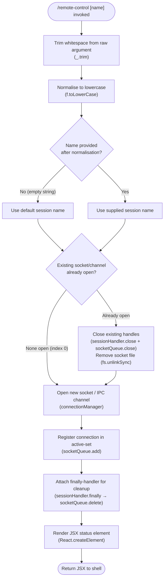

# `/remote-control`

> Analysis basis: CC v2.1.133 bundle.js (AST extraction + Claude interpretation)
> Minimum version: v2.1.133

---

## Overview

`/remote-control` (alias `/rc`) registers the current terminal session as a named remote-control endpoint, enabling external processes or orchestration layers to send instructions to this Claude Code instance. It trims and normalises the optional `[name]` argument, opens a session socket/channel, and renders a JSX status element confirming the connection. When the session ends, it cleans up all registered connection handles and removes the associated socket file from disk.

## Registration

| Field | Value |
|---|---|
| type | `local-jsx` |
| name | `remote-control` |
| aliases | `rc` |
| description | Connect this terminal for remote-control sessions |
| argumentHint | `[name]` |
| immediate | `true` |
| isHidden | `null` (visible) |
| module_id | `zDq` |
| load_inline | `true` |
| loc_byte | `11406694` |
| loc_byte_end | `11406940` |
| loc_line | `7128` |
| arbor_handler.name | `LX7` |
| arbor_handler.fqn | `claude-2.1.133::LX7` |
| arbor_handler.kind | `AsyncFunction` |
| arbor_handler.resolution_path | `module_id` |
| arbor_handler.n_hits | `1` |

Analysis basis: CC v2.1.133 bundle.js:+11406694

## Input Branching

The command accepts an optional `[name]` argument. After normalisation the resolved name drives three distinct downstream states: no active socket (first connection), socket already open (reconnect/replace), and teardown (session close). This warrants a Mermaid flowchart.



Analysis basis: CC v2.1.133 bundle.js:+11406365 (trim), +11406389 (createElement), +14181260 (toLowerCase), +14167103 (close sequence), +14161309 (add), +14161318 (finally), +14161332 (delete)

## Behavioral Spec

### 1. Argument Normalisation

```
async function remoteControlHandler(rawArgs):
    trimmedName  = trim(rawArgs)                 // remove leading/trailing whitespace
    sessionName  = toLowerCase(trimmedName)      // canonical lowercase key
    return sessionName
```

Analysis basis: CC v2.1.133 bundle.js:+11406365 (trim), +14181260 (toLowerCase)

---

### 2. Socket / Channel Lifecycle

```
async function openSession(sessionName):

    // Teardown any pre-existing connection for this name
    existingIndex = lookupActiveConnection(sessionName)   // 0 = none (literal 0)
    if existingIndex != 0:
        sessionHandler.close()                            // close IPC/socket handle
        socketQueue.close()                               // drain pending messages
        fs.unlinkSync(socketFilePath)                     // remove socket file from disk

    // Open fresh connection
    newHandle = openNewSocketChannel(sessionName)

    // Track in active-connection set
    socketQueue.add(newHandle)

    // Register cleanup on session end
    newHandle.finally(() =>
        socketQueue.delete(newHandle)                     // remove from active set
    )

    return newHandle
```

The sentinel value `0` (bundle.js:+14167101) is used as the "no existing connection" index, consistent with an array or map that stores handles starting at positive indices. The constant `40` (bundle.js:+14181334) appears in the toLowerCase branch of the normalisation utility; its precise semantic role — likely a character-code boundary or maximum name length — is <!-- TODO: not found in depth-2 traversal; needs --depth 4 -->.

Analysis basis: CC v2.1.133 bundle.js:+14167103, +14167113, +14137065, +14161309, +14161318, +14161332, +14167101

---

### 3. JSX Status Rendering

Because the command is registered as `local-jsx` with `immediate: true`, the handler returns a React element rather than printing plain text. The element is constructed via `React.createElement` immediately after the session is opened, conveying connection status to the terminal UI.

```
function buildStatusElement(sessionName, connectionHandle):
    return React.createElement(
        StatusComponent,
        { sessionName: sessionName, handle: connectionHandle }
    )
```

Analysis basis: CC v2.1.133 bundle.js:+11406389

---

### 4. Full Handler Flow (composite)

```
async function LX7(context):                         // arbor: LX7, AsyncFunction
    sessionName   = normaliseArgument(context.args)  // trim + toLowerCase
    connectionHandle = openSession(sessionName)       // lifecycle (see §2)
    statusElement = buildStatusElement(sessionName, connectionHandle)
    return statusElement                              // rendered by local-jsx shell
```

Analysis basis: CC v2.1.133 bundle.js:+11406365–11406389 (handler entry block)

## State & Side Effects

| Item | Detail |
|---|---|
| Telemetry | None detected in this implementation (`telemetry: []`) |
| Socket file creation | A named socket/IPC file is created on disk for the session |
| Socket file deletion | `fs.unlinkSync` removes the socket file on teardown (bundle.js:+14137065) |
| Active-connection set | `socketQueue.add` / `socketQueue.delete` mutate a module-level set of open handles (bundle.js:+14161309, +14161332) |
| Session handle cleanup | A `finally` callback ensures the handle is removed from the active set even on error (bundle.js:+14161318) |
| JSX render | Returns a `local-jsx` element immediately (`immediate: true`) — no streaming output |
| appState changes | <!-- TODO: not found in depth-2 traversal; needs --depth 4 --> |
| Sound | <!-- TODO: not found in depth-2 traversal; needs --depth 4 --> |

## Version History

| Version | Change |
|---|---|
| v2.1.133 | Initial analysis |

## Common Mistakes

1. **Omitting the `[name]` argument when multiple sessions are needed.** Without a distinguishing name, concurrent `/remote-control` invocations will collide on the same default session key, causing the first session's socket to be torn down silently.
2. **Assuming `/rc` behaves differently from `/remote-control`.** The alias `rc` is registered identically; both invoke the same `LX7` handler with no behavioural difference.
3. **Expecting plain-text output.** The command is `local-jsx` + `immediate: true`. Shell integrations that capture stdout will see no text; they must handle the JSX render path.
4. **Not accounting for automatic socket cleanup on crash.** The `finally` handler only runs within the Node process. If the process is killed hard (`SIGKILL`), the socket file written by `unlinkSync` may persist on disk and block future connections until manually removed.
5. **Case-sensitive name matching.** The session name is lowercased before registration. Passing `MySession` and `mysession` in separate invocations will resolve to the same key and trigger a replace, not a second connection.

## Appendix — Identifier Mapping

> For bundle debugging only. Identifiers change across versions.

| Identifier | Role |
|---|---|
| `LX7` | Main async handler for `/remote-control` (entry point resolved by Arbor via `module_id` path) |
| `_` | Argument-normalisation utility — exposes `trim` and `toLowerCase` helpers |
| `f` | Session-handler object — owns `close()` and `finally()` on the active IPC/socket handle |
| `q` | Socket-queue / active-connection set — exposes `add`, `delete`, `close`; also calls `fs.unlinkSync` on teardown |
| `K` | Connection-lifecycle orchestrator — coordinates `socketQueue.add`, `sessionHandler.finally`, and `socketQueue.delete` |

---

Note: index built via Arbor fallback; some signals (telemetry, literals) may be missing — see arbor-fallback.js.