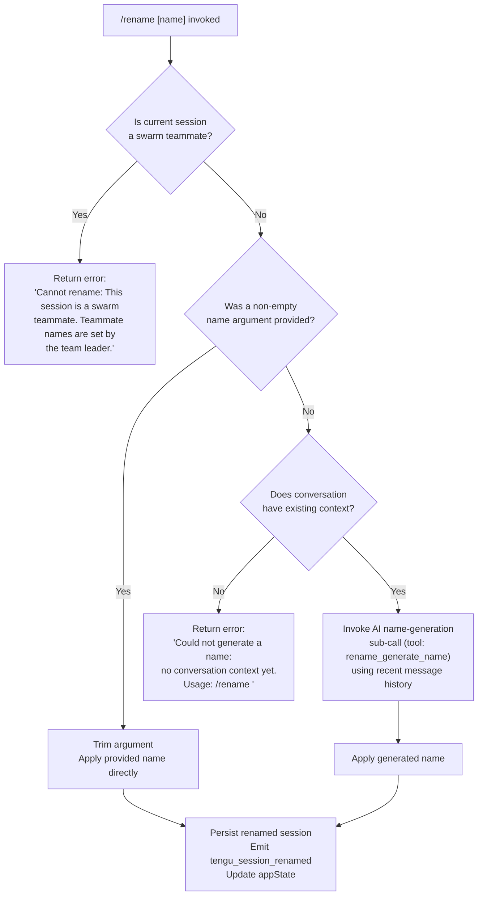

# `/rename`

> Analysis basis: CC v2.1.142 bundle.js (AST extraction + Claude interpretation)
> Minimum version: v2.1.142

---

## Overview

The `/rename` command (also accessible as `/name`) renames the current Claude Code conversation session. When an explicit name argument is provided the session is renamed immediately to that string; when no argument is given the command invokes a model-assisted name-generation sub-call that derives a title from the existing conversation history, then applies the result. The command is blocked outright when the current session is a swarm teammate, because teammate names are controlled exclusively by the team leader.

---

## Registration

| Field | Value |
|---|---|
| type | `local-jsx` |
| name | `rename` |
| description | `Rename the current conversation` |
| argumentHint | `[name]` |
| immediate | `true` |
| aliases | `["name"]` |
| module_id | `Izq` |
| load_inline | `true` |
| loc_byte | `11022395` |
| loc_byte_end | `11022594` |
| loc_line | `6625` |
| arbor_handler.name | `dW7` |
| arbor_handler.kind | `AsyncFunction` |
| arbor_handler.fqn | `claude-2.1.142::dW7` |
| arbor_handler.resolution_path | `module_id` |
| arbor_handler.n_hits | `0` |

Analysis basis: CC v2.1.142 bundle.js:+11022395

---

## Input Branching

The command has four distinct branches depending on swarm membership and whether a name argument was supplied.



Analysis basis: CC v2.1.142 bundle.js:+11021536, +11021556, +11021661, +11021757

---

## Behavioral Spec

### Top-level handler (dW7)

The Arbor-resolved async handler `dW7` is the entry point. It delegates immediately to two helpers: a context-store accessor and the primary rename logic function.

```
async function renameCommandHandler(userInput, sessionContext):
    conversationStore = getConversationStore()          // via L5 → U2 → Ri8.getStore
    await executeRename(userInput, conversationStore)   // kJ8
```

Analysis basis: CC v2.1.142 bundle.js:+11022086, +11022102, +11022144

---

### Swarm-teammate guard

Before any rename action is attempted the handler checks whether the active session participates in a swarm as a teammate role. If so, execution halts with a user-visible error message.

```
function guardSwarmTeammate(sessionContext):
    if sessionContext.isSwarmTeammate:
        return errorResult(
            "Cannot rename: This session is a swarm teammate. " +
            "Teammate names are set by the team leader."
        )
```

Error string literal: `"Cannot rename: This session is a swarm teammate…"` (≤30 char citation: `"Cannot rename: This session…"`)

Analysis basis: CC v2.1.142 bundle.js:+11021536, +11021556

---

### Argument handling and trim

When the swarm guard passes, the supplied argument string is trimmed of whitespace. An empty post-trim value triggers the AI generation path; a non-empty value is used directly.

```
function resolveTargetName(rawArgument):
    trimmed = rawArgument.trim()      // H.trim call
    if trimmed is empty:
        return GENERATE_VIA_AI
    else:
        return trimmed
```

Analysis basis: CC v2.1.142 bundle.js:+11021661

---

### AI name generation (no argument supplied)

When no argument is present, the command checks whether the conversation contains usable message history. If the history is empty (no context yet), a specific error is returned. Otherwise, a sub-query is sent to the model using the internal tool `rename_generate_name` and a JSON-schema response format.

```
async function generateNameFromHistory(conversationHistory):
    if conversationHistory has no usable content:
        return errorResult(
            "Could not generate a name: no conversation context yet. " +
            "Usage: /rename <name>"
        )

    // Build a condensed representation of conversation messages
    // Filter to user/assistant turns, excluding meta messages
    // Collect text content blocks only
    messageSummary = buildMessageSummary(conversationHistory)   // IJ8

    // Issue model sub-call with structured output tool
    response = await runSubQuery(
        tool = {
            name: "rename_generate_name",
            output_schema: { type: "json_schema", property: "name" }
        },
        messages = messageSummary
    )                                                           // _aH → lN

    return response.generatedName
```

Tool name constant: `"rename_generate_name"` (bundle.js:+11020960)
Schema type constant: `"json_schema"` (bundle.js:+11020816)
Schema property constant: `"name"` (bundle.js:+11020896)
Error literal: `"Could not generate a name: no conversation…"` (bundle.js:+11021757)

Analysis basis: CC v2.1.142 bundle.js:+11020296, +11020337, +11020816, +11020896, +11020960, +11021695, +11021757

---

### Message summary builder (IJ8)

The sub-routine that assembles the message history passed to the model filters conversation turns to `user` and `assistant` roles, discards meta messages, and extracts `text`-typed content blocks. Array joins produce a compact string representation.

```
function buildMessageSummary(allMessages):
    filtered = []
    for message in allMessages:
        if message.role not in ["user", "assistant"]:
            continue
        if message.isMeta:
            continue
        if message.origin == "human":
            // include verbatim
        for block in message.content:
            if block.type == "text":
                filtered.push(block.text)
    return filtered.join(...)
```

Role filter string literals: `"user"` (bundle.js:+11017891), `"assistant"` (bundle.js:+11017908)
Meta exclusion key: `"isMeta"` (bundle.js:+11017932)
Origin key: `"origin"` (bundle.js:+11017967), `"human"` (bundle.js:+11018007)
Content type checks: `"type"` (bundle.js:+11018125), `"text"` (bundle.js:+11018146)

Analysis basis: CC v2.1.142 bundle.js:+11018071, +11018089, +11018125, +11018146, +11018187, +11018219

---

### Name application and persistence

After the target name is resolved (either from the argument or from the AI generation step), it is applied to the session. The session store is updated, `appState` is mutated via `setAppState`, and the log-writer subsystem records a `custom-title` or `ai-title` marker. The `tengu_session_renamed` telemetry event is emitted.

```
async function applyRename(sessionContext, resolvedName, wasAiGenerated):
    // Update in-memory session title
    sessionContext.setAppState({ title: resolvedName })    // _.setAppState

    // Persist to session log file
    // Title type tag written to log metadata
    titleTag = wasAiGenerated ? "ai-title" : "custom-title"
    writeSessionMetadata(sessionContext.logPath, titleTag, resolvedName)

    // Emit telemetry
    emit("tengu_session_renamed")                          // bundle.js:+12103375

    // Refresh UI display
    refreshDisplay()                                       // sIH
```

Title-tag constants: `"custom-title"` (bundle.js:+12103283), `"ai-title"` (bundle.js:+12103448)

Analysis basis: CC v2.1.142 bundle.js:+11021896, +12103283, +12103375, +12103448

---

### Session log write path (sIH / xb / RKH)

Persistence delegates through a log-writer subsystem that creates or appends to a session log file. The subsystem emits a `dg_.emit` event after writing and records a `tengu_agent_name_set` telemetry event when an agent name is being set in the swarm context (distinct from the user-rename path).

```
async function writeSessionLog(logPath, titleTag, titleValue):
    ensure directory exists (mkdir recursive)
    append metadata entry: { tag: titleTag, value: titleValue }
    emit dg_ event                   // dg_.emit
    record telemetry if agentName    // tengu_agent_name_set
```

Analysis basis: CC v2.1.142 bundle.js:+12103362, +12106391, +12106404

---

### Random back-off in generation path (H)

The AI name generation sub-call uses a small random delay before the sub-query is issued. The delay is computed as `Math.random() * 2 + 1` seconds (approximate), implemented via `setTimeout`.

```
function jitterDelay():
    waitMs = (Math.random() * 2 + 1) * 1000   // constants 2 and 1 at +12592943/+12592959
    await sleep(waitMs)
```

Numeric literal `2` at bundle.js:+12592943; numeric literal `1` at bundle.js:+12592959.

Analysis basis: CC v2.1.142 bundle.js:+12592943, +12592945, +12592959, +12592982

---

## State & Side Effects

| Item | Detail |
|---|---|
| Telemetry | `tengu_session_renamed` (bundle.js:+12103375) — fired on every successful rename |
| Telemetry | `tengu_agent_name_set` (bundle.js:+12106404) — fired when an agent name is written to the session log (swarm agent-name path) |
| Telemetry (indirect, sub-query) | `tengu_off_switch_query`, `tengu_api_before_normalize`, `tengu_api_after_normalize`, `tengu_streaming_idle_timeout`, `tengu_api_slow_first_byte`, `tengu_advisor_strip_retry`, `tengu_streaming_stall`, `tengu_max_tokens_reached`, `tengu_stream_loop_exited_after_watchdog`, and others — all fired by the shared query engine if AI generation is triggered |
| appState changes | `_.setAppState` called with updated session title (bundle.js:+11021896) |
| Session log write | Title tag (`"custom-title"` or `"ai-title"`) and resolved name appended to the session log file via the log-writer subsystem |
| `dg_` event emission | `dg_.emit` fired after log write (bundle.js:+12106391) |
| Sound | None observed in depth-2 traversal |
| Hook registration | None observed in depth-2 traversal |

---

## Version History

| Version | Change |
|---|---|
| v2.1.142 | Initial analysis |

---

## Common Mistakes

1. **Running `/rename` with no argument in a fresh session.** If the conversation has no message history yet, the AI generation path cannot produce a name and returns the error `"Could not generate a name: no conversation context yet. Usage: /rename <name>"`. Always provide an explicit name at session start.
2. **Attempting to rename a swarm teammate session.** Sessions participating as swarm teammates reject the command entirely; only the team leader may set teammate names. Use the team-leader session to rename a teammate.
3. **Expecting the alias `/name` to behave differently.** The `name` alias is registered identically to `rename` and shares the same handler with no behavioral differences.
4. **Providing a name with leading or trailing whitespace.** The argument is trimmed before use, so `"  MyProject  "` becomes `"MyProject"`. This is generally harmless but can cause confusion if the intent was to include padding.
5. **Assuming the rename is instantaneous in the AI-generation path.** When no argument is given, a small random jitter delay is added before the sub-query is sent, and the full model round-trip must complete before the title updates.

---

## Appendix — Identifier Mapping

> For bundle debugging only. Identifiers change across versions.

| Identifier | Role |
|---|---|
| `dW7` | Top-level async rename command handler (Arbor-resolved entry point) |
| `kJ8` | Primary rename execution function (swarm guard, argument dispatch, apply name) |
| `NJ8` | Context-store accessor wrapper called from handler entry |
| `hW` | Conversation/session store getter |
| `L5` | Store retrieval helper |
| `U2` | Async store accessor |
| `_aH` | AI name-generation orchestrator (no-argument path) |
| `IJ8` | Message summary builder (filters history to text blocks) |
| `lN` | Sub-query runner for model-assisted name generation |
| `HY8` | Session/conversation data serializer used by sub-query |
| `bK7` | Message content mapper within serializer |
| `bNH` | Query executor bridging sub-query to model API |
| `Yhq` | Core model query engine (streaming + retry logic) |
| `Sh_` | Session context assembler for sub-query |
| `sIH` | Session log-writer and title persistence subsystem |
| `xb` | Log-write helper (title tag write path) |
| `oLH` | Log file append-and-create helper |
| `FHH` | Log flush/finalize helper |
| `RKH` | Agent-name write path within log-writer |
| `pB` | Session metadata persistence (read/write JSON) |
| `Rq6` | Session file read/write utility |
| `M6A` | File rotation helper (rename + unlink on `.txt` files) |
| `$7K` | Buffered append-file writer |
| `$K` | History filter utility |
| `M1` | <!-- TODO: not found in depth-2 traversal; needs --depth 4 --> |
| `v` | Output formatter / display renderer |
| `f7K` | Log-level routing helper |
| `Zt_` | Log channel selector |
| `H5` | Path truncation / redaction helper |
| `BhH` | Terminal write wrapper |
| `gHA` | Raw terminal output writer |
| `O7K` | Transcript/log manager |
| `YhH` | Buffered stdout/stderr flusher |
| `i8H` | Log-line serializer |
| `Vv8` | Error-code classifier |
| `$6A` | Path join utility for log files |
| `C9` | File-descriptor tracker |
| `GH` | String coercion wrapper |
| `V6` | Logger / structured-event emitter |
| `JV` | Core event emitter |
| `JP` | API base-URL resolver |
| `VA` | Provider string builder |
| `h1` | Credential/config loader |
| `VxH` | Model name resolver |
| `I0` | <!-- TODO: not found in depth-2 traversal; needs --depth 4 --> |
| `WD8` | App-state key enumerator |
| `s$H` | Job/worker scheduler |
| `IK` | Job directory resolver |
| `S0` | Jobs base-path builder |
| `R0` | Job basename extractor |
| `o1` | Job file reader with caching |
| `a2` | Job cache invalidator |
| `gf` | Atomic job file writer |
| `sO` | Atomic write-with-rename helper |
| `NH` | Error reporter / notification emitter |
| `k_` | Error normalizer |
| `$q` | Notification formatter |
| `NMA` | Notification string builder |
| `JvK` | Notification queue manager |
| `H_` | Identity / pass-through helper |
| `lX6` | <!-- TODO: not found in depth-2 traversal; needs --depth 4 --> |
| `D47` | Timing / Date.now wrapper |
| `O78` | Tool-schema object inspector |
| `$78` | Tool-option extractor |
| `H8` | MCP debug logger |
| `lh_` | MCP OAuth authentication handler |
| `nh_` | MCP OAuth callback handler |
| `o6q` | MCP request sender with timing |
| `dh_` | MCP tool dispatcher |
| `LG_` | Tool allowlist checker |
| `_7` | MCP error logger |
| `c6q` | MCP queue/dequeue helper |
| `nX6` | Integer parser (MCP timeout) |
| `JS_` | Integer parser (MCP port) |
| `Peq` | MCP server update applier |
| `SY8` | MCP server state serializer |
| `Ov` | MCP connection cleanup handler |
| `zEq` | Session expiry / date-now checker |
| `n_5` | MCP server collection manager |
| `Y78` | MCP tool permission set checker |
| `a8` | Timeout-with-abort helper |
| `BrH` | MCP reconnect logic |
| `uHH` | <!-- TODO: not found in depth-2 traversal; needs --depth 4 --> |
| `E$` | <!-- TODO: not found in depth-2 traversal; needs --depth 4 --> |
| `xjH` | <!-- TODO: not found in depth-2 traversal; needs --depth 4 --> |
| `bi` | <!-- TODO: not found in depth-2 traversal; needs --depth 4 --> |
| `bZ` | <!-- TODO: not found in depth-2 traversal; needs --depth 4 --> |
| `qL` | Log-rotate trigger |
| `d` | Async deferred / promise resolver |
| `$` | Session-map accessor |
| `IvH` | MCP transport multiplexer (stdio/sse/http/ws) |
| `AHH` | MCP client factory |
| `dI` | MCP client config builder |
| `K` | Column/padding formatter |
| `y` | Process stdout writer |
| `RH` | JSON stringify wrapper |
| `b6` | JSON parse wrapper |
| `CHq` | Conversation hash builder |
| `O8` | Error-code extractor |
| `bH` | String converter |
| `L` | Promise lifecycle tracker (add/finally/delete) |
| `Y8` | Session UUID generator |
| `j` | Process reference holder |
| `J` | Process registry (values/kill) |
| `rq` | React / JSX renderer |
| `Tp` | <!-- TODO: not found in depth-2 traversal; needs --depth 4 --> |
| `$5` | Path builder for config/log directories |
| `NU` | Config path resolver |
| `__` | Home-dir path resolver |
| `FZ` | Structured log formatter |
| `pB` | Session file metadata reader/writer |
| `h6` | VS6/__  helper pair |
| `q` | File unlink / temp-file remover |